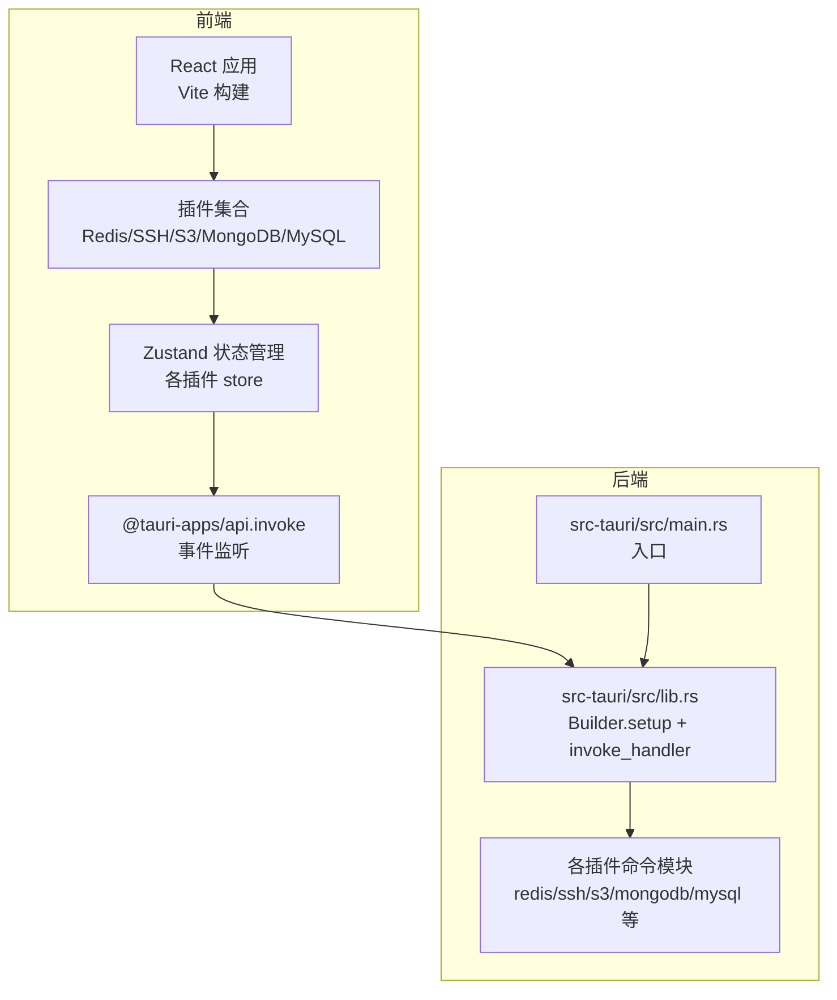
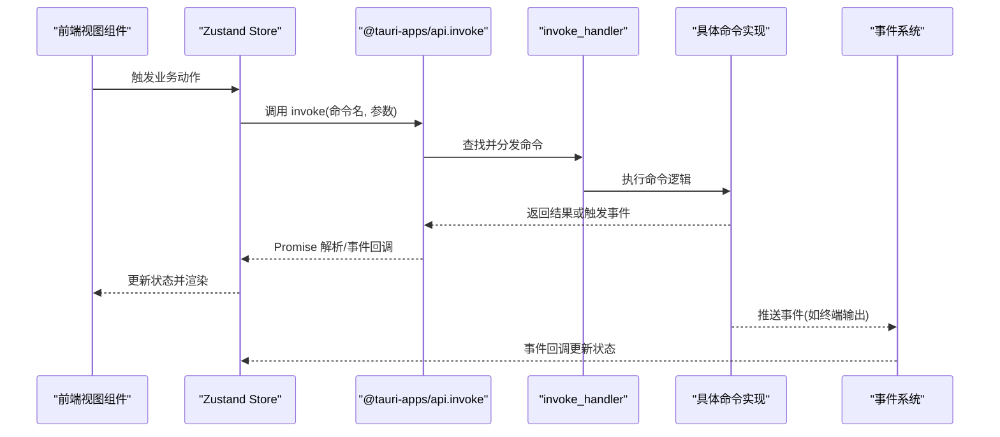
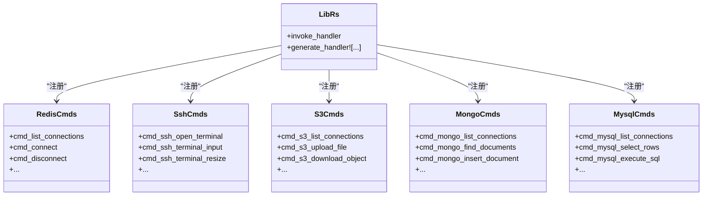
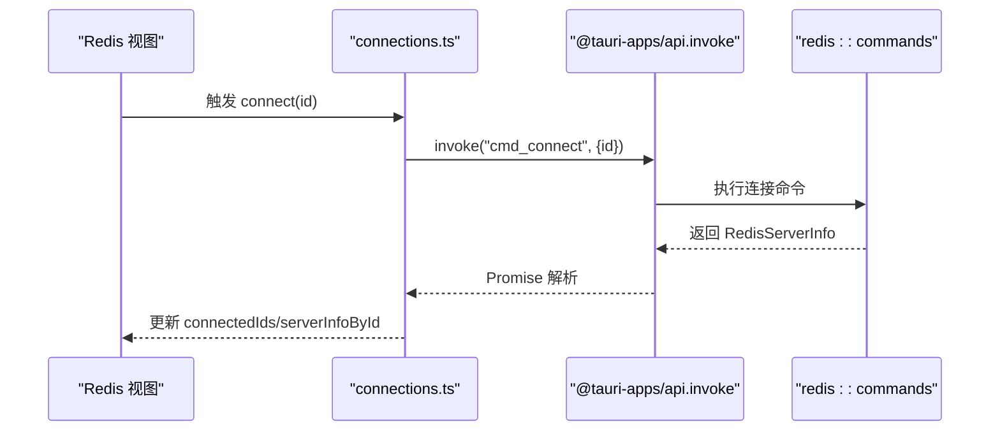
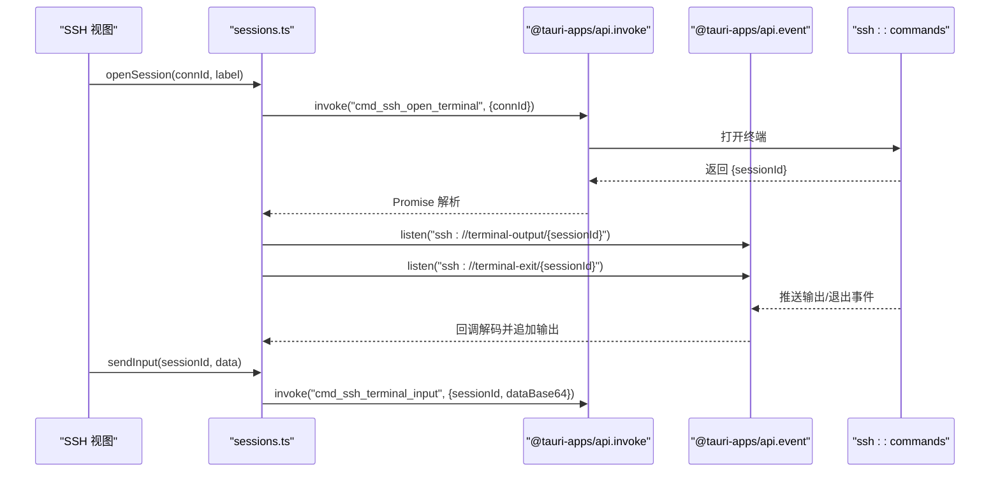
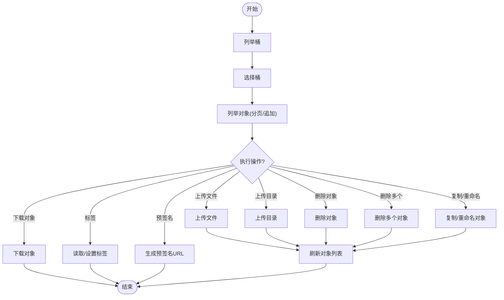
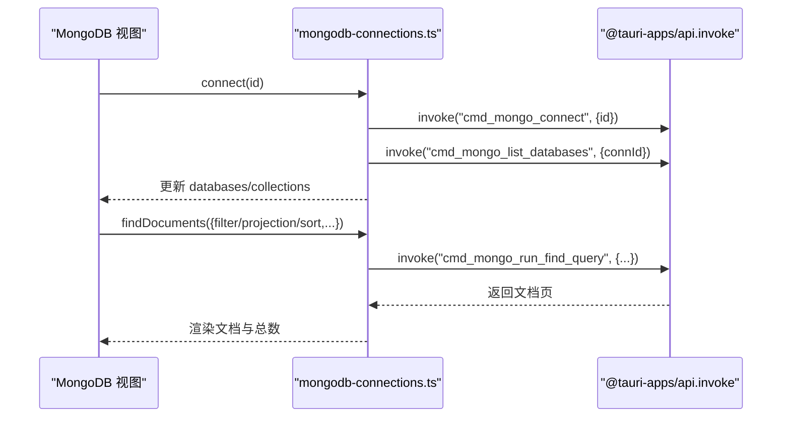
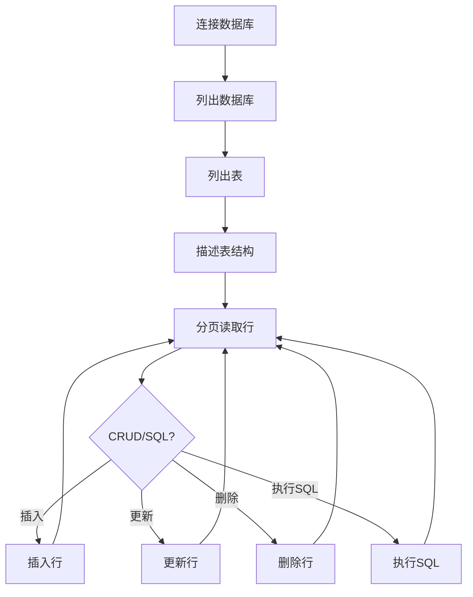
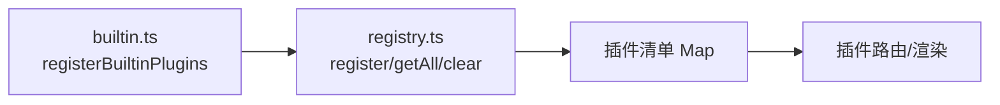
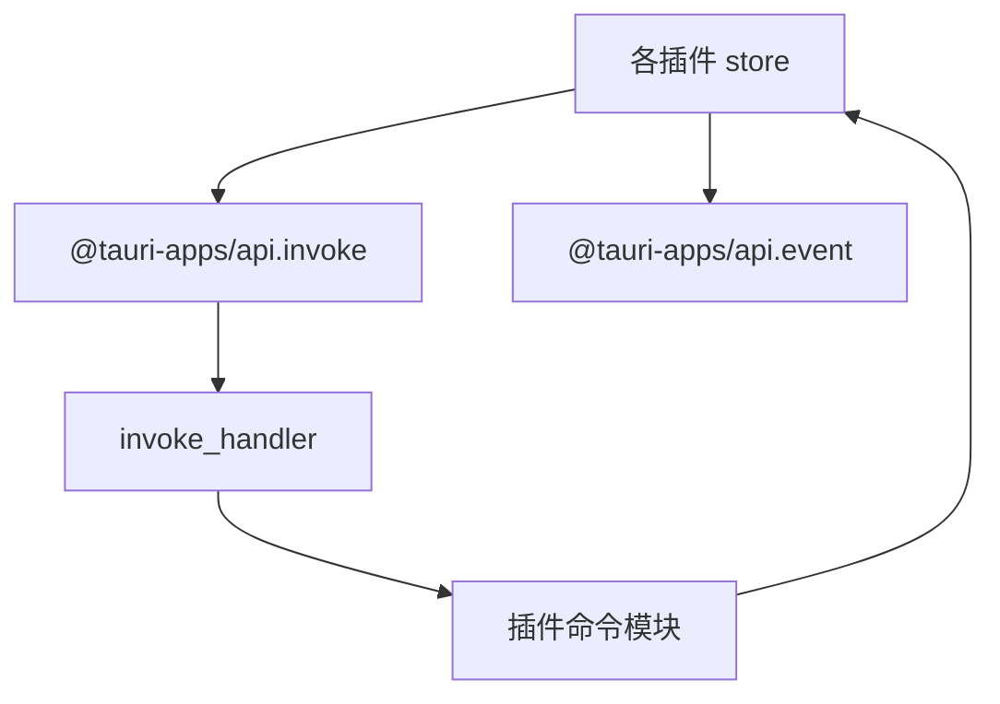

# 前后端通信机制

<cite>
**本文引用的文件**
- [src-tauri/src/main.rs](file://src-tauri/src/main.rs)
- [src-tauri/src/lib.rs](file://src-tauri/src/lib.rs)
- [src-tauri/tauri.conf.json](file://src-tauri/tauri.conf.json)
- [src/app/plugin-registry/registry.ts](file://src/app/plugin-registry/registry.ts)
- [src/app/plugin-registry/builtin.ts](file://src/app/plugin-registry/builtin.ts)
- [src/plugins/redis-manager/index.tsx](file://src/plugins/redis-manager/index.tsx)
- [src/plugins/ssh-client/index.tsx](file://src/plugins/ssh-client/index.tsx)
- [src/plugins/s3-client/index.tsx](file://src/plugins/s3-client/index.tsx)
- [src/plugins/mongodb-client/index.tsx](file://src/plugins/mongodb-client/index.tsx)
- [src/plugins/mysql-client/index.tsx](file://src/plugins/mysql-client/index.tsx)
- [src/plugins/redis-manager/store/connections.ts](file://src/plugins/redis-manager/store/connections.ts)
- [src/plugins/ssh-client/store/sessions.ts](file://src/plugins/ssh-client/store/sessions.ts)
- [src/plugins/s3-client/store/s3-connections.ts](file://src/plugins/s3-client/store/s3-connections.ts)
- [src/plugins/mongodb-client/store/mongodb-connections.ts](file://src/plugins/mongodb-client/store/mongodb-connections.ts)
- [src/plugins/mysql-client/store/mysql-connections.ts](file://src/plugins/mysql-client/store/mysql-connections.ts)
</cite>

## 目录
1. [引言](#引言)
2. [项目结构](#项目结构)
3. [核心组件](#核心组件)
4. [架构总览](#架构总览)
5. [详细组件分析](#详细组件分析)
6. [依赖关系分析](#依赖关系分析)
7. [性能考量](#性能考量)
8. [故障排查指南](#故障排查指南)
9. [结论](#结论)
10. [附录](#附录)

## 引言
本文件系统性阐述 DevNexus 的前后端通信机制，重点覆盖以下方面：
- 前端 React 组件如何通过 Tauri API 调用 Rust 后端命令的完整流程
- Tauri 命令系统的架构设计：命令注册、参数传递、返回值处理与错误传播
- 不同类型插件（Redis、SSH、S3、MongoDB、MySQL 等）的通信模式与实现要点
- 异步通信处理：Promise 封装、事件监听、状态管理与错误传播
- 通信协议设计规范：数据序列化、类型安全与性能优化策略
- 实际代码示例路径与调试技巧

## 项目结构
DevNexus 采用 Tauri 桌面应用框架，前端使用 React/Vite，后端使用 Rust。前端通过 @tauri-apps/api 的 invoke 与事件 API 与后端交互；后端在启动时集中注册大量命令，统一由 Tauri 的 invoke_handler 分发。

图表来源
- [src-tauri/src/main.rs:1-7](file://src-tauri/src/main.rs#L1-L7)
- [src-tauri/src/lib.rs:10-249](file://src-tauri/src/lib.rs#L10-L249)

章节来源
- [src-tauri/tauri.conf.json:1-39](file://src-tauri/tauri.conf.json#L1-L39)
- [src-tauri/src/main.rs:1-7](file://src-tauri/src/main.rs#L1-L7)
- [src-tauri/src/lib.rs:10-249](file://src-tauri/src/lib.rs#L10-L249)

## 核心组件
- 前端通信入口
  - invoke：用于同步或异步调用后端命令，支持泛型返回类型声明，确保类型安全
  - listen：用于订阅后端推送的事件，实现双向通信
- 后端命令注册
  - 在 lib.rs 中集中注册所有插件命令，统一由 generate_handler 注册到 invoke_handler
- 插件注册与发现
  - 插件清单通过注册表进行管理，内置插件在应用初始化阶段完成注册

章节来源
- [src/plugins/redis-manager/store/connections.ts:1-91](file://src/plugins/redis-manager/store/connections.ts#L1-L91)
- [src/plugins/ssh-client/store/sessions.ts:1-192](file://src/plugins/ssh-client/store/sessions.ts#L1-L192)
- [src/plugins/s3-client/store/s3-connections.ts:1-432](file://src/plugins/s3-client/store/s3-connections.ts#L1-L432)
- [src/plugins/mongodb-client/store/mongodb-connections.ts:1-296](file://src/plugins/mongodb-client/store/mongodb-connections.ts#L1-L296)
- [src/plugins/mysql-client/store/mysql-connections.ts:1-153](file://src/plugins/mysql-client/store/mysql-connections.ts#L1-L153)
- [src-tauri/src/lib.rs:25-246](file://src-tauri/src/lib.rs#L25-L246)
- [src/app/plugin-registry/registry.ts:1-26](file://src/app/plugin-registry/registry.ts#L1-L26)
- [src/app/plugin-registry/builtin.ts:1-29](file://src/app/plugin-registry/builtin.ts#L1-L29)

## 架构总览
Tauri 的命令调用链路如下：
- 前端组件通过 Zustand store 发起 invoke 调用
- Tauri invoke_handler 根据命令名分发至对应插件命令实现
- 命令执行完成后，通过 Promise 返回结果；部分命令通过事件流推送持续输出
- 错误通过 Promise 拒绝传播，前端捕获并反馈给用户

图表来源
- [src-tauri/src/lib.rs:25-246](file://src-tauri/src/lib.rs#L25-L246)
- [src/plugins/ssh-client/store/sessions.ts:85-139](file://src/plugins/ssh-client/store/sessions.ts#L85-L139)

章节来源
- [src-tauri/src/lib.rs:25-246](file://src-tauri/src/lib.rs#L25-L246)
- [src/plugins/ssh-client/store/sessions.ts:50-192](file://src/plugins/ssh-client/store/sessions.ts#L50-L192)

## 详细组件分析

### Tauri 命令系统与命令注册
- 命令注册位置：在 lib.rs 的 invoke_handler 中集中注册所有插件命令，涵盖 Redis、SSH、S3、MongoDB、MySQL、网络工具、API 调试器、LAN Chat 等
- 命令命名规范：以插件域前缀区分（如 cmd_redis_*、cmd_ssh_*、cmd_s3_* 等），便于维护与查找
- 类型安全：前端通过 invoke 的泛型参数声明返回类型，确保编译期类型检查

图表来源
- [src-tauri/src/lib.rs:25-246](file://src-tauri/src/lib.rs#L25-L246)

章节来源
- [src-tauri/src/lib.rs:25-246](file://src-tauri/src/lib.rs#L25-L246)

### Redis 插件通信模式
- 命令调用：通过 invoke 调用 Redis 命令（如连接、断开、键操作、扫描、数据库选择等）
- 状态管理：Zustand store 维护连接列表、已连接 ID、服务器信息与延迟等
- 流程要点：
  - 列表/保存/删除连接：同步命令，返回列表或无返回
  - 连接/断开：返回服务器信息或无返回
  - 键操作：根据键类型执行字符串/哈希/列表/集合/有序集等操作

图表来源
- [src/plugins/redis-manager/store/connections.ts:59-69](file://src/plugins/redis-manager/store/connections.ts#L59-L69)
- [src-tauri/src/lib.rs:26-68](file://src-tauri/src/lib.rs#L26-L68)

章节来源
- [src/plugins/redis-manager/store/connections.ts:1-91](file://src/plugins/redis-manager/store/connections.ts#L1-L91)
- [src/plugins/redis-manager/index.tsx:1-67](file://src/plugins/redis-manager/index.tsx#L1-L67)

### SSH 插件通信模式
- 会话管理：通过 openSession 打开会话，后端返回会话 ID；随后订阅事件通道获取输出与退出状态
- 事件驱动：后端通过事件推送“终端输出”和“会话退出”，前端解码并追加到输出缓冲
- 输入与调整：通过 invoke 发送输入与调整终端大小；关闭会话时清理事件监听
- 编解码：输出数据采用 Base64 编解码，兼容二进制数据传输

图表来源
- [src/plugins/ssh-client/store/sessions.ts:85-139](file://src/plugins/ssh-client/store/sessions.ts#L85-L139)
- [src/plugins/ssh-client/store/sessions.ts:106-121](file://src/plugins/ssh-client/store/sessions.ts#L106-L121)
- [src-tauri/src/lib.rs:69-94](file://src-tauri/src/lib.rs#L69-L94)

章节来源
- [src/plugins/ssh-client/store/sessions.ts:1-192](file://src/plugins/ssh-client/store/sessions.ts#L1-L192)
- [src/plugins/ssh-client/index.tsx:1-66](file://src/plugins/ssh-client/index.tsx#L1-L66)

### S3 插件通信模式
- 对象存储操作：列举桶、对象，创建/删除桶与对象，复制/重命名对象，标签管理，预签名 URL 生成等
- 并发与分页：列举对象支持分页与追加加载；删除多个对象返回批量结果
- 状态管理：store 维护连接、桶、对象列表、前缀与分页令牌等状态

图表来源
- [src/plugins/s3-client/store/s3-connections.ts:197-330](file://src/plugins/s3-client/store/s3-connections.ts#L197-L330)
- [src-tauri/src/lib.rs:95-133](file://src-tauri/src/lib.rs#L95-L133)

章节来源
- [src/plugins/s3-client/store/s3-connections.ts:1-432](file://src/plugins/s3-client/store/s3-connections.ts#L1-L432)
- [src/plugins/s3-client/index.tsx:1-68](file://src/plugins/s3-client/index.tsx#L1-L68)

### MongoDB 插件通信模式
- 数据库与集合管理：列出数据库/集合、创建/删除集合、索引管理
- 文档操作：查询、插入、更新、删除；聚合与数据库命令执行
- 导入导出：支持 JSON/JSONL 导出；导入文件选择、预览与导入
- 查询历史与服务状态：维护查询历史与服务器状态

图表来源
- [src/plugins/mongodb-client/store/mongodb-connections.ts:147-161](file://src/plugins/mongodb-client/store/mongodb-connections.ts#L147-L161)
- [src/plugins/mongodb-client/store/mongodb-connections.ts:206-211](file://src/plugins/mongodb-client/store/mongodb-connections.ts#L206-L211)
- [src-tauri/src/lib.rs:134-159](file://src-tauri/src/lib.rs#L134-L159)

章节来源
- [src/plugins/mongodb-client/store/mongodb-connections.ts:1-296](file://src/plugins/mongodb-client/store/mongodb-connections.ts#L1-L296)
- [src/plugins/mongodb-client/index.tsx:1-87](file://src/plugins/mongodb-client/index.tsx#L1-L87)

### MySQL 插件通信模式
- 表级操作：列出数据库与表、描述表结构、获取表状态
- 行级操作：分页读取行、插入/更新/删除行
- SQL 执行：执行任意 SQL，支持指定数据库上下文
- 导入导出与索引管理：支持导入文件预览与导入，索引创建/删除

图表来源
- [src/plugins/mysql-client/store/mysql-connections.ts:119-133](file://src/plugins/mysql-client/store/mysql-connections.ts#L119-L133)
- [src/plugins/mysql-client/store/mysql-connections.ts:134-142](file://src/plugins/mysql-client/store/mysql-connections.ts#L134-L142)
- [src-tauri/src/lib.rs:160-183](file://src-tauri/src/lib.rs#L160-L183)

章节来源
- [src/plugins/mysql-client/store/mysql-connections.ts:1-153](file://src/plugins/mysql-client/store/mysql-connections.ts#L1-L153)
- [src/plugins/mysql-client/index.tsx:1-38](file://src/plugins/mysql-client/index.tsx#L1-L38)

### 插件注册与路由
- 插件清单注册：通过注册表管理插件清单，按侧边栏顺序排序
- 内置插件注册：应用启动时一次性注册所有内置插件，避免重复注册

图表来源
- [src/app/plugin-registry/builtin.ts:13-27](file://src/app/plugin-registry/builtin.ts#L13-L27)
- [src/app/plugin-registry/registry.ts:3-26](file://src/app/plugin-registry/registry.ts#L3-L26)

章节来源
- [src/app/plugin-registry/builtin.ts:1-29](file://src/app/plugin-registry/builtin.ts#L1-L29)
- [src/app/plugin-registry/registry.ts:1-26](file://src/app/plugin-registry/registry.ts#L1-L26)

## 依赖关系分析
- 前端对后端的依赖
  - 所有插件 store 依赖 @tauri-apps/api 的 invoke 与事件 API
  - 插件组件依赖 store 管理状态与副作用
- 后端对前端的依赖
  - 通过事件系统向前端推送实时数据（如 SSH 输出）
- 插件间耦合
  - 通过统一命令命名空间隔离，降低耦合度
  - 共享类型定义可来自公共类型模块（本仓库未展示）

图表来源
- [src-tauri/src/lib.rs:25-246](file://src-tauri/src/lib.rs#L25-L246)
- [src/plugins/ssh-client/store/sessions.ts:106-121](file://src/plugins/ssh-client/store/sessions.ts#L106-L121)

章节来源
- [src-tauri/src/lib.rs:25-246](file://src-tauri/src/lib.rs#L25-L246)
- [src/plugins/ssh-client/store/sessions.ts:1-192](file://src/plugins/ssh-client/store/sessions.ts#L1-L192)

## 性能考量
- 命令粒度与批处理
  - 对于高频操作（如列举对象、查询文档），优先使用分页/批量接口，减少单次往返开销
- 事件驱动与流式输出
  - SSH 终端输出采用事件推送，前端按块解码追加，避免阻塞主线程
- 类型安全与编译期校验
  - 通过 invoke 泛型声明返回类型，减少运行时解析错误
- 状态管理优化
  - 使用不可变更新策略（如展开对象/数组）与最小化状态切片，降低渲染成本
- 数据序列化
  - 大体量二进制数据采用 Base64 编解码，兼顾跨平台传输稳定性

## 故障排查指南
- 命令未找到
  - 检查命令是否已在 lib.rs 的 invoke_handler 中注册
  - 确认命令名称与前端调用一致（含插件域前缀）
- 返回类型不匹配
  - 在前端调用处补充正确的泛型类型，确保 Promise 解析类型与后端返回一致
- 事件未收到
  - 确认事件通道命名与后端推送一致；检查监听生命周期与清理逻辑
- SSH 会话异常
  - 关注“会话关闭”事件与“终端退出”事件；确认 Base64 编解码正确
- 状态未更新
  - 检查 store 的状态更新路径与错误边界；确保 finally 或异常分支中恢复 loading 状态

章节来源
- [src-tauri/src/lib.rs:25-246](file://src-tauri/src/lib.rs#L25-L246)
- [src/plugins/ssh-client/store/sessions.ts:106-121](file://src/plugins/ssh-client/store/sessions.ts#L106-L121)
- [src/plugins/ssh-client/store/sessions.ts:140-161](file://src/plugins/ssh-client/store/sessions.ts#L140-L161)

## 结论
DevNexus 的前后端通信以 Tauri 为核心，通过集中命令注册与 invoke 事件机制实现稳定高效的跨端调用。插件体系遵循统一的命令命名与状态管理模式，结合事件驱动与类型安全，既保证了开发效率，也兼顾了运行时性能与可维护性。建议在后续扩展中继续沿用现有模式，并完善错误日志与监控埋点，进一步提升可观测性与用户体验。

## 附录
- 配置参考
  - 开发与构建配置位于 tauri.conf.json，包含 devUrl、frontendDist 等关键字段
- 插件清单与注册
  - 内置插件清单集中注册，避免重复注册与遗漏

章节来源
- [src-tauri/tauri.conf.json:6-11](file://src-tauri/tauri.conf.json#L6-L11)
- [src/app/plugin-registry/builtin.ts:13-27](file://src/app/plugin-registry/builtin.ts#L13-L27)