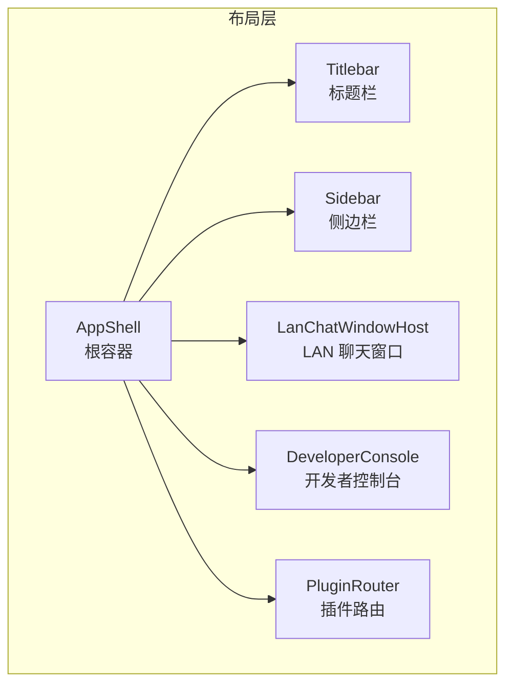
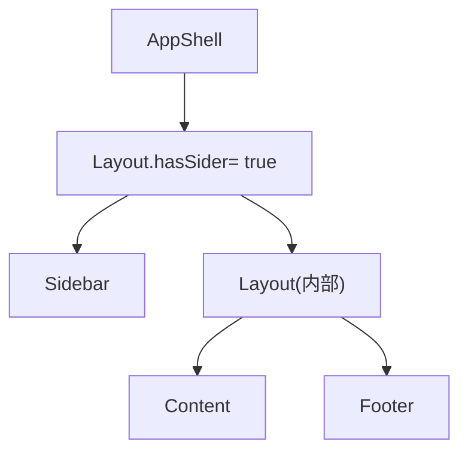
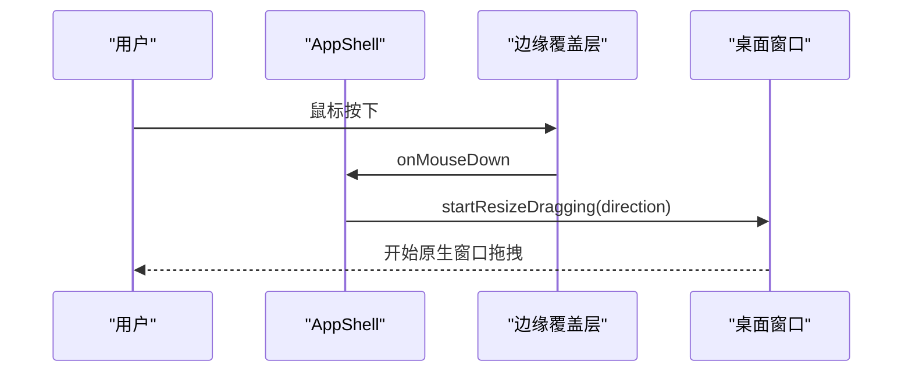
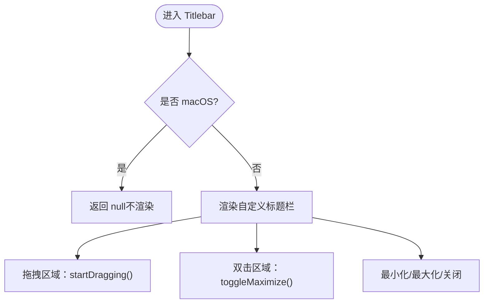
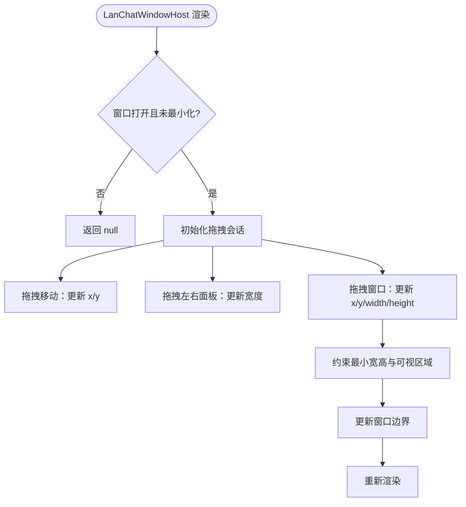
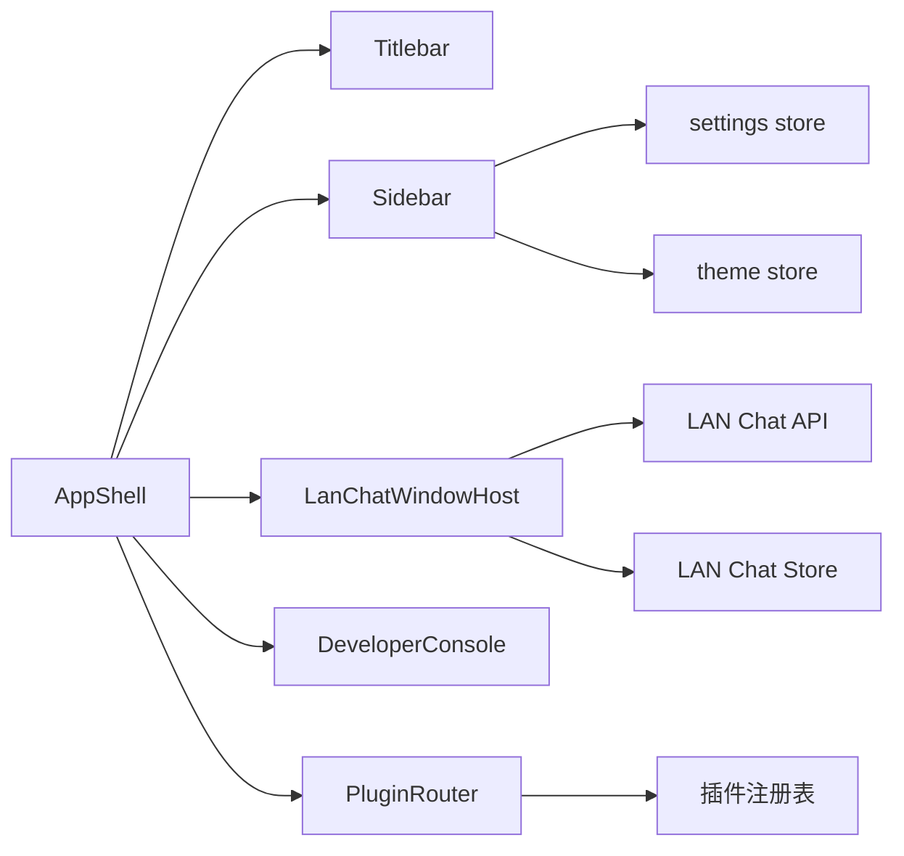

# 主容器布局

<cite>
**本文引用的文件**
- [AppShell.tsx](file://src/app/layout/AppShell.tsx)
- [Sidebar.tsx](file://src/app/layout/Sidebar.tsx)
- [Titlebar.tsx](file://src/app/layout/Titlebar.tsx)
- [PluginRouter.tsx](file://src/app/plugin-registry/PluginRouter.tsx)
- [DeveloperConsole.tsx](file://src/app/developer-console/DeveloperConsole.tsx)
- [LanChatWindowHost.tsx](file://src/plugins/lan-chat/components/LanChatWindowHost.tsx)
- [status-bar.ts](file://src/app/layout/status-bar.ts)
- [platform.ts](file://src/app/runtime/platform.ts)
- [settings.ts](file://src/app/store/settings.ts)
- [theme.ts](file://src/app/store/theme.ts)
- [global.css](file://src/styles/global.css)
</cite>

## 目录
1. [简介](#简介)
2. [项目结构](#项目结构)
3. [核心组件](#核心组件)
4. [架构总览](#架构总览)
5. [详细组件分析](#详细组件分析)
6. [依赖分析](#依赖分析)
7. [性能考量](#性能考量)
8. [故障排查指南](#故障排查指南)
9. [结论](#结论)
10. [附录](#附录)

## 简介
本文件系统性解析 DevNexus 的主容器布局设计，重点围绕 AppShell 作为应用根容器的整体理念展开，涵盖：
- Layout 组件的嵌套结构与 hasSider 行为
- 响应式布局与平台差异（macOS 原生标题栏）
- 边缘拖拽调整窗口大小的实现原理（edgeOverlays、ResizeDirection、鼠标事件）
- 子组件渲染顺序与层级关系（Titlebar、Sidebar、LanChatWindowHost、DeveloperConsole、PluginRouter）
- 最佳实践与扩展建议

## 项目结构
主容器布局位于 src/app/layout 目录，配合插件路由、开发者控制台、LAN Chat 窗口宿主等模块协同工作。样式通过全局 CSS 控制容器尺寸、边距与主题切换。

图表来源
- [AppShell.tsx:147-205](file://src/app/layout/AppShell.tsx#L147-L205)
- [Titlebar.tsx:12-74](file://src/app/layout/Titlebar.tsx#L12-L74)
- [Sidebar.tsx:21-176](file://src/app/layout/Sidebar.tsx#L21-L176)
- [PluginRouter.tsx:7-28](file://src/app/plugin-registry/PluginRouter.tsx#L7-L28)
- [DeveloperConsole.tsx:10-131](file://src/app/developer-console/DeveloperConsole.tsx#L10-L131)
- [LanChatWindowHost.tsx:67-454](file://src/plugins/lan-chat/components/LanChatWindowHost.tsx#L67-L454)

章节来源
- [AppShell.tsx:31-206](file://src/app/layout/AppShell.tsx#L31-L206)
- [global.css:36-81](file://src/styles/global.css#L36-L81)

## 核心组件
- AppShell：应用根容器，负责整体布局、条件渲染（macOS 原生标题栏）、边缘拖拽调整窗口大小、状态栏信息聚合与 LAN Chat 消息未读计数联动。
- Titlebar：非 macOS 平台下的自定义标题栏，提供拖拽、最小化、最大化、关闭等窗口控制能力。
- Sidebar：左侧导航与工具入口，支持折叠、数据库工具分组、主题切换、LAN Chat 快捷入口。
- PluginRouter：根据当前选中插件 ID 渲染对应插件组件。
- DeveloperConsole：隐藏的开发者控制台抽屉，用于查看与导出日志。
- LanChatWindowHost：LAN Chat 独立窗口宿主，包含聊天会话列表、消息面板、成员与传输管理、多方向拖拽调整尺寸与位置。

章节来源
- [AppShell.tsx:31-206](file://src/app/layout/AppShell.tsx#L31-L206)
- [Titlebar.tsx:12-74](file://src/app/layout/Titlebar.tsx#L12-L74)
- [Sidebar.tsx:21-176](file://src/app/layout/Sidebar.tsx#L21-L176)
- [PluginRouter.tsx:7-28](file://src/app/plugin-registry/PluginRouter.tsx#L7-L28)
- [DeveloperConsole.tsx:10-131](file://src/app/developer-console/DeveloperConsole.tsx#L10-L131)
- [LanChatWindowHost.tsx:67-454](file://src/plugins/lan-chat/components/LanChatWindowHost.tsx#L67-L454)

## 架构总览
AppShell 采用 Ant Design Layout 结构，通过 hasSider 标记左侧 Sidebar，形成“标题栏 + 侧边栏 + 内容区”的经典桌面应用布局。内容区再嵌套一个 Layout，承载 Content 与 Footer，Footer 中包含状态项与 LAN Chat 悬浮按钮。

图表来源
- [AppShell.tsx:168-203](file://src/app/layout/AppShell.tsx#L168-L203)

章节来源
- [AppShell.tsx:168-203](file://src/app/layout/AppShell.tsx#L168-L203)

## 详细组件分析

### AppShell：根容器与响应式布局
- 设计理念
  - 以 AppShell 为根容器，统一管理布局骨架、平台差异与交互行为。
  - 通过 nativeTitlebar 条件渲染，避免在 macOS 上重复绘制标题栏。
  - 使用 hasSider 实现左侧 Sidebar 固定宽度与内容区自适应。
- 响应式与平台差异
  - 通过 isMacOsRuntime 判断是否为 macOS 运行时，决定是否渲染自定义标题栏。
  - 在 macOS 下，主内容高度为 100%，否则减去标题栏高度。
- 边缘拖拽调整窗口大小
  - 定义 edgeOverlays 数组，覆盖四边与四角共八块区域，每块设置方向与光标形状。
  - 鼠标按下时调用窗口的 startResizeDragging(direction) 触发原生拖拽。
- 子组件渲染顺序与层级
  - 先渲染边缘拖拽覆盖层（固定层级），再渲染 Titlebar，然后是 Sidebar、LanChatWindowHost、DeveloperConsole，最后是内容区与底部状态栏。
- 状态栏与 LAN Chat 未读联动
  - buildAppStatusItems 聚合工具名称、侧边栏状态、运行时、LAN 设备/房间/传输数量。
  - shouldDockChatInStatusBar 决定 LAN Chat 最小化时是否在底部状态栏显示快捷按钮。

图表来源
- [AppShell.tsx:147-167](file://src/app/layout/AppShell.tsx#L147-L167)

章节来源
- [AppShell.tsx:31-206](file://src/app/layout/AppShell.tsx#L31-L206)
- [status-bar.ts:15-28](file://src/app/layout/status-bar.ts#L15-L28)
- [platform.ts:1-9](file://src/app/runtime/platform.ts#L1-L9)
- [global.css:72-74](file://src/styles/global.css#L72-L74)

### Titlebar：自定义标题栏与窗口控制
- 条件渲染
  - 在 macOS 上直接返回空，交由系统原生标题栏处理。
- 拖拽与双击
  - 拖拽区域支持窗口拖拽；双击支持最大化/还原。
- 控件
  - 提供最小化、最大化/还原、关闭三个按钮，仅在桌面运行时可用。

图表来源
- [Titlebar.tsx:12-74](file://src/app/layout/Titlebar.tsx#L12-L74)
- [platform.ts:1-9](file://src/app/runtime/platform.ts#L1-L9)

章节来源
- [Titlebar.tsx:12-74](file://src/app/layout/Titlebar.tsx#L12-L74)
- [platform.ts:1-9](file://src/app/runtime/platform.ts#L1-L9)

### Sidebar：导航与工具入口
- 折叠与展开
  - 通过设置 store 控制 sidebarCollapsed/dbToolsCollapsed，影响宽度与可见性。
- 插件分组
  - 将数据库类插件单独分组，支持点击展开/收起。
- 工具与主题
  - LAN Chat 未读计数徽章、明暗主题切换按钮。
- 交互
  - 点击插件按钮更新选中插件 ID，驱动 PluginRouter 渲染对应组件。

章节来源
- [Sidebar.tsx:21-176](file://src/app/layout/Sidebar.tsx#L21-L176)
- [settings.ts:4-27](file://src/app/store/settings.ts#L4-L27)
- [theme.ts:4-26](file://src/app/store/theme.ts#L4-L26)

### PluginRouter：按选中插件渲染
- 逻辑
  - 若无注册插件，提示“未注册插件”。
  - 否则根据选中插件 ID 获取组件并渲染。

章节来源
- [PluginRouter.tsx:7-28](file://src/app/plugin-registry/PluginRouter.tsx#L7-L28)
- [settings.ts:4-27](file://src/app/store/settings.ts#L4-L27)

### DeveloperConsole：隐藏开发者控制台
- 快捷键
  - Ctrl+Shift+D 打开/关闭抽屉。
- 日志监听
  - 订阅 dev-log 事件，实时追加日志。
- 功能
  - 复制 JSON、清空日志、分页表格展示。

章节来源
- [DeveloperConsole.tsx:10-131](file://src/app/developer-console/DeveloperConsole.tsx#L10-L131)

### LanChatWindowHost：LAN Chat 独立窗口
- 窗口尺寸与位置
  - 支持拖拽移动与多方向拖拽调整尺寸，包含最小宽高限制。
- 面板与交互
  - 会话列表、消息面板、成员与传输管理、文件预览与下载。
- 状态与联动
  - 与 AppShell 的 LAN Chat 未读计数联动，支持最小化停靠至底部状态栏。

图表来源
- [LanChatWindowHost.tsx:67-454](file://src/plugins/lan-chat/components/LanChatWindowHost.tsx#L67-L454)

章节来源
- [LanChatWindowHost.tsx:67-454](file://src/plugins/lan-chat/components/LanChatWindowHost.tsx#L67-L454)

## 依赖分析
- AppShell 依赖
  - 平台判断：isMacOsRuntime → nativeTitlebar
  - 窗口控制：桌面运行时且非原生标题栏 → getCurrentWindow() → startResizeDragging
  - 状态栏：buildAppStatusItems、shouldDockChatInStatusBar
  - 插件路由：PluginRouter
  - LAN Chat：LanChatWindowHost、未读计数联动
  - 开发者控制台：DeveloperConsole
- Sidebar 依赖
  - 设置存储：sidebarCollapsed/dbToolsCollapsed/selectedPluginId
  - 主题存储：mode/toggleMode
  - LAN Chat：未读计数、打开窗口
- PluginRouter 依赖
  - 注册表：getAll/getById
  - 设置存储：selectedPluginId
- DeveloperConsole 依赖
  - 事件监听：dev-log
  - API：listDevLogs/clearDevLogs
- LanChatWindowHost 依赖
  - API：startLanChatNetwork/getLanChatSnapshot/listLanChatConversations/listLanChatMessages/sendLanChatMessage/sendLanChatFileMessage/saveLanChatMessageAttachment
  - Store：window/bounds/activeConversationId/unread

图表来源
- [AppShell.tsx:31-206](file://src/app/layout/AppShell.tsx#L31-L206)
- [Sidebar.tsx:21-176](file://src/app/layout/Sidebar.tsx#L21-L176)
- [PluginRouter.tsx:7-28](file://src/app/plugin-registry/PluginRouter.tsx#L7-L28)
- [settings.ts:4-27](file://src/app/store/settings.ts#L4-L27)
- [theme.ts:4-26](file://src/app/store/theme.ts#L4-L26)

章节来源
- [AppShell.tsx:31-206](file://src/app/layout/AppShell.tsx#L31-L206)
- [Sidebar.tsx:21-176](file://src/app/layout/Sidebar.tsx#L21-L176)
- [PluginRouter.tsx:7-28](file://src/app/plugin-registry/PluginRouter.tsx#L7-L28)
- [settings.ts:4-27](file://src/app/store/settings.ts#L4-L27)
- [theme.ts:4-26](file://src/app/store/theme.ts#L4-L26)

## 性能考量
- 边缘拖拽覆盖层
  - 固定层级与透明区域，避免与内容区交互冲突；仅在桌面运行时渲染。
- LAN Chat 未读计数
  - 使用 useRef 缓存已见过的消息 ID，避免重复计算；定时刷新频率适中。
- 开发者控制台
  - 分页表格与延迟加载，避免一次性渲染大量日志。
- 样式主题
  - 通过 CSS 变量与 data-theme 切换，减少重排与重绘。

## 故障排查指南
- 自定义标题栏无效
  - 检查 isMacOsRuntime 是否正确识别平台；确认 nativeTitlebar 条件渲染分支。
- 边缘拖拽无响应
  - 确认桌面运行时与非原生标题栏场景；检查 edgeOverlays 的方向映射与鼠标事件绑定。
- LAN Chat 未读计数不更新
  - 检查 startLanChatNetwork 与 getLanChatSnapshot 调用链；确认定时器与状态更新。
- 插件未渲染或空白
  - 检查插件注册表是否为空；确认 selectedPluginId 是否有效。
- 开发者控制台无法打开
  - 检查快捷键组合与抽屉开关；确认 dev-log 事件订阅与权限。

章节来源
- [AppShell.tsx:59-92](file://src/app/layout/AppShell.tsx#L59-L92)
- [Titlebar.tsx:12-74](file://src/app/layout/Titlebar.tsx#L12-L74)
- [PluginRouter.tsx:7-28](file://src/app/plugin-registry/PluginRouter.tsx#L7-L28)
- [DeveloperConsole.tsx:24-45](file://src/app/developer-console/DeveloperConsole.tsx#L24-L45)

## 结论
AppShell 以简洁清晰的嵌套结构与平台感知的条件渲染，构建了稳定可扩展的桌面应用主容器。通过边缘拖拽、状态栏联动与多组件协作，实现了良好的用户体验与开发效率。遵循本文最佳实践，可在不破坏现有布局的前提下安全扩展新功能。

## 附录

### 边缘拖拽配置与类型
- edgeOverlays 数组定义八个拖拽区域，分别对应八种 ResizeDirection。
- 鼠标按下时触发窗口原生拖拽，提升交互一致性与性能。

章节来源
- [AppShell.tsx:94-145](file://src/app/layout/AppShell.tsx#L94-L145)
- [AppShell.tsx:21-29](file://src/app/layout/AppShell.tsx#L21-L29)

### 子组件渲染顺序与层级
- 渲染顺序：边缘覆盖层 → 标题栏 → 侧边栏 → LAN Chat 窗口 → 开发者控制台 → 内容区 → 底部状态栏。
- 层级关系：边缘覆盖层固定最高层级；LAN Chat 独立窗口固定较高层级；内容区与状态栏按常规层级排列。

章节来源
- [AppShell.tsx:147-205](file://src/app/layout/AppShell.tsx#L147-L205)
- [global.css:408-410](file://src/styles/global.css#L408-L410)

### 最佳实践与扩展建议
- 布局扩展
  - 新增侧边栏功能时，优先复用 Sidebar 的折叠与分组模式，保持一致的交互体验。
- 窗口控制
  - 自定义拖拽区域需与原生窗口拖拽区分，避免冲突；新增拖拽方向时同步更新 edgeOverlays 与样式光标。
- 状态栏
  - 新增状态项时，遵循 buildAppStatusItems 的输入输出格式，确保数据一致性。
- 插件路由
  - 新插件注册后，确保 selectedPluginId 默认值合理，避免首次渲染空白。
- 开发者控制台
  - 新增日志源时，注意事件命名空间与权限，避免阻塞主线程。