# 侧边栏导航

<cite>
**本文档引用的文件**
- [Sidebar.tsx](file://src/app/layout/Sidebar.tsx)
- [registry.ts](file://src/app/plugin-registry/registry.ts)
- [types.ts](file://src/app/plugin-registry/types.ts)
- [visibility.ts](file://src/app/plugin-registry/visibility.ts)
- [builtin.ts](file://src/app/plugin-registry/builtin.ts)
- [settings.ts](file://src/app/store/settings.ts)
- [theme.ts](file://src/app/store/theme.ts)
- [lan-chat.ts](file://src/plugins/lan-chat/store/lan-chat.ts)
- [status-bar.ts](file://src/app/layout/status-bar.ts)
- [AppShell.tsx](file://src/app/layout/AppShell.tsx)
- [global.css](file://src/styles/global.css)
- [redis-manager/index.tsx](file://src/plugins/redis-manager/index.tsx)
- [mongodb-client/index.tsx](file://src/plugins/mongodb-client/index.tsx)
- [mysql-client/index.tsx](file://src/plugins/mysql-client/index.tsx)
</cite>

## 目录
1. [简介](#简介)
2. [项目结构](#项目结构)
3. [核心组件](#核心组件)
4. [架构概览](#架构概览)
5. [详细组件分析](#详细组件分析)
6. [依赖关系分析](#依赖关系分析)
7. [性能考虑](#性能考虑)
8. [故障排除指南](#故障排除指南)
9. [结论](#结论)
10. [附录](#附录)

## 简介

DevNexus 的侧边栏导航系统是一个高度模块化和可扩展的导航解决方案，专为开发者工具集设计。该系统实现了现代化的响应式设计，支持插件动态加载、状态管理、主题切换和实时消息通知等功能。

系统的核心设计理念是通过插件注册表实现松耦合的插件架构，每个插件都可以独立配置其在侧边栏中的显示行为。侧边栏不仅提供基础的导航功能，还集成了状态栏联动、未读消息提醒等高级特性。

## 项目结构

侧边栏导航系统的文件组织遵循清晰的分层架构：

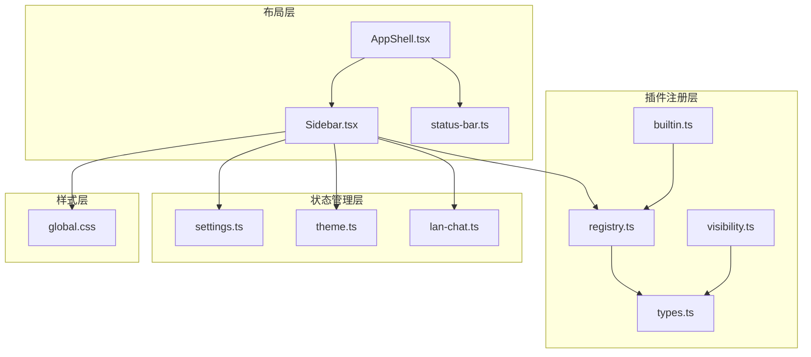

**图表来源**
- [Sidebar.tsx:1-177](file://src/app/layout/Sidebar.tsx#L1-L177)
- [registry.ts:1-26](file://src/app/plugin-registry/registry.ts#L1-L26)
- [settings.ts:1-28](file://src/app/store/settings.ts#L1-L28)

**章节来源**
- [Sidebar.tsx:1-177](file://src/app/layout/Sidebar.tsx#L1-L177)
- [registry.ts:1-26](file://src/app/plugin-registry/registry.ts#L1-L26)
- [settings.ts:1-28](file://src/app/store/settings.ts#L1-L28)

## 核心组件

### Sidebar 组件架构

Sidebar 组件采用函数式组件设计，实现了以下核心功能：

- **插件动态生成**：从插件注册表获取所有已注册插件，过滤出显示在侧边栏的插件
- **响应式折叠**：支持展开/折叠两种状态，宽度从 200px 缩小到 64px
- **状态管理**：集成设置存储和主题存储，实现持久化的用户偏好
- **分组导航**：将数据库工具插件单独分组管理
- **实时通知**：集成 LAN Chat 插件的未读消息提醒

### 插件注册系统

插件注册系统采用单例模式和 Map 数据结构，提供了完整的插件生命周期管理：

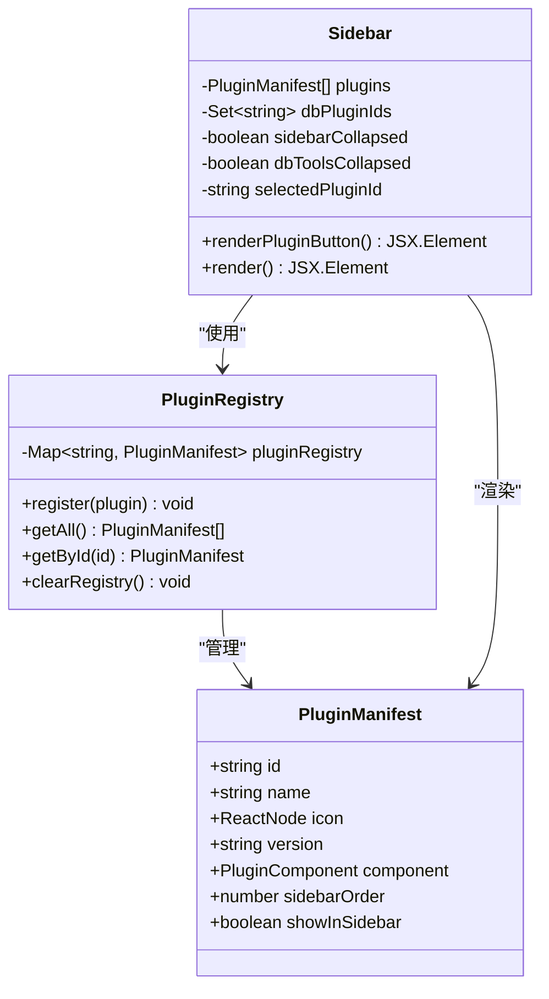

**图表来源**
- [types.ts:5-13](file://src/app/plugin-registry/types.ts#L5-L13)
- [registry.ts:3-25](file://src/app/plugin-registry/registry.ts#L3-L25)
- [Sidebar.tsx:21-77](file://src/app/layout/Sidebar.tsx#L21-L77)

**章节来源**
- [Sidebar.tsx:21-77](file://src/app/layout/Sidebar.tsx#L21-L77)
- [types.ts:5-13](file://src/app/plugin-registry/types.ts#L5-L13)
- [registry.ts:3-25](file://src/app/plugin-registry/registry.ts#L3-L25)

## 架构概览

### 整体架构设计

系统采用分层架构，各层职责明确：

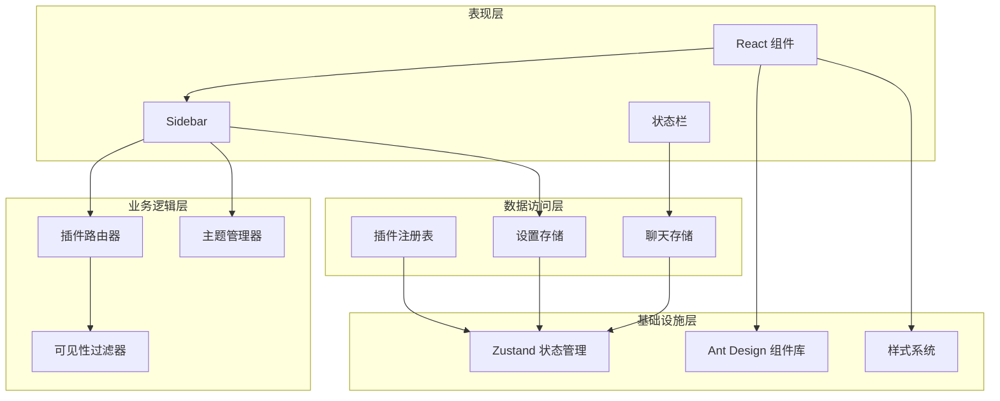

**图表来源**
- [AppShell.tsx:31-207](file://src/app/layout/AppShell.tsx#L31-L207)
- [Sidebar.tsx:21-177](file://src/app/layout/Sidebar.tsx#L21-L177)

### 数据流架构

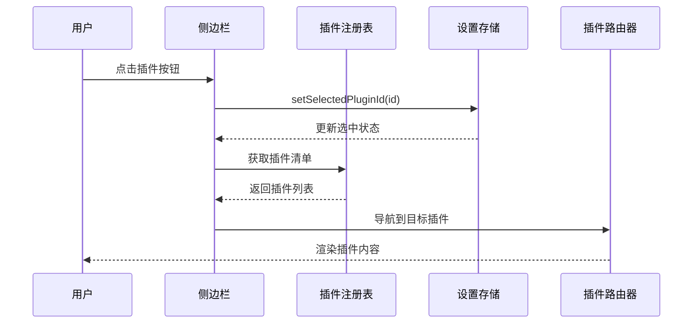

**图表来源**
- [Sidebar.tsx:34-42](file://src/app/layout/Sidebar.tsx#L34-L42)
- [registry.ts:13-17](file://src/app/plugin-registry/registry.ts#L13-L17)
- [settings.ts:9-21](file://src/app/store/settings.ts#L9-L21)

**章节来源**
- [AppShell.tsx:31-207](file://src/app/layout/AppShell.tsx#L31-L207)
- [Sidebar.tsx:21-177](file://src/app/layout/Sidebar.tsx#L21-L177)

## 详细组件分析

### 侧边栏折叠机制

侧边栏实现了智能的响应式折叠系统，支持两种显示模式：

#### 折叠状态管理

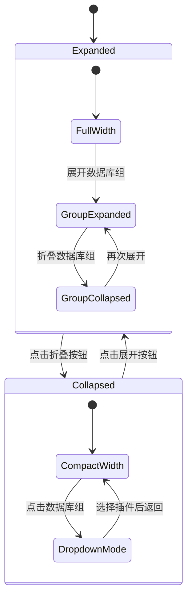

**图表来源**
- [Sidebar.tsx:26-37](file://src/app/layout/Sidebar.tsx#L26-L37)
- [Sidebar.tsx:98-144](file://src/app/layout/Sidebar.tsx#L98-L144)

#### 动画效果实现

折叠动画通过 CSS 过渡实现，具有流畅的视觉体验：

| 状态 | 宽度 | 过渡时间 | 缓动函数 |
|------|------|----------|----------|
| 展开 | 200px | 0.25s | ease |
| 折叠 | 64px | 0.25s | ease |
| 数据库组展开 | 自适应 | 0.2s | ease-out |
| 数据库组折叠 | 0px | 0.2s | ease-in |

**章节来源**
- [Sidebar.tsx:98-144](file://src/app/layout/Sidebar.tsx#L98-L144)
- [global.css:83-101](file://src/styles/global.css#L83-L101)

### 插件图标和名称显示

#### 图标渲染系统

插件图标通过 Ant Design 图标库提供，支持自定义图标：

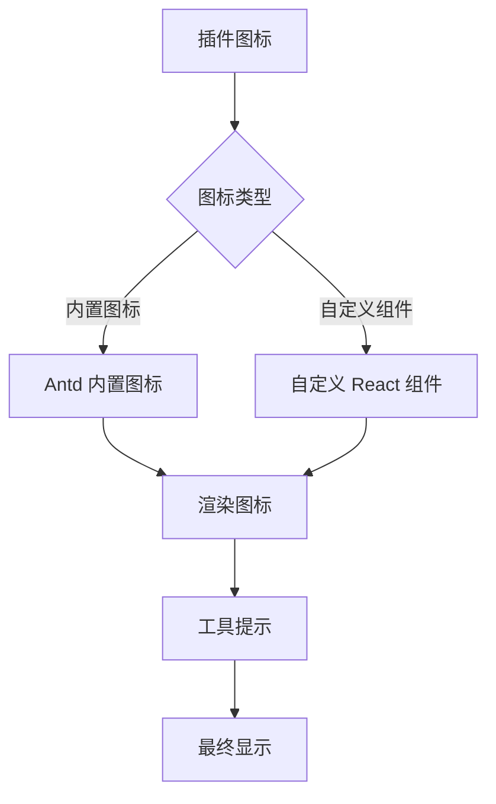

**图表来源**
- [redis-manager/index.tsx:62](file://src/plugins/redis-manager/index.tsx#L62)
- [mongodb-client/index.tsx:82](file://src/plugins/mongodb-client/index.tsx#L82)
- [mysql-client/index.tsx:37](file://src/plugins/mysql-client/index.tsx#L37)

#### 名称显示逻辑

名称显示根据侧边栏状态动态调整：

| 侧边栏状态 | 名称显示 | 工具提示 |
|------------|----------|----------|
| 展开 | 显示完整名称 | 隐藏（无提示） |
| 折叠 | 隐藏名称 | 显示完整名称 |
| 下拉菜单 | 显示完整名称 | 显示数据库组标题 |

**章节来源**
- [Sidebar.tsx:50-77](file://src/app/layout/Sidebar.tsx#L50-L77)
- [Sidebar.tsx:68-77](file://src/app/layout/Sidebar.tsx#L68-L77)

### 点击事件处理

#### 插件选择流程

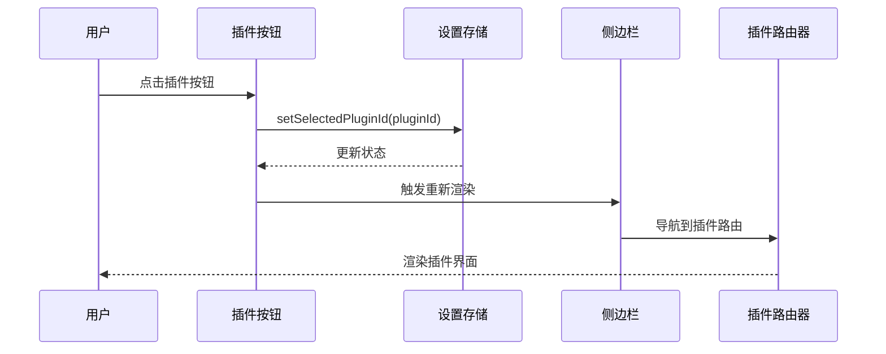

**图表来源**
- [Sidebar.tsx:60](file://src/app/layout/Sidebar.tsx#L60)
- [settings.ts:20](file://src/app/store/settings.ts#L20)

#### 数据库组交互

数据库组采用了特殊的交互模式：

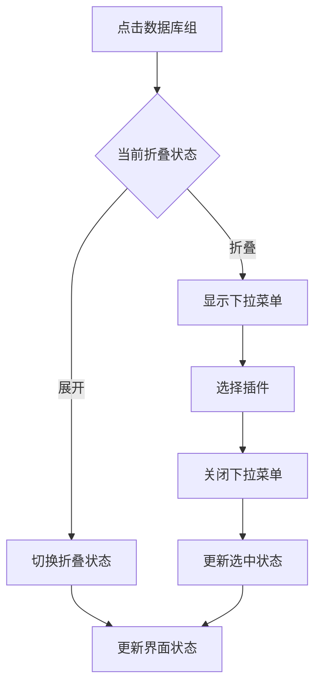

**图表来源**
- [Sidebar.tsx:127](file://src/app/layout/Sidebar.tsx#L127)
- [Sidebar.tsx:106](file://src/app/layout/Sidebar.tsx#L106)

**章节来源**
- [Sidebar.tsx:44-48](file://src/app/layout/Sidebar.tsx#L44-L48)
- [Sidebar.tsx:127](file://src/app/layout/Sidebar.tsx#L127)

### 侧边栏宽度控制

#### 响应式宽度系统

侧边栏宽度控制基于 CSS 变量和条件类名：

```mermaid
graph LR
subgraph "CSS 类名"
BaseClass[devnexus-sidebar]
CollapsedClass[devnexus-sidebar--collapsed]
end
subgraph "宽度值"
ExpandedWidth[200px]
CollapsedWidth[64px]
end
subgraph "过渡效果"
Transition[0.25s ease]
Transform[transform: rotate(-90deg)]
end
BaseClass --> ExpandedWidth
CollapsedClass --> CollapsedWidth
CollapsedClass -.-> Transform
```

**图表来源**
- [global.css:83-101](file://src/styles/global.css#L83-L101)
- [global.css:185-193](file://src/styles/global.css#L185-L193)

#### 移动端适配策略

系统针对不同屏幕尺寸提供了适配方案：

| 屏幕宽度 | 侧边栏状态 | 折叠行为 | 交互方式 |
|----------|------------|----------|----------|
| ≥ 1200px | 展开 | 手动折叠 | 悬停/点击 |
| 992px-1199px | 展开 | 手动折叠 | 悬停/点击 |
| 768px-991px | 展开 | 手动折叠 | 悬停/点击 |
| < 768px | 折叠 | 自动折叠 | 点击触发 |

**章节来源**
- [global.css:83-101](file://src/styles/global.css#L83-L101)
- [Sidebar.tsx:80-84](file://src/app/layout/Sidebar.tsx#L80-L84)

### 与插件注册表的集成

#### 插件清单获取流程

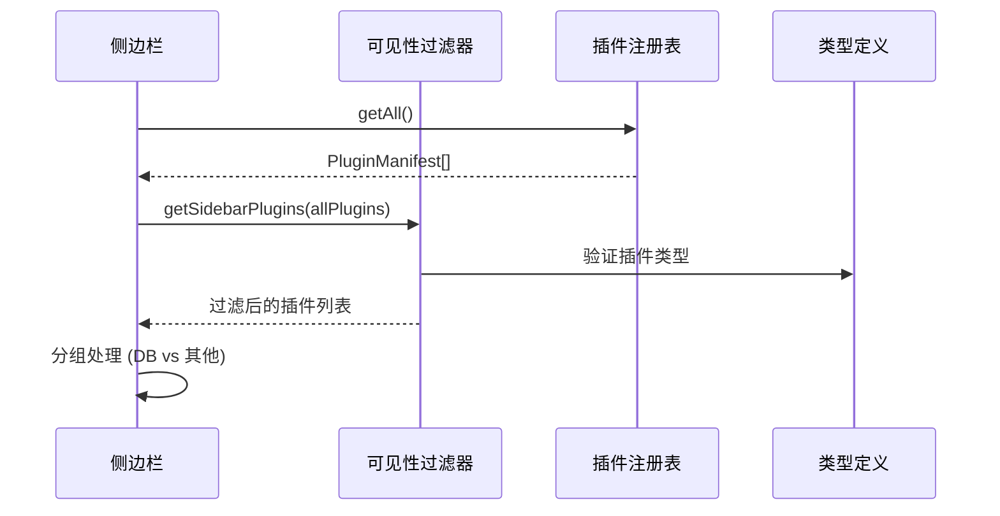

**图表来源**
- [Sidebar.tsx:22](file://src/app/layout/Sidebar.tsx#L22)
- [registry.ts:13-17](file://src/app/plugin-registry/registry.ts#L13-L17)
- [visibility.ts:3-5](file://src/app/plugin-registry/visibility.ts#L3-L5)

#### 插件清单过滤逻辑

插件过滤基于多个条件：

1. **可见性标志**：`showInSidebar !== false`
2. **排序优先级**：按 `sidebarOrder` 升序排列
3. **分组处理**：数据库工具插件特殊处理

**章节来源**
- [visibility.ts:3-5](file://src/app/plugin-registry/visibility.ts#L3-L5)
- [registry.ts:13-17](file://src/app/plugin-registry/registry.ts#L13-L17)

### 状态栏联动功能

#### 未读消息显示机制

系统实现了完整的未读消息通知系统：

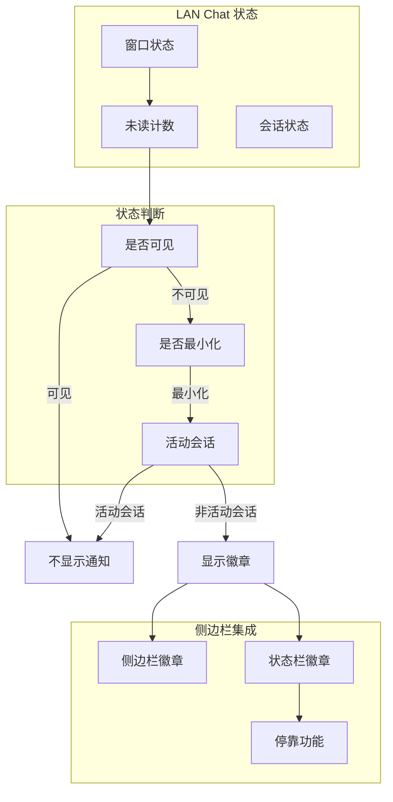

**图表来源**
- [lan-chat.ts:44-71](file://src/plugins/lan-chat/store/lan-chat.ts#L44-L71)
- [status-bar.ts:26-28](file://src/app/layout/status-bar.ts#L26-L28)

#### 徽章显示策略

徽章显示遵循以下规则：

| 条件 | 显示位置 | 显示内容 | 颜色样式 |
|------|----------|----------|----------|
| 有未读消息且窗口最小化 | 侧边栏 | 数字徽章 | 红色背景 |
| 有未读消息且窗口最小化 | 状态栏 | 小型徽章 | 蓝色背景 |
| 无未读消息 | 两侧 | 隐藏 | 不适用 |
| 窗口可见 | 两侧 | 隐藏 | 不适用 |

**章节来源**
- [Sidebar.tsx:152](file://src/app/layout/Sidebar.tsx#L152)
- [AppShell.tsx:196](file://src/app/layout/AppShell.tsx#L196)
- [lan-chat.ts:146-174](file://src/plugins/lan-chat/store/lan-chat.ts#L146-L174)

## 依赖关系分析

### 组件依赖图

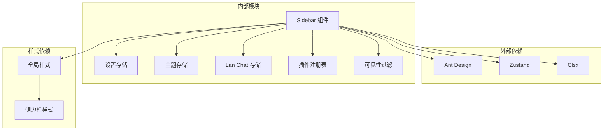

**图表来源**
- [Sidebar.tsx:1-20](file://src/app/layout/Sidebar.tsx#L1-L20)
- [settings.ts:1-3](file://src/app/store/settings.ts#L1-L3)

### 数据流依赖

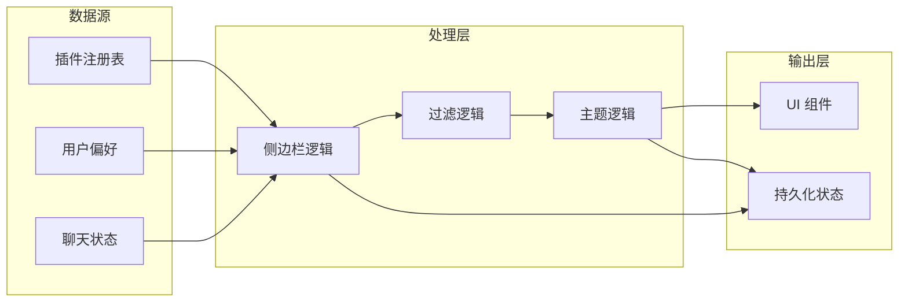

**图表来源**
- [registry.ts:13-17](file://src/app/plugin-registry/registry.ts#L13-L17)
- [settings.ts:13-27](file://src/app/store/settings.ts#L13-L27)
- [lan-chat.ts:89-201](file://src/plugins/lan-chat/store/lan-chat.ts#L89-L201)

**章节来源**
- [Sidebar.tsx:15-41](file://src/app/layout/Sidebar.tsx#L15-L41)
- [registry.ts:13-17](file://src/app/plugin-registry/registry.ts#L13-L17)

## 性能考虑

### 渲染优化策略

系统采用了多种性能优化技术：

1. **组件记忆化**：使用 `useMemo` 优化复杂计算
2. **状态分离**：将不同状态域分离到独立的存储中
3. **条件渲染**：根据状态动态决定渲染内容
4. **CSS 过渡**：利用硬件加速实现流畅动画

### 内存管理

- **存储清理**：使用 `persist` 中间件管理本地存储
- **事件监听**：在组件卸载时清理定时器和事件监听器
- **引用优化**：使用 `useRef` 避免不必要的重渲染

### 网络性能

对于 LAN Chat 功能，系统实现了智能的网络监控：

- **定时刷新**：初始延迟 1.8 秒，之后每 5 秒刷新一次
- **增量更新**：只处理新增的消息，避免重复处理
- **状态同步**：确保本地状态与服务器状态一致

## 故障排除指南

### 常见问题诊断

#### 插件不显示问题

**症状**：新安装的插件不在侧边栏显示

**排查步骤**：
1. 检查插件是否正确注册到注册表
2. 验证 `showInSidebar` 属性设置
3. 确认 `sidebarOrder` 排序值合理
4. 检查插件图标组件是否正确导入

**解决方法**：
```typescript
// 确保插件正确注册
register({
  id: "your-plugin-id",
  name: "Your Plugin",
  icon: <YourIcon />,
  version: "1.0.0",
  component: YourComponent,
  sidebarOrder: 100, // 确保数值合理
  showInSidebar: true // 确保显示在侧边栏
});
```

#### 折叠动画异常

**症状**：侧边栏折叠/展开动画不流畅

**排查步骤**：
1. 检查 CSS 过渡属性是否正确
2. 验证容器元素的 `transition` 属性
3. 确认没有其他 CSS 规则覆盖过渡效果

**解决方法**：
```css
/* 确保过渡属性正确 */
.devnexus-sidebar {
  transition: width 0.25s ease;
}

.devnexus-sidebar__group-chevron {
  transition: transform 0.2s ease;
}
```

#### 未读消息显示错误

**症状**：未读消息徽章显示不正确

**排查步骤**：
1. 检查聊天存储的状态更新逻辑
2. 验证窗口可见性判断条件
3. 确认活动会话状态同步

**解决方法**：
```typescript
// 确保正确的可见性检查
const isVisible = state.window.open && !state.window.minimized;
const unreadCount = isVisible ? 0 : state.window.unreadCount + count;
```

**章节来源**
- [Sidebar.tsx:22-25](file://src/app/layout/Sidebar.tsx#L22-L25)
- [lan-chat.ts:63-71](file://src/plugins/lan-chat/store/lan-chat.ts#L63-L71)

## 结论

DevNexus 的侧边栏导航系统展现了现代前端架构的最佳实践。通过模块化设计、响应式布局和智能状态管理，系统为开发者提供了强大而灵活的导航解决方案。

系统的主要优势包括：

1. **高度可扩展**：基于插件注册表的设计允许轻松添加新功能
2. **用户体验优秀**：流畅的动画效果和智能的响应式设计
3. **状态管理完善**：持久化的用户偏好和实时的通知系统
4. **代码结构清晰**：分层架构和明确的职责划分

未来可以考虑的改进方向：
- 添加插件权限控制系统
- 实现更丰富的主题定制选项
- 增强键盘快捷键支持
- 优化移动端触摸交互

## 附录

### 开发指南

#### 添加新插件到侧边栏

1. **创建插件组件**：
```typescript
export const myPlugin: PluginManifest = {
  id: "my-plugin",
  name: "My Plugin",
  icon: <AppstoreOutlined />,
  version: "1.0.0",
  component: MyPluginComponent,
  sidebarOrder: 50,
  showInSidebar: true,
};
```

2. **注册插件**：
```typescript
register(myPlugin);
```

3. **在内置插件中导出**：
```typescript
export function registerBuiltinPlugins(): void {
  register(myPlugin);
  // ... 其他插件
}
```

#### 自定义侧边栏样式

1. **修改 CSS 变量**：
```css
:root {
  --devnexus-sidebar-bg: #f5f5f5;
  --devnexus-sidebar-width-expanded: 220px;
  --devnexus-sidebar-width-collapsed: 70px;
}
```

2. **添加新的交互效果**：
```css
.devnexus-sidebar__plugin-button:hover {
  transform: translateX(2px);
  transition: transform 0.15s ease;
}
```

#### 扩展状态栏功能

1. **添加新的状态项**：
```typescript
export interface AppStatusInput {
  // ... 现有字段
  myCustomValue: string;
}

export function buildAppStatusItems(input: AppStatusInput): AppStatusItem[] {
  return [
    // ... 现有项目
    { label: "My Custom", value: input.myCustomValue },
  ];
}
```

2. **集成到应用壳层**：
```typescript
const statusItems = useMemo(
  () =>
    buildAppStatusItems({
      // ... 现有参数
      myCustomValue: myCustomState,
    }),
  [myCustomState]
);
```