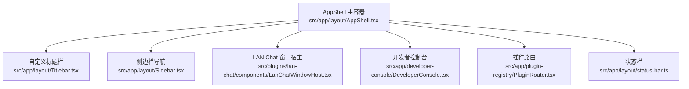
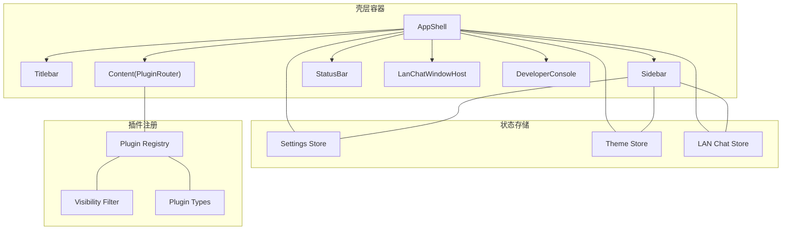
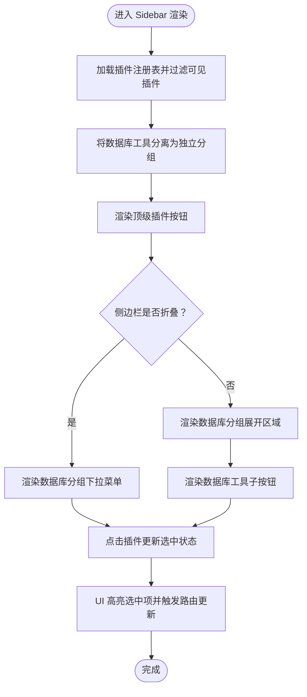
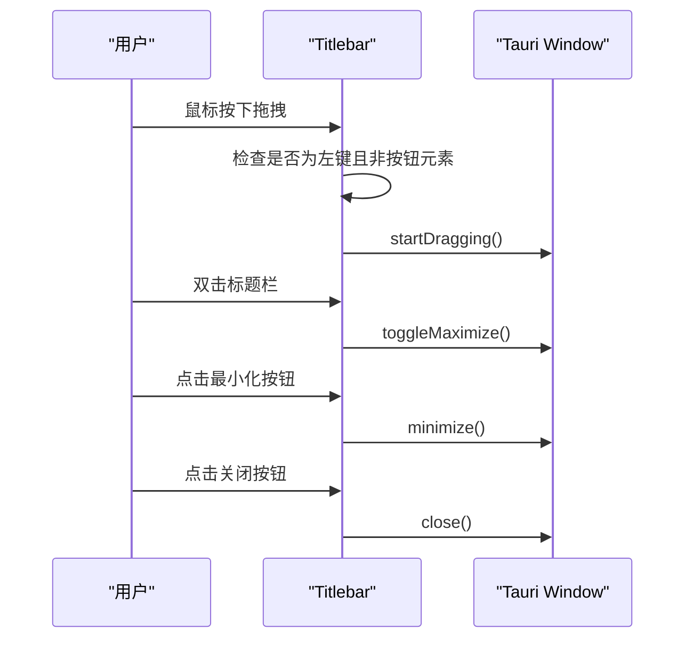
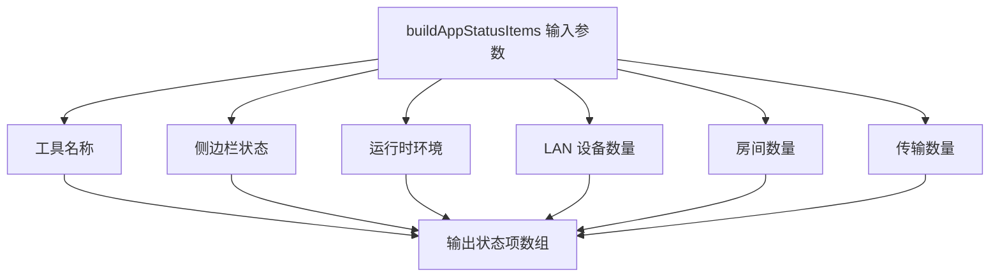
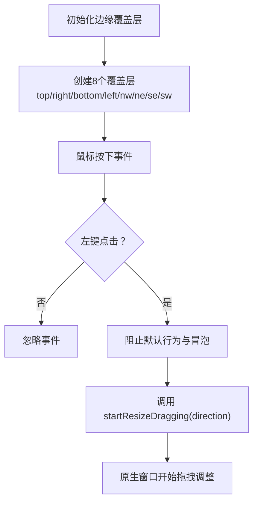
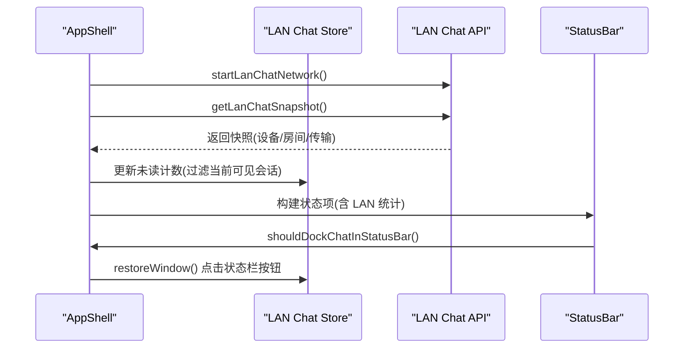
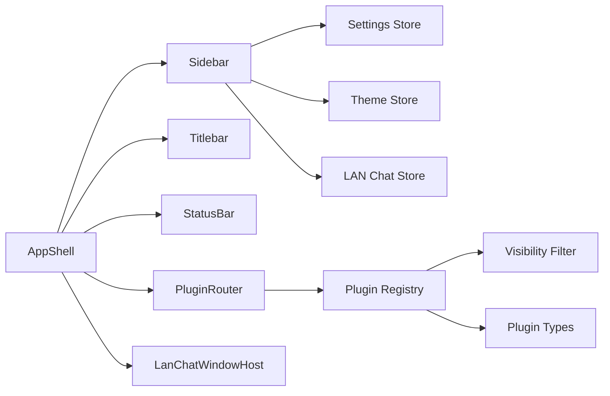

# 应用壳层设计

<cite>
**本文档引用的文件**
- [AppShell.tsx](file://src/app/layout/AppShell.tsx)
- [Sidebar.tsx](file://src/app/layout/Sidebar.tsx)
- [Titlebar.tsx](file://src/app/layout/Titlebar.tsx)
- [status-bar.ts](file://src/app/layout/status-bar.ts)
- [registry.ts](file://src/app/plugin-registry/registry.ts)
- [visibility.ts](file://src/app/plugin-registry/visibility.ts)
- [types.ts](file://src/app/plugin-registry/types.ts)
- [settings.ts](file://src/app/store/settings.ts)
- [theme.ts](file://src/app/store/theme.ts)
- [lan-chat.ts](file://src/plugins/lan-chat/store/lan-chat.ts)
- [LanChatWindowHost.tsx](file://src/plugins/lan-chat/components/LanChatWindowHost.tsx)
- [global.css](file://src/styles/global.css)
- [redis-manager/index.tsx](file://src/plugins/redis-manager/index.tsx)
</cite>

## 目录
1. [简介](#简介)
2. [项目结构](#项目结构)
3. [核心组件](#核心组件)
4. [架构总览](#架构总览)
5. [详细组件分析](#详细组件分析)
6. [依赖关系分析](#依赖关系分析)
7. [性能考虑](#性能考虑)
8. [故障排除指南](#故障排除指南)
9. [结论](#结论)
10. [附录](#附录)

## 简介
本设计文档面向 DevNexus 的应用壳层（AppShell），系统性阐述其作为应用主容器的整体设计思路，包括布局结构、组件组织与交互逻辑。重点覆盖：
- 侧边栏（Sidebar）导航设计：插件列表展示、选中状态管理、分组折叠与响应式布局
- 自定义标题栏（Titlebar）实现：窗口控制按钮、拖拽区域与平台适配
- 状态栏（StatusBar）功能设计：运行时信息显示、设备状态监控与快捷操作入口
- 边缘拖拽调整窗口大小机制：桌面端窗口尺寸调整与跨平台兼容性
- 布局定制与主题适配的扩展指南

## 项目结构
DevNexus 的壳层采用模块化布局，以 Ant Design 的 Layout 组件为核心容器，配合自定义的 Sidebar、Titlebar、StatusBar 与插件路由，形成统一的主界面骨架。

图表来源
- [AppShell.tsx:147-205](file://src/app/layout/AppShell.tsx#L147-L205)
- [Titlebar.tsx:12-74](file://src/app/layout/Titlebar.tsx#L12-L74)
- [Sidebar.tsx:21-176](file://src/app/layout/Sidebar.tsx#L21-L176)
- [status-bar.ts:15-28](file://src/app/layout/status-bar.ts#L15-L28)

章节来源
- [AppShell.tsx:31-206](file://src/app/layout/AppShell.tsx#L31-L206)
- [global.css:36-101](file://src/styles/global.css#L36-L101)

## 核心组件
- AppShell：应用主容器，负责整体布局、边缘拖拽、状态栏数据构建与 LAN Chat 窗口集成
- Sidebar：左侧导航，包含插件列表、数据库工具分组、主题切换与 LAN Chat 快捷入口
- Titlebar：自定义标题栏，提供窗口控制按钮与拖拽区域，并针对 macOS 进行平台适配
- StatusBar：底部状态栏，展示工具名称、侧边栏状态、运行时环境与 LAN 设备/房间/传输统计
- 插件路由：根据选中插件动态渲染对应插件视图

章节来源
- [AppShell.tsx:31-206](file://src/app/layout/AppShell.tsx#L31-L206)
- [Sidebar.tsx:21-176](file://src/app/layout/Sidebar.tsx#L21-L176)
- [Titlebar.tsx:12-74](file://src/app/layout/Titlebar.tsx#L12-L74)
- [status-bar.ts:15-28](file://src/app/layout/status-bar.ts#L15-L28)

## 架构总览
AppShell 通过 Ant Design 的 Layout 结构组织页面，结合 Zustand 状态管理与 Tauri 桌面能力，实现跨平台的窗口控制与拖拽调整。

图表来源
- [AppShell.tsx:31-206](file://src/app/layout/AppShell.tsx#L31-L206)
- [Sidebar.tsx:21-176](file://src/app/layout/Sidebar.tsx#L21-L176)
- [settings.ts:13-27](file://src/app/store/settings.ts#L13-L27)
- [theme.ts:12-26](file://src/app/store/theme.ts#L12-L26)
- [registry.ts:3-25](file://src/app/plugin-registry/registry.ts#L3-L25)
- [visibility.ts:3-5](file://src/app/plugin-registry/visibility.ts#L3-L5)
- [types.ts:5-13](file://src/app/plugin-registry/types.ts#L5-L13)

## 详细组件分析

### 侧边栏（Sidebar）导航设计
- 插件列表展示：从插件注册表中筛选显示在侧边栏的插件，按 sidebarOrder 排序
- 分组折叠：数据库工具（Redis/MongoDB/MySQL）单独分组，支持折叠展开
- 选中状态管理：通过 Settings Store 记录当前选中插件 ID，并在 UI 中高亮显示
- 响应式布局：在折叠状态下使用下拉菜单与 Tooltip 提供紧凑体验
- 工具栏快捷入口：LAN Chat 未读计数徽章与主题模式切换按钮

图表来源
- [Sidebar.tsx:21-176](file://src/app/layout/Sidebar.tsx#L21-L176)
- [registry.ts:13-21](file://src/app/plugin-registry/registry.ts#L13-L21)
- [visibility.ts:3-5](file://src/app/plugin-registry/visibility.ts#L3-L5)
- [settings.ts:13-27](file://src/app/store/settings.ts#L13-L27)

章节来源
- [Sidebar.tsx:21-176](file://src/app/layout/Sidebar.tsx#L21-L176)
- [registry.ts:13-21](file://src/app/plugin-registry/registry.ts#L13-L21)
- [visibility.ts:3-5](file://src/app/plugin-registry/visibility.ts#L3-L5)
- [settings.ts:13-27](file://src/app/store/settings.ts#L13-L27)

### 自定义标题栏（Titlebar）实现
- 平台适配：macOS 运行时直接返回空，使用原生标题栏
- 拖拽区域：标题栏区域支持鼠标拖拽移动窗口，双击最大化/还原
- 窗口控制：最小化、最大化/还原、关闭按钮，仅在 Tauri 桌面环境下可用

图表来源
- [Titlebar.tsx:12-74](file://src/app/layout/Titlebar.tsx#L12-L74)

章节来源
- [Titlebar.tsx:12-74](file://src/app/layout/Titlebar.tsx#L12-L74)

### 状态栏（StatusBar）功能设计
- 数据构建：根据当前选中插件、侧边栏状态、运行时环境与 LAN Chat 设备/房间/传输数量生成状态项
- 快捷操作：当 LAN Chat 窗口处于最小化但打开状态时，在状态栏显示“LAN Chat”按钮，点击恢复窗口

图表来源
- [status-bar.ts:15-28](file://src/app/layout/status-bar.ts#L15-L28)

章节来源
- [status-bar.ts:15-28](file://src/app/layout/status-bar.ts#L15-L28)

### 边缘拖拽调整窗口大小机制
- 桌面端窗口调整：在非 macOS 平台下，AppShell 在窗口四周绘制 8 个边缘覆盖层，分别对应不同方向的拖拽
- 调整方向枚举：包含北、南、东、西及四个对角线方向
- 事件处理：鼠标按下时调用 Tauri Window 的 startResizeDragging，实现原生窗口拖拽调整

图表来源
- [AppShell.tsx:94-145](file://src/app/layout/AppShell.tsx#L94-L145)
- [AppShell.tsx:158-166](file://src/app/layout/AppShell.tsx#L158-L166)

章节来源
- [AppShell.tsx:94-166](file://src/app/layout/AppShell.tsx#L94-L166)

### LAN Chat 集成与状态栏联动
- LAN Chat 监控：定时刷新 LAN Chat 快照，统计设备、房间与传输数量
- 未读计数：检测新消息并累加未读计数，避免当前可见会话重复提醒
- 状态栏显示：当窗口最小化但打开时，显示 LAN Chat 快捷按钮与未读徽章

图表来源
- [AppShell.tsx:59-92](file://src/app/layout/AppShell.tsx#L59-L92)
- [status-bar.ts:26-28](file://src/app/layout/status-bar.ts#L26-L28)
- [lan-chat.ts:89-201](file://src/plugins/lan-chat/store/lan-chat.ts#L89-L201)

章节来源
- [AppShell.tsx:59-92](file://src/app/layout/AppShell.tsx#L59-L92)
- [status-bar.ts:26-28](file://src/app/layout/status-bar.ts#L26-L28)
- [lan-chat.ts:89-201](file://src/plugins/lan-chat/store/lan-chat.ts#L89-L201)

## 依赖关系分析
- 组件耦合：AppShell 与 Sidebar、Titlebar、StatusBar、PluginRouter、LanChatWindowHost 形成强耦合的主容器关系
- 状态管理：Settings Store 与 Theme Store 为 Sidebar 与全局主题提供状态；LAN Chat Store 为 LAN Chat 功能提供状态
- 插件系统：Plugin Registry 与 Visibility Filter 决定 Sidebar 展示的插件集合；Plugin Manifest 定义插件元数据

图表来源
- [AppShell.tsx:31-206](file://src/app/layout/AppShell.tsx#L31-L206)
- [Sidebar.tsx:21-176](file://src/app/layout/Sidebar.tsx#L21-L176)
- [settings.ts:13-27](file://src/app/store/settings.ts#L13-L27)
- [theme.ts:12-26](file://src/app/store/theme.ts#L12-L26)
- [registry.ts:3-25](file://src/app/plugin-registry/registry.ts#L3-L25)
- [visibility.ts:3-5](file://src/app/plugin-registry/visibility.ts#L3-L5)
- [types.ts:5-13](file://src/app/plugin-registry/types.ts#L5-L13)

章节来源
- [AppShell.tsx:31-206](file://src/app/layout/AppShell.tsx#L31-L206)
- [Sidebar.tsx:21-176](file://src/app/layout/Sidebar.tsx#L21-L176)
- [settings.ts:13-27](file://src/app/store/settings.ts#L13-L27)
- [theme.ts:12-26](file://src/app/store/theme.ts#L12-L26)
- [registry.ts:3-25](file://src/app/plugin-registry/registry.ts#L3-L25)
- [visibility.ts:3-5](file://src/app/plugin-registry/visibility.ts#L3-L5)
- [types.ts:5-13](file://src/app/plugin-registry/types.ts#L5-L13)

## 性能考虑
- 状态栏数据计算：使用 useMemo 缓存状态项构建结果，减少不必要的重渲染
- LAN Chat 监控：定时器与首次延迟启动，避免频繁网络请求
- 边缘覆盖层：仅在桌面端且非 macOS 平台启用，避免不必要的 DOM 节点
- 插件渲染：插件路由按需渲染，避免一次性加载所有插件视图

## 故障排除指南
- 标题栏拖拽无效：检查运行时是否为桌面环境且未使用 macOS 原生标题栏
- 窗口调整无响应：确认鼠标按键为左键，且未在按钮元素上触发
- LAN Chat 未读计数不更新：检查定时器是否正常运行与网络连接状态
- 侧边栏插件不显示：确认插件 manifest 中 showInSidebar 未设为 false，且 sidebarOrder 正确

章节来源
- [Titlebar.tsx:12-74](file://src/app/layout/Titlebar.tsx#L12-L74)
- [AppShell.tsx:94-166](file://src/app/layout/AppShell.tsx#L94-L166)
- [AppShell.tsx:59-92](file://src/app/layout/AppShell.tsx#L59-L92)
- [visibility.ts:3-5](file://src/app/plugin-registry/visibility.ts#L3-L5)

## 结论
DevNexus 的应用壳层通过清晰的模块划分与状态管理，实现了跨平台的桌面体验与灵活的插件化架构。Sidebar 提供直观的导航与快捷入口，Titlebar 与边缘拖拽确保窗口操作的流畅性，StatusBar 则集中展示了关键运行时信息与快捷操作。整体设计兼顾了可维护性与扩展性，为后续功能迭代提供了良好的基础。

## 附录

### 布局定制与主题适配扩展指南
- CSS 变量：通过全局 CSS 变量控制主题色与背景，便于主题切换
- Sidebar 折叠策略：可扩展更多分组或条件折叠逻辑
- 状态栏扩展：新增运行时指标或设备监控项，通过 buildAppStatusItems 动态注入
- 插件注册：通过 Plugin Manifest 扩展插件元数据，如图标、版本与排序字段
- 主题存储：Theme Store 支持持久化与模式切换，可扩展更多主题变量

章节来源
- [global.css:1-17](file://src/styles/global.css#L1-L17)
- [types.ts:5-13](file://src/app/plugin-registry/types.ts#L5-L13)
- [theme.ts:12-26](file://src/app/store/theme.ts#L12-L26)