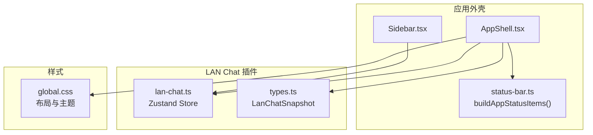
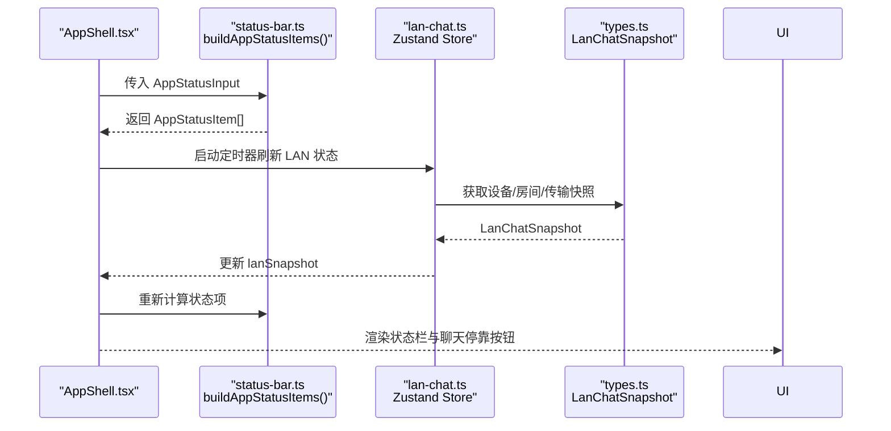
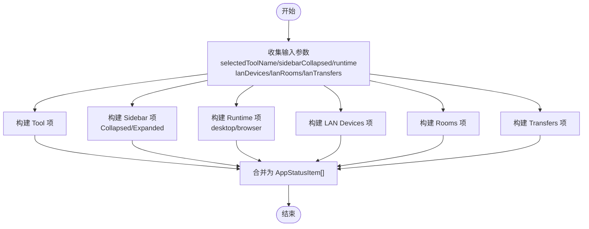
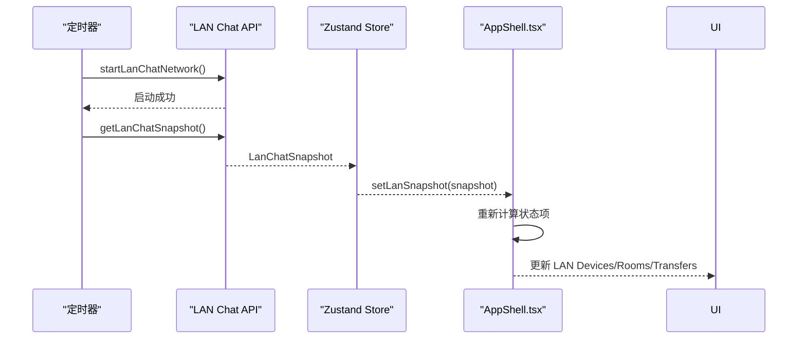
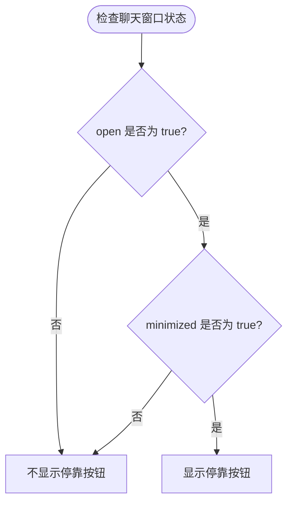
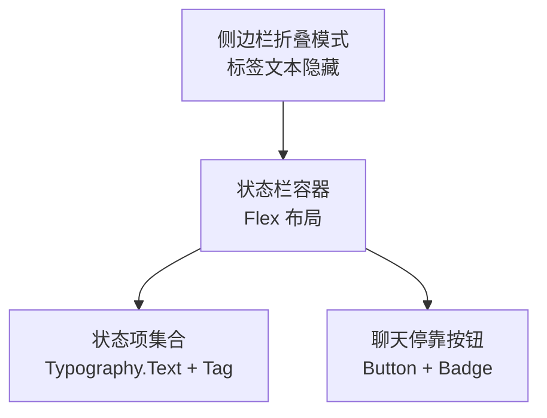
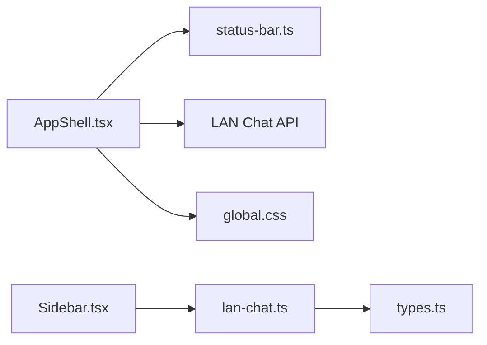

# 状态栏信息显示

<cite>
**本文档引用的文件**
- [status-bar.ts](file://src/app/layout/status-bar.ts)
- [AppShell.tsx](file://src/app/layout/AppShell.tsx)
- [Sidebar.tsx](file://src/app/layout/Sidebar.tsx)
- [lan-chat.ts](file://src/plugins/lan-chat/store/lan-chat.ts)
- [types.ts](file://src/plugins/lan-chat/types.ts)
- [global.css](file://src/styles/global.css)
- [status-bar.test.ts](file://tests/app/status-bar.test.ts)
</cite>

## 目录
1. [简介](#简介)
2. [项目结构](#项目结构)
3. [核心组件](#核心组件)
4. [架构总览](#架构总览)
5. [详细组件分析](#详细组件分析)
6. [依赖关系分析](#依赖关系分析)
7. [性能考虑](#性能考虑)
8. [故障排除指南](#故障排除指南)
9. [结论](#结论)
10. [附录：定制与扩展指南](#附录定制与扩展指南)

## 简介
本文件面向 DevNexus 的状态栏信息显示系统，重点解析 `buildAppStatusItems` 函数的设计原理与实现细节，涵盖运行时信息收集、设备状态监控、LAN Chat 集成、响应式布局与紧凑模式、以及状态更新机制（定时刷新与事件驱动）。同时提供状态栏定制与扩展的开发指南，帮助开发者新增状态项与自定义显示格式。

## 项目结构
状态栏相关代码主要分布在以下模块：
- 状态栏构建与判断逻辑：src/app/layout/status-bar.ts
- 应用外壳与状态渲染：src/app/layout/AppShell.tsx
- 侧边栏与 LAN Chat 入口：src/app/layout/Sidebar.tsx
- LAN Chat 存储与窗口状态：src/plugins/lan-chat/store/lan-chat.ts
- LAN Chat 类型定义：src/plugins/lan-chat/types.ts
- 全局样式与布局：src/styles/global.css
- 单元测试：tests/app/status-bar.test.ts

**图表来源**
- [AppShell.tsx:31-206](file://src/app/layout/AppShell.tsx#L31-L206)
- [status-bar.ts:15-28](file://src/app/layout/status-bar.ts#L15-L28)
- [Sidebar.tsx:32-176](file://src/app/layout/Sidebar.tsx#L32-L176)
- [lan-chat.ts:73-202](file://src/plugins/lan-chat/store/lan-chat.ts#L73-L202)
- [types.ts:68-74](file://src/plugins/lan-chat/types.ts#L68-L74)
- [global.css:858-890](file://src/styles/global.css#L858-L890)

**章节来源**
- [status-bar.ts:1-28](file://src/app/layout/status-bar.ts#L1-L28)
- [AppShell.tsx:1-207](file://src/app/layout/AppShell.tsx#L1-L207)
- [Sidebar.tsx:32-176](file://src/app/layout/Sidebar.tsx#L32-L176)
- [lan-chat.ts:73-202](file://src/plugins/lan-chat/store/lan-chat.ts#L73-L202)
- [types.ts:68-74](file://src/plugins/lan-chat/types.ts#L68-L74)
- [global.css:858-890](file://src/styles/global.css#L858-L890)

## 核心组件
- 状态输入接口：AppStatusInput
  - 包含当前选中工具名、侧边栏折叠状态、运行时环境（desktop/browser）、LAN 设备数、房间数、传输任务数。
- 状态项接口：AppStatusItem
  - 每个状态项由标签与值组成，用于 UI 渲染。
- 构建函数：buildAppStatusItems
  - 将 AppStatusInput 转换为 AppStatusItem 数组，实现动态状态项生成。
- 聊天停靠判断：shouldDockChatInStatusBar
  - 当聊天窗口打开且最小化时，将其停靠到状态栏。

**章节来源**
- [status-bar.ts:1-28](file://src/app/layout/status-bar.ts#L1-L28)

## 架构总览
状态栏信息流从应用外壳收集状态，调用构建函数生成状态项，并在底部栏渲染；同时通过 LAN Chat API 定时刷新网络快照，驱动状态项中的设备、房间与传输任务计数变化。

**图表来源**
- [AppShell.tsx:44-92](file://src/app/layout/AppShell.tsx#L44-L92)
- [status-bar.ts:15-24](file://src/app/layout/status-bar.ts#L15-L24)
- [lan-chat.ts:73-202](file://src/plugins/lan-chat/store/lan-chat.ts#L73-L202)
- [types.ts:68-74](file://src/plugins/lan-chat/types.ts#L68-L74)

## 详细组件分析

### 组件一：状态项构建器 buildAppStatusItems
- 设计原则
  - 输入即契约：严格约束输入字段，确保渲染稳定性。
  - 输出即展示：统一输出结构，便于 UI 一致渲染。
  - 可组合性：每个状态项独立，支持按需增删。
- 动态生成逻辑
  - 工具名：来自插件注册表名称或 ID。
  - 侧边栏状态：根据布尔值映射为“Collapsed/Expanded”。
  - 运行时：根据是否为桌面运行时输出“desktop/browser”。
  - LAN 数据：设备数、房间数、传输任务数以字符串形式显示。
- 参数处理要点
  - selectedToolName：来源于当前选中插件的名称。
  - sidebarCollapsed：来源于设置存储。
  - runtime：来源于运行平台检测。
  - lanDevices/lanRooms/lanTransfers：来源于 LAN Chat 快照长度。

**图表来源**
- [status-bar.ts:15-24](file://src/app/layout/status-bar.ts#L15-L24)

**章节来源**
- [status-bar.ts:15-24](file://src/app/layout/status-bar.ts#L15-L24)

### 组件二：LAN Chat 集成与状态监控
- 数据来源
  - LanChatSnapshot：包含设备、房间、传输任务列表。
- 监控流程
  - 定时刷新：启动后立即执行一次，随后每 5 秒刷新一次。
  - 未读统计：遍历会话消息，过滤非本地发送且未见过的消息，累加到对应会话未读数。
  - 可见性判断：仅当聊天窗口未最小化且非可见会话时才增加未读数。
- 状态项联动
  - 设备数、房间数、传输任务数来源于快照数组长度，随刷新自动更新。

**图表来源**
- [AppShell.tsx:59-92](file://src/app/layout/AppShell.tsx#L59-L92)
- [lan-chat.ts:73-202](file://src/plugins/lan-chat/store/lan-chat.ts#L73-L202)
- [types.ts:68-74](file://src/plugins/lan-chat/types.ts#L68-L74)

**章节来源**
- [AppShell.tsx:59-92](file://src/app/layout/AppShell.tsx#L59-L92)
- [lan-chat.ts:73-202](file://src/plugins/lan-chat/store/lan-chat.ts#L73-L202)
- [types.ts:68-74](file://src/plugins/lan-chat/types.ts#L68-L74)

### 组件三：聊天停靠逻辑 shouldDockChatInStatusBar
- 触发条件：聊天窗口处于打开且最小化状态。
- 停靠行为：在状态栏右侧显示一个小型按钮，点击可恢复窗口。
- 未停靠条件：窗口未打开或未最小化时不显示停靠按钮。

**图表来源**
- [status-bar.ts:26-28](file://src/app/layout/status-bar.ts#L26-L28)
- [lan-chat.ts:4-13](file://src/plugins/lan-chat/store/lan-chat.ts#L4-L13)

**章节来源**
- [status-bar.ts:26-28](file://src/app/layout/status-bar.ts#L26-L28)
- [lan-chat.ts:4-13](file://src/plugins/lan-chat/store/lan-chat.ts#L4-L13)

### 组件四：响应式布局与紧凑模式
- 响应式设计
  - 状态栏容器使用 Flex 布局，左侧为状态项集合，右侧为聊天停靠按钮。
  - 状态项采用 Ant Design 的 Typography.Text + Tag 组件，保证文本与数值分隔清晰。
- 紧凑模式
  - 侧边栏折叠时，状态栏中的标签文本被隐藏，仅保留图标与简短提示，提升空间利用率。
- 主题适配
  - 根据主题切换（浅色/深色）调整状态栏背景与边框颜色，确保可读性。

**图表来源**
- [AppShell.tsx:179-201](file://src/app/layout/AppShell.tsx#L179-L201)
- [global.css:858-890](file://src/styles/global.css#L858-L890)
- [Sidebar.tsx:98-101](file://src/app/layout/Sidebar.tsx#L98-L101)

**章节来源**
- [AppShell.tsx:179-201](file://src/app/layout/AppShell.tsx#L179-L201)
- [global.css:858-890](file://src/styles/global.css#L858-L890)
- [Sidebar.tsx:98-101](file://src/app/layout/Sidebar.tsx#L98-L101)

## 依赖关系分析
- 组件耦合
  - AppShell 依赖 status-bar 构建函数与 LAN Chat API。
  - Sidebar 依赖 LAN Chat Store 以提供聊天入口与未读计数。
  - 全局样式为状态栏与聊天停靠按钮提供视觉规范。
- 外部依赖
  - Ant Design 组件库用于文本、标签与按钮等 UI 组件。
  - Zustand 用于 LAN Chat Store 的状态管理。
- 潜在循环依赖
  - 当前模块间为单向依赖（AppShell -> status-bar 与 LAN Chat），无循环风险。

**图表来源**
- [AppShell.tsx:9-18](file://src/app/layout/AppShell.tsx#L9-L18)
- [status-bar.ts:15-28](file://src/app/layout/status-bar.ts#L15-L28)
- [Sidebar.tsx:40-41](file://src/app/layout/Sidebar.tsx#L40-L41)
- [lan-chat.ts:73-202](file://src/plugins/lan-chat/store/lan-chat.ts#L73-L202)
- [types.ts:68-74](file://src/plugins/lan-chat/types.ts#L68-L74)
- [global.css:858-890](file://src/styles/global.css#L858-L890)

**章节来源**
- [AppShell.tsx:9-18](file://src/app/layout/AppShell.tsx#L9-L18)
- [Sidebar.tsx:40-41](file://src/app/layout/Sidebar.tsx#L40-L41)
- [lan-chat.ts:73-202](file://src/plugins/lan-chat/store/lan-chat.ts#L73-L202)
- [types.ts:68-74](file://src/plugins/lan-chat/types.ts#L68-L74)
- [global.css:858-890](file://src/styles/global.css#L858-L890)

## 性能考虑
- 计算优化
  - 使用 useMemo 缓存状态项结果，避免不必要的重渲染。
  - 仅在关键依赖（如运行时、LAN 快照长度、工具名、侧边栏状态）变化时重新计算。
- 网络刷新策略
  - 初始延迟 1.8 秒，随后每 5 秒刷新一次，平衡实时性与资源消耗。
  - 错误捕获与忽略，防止异常影响主流程。
- UI 渲染
  - Ant Design 的 Tag 与 Typography.Text 渲染开销较低，适合频繁更新。
  - 紧凑模式下减少文本渲染，提升小屏体验。

**章节来源**
- [AppShell.tsx:44-56](file://src/app/layout/AppShell.tsx#L44-L56)
- [AppShell.tsx:86-92](file://src/app/layout/AppShell.tsx#L86-L92)

## 故障排除指南
- 状态项为空或不更新
  - 检查 AppStatusInput 的依赖是否正确传递（selectedToolName、sidebarCollapsed、runtime、lanDevices/lanRooms/lanTransfers）。
  - 确认 useMemo 的依赖数组是否包含所有相关状态。
- LAN Chat 未显示数据
  - 确认桌面运行时检测逻辑与 LAN Chat API 初始化是否成功。
  - 查看定时器是否正常执行，错误日志是否被捕获。
- 聊天停靠按钮不出现
  - 确认聊天窗口状态为 open=true 且 minimized=true。
  - 检查 dockChat 计算逻辑与 UI 条件渲染。

**章节来源**
- [status-bar.test.ts:5-26](file://tests/app/status-bar.test.ts#L5-L26)
- [AppShell.tsx:44-56](file://src/app/layout/AppShell.tsx#L44-L56)
- [status-bar.ts:26-28](file://src/app/layout/status-bar.ts#L26-L28)

## 结论
DevNexus 状态栏信息显示系统通过简洁的输入-输出模型与稳定的依赖关系，实现了运行时信息、侧边栏状态与 LAN Chat 数据的动态展示。其响应式布局与紧凑模式提升了多场景下的可用性，而定时刷新与事件驱动更新保障了信息的实时性与可靠性。该设计易于扩展，为后续新增状态项与自定义格式提供了良好基础。

## 附录：定制与扩展指南
- 新增状态项
  - 在 AppStatusInput 中添加新字段，在 buildAppStatusItems 中映射为新的 AppStatusItem。
  - 在 AppShell 的 useMemo 依赖数组中加入新依赖，确保状态项重新计算。
- 自定义显示格式
  - 对于数值类状态，可使用字符串转换或格式化函数统一显示（如千分位、单位换算）。
  - 对于布尔类状态，可映射为更直观的文案（如“启用/禁用”）。
- 扩展 LAN Chat 集成
  - 在 LanChatSnapshot 中新增字段，同步更新 AppStatusInput 与 buildAppStatusItems。
  - 在 AppShell 的刷新逻辑中处理新字段，确保未读统计与可见性判断符合预期。
- UI 与主题适配
  - 通过全局样式变量与 Ant Design 组件属性，保持状态栏在不同主题下的可读性与一致性。

**章节来源**
- [status-bar.ts:1-28](file://src/app/layout/status-bar.ts#L1-L28)
- [AppShell.tsx:44-56](file://src/app/layout/AppShell.tsx#L44-L56)
- [types.ts:68-74](file://src/plugins/lan-chat/types.ts#L68-L74)
- [global.css:858-890](file://src/styles/global.css#L858-L890)