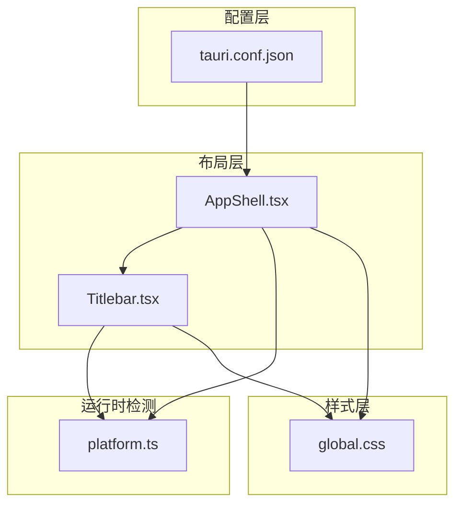
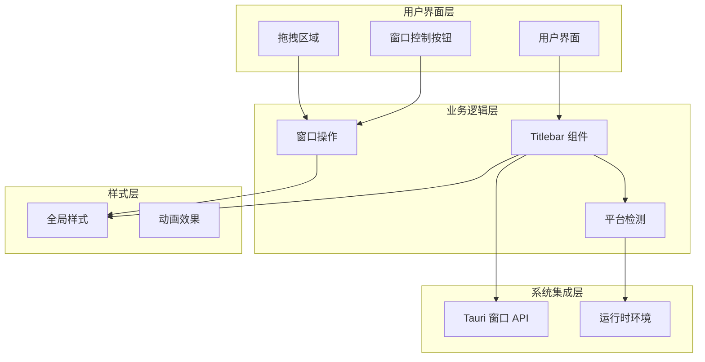
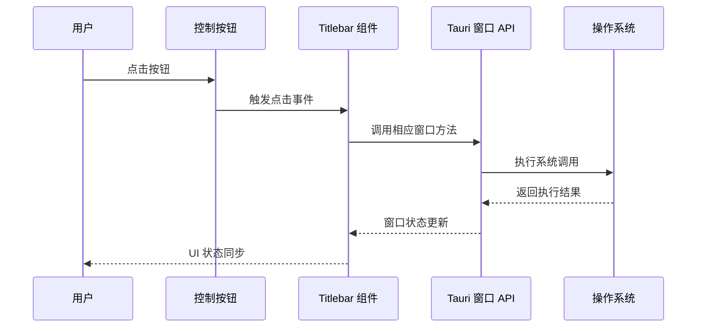
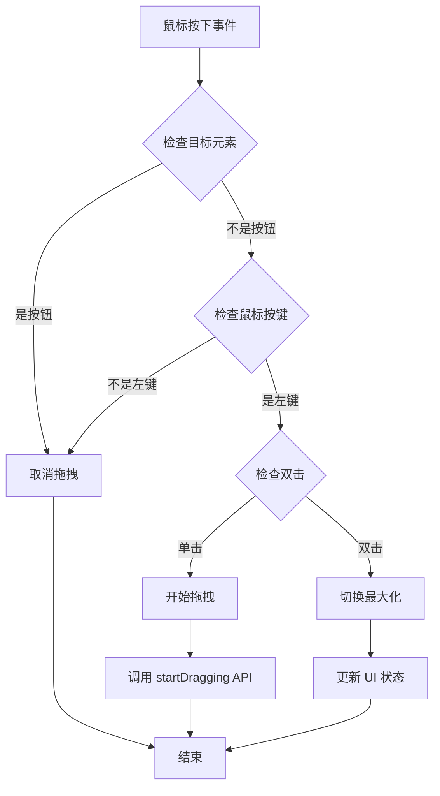
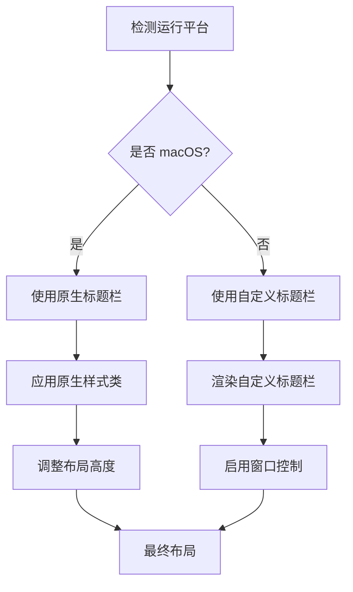
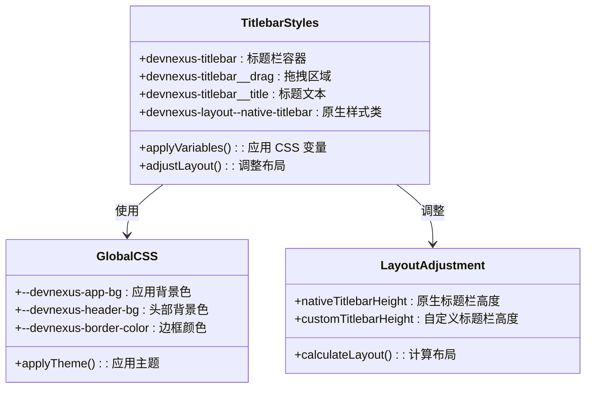
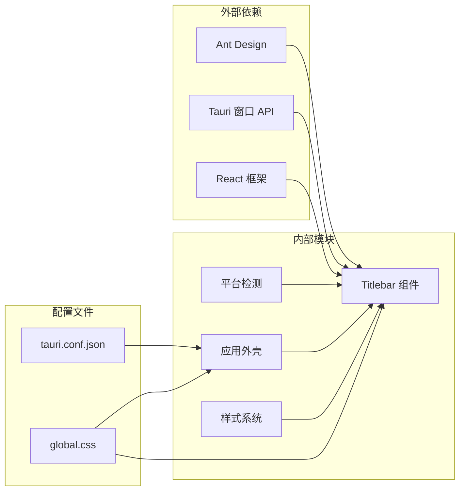

# 自定义标题栏

<cite>
**本文档引用的文件**
- [Titlebar.tsx](file://src/app/layout/Titlebar.tsx)
- [platform.ts](file://src/app/runtime/platform.ts)
- [AppShell.tsx](file://src/app/layout/AppShell.tsx)
- [global.css](file://src/styles/global.css)
- [tauri.conf.json](file://src-tauri/tauri.conf.json)
- [status-bar.ts](file://src/app/layout/status-bar.ts)
</cite>

## 目录
1. [简介](#简介)
2. [项目结构](#项目结构)
3. [核心组件](#核心组件)
4. [架构概览](#架构概览)
5. [详细组件分析](#详细组件分析)
6. [依赖关系分析](#依赖关系分析)
7. [性能考虑](#性能考虑)
8. [故障排除指南](#故障排除指南)
9. [结论](#结论)

## 简介

DevNexus 的自定义标题栏是一个精心设计的跨平台窗口控件系统，专为 Tauri 桌面应用而构建。该系统提供了统一的窗口控制体验，支持最小化、最大化/还原、关闭等标准窗口操作，同时实现了智能的拖拽功能和平台适配策略。

该组件的核心设计理念是：
- **平台感知**：自动检测运行环境并相应调整行为
- **原生体验**：在 macOS 上使用原生标题栏，在其他平台上提供自定义实现
- **用户友好**：提供直观的窗口控制按钮和拖拽功能
- **跨平台兼容**：确保在 Windows、macOS 和 Linux 上的一致体验

## 项目结构

自定义标题栏系统主要分布在以下文件中：

**图表来源**
- [AppShell.tsx:1-207](file://src/app/layout/AppShell.tsx#L1-L207)
- [Titlebar.tsx:1-75](file://src/app/layout/Titlebar.tsx#L1-L75)
- [platform.ts:1-10](file://src/app/runtime/platform.ts#L1-L10)
- [global.css:1-973](file://src/styles/global.css#L1-L973)
- [tauri.conf.json:1-39](file://src-tauri/tauri.conf.json#L1-L39)

**章节来源**
- [AppShell.tsx:147-168](file://src/app/layout/AppShell.tsx#L147-L168)
- [Titlebar.tsx:12-74](file://src/app/layout/Titlebar.tsx#L12-L74)

## 核心组件

### Titlebar 组件

Titlebar 组件是自定义标题栏的核心实现，负责渲染窗口控制按钮和处理用户交互。

**主要特性：**
- 条件渲染：仅在非 macOS 平台上显示
- 窗口控制：提供最小化、最大化/还原、关闭按钮
- 拖拽功能：实现窗口拖拽移动
- 双击最大化：支持双击标题栏区域进行窗口最大化/还原

**章节来源**
- [Titlebar.tsx:12-74](file://src/app/layout/Titlebar.tsx#L12-L74)

### 平台检测模块

platform.ts 模块提供了运行时平台检测功能，用于判断应用程序是否在 macOS 环境中运行。

**检测机制：**
- 使用 `navigator.platform` 检测平台标识
- 检查 `navigator.userAgent` 中的 macOS 字符串
- 返回布尔值指示是否为 macOS 运行时

**章节来源**
- [platform.ts:1-10](file://src/app/runtime/platform.ts#L1-L10)

### 应用外壳容器

AppShell.tsx 作为应用的主要容器，协调自定义标题栏与其他界面元素的关系。

**关键功能：**
- 布局管理：组织标题栏、侧边栏、主要内容区域
- 样式应用：根据平台类型应用不同的 CSS 类名
- 窗口控制：提供窗口拖拽和调整大小功能
- 状态管理：维护应用的整体状态和配置

**章节来源**
- [AppShell.tsx:31-206](file://src/app/layout/AppShell.tsx#L31-L206)

## 架构概览

自定义标题栏系统采用分层架构设计，确保了良好的模块分离和可维护性：

**图表来源**
- [Titlebar.tsx:12-74](file://src/app/layout/Titlebar.tsx#L12-L74)
- [platform.ts:1-10](file://src/app/runtime/platform.ts#L1-L10)
- [AppShell.tsx:147-168](file://src/app/layout/AppShell.tsx#L147-L168)

## 详细组件分析

### 窗口控制按钮实现

窗口控制按钮是自定义标题栏的核心功能之一，提供了标准的窗口操作能力：

**图表来源**
- [Titlebar.tsx:48-71](file://src/app/layout/Titlebar.tsx#L48-L71)

**实现细节：**
- **最小化按钮**：调用 `minimize()` 方法将窗口最小化到任务栏
- **最大化/还原按钮**：调用 `toggleMaximize()` 在最大化和正常状态间切换
- **关闭按钮**：调用 `close()` 方法关闭窗口
- **禁用状态**：当无法控制窗口时自动禁用按钮

**章节来源**
- [Titlebar.tsx:48-71](file://src/app/layout/Titlebar.tsx#L48-L71)

### 拖拽功能实现原理

拖拽功能通过鼠标事件处理和 Tauri 窗口 API 实现：

**图表来源**
- [Titlebar.tsx:22-44](file://src/app/layout/Titlebar.tsx#L22-L44)

**实现机制：**
- **事件拦截**：阻止按钮点击事件冒泡到拖拽处理程序
- **按键检测**：确保只有左键触发拖拽操作
- **双击处理**：双击事件触发窗口最大化/还原
- **API 调用**：通过 `startDragging()` 实现窗口拖拽

**章节来源**
- [Titlebar.tsx:22-44](file://src/app/layout/Titlebar.tsx#L22-L44)

### 平台适配策略

系统采用智能的平台适配策略，确保在不同操作系统上提供最佳体验：

**图表来源**
- [platform.ts:1-10](file://src/app/runtime/platform.ts#L1-L10)
- [AppShell.tsx:147-148](file://src/app/layout/AppShell.tsx#L147-L148)

**适配机制：**
- **macOS 检测**：通过 `navigator.platform` 和 `navigator.userAgent` 检测
- **原生标题栏**：在 macOS 上使用系统原生标题栏
- **自定义标题栏**：在其他平台提供自定义实现
- **样式调整**：根据平台类型调整布局高度

**章节来源**
- [platform.ts:1-10](file://src/app/runtime/platform.ts#L1-L10)
- [AppShell.tsx:147-148](file://src/app/layout/AppShell.tsx#L147-L148)

### 样式系统设计

自定义标题栏采用 CSS 变量和类名系统，确保一致的视觉体验：

**图表来源**
- [global.css:43-74](file://src/styles/global.css#L43-L74)

**样式特性：**
- **CSS 变量**：使用 `--devnexus-*` 变量统一主题色彩
- **响应式设计**：适配不同屏幕尺寸和分辨率
- **平台特定样式**：针对不同操作系统提供专门的样式类

**章节来源**
- [global.css:43-74](file://src/styles/global.css#L43-L74)

## 依赖关系分析

自定义标题栏系统的依赖关系清晰明确，遵循单一职责原则：

**图表来源**
- [Titlebar.tsx:1-10](file://src/app/layout/Titlebar.tsx#L1-L10)
- [AppShell.tsx:1-20](file://src/app/layout/AppShell.tsx#L1-L20)

**依赖特点：**
- **低耦合**：各模块职责明确，相互依赖最小化
- **可测试性**：平台检测逻辑独立，便于单元测试
- **可扩展性**：样式系统支持主题定制和扩展

**章节来源**
- [Titlebar.tsx:1-10](file://src/app/layout/Titlebar.tsx#L1-L10)
- [AppShell.tsx:1-20](file://src/app/layout/AppShell.tsx#L1-L20)

## 性能考虑

自定义标题栏系统在设计时充分考虑了性能优化：

### 渲染优化
- **条件渲染**：仅在需要时渲染自定义标题栏
- **事件委托**：使用事件委托减少事件处理器数量
- **样式缓存**：CSS 变量提供高效的样式更新机制

### 内存管理
- **无状态组件**：Titlebar 组件保持无状态设计
- **事件清理**：组件卸载时自动清理事件监听器
- **资源释放**：窗口 API 调用完成后及时释放资源

### 用户体验优化
- **即时反馈**：按钮状态变化提供即时视觉反馈
- **平滑过渡**：使用 CSS 过渡效果提升交互体验
- **无障碍支持**：提供键盘导航和屏幕阅读器支持

## 故障排除指南

### 常见问题及解决方案

**问题：窗口无法拖拽**
- 检查是否在 macOS 平台上运行
- 确认 Tauri 窗口 API 是否可用
- 验证鼠标事件是否被正确处理

**问题：按钮无响应**
- 检查 `disabled` 属性状态
- 确认窗口对象是否正确初始化
- 验证事件处理器是否绑定成功

**问题：样式显示异常**
- 检查 CSS 类名是否正确应用
- 验证 CSS 变量是否正确定义
- 确认平台检测逻辑是否准确

**章节来源**
- [Titlebar.tsx:17-18](file://src/app/layout/Titlebar.tsx#L17-L18)
- [AppShell.tsx:40-42](file://src/app/layout/AppShell.tsx#L40-L42)

### 调试技巧

1. **开发者工具**：使用浏览器开发者工具检查元素状态
2. **日志输出**：在关键位置添加调试日志
3. **断点调试**：设置断点跟踪事件处理流程
4. **网络监控**：检查 Tauri API 调用状态

## 结论

DevNexus 的自定义标题栏系统展现了现代桌面应用开发的最佳实践。通过精心设计的架构、智能的平台适配策略和优雅的用户界面，该系统为用户提供了流畅、一致且功能丰富的窗口控制体验。

**主要优势：**
- **跨平台兼容**：在不同操作系统上提供原生般的体验
- **代码质量**：模块化设计确保了良好的可维护性
- **用户体验**：直观的交互设计提升了用户满意度
- **性能优化**：高效的实现方式保证了流畅的运行体验

**未来改进方向：**
- 增强主题定制能力
- 扩展窗口控制选项
- 改进触摸设备支持
- 优化高 DPI 显示器适配

该系统为类似桌面应用的开发提供了优秀的参考范例，展示了如何在保持功能完整性的同时实现优雅的用户体验。