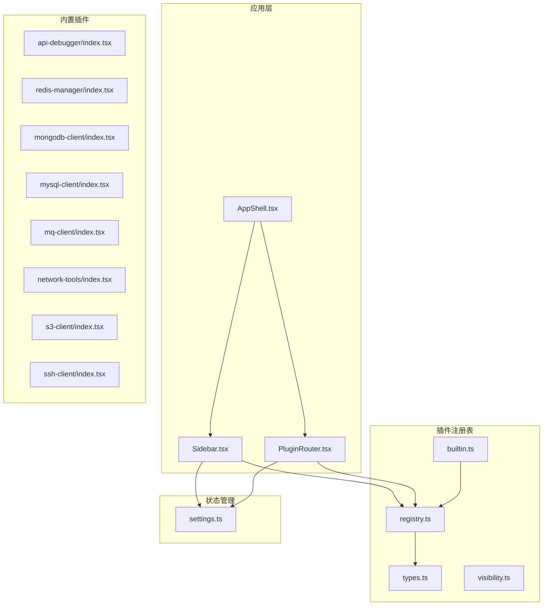
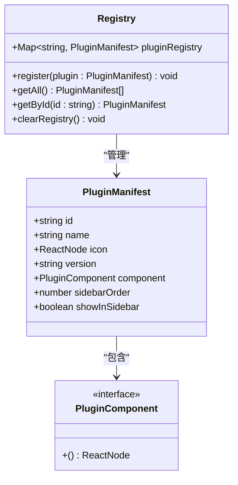
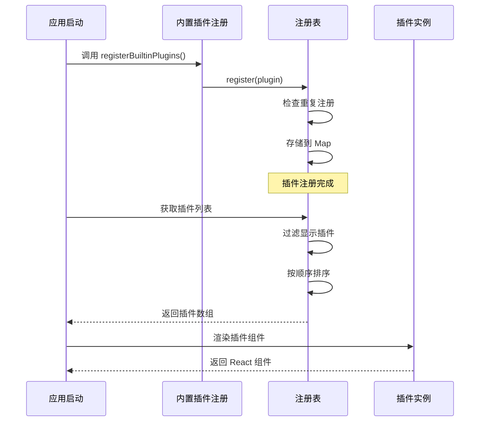
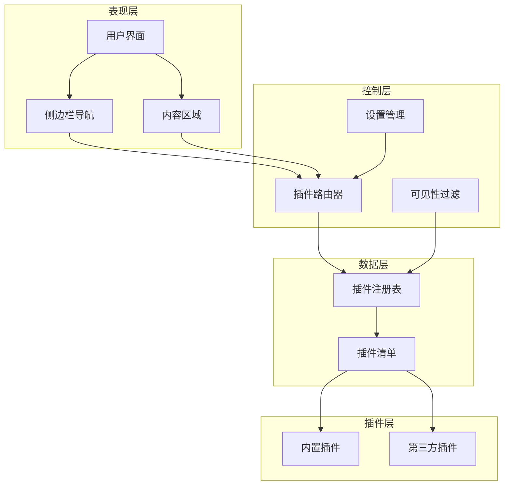
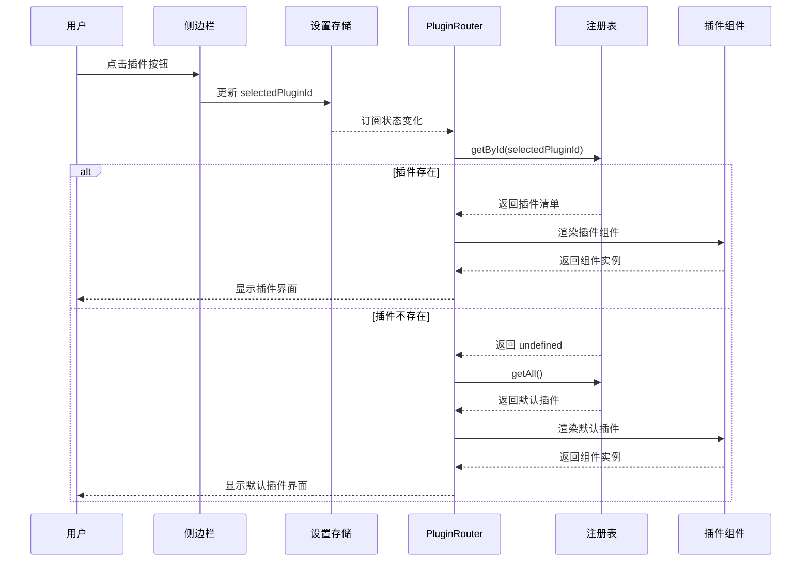
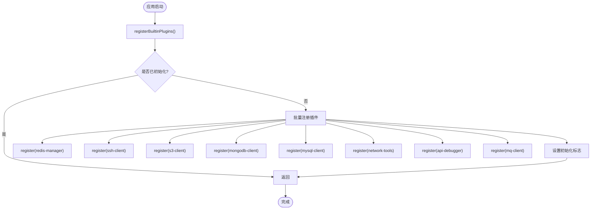
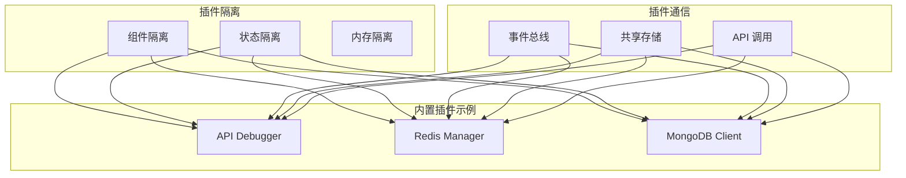
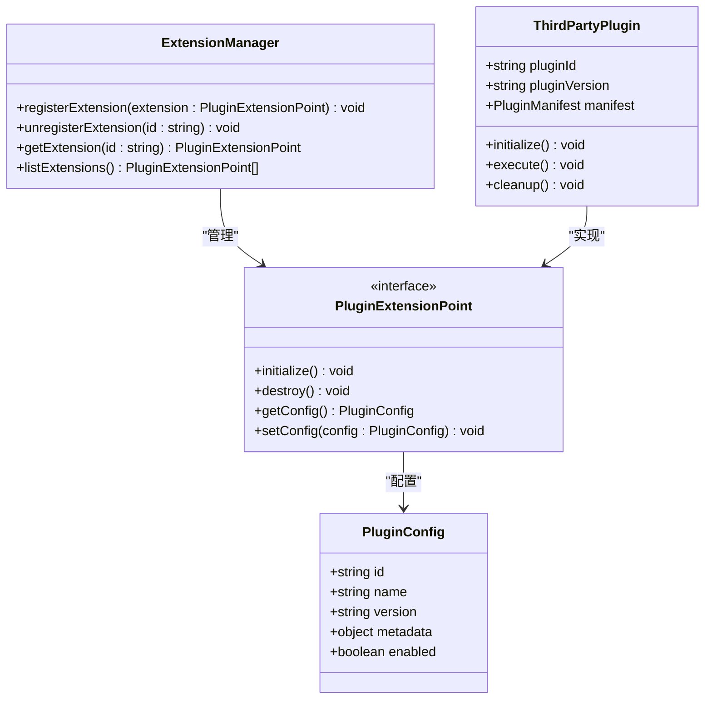
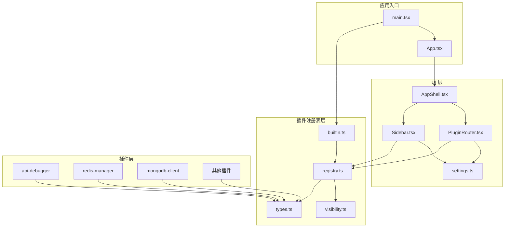

# 插件化架构设计

<cite>
**本文档引用的文件**
- [registry.ts](file://src/app/plugin-registry/registry.ts)
- [types.ts](file://src/app/plugin-registry/types.ts)
- [PluginRouter.tsx](file://src/app/plugin-registry/PluginRouter.tsx)
- [builtin.ts](file://src/app/plugin-registry/builtin.ts)
- [visibility.ts](file://src/app/plugin-registry/visibility.ts)
- [index.tsx](file://src/plugins/api-debugger/index.tsx)
- [types.ts](file://src/plugins/api-debugger/types.ts)
- [index.tsx](file://src/plugins/redis-manager/index.tsx)
- [types.ts](file://src/plugins/redis-manager/types.ts)
- [index.tsx](file://src/plugins/mongodb-client/index.tsx)
- [main.tsx](file://src/main.tsx)
- [settings.ts](file://src/app/store/settings.ts)
- [Sidebar.tsx](file://src/app/layout/Sidebar.tsx)
- [AppShell.tsx](file://src/app/layout/AppShell.tsx)
</cite>

## 目录
1. [引言](#引言)
2. [项目结构](#项目结构)
3. [核心组件](#核心组件)
4. [架构概览](#架构概览)
5. [详细组件分析](#详细组件分析)
6. [依赖关系分析](#依赖关系分析)
7. [性能考虑](#性能考虑)
8. [故障排除指南](#故障排除指南)
9. [结论](#结论)
10. [附录](#附录)

## 引言

DevNexus 是一个基于 React 和 Tauri 的桌面应用程序，采用插件化架构设计，支持内置插件和第三方插件的动态加载和管理。该架构通过统一的插件注册表、标准化的插件清单接口和灵活的路由系统，实现了模块化的功能扩展和良好的用户体验。

插件化架构的核心目标是：
- 提供可扩展的功能模块
- 支持运行时动态加载
- 实现插件间的隔离和通信
- 确保系统的稳定性和安全性
- 降低模块间的耦合度

## 项目结构

DevNexus 的插件化架构主要分布在以下目录结构中：

**图表来源**
- [AppShell.tsx:31-206](file://src/app/layout/AppShell.tsx#L31-L206)
- [Sidebar.tsx:21-176](file://src/app/layout/Sidebar.tsx#L21-L176)
- [registry.ts:1-26](file://src/app/plugin-registry/registry.ts#L1-L26)

**章节来源**
- [main.tsx:1-38](file://src/main.tsx#L1-L38)
- [AppShell.tsx:1-207](file://src/app/layout/AppShell.tsx#L1-L207)

## 核心组件

### PluginManifest 接口规范

PluginManifest 是插件系统的核心数据结构，定义了插件的标准接口规范：

**图表来源**
- [types.ts:5-13](file://src/app/plugin-registry/types.ts#L5-L13)
- [registry.ts:3-25](file://src/app/plugin-registry/registry.ts#L3-L25)

插件清单包含以下关键字段：
- **id**: 插件唯一标识符
- **name**: 插件显示名称
- **icon**: 插件图标组件
- **version**: 插件版本信息
- **component**: 插件主组件
- **sidebarOrder**: 侧边栏排序权重
- **showInSidebar**: 是否显示在侧边栏

**章节来源**
- [types.ts:1-14](file://src/app/plugin-registry/types.ts#L1-L14)

### 插件注册表（Registry）

插件注册表是整个插件系统的核心管理中心，提供了完整的插件生命周期管理：

**图表来源**
- [builtin.ts:13-27](file://src/app/plugin-registry/builtin.ts#L13-L27)
- [registry.ts:5-25](file://src/app/plugin-registry/registry.ts#L5-L25)

注册表提供了以下核心功能：
- **register()**: 注册插件到内存映射表
- **getAll()**: 获取所有插件并按侧边栏顺序排序
- **getById()**: 根据 ID 获取特定插件
- **clearRegistry()**: 清空注册表

**章节来源**
- [registry.ts:1-26](file://src/app/plugin-registry/registry.ts#L1-L26)

## 架构概览

DevNexus 的插件化架构采用分层设计，确保了良好的模块化和可维护性：

**图表来源**
- [AppShell.tsx:173-177](file://src/app/layout/AppShell.tsx#L173-L177)
- [Sidebar.tsx:21-48](file://src/app/layout/Sidebar.tsx#L21-L48)
- [PluginRouter.tsx:7-28](file://src/app/plugin-registry/PluginRouter.tsx#L7-L28)

## 详细组件分析

### PluginRouter 组件

PluginRouter 是插件系统的核心路由组件，负责根据用户选择渲染对应的插件界面：

**图表来源**
- [PluginRouter.tsx:7-28](file://src/app/plugin-registry/PluginRouter.tsx#L7-L28)
- [settings.ts:9-21](file://src/app/store/settings.ts#L9-L21)

PluginRouter 的工作流程：
1. 从设置存储中获取当前选中的插件 ID
2. 使用注册表查找对应的插件清单
3. 如果找不到则使用第一个可用插件作为默认值
4. 渲染插件的主组件

**章节来源**
- [PluginRouter.tsx:1-29](file://src/app/plugin-registry/PluginRouter.tsx#L1-L29)

### 内置插件注册机制

内置插件通过 registerBuiltinPlugins() 函数进行批量注册，确保应用启动时所有内置功能都可用：

**图表来源**
- [builtin.ts:13-27](file://src/app/plugin-registry/builtin.ts#L13-L27)

内置插件包括：
- **Redis 管理器**: 数据库连接和操作工具
- **SSH 客户端**: 远程连接和终端管理
- **S3 客户端**: 对象存储服务管理
- **MongoDB 客户端**: 文档数据库操作工具
- **MySQL 客户端**: 关系型数据库管理
- **网络工具**: 网络诊断和测试工具
- **API 调试器**: HTTP 请求调试工具
- **MQ 客户端**: 消息队列管理工具

**章节来源**
- [builtin.ts:1-29](file://src/app/plugin-registry/builtin.ts#L1-L29)

### 插件间隔离和通信机制

DevNexus 通过以下机制实现插件间的隔离和通信：

**图表来源**
- [index.tsx:13-38](file://src/plugins/api-debugger/index.tsx#L13-L38)
- [index.tsx:14-57](file://src/plugins/redis-manager/index.tsx#L14-L57)

隔离机制包括：
- **组件隔离**: 每个插件都有独立的组件树
- **状态隔离**: 使用独立的状态管理（如 Zustand）
- **内存隔离**: 插件代码独立加载和执行

通信机制包括：
- **事件总线**: 插件间的消息传递
- **共享存储**: 公共状态的访问
- **API 调用**: 插件间的函数调用

**章节来源**
- [index.tsx:1-39](file://src/plugins/api-debugger/index.tsx#L1-L39)
- [index.tsx:1-67](file://src/plugins/redis-manager/index.tsx#L1-L67)

### 插件扩展点设计

DevNexus 的插件扩展点设计遵循开放封闭原则，允许第三方开发者扩展功能：

**图表来源**
- [types.ts:5-13](file://src/app/plugin-registry/types.ts#L5-L13)

扩展点包括：
- **插件清单扩展**: 支持自定义元数据
- **路由扩展**: 动态添加新的导航项
- **状态扩展**: 添加新的全局状态
- **API 扩展**: 提供新的后端接口

**章节来源**
- [types.ts:1-14](file://src/app/plugin-registry/types.ts#L1-L14)

## 依赖关系分析

插件化架构的依赖关系呈现清晰的层次结构：

**图表来源**
- [main.tsx:5-10](file://src/main.tsx#L5-L10)
- [AppShell.tsx:11-12](file://src/app/layout/AppShell.tsx#L11-L12)
- [Sidebar.tsx:15-16](file://src/app/layout/Sidebar.tsx#L15-L16)

依赖关系特点：
- **单向依赖**: 上层组件依赖下层组件，但不反向依赖
- **松耦合**: 通过接口和类型定义实现解耦
- **可替换性**: 插件清单接口允许不同实现的替换

**章节来源**
- [main.tsx:1-38](file://src/main.tsx#L1-L38)
- [AppShell.tsx:1-207](file://src/app/layout/AppShell.tsx#L1-L207)

## 性能考虑

插件化架构在性能方面采用了多项优化策略：

### 懒加载策略
- 插件组件按需加载，减少初始包大小
- 使用 React.lazy 和 Suspense 实现代码分割
- 避免一次性加载所有插件资源

### 内存管理
- 插件卸载时清理相关状态和事件监听器
- 使用 WeakMap 存储插件私有数据
- 及时释放不再使用的插件实例

### 渲染优化
- 使用 React.memo 优化插件组件渲染
- 通过 useMemo 和 useCallback 缓存计算结果
- 避免不必要的重渲染

### 并发处理
- 插件间异步操作使用 Promise 处理
- 错误边界确保插件异常不影响整体应用
- 超时机制防止长时间阻塞

## 故障排除指南

### 常见问题及解决方案

**插件未显示在侧边栏**
- 检查插件清单中的 `showInSidebar` 字段
- 验证插件 ID 的唯一性
- 确认插件已正确注册到注册表

**插件切换无效**
- 检查设置存储中的 `selectedPluginId`
- 验证插件组件的导出格式
- 确认插件清单的完整性

**插件加载失败**
- 检查插件依赖的第三方库
- 验证插件的 TypeScript 类型定义
- 查看浏览器控制台的错误信息

**内存泄漏问题**
- 确保插件组件在卸载时清理事件监听器
- 检查插件中使用的定时器和订阅
- 验证插件状态的正确清理

**章节来源**
- [PluginRouter.tsx:15-24](file://src/app/plugin-registry/PluginRouter.tsx#L15-L24)
- [registry.ts:6-8](file://src/app/plugin-registry/registry.ts#L6-L8)

### 调试技巧

1. **启用开发模式**: 在开发环境中启用详细的错误信息
2. **使用 React DevTools**: 检查插件组件的渲染状态
3. **监控内存使用**: 使用浏览器性能面板分析内存占用
4. **日志记录**: 在关键节点添加日志输出
5. **单元测试**: 为插件功能编写测试用例

## 结论

DevNexus 的插件化架构设计体现了现代前端应用的最佳实践，通过标准化的接口规范、清晰的层次结构和灵活的扩展机制，实现了功能的模块化和可维护性。

该架构的主要优势包括：
- **高度模块化**: 插件间完全隔离，互不影响
- **易于扩展**: 支持内置和第三方插件的动态加载
- **良好性能**: 通过懒加载和优化策略提升用户体验
- **强类型支持**: TypeScript 提供完整的类型安全保障
- **可维护性强**: 清晰的依赖关系和接口定义

未来的发展方向可能包括：
- 支持插件热重载功能
- 增强插件间的安全隔离机制
- 提供更丰富的插件开发工具链
- 优化插件的性能监控和诊断能力

## 附录

### 插件开发最佳实践

**接口规范**
- 严格遵守 PluginManifest 接口定义
- 提供完整的 TypeScript 类型声明
- 包含必要的元数据信息

**组件设计**
- 使用受控组件模式
- 实现正确的生命周期管理
- 提供适当的错误边界处理

**状态管理**
- 使用局部状态管理插件内部状态
- 避免污染全局状态
- 提供状态重置和清理机制

**性能优化**
- 实现组件懒加载
- 使用 React.memo 优化渲染
- 避免不必要的重新计算

**测试策略**
- 编写单元测试覆盖核心逻辑
- 提供集成测试验证插件功能
- 使用模拟数据进行测试

**章节来源**
- [types.ts:5-13](file://src/app/plugin-registry/types.ts#L5-L13)
- [index.tsx:13-38](file://src/plugins/api-debugger/index.tsx#L13-L38)