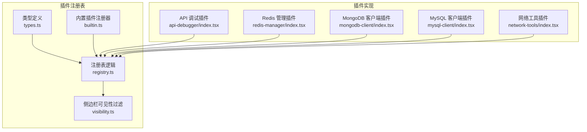
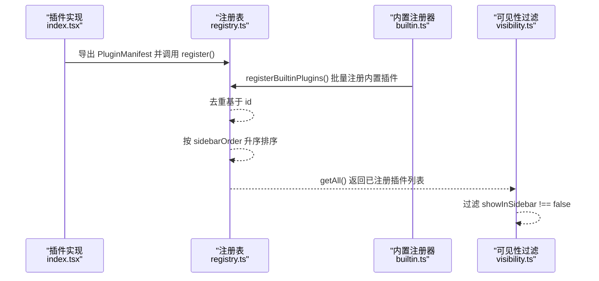
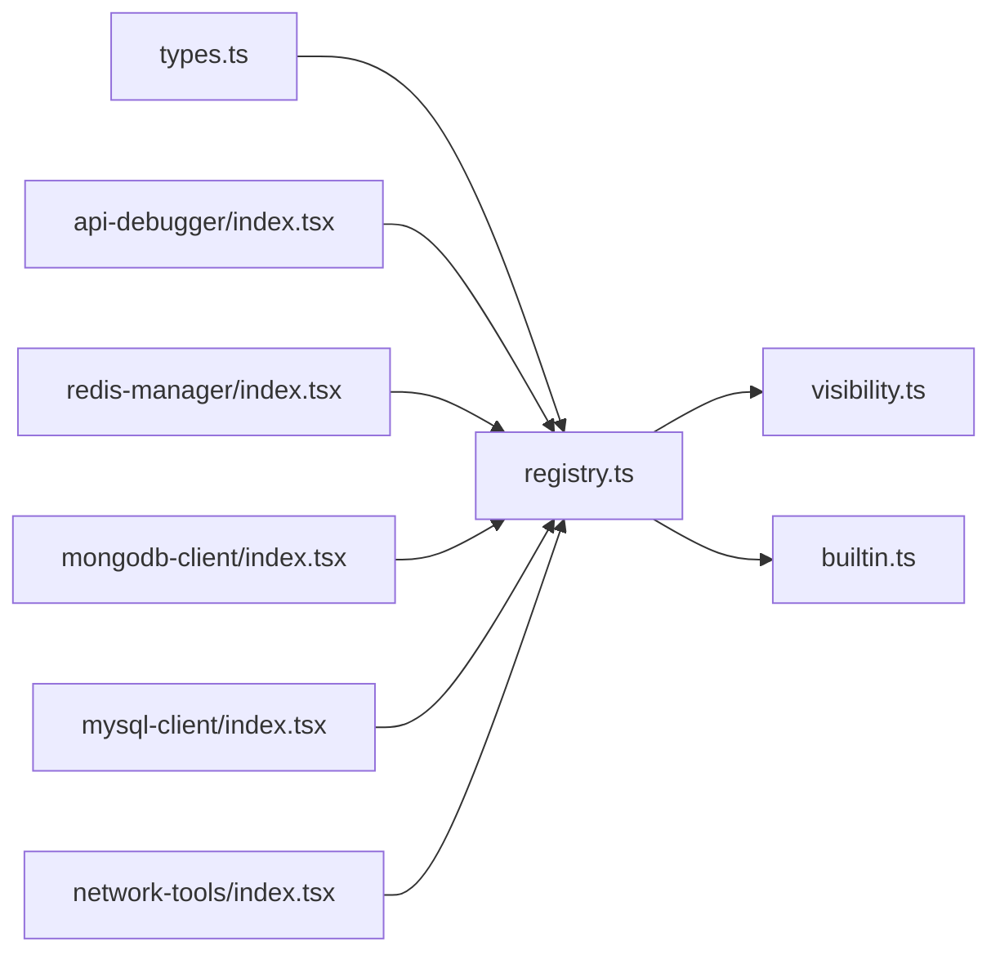
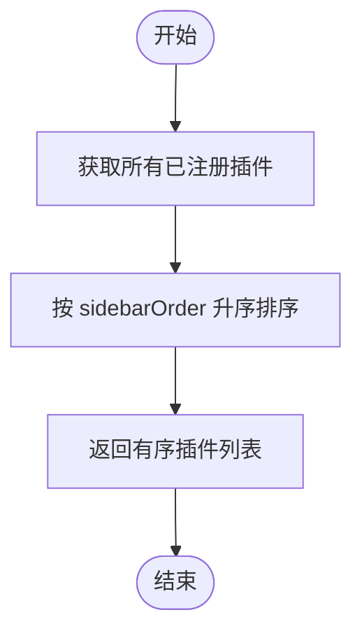

# 插件接口规范

<cite>
**本文引用的文件**
- [src/app/plugin-registry/types.ts](file://src/app/plugin-registry/types.ts)
- [src/app/plugin-registry/registry.ts](file://src/app/plugin-registry/registry.ts)
- [src/app/plugin-registry/builtin.ts](file://src/app/plugin-registry/builtin.ts)
- [src/app/plugin-registry/visibility.ts](file://src/app/plugin-registry/visibility.ts)
- [src/plugins/api-debugger/index.tsx](file://src/plugins/api-debugger/index.tsx)
- [src/plugins/redis-manager/index.tsx](file://src/plugins/redis-manager/index.tsx)
- [src/plugins/mongodb-client/index.tsx](file://src/plugins/mongodb-client/index.tsx)
- [src/plugins/mysql-client/index.tsx](file://src/plugins/mysql-client/index.tsx)
- [src/plugins/network-tools/index.tsx](file://src/plugins/network-tools/index.tsx)
- [tests/app/plugin-registry/registry.test.ts](file://tests/app/plugin-registry/registry.test.ts)
- [tests/app/plugin-registry/builtin.test.ts](file://tests/app/plugin-registry/builtin.test.ts)
</cite>

## 目录
1. [简介](#简介)
2. [项目结构](#项目结构)
3. [核心组件](#核心组件)
4. [架构总览](#架构总览)
5. [详细组件分析](#详细组件分析)
6. [依赖关系分析](#依赖关系分析)
7. [性能考量](#性能考量)
8. [故障排查指南](#故障排查指南)
9. [结论](#结论)
10. [附录](#附录)

## 简介
本文件系统化阐述 DevNexus 插件接口规范，重点围绕 PluginManifest 接口的字段语义与约束、插件清单结构要求、插件标识符命名与唯一性、sidebarOrder 的排序影响，以及如何实现一个符合规范的插件。同时给出版本兼容性与向后兼容策略建议，并通过实际插件实现示例帮助开发者快速上手。

## 项目结构
DevNexus 的插件体系由“插件注册表”和“内置插件注册器”组成，插件清单（PluginManifest）在各插件包内导出，随后被注册到全局注册表中。注册表负责去重、排序与查询；侧边栏可见性由过滤函数控制。

图表来源
- [src/app/plugin-registry/types.ts:1-14](file://src/app/plugin-registry/types.ts#L1-L14)
- [src/app/plugin-registry/registry.ts:1-26](file://src/app/plugin-registry/registry.ts#L1-L26)
- [src/app/plugin-registry/visibility.ts:1-6](file://src/app/plugin-registry/visibility.ts#L1-L6)
- [src/app/plugin-registry/builtin.ts:1-29](file://src/app/plugin-registry/builtin.ts#L1-L29)
- [src/plugins/api-debugger/index.tsx:1-39](file://src/plugins/api-debugger/index.tsx#L1-L39)
- [src/plugins/redis-manager/index.tsx:1-67](file://src/plugins/redis-manager/index.tsx#L1-L67)
- [src/plugins/mongodb-client/index.tsx:1-87](file://src/plugins/mongodb-client/index.tsx#L1-L87)
- [src/plugins/mysql-client/index.tsx:1-38](file://src/plugins/mysql-client/index.tsx#L1-L38)
- [src/plugins/network-tools/index.tsx:1-27](file://src/plugins/network-tools/index.tsx#L1-L27)

章节来源
- [src/app/plugin-registry/types.ts:1-14](file://src/app/plugin-registry/types.ts#L1-L14)
- [src/app/plugin-registry/registry.ts:1-26](file://src/app/plugin-registry/registry.ts#L1-L26)
- [src/app/plugin-registry/builtin.ts:1-29](file://src/app/plugin-registry/builtin.ts#L1-L29)

## 核心组件
- PluginManifest 接口：定义插件清单的全部字段与类型约束。
- 注册表（registry）：提供注册、查询、清空与按 sidebarOrder 排序的能力。
- 内置插件注册器（builtin）：集中注册内置插件，避免重复初始化。
- 侧边栏可见性过滤（visibility）：根据 showInSidebar 控制是否显示在侧边栏。

章节来源
- [src/app/plugin-registry/types.ts:5-13](file://src/app/plugin-registry/types.ts#L5-L13)
- [src/app/plugin-registry/registry.ts:5-25](file://src/app/plugin-registry/registry.ts#L5-L25)
- [src/app/plugin-registry/builtin.ts:13-27](file://src/app/plugin-registry/builtin.ts#L13-L27)
- [src/app/plugin-registry/visibility.ts:3-5](file://src/app/plugin-registry/visibility.ts#L3-L5)

## 架构总览
下图展示了从插件实现到注册表、再到侧边栏渲染的关键流程。

图表来源
- [src/plugins/api-debugger/index.tsx:38](file://src/plugins/api-debugger/index.tsx#L38)
- [src/app/plugin-registry/registry.ts:5-17](file://src/app/plugin-registry/registry.ts#L5-L17)
- [src/app/plugin-registry/builtin.ts:18-26](file://src/app/plugin-registry/builtin.ts#L18-L26)
- [src/app/plugin-registry/visibility.ts:3-5](file://src/app/plugin-registry/visibility.ts#L3-L5)

## 详细组件分析

### PluginManifest 接口详解
- 字段与约束
  - id: 字符串，插件唯一标识符，注册时用于去重与检索。必须全局唯一，否则后续注册会被忽略。
  - name: 字符串，插件在 UI 中显示的名称。
  - icon: ReactNode，Ant Design 图标或自定义图标节点，用于侧边栏与标签页。
  - version: 字符串，插件版本号，便于追踪与兼容性管理。
  - component: React 组件工厂，返回根组件节点，作为插件工作区的渲染入口。
  - sidebarOrder: 数字，决定插件在侧边栏中的排序位置，数值越小越靠前。
  - showInSidebar?: 布尔值，可选字段。若为 false，则该插件不会出现在侧边栏中；默认视为可见。

- 字段作用与约束总结
  - 唯一性：id 必须全局唯一，注册表会拒绝重复 id。
  - 排序：sidebarOrder 用于 getAll() 返回结果的稳定排序。
  - 可见性：showInSidebar 默认为 true；显式设为 false 则隐藏。
  - 渲染：component 必须返回合法的 ReactNode，确保插件工作区正常渲染。

章节来源
- [src/app/plugin-registry/types.ts:5-13](file://src/app/plugin-registry/types.ts#L5-L13)
- [src/app/plugin-registry/registry.ts:5-17](file://src/app/plugin-registry/registry.ts#L5-L17)
- [src/app/plugin-registry/visibility.ts:3-5](file://src/app/plugin-registry/visibility.ts#L3-L5)

### 插件清单结构要求
- 必需字段
  - id、name、icon、version、component、sidebarOrder
- 可选字段
  - showInSidebar
- 结构一致性
  - 所有字段类型需与 PluginManifest 定义一致，组件需遵循 React 函数组件签名。

章节来源
- [src/app/plugin-registry/types.ts:5-13](file://src/app/plugin-registry/types.ts#L5-L13)

### 插件标识符命名规范与唯一性
- 命名规范
  - 使用短横线分隔的全小写字符串，如 "api-debugger"、"redis-manager"。
  - 避免使用保留关键字或特殊字符，保持与文件系统与路由兼容。
- 唯一性要求
  - 注册表会对重复 id 进行去重，后续注册会被忽略；因此不同插件间 id 必须互异。

章节来源
- [src/app/plugin-registry/registry.ts:6-8](file://src/app/plugin-registry/registry.ts#L6-L8)
- [tests/app/plugin-registry/registry.test.ts:32-38](file://tests/app/plugin-registry/registry.test.ts#L32-L38)

### sidebarOrder 对插件排序的影响
- 排序机制
  - 注册表在 getAll() 时按 sidebarOrder 升序排列，数值越小越靠前。
- 实践建议
  - 为内置插件预留区间（例如 10、20、30、40、50、60），以便第三方插件插入中间区间而不冲突。
  - 第三方插件可采用 100+ 的起始值，避免与内置插件重叠。

章节来源
- [src/app/plugin-registry/registry.ts:13-17](file://src/app/plugin-registry/registry.ts#L13-L17)
- [tests/app/plugin-registry/registry.test.ts:25-30](file://tests/app/plugin-registry/registry.test.ts#L25-L30)

### 插件接口实现示例
以下为多个官方插件的清单导出示例，展示如何正确实现一个符合规范的插件：

- API 调试插件
  - 导出对象包含 id、name、icon、version、sidebarOrder 与 component。
  - 参考路径：[src/plugins/api-debugger/index.tsx:38](file://src/plugins/api-debugger/index.tsx#L38)

- Redis 管理插件
  - 导出对象包含 id、name、icon、version、sidebarOrder 与 component。
  - 参考路径：[src/plugins/redis-manager/index.tsx:59-66](file://src/plugins/redis-manager/index.tsx#L59-L66)

- MongoDB 客户端插件
  - 导出对象包含 id、name、icon、version、sidebarOrder 与 component。
  - 参考路径：[src/plugins/mongodb-client/index.tsx:79-86](file://src/plugins/mongodb-client/index.tsx#L79-L86)

- MySQL 客户端插件
  - 导出对象包含 id、name、icon、version、sidebarOrder 与 component。
  - 参考路径：[src/plugins/mysql-client/index.tsx:37](file://src/plugins/mysql-client/index.tsx#L37)

- 网络工具插件
  - 导出对象包含 id、name、icon、version、sidebarOrder 与 component。
  - 参考路径：[src/plugins/network-tools/index.tsx:26](file://src/plugins/network-tools/index.tsx#L26)

章节来源
- [src/plugins/api-debugger/index.tsx:38](file://src/plugins/api-debugger/index.tsx#L38)
- [src/plugins/redis-manager/index.tsx:59-66](file://src/plugins/redis-manager/index.tsx#L59-L66)
- [src/plugins/mongodb-client/index.tsx:79-86](file://src/plugins/mongodb-client/index.tsx#L79-L86)
- [src/plugins/mysql-client/index.tsx:37](file://src/plugins/mysql-client/index.tsx#L37)
- [src/plugins/network-tools/index.tsx:26](file://src/plugins/network-tools/index.tsx#L26)

### 版本兼容性与向后兼容策略
- 版本字段
  - version 字段用于标识插件版本，便于用户与系统识别差异。
- 向后兼容建议
  - 字段扩展：新增可选字段（如 showInSidebar）时，不应破坏现有插件行为；读取方应具备默认值处理能力。
  - 类型演进：字段类型变更需谨慎，优先采用更宽泛的类型或提供兼容转换。
  - 行为演进：若出现行为变化，应在版本号中标注（如 alpha、beta），并在文档中明确迁移步骤。
- 测试验证
  - 通过测试用例验证注册表对重复 id 的去重行为与排序稳定性，确保升级不引入副作用。
  - 参考路径：[tests/app/plugin-registry/registry.test.ts:25-38](file://tests/app/plugin-registry/registry.test.ts#L25-L38)

章节来源
- [src/app/plugin-registry/types.ts:9](file://src/app/plugin-registry/types.ts#L9)
- [tests/app/plugin-registry/registry.test.ts:25-38](file://tests/app/plugin-registry/registry.test.ts#L25-L38)

## 依赖关系分析
- 组件耦合
  - 插件实现仅依赖类型定义与注册表导出的 register 方法，耦合度低。
  - 注册表内部使用 Map 存储，提供 O(1) 查找与设置。
- 外部依赖
  - ReactNode 与 Ant Design 图标作为 UI 元素依赖。
- 可能的循环依赖
  - 当前结构清晰，无明显循环导入风险。

图表来源
- [src/app/plugin-registry/types.ts:1-14](file://src/app/plugin-registry/types.ts#L1-L14)
- [src/app/plugin-registry/registry.ts:1-26](file://src/app/plugin-registry/registry.ts#L1-L26)
- [src/app/plugin-registry/visibility.ts:1-6](file://src/app/plugin-registry/visibility.ts#L1-L6)
- [src/app/plugin-registry/builtin.ts:1-29](file://src/app/plugin-registry/builtin.ts#L1-L29)
- [src/plugins/api-debugger/index.tsx:1-39](file://src/plugins/api-debugger/index.tsx#L1-L39)
- [src/plugins/redis-manager/index.tsx:1-67](file://src/plugins/redis-manager/index.tsx#L1-L67)
- [src/plugins/mongodb-client/index.tsx:1-87](file://src/plugins/mongodb-client/index.tsx#L1-L87)
- [src/plugins/mysql-client/index.tsx:1-38](file://src/plugins/mysql-client/index.tsx#L1-L38)
- [src/plugins/network-tools/index.tsx:1-27](file://src/plugins/network-tools/index.tsx#L1-L27)

## 性能考量
- 注册复杂度
  - 单次注册为 O(1)，批量注册为 O(n)。
- 查询与排序
  - getAll() 返回副本并进行一次排序，时间复杂度 O(n log n)；n 为已注册插件数量。
- 内存占用
  - 注册表使用 Map 存储，内存开销与插件数量线性相关。
- 优化建议
  - 控制插件总量，避免过多插件导致排序成本上升。
  - 若存在大量插件，可在 UI 层实现虚拟滚动与懒加载。

## 故障排查指南
- 插件未显示在侧边栏
  - 检查 showInSidebar 是否被显式设为 false。
  - 参考路径：[src/app/plugin-registry/visibility.ts:3-5](file://src/app/plugin-registry/visibility.ts#L3-L5)
- 插件顺序异常
  - 检查 sidebarOrder 设置是否合理，避免重复值导致排序不确定。
  - 参考路径：[src/app/plugin-registry/registry.ts:13-17](file://src/app/plugin-registry/registry.ts#L13-L17)
- 插件未生效或被覆盖
  - 检查 id 是否重复，重复 id 将被忽略。
  - 参考路径：[src/app/plugin-registry/registry.ts:6-8](file://src/app/plugin-registry/registry.ts#L6-L8)
- 内置插件未注册
  - 确认已调用 registerBuiltinPlugins()，且未重复初始化。
  - 参考路径：[src/app/plugin-registry/builtin.ts:13-27](file://src/app/plugin-registry/builtin.ts#L13-L27)

章节来源
- [src/app/plugin-registry/visibility.ts:3-5](file://src/app/plugin-registry/visibility.ts#L3-L5)
- [src/app/plugin-registry/registry.ts:6-8](file://src/app/plugin-registry/registry.ts#L6-L8)
- [src/app/plugin-registry/builtin.ts:13-27](file://src/app/plugin-registry/builtin.ts#L13-L27)

## 结论
DevNexus 插件接口规范以 PluginManifest 为核心，通过严格的字段约束与注册表机制，实现了插件的唯一标识、稳定排序与可控可见性。遵循本文的命名规范、排序策略与版本管理建议，可确保插件生态的可维护性与扩展性。内置插件注册器与可见性过滤进一步简化了集成流程，降低了耦合度。

## 附录

### 插件清单字段对照表
- id: 字符串，唯一标识符
- name: 字符串，显示名称
- icon: ReactNode，图标
- version: 字符串，版本号
- component: React 组件工厂
- sidebarOrder: 数字，排序权重
- showInSidebar: 布尔值，是否显示在侧边栏

章节来源
- [src/app/plugin-registry/types.ts:5-13](file://src/app/plugin-registry/types.ts#L5-L13)

### 排序算法流程图

图表来源
- [src/app/plugin-registry/registry.ts:13-17](file://src/app/plugin-registry/registry.ts#L13-L17)