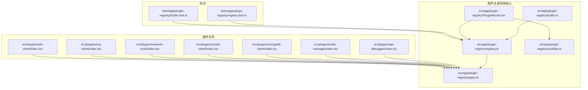
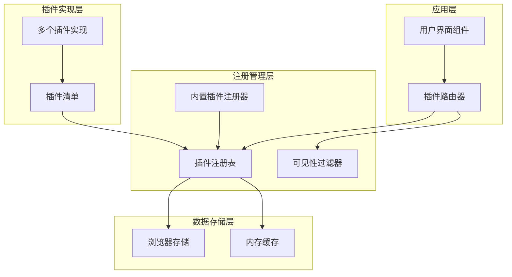
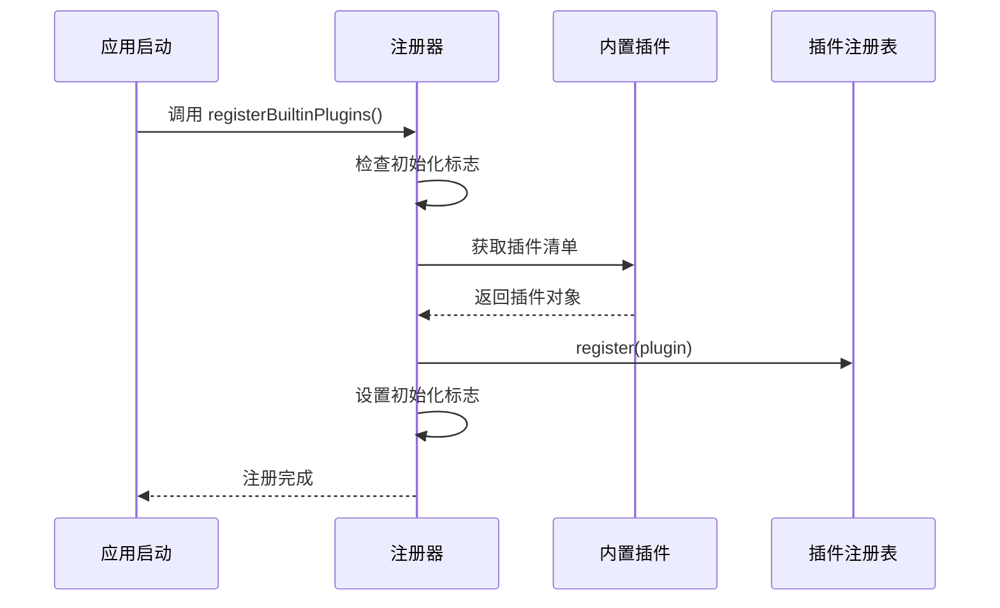
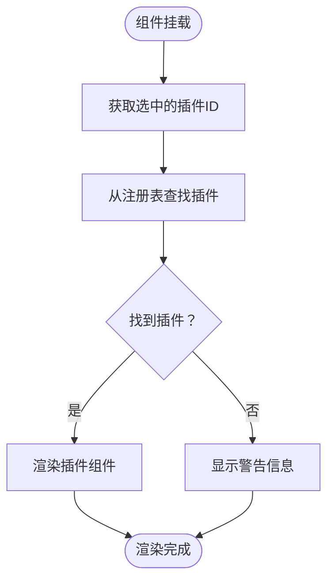
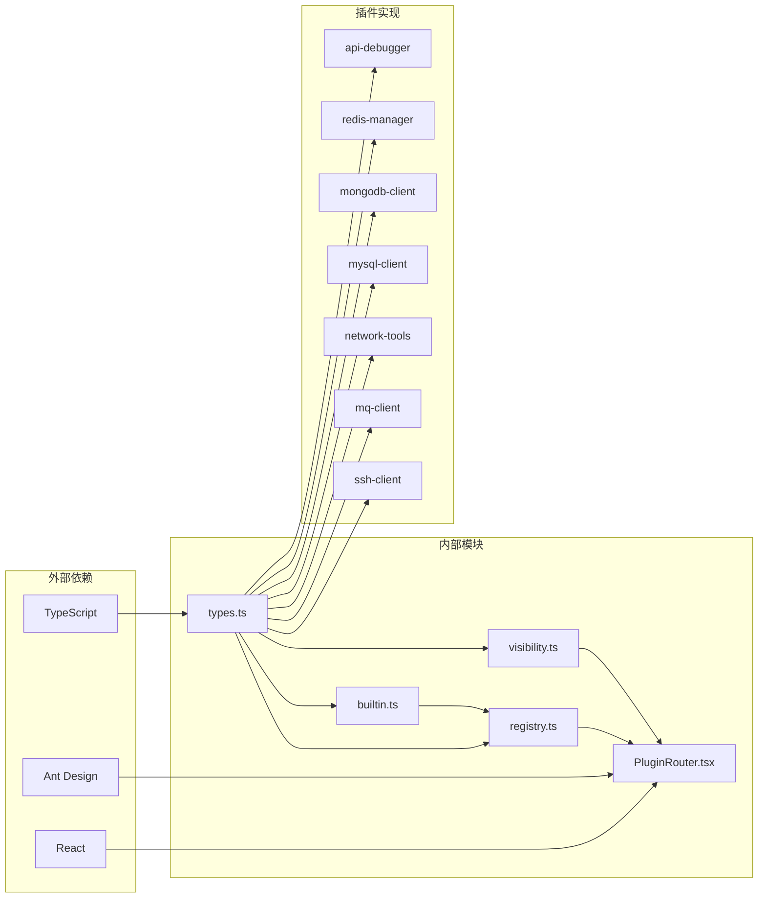
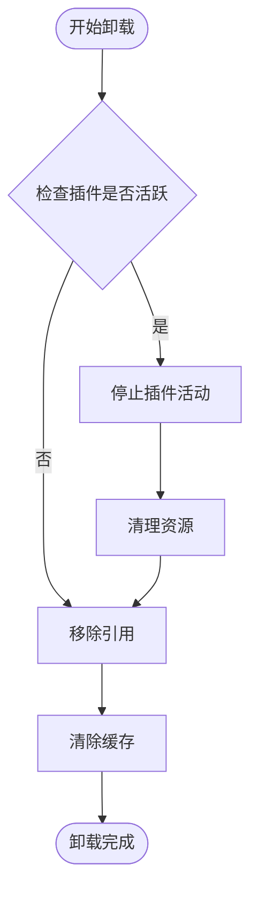

# 插件注册系统

<cite>
**本文档引用的文件**
- [registry.ts](file://src/app/plugin-registry/registry.ts)
- [builtin.ts](file://src/app/plugin-registry/builtin.ts)
- [types.ts](file://src/app/plugin-registry/types.ts)
- [visibility.ts](file://src/app/plugin-registry/visibility.ts)
- [PluginRouter.tsx](file://src/app/plugin-registry/PluginRouter.tsx)
- [index.tsx (api-debugger)](file://src/plugins/api-debugger/index.tsx)
- [index.tsx (redis-manager)](file://src/plugins/redis-manager/index.tsx)
- [index.tsx (mongodb-client)](file://src/plugins/mongodb-client/index.tsx)
- [index.tsx (mysql-client)](file://src/plugins/mysql-client/index.tsx)
- [index.tsx (network-tools)](file://src/plugins/network-tools/index.tsx)
- [index.tsx (mq-client)](file://src/plugins/mq-client/index.tsx)
- [index.tsx (ssh-client)](file://src/plugins/ssh-client/index.tsx)
- [registry.test.ts](file://tests/app/plugin-registry/registry.test.ts)
- [builtin.test.ts](file://tests/app/plugin-registry/builtin.test.ts)
</cite>

## 目录
1. [简介](#简介)
2. [项目结构](#项目结构)
3. [核心组件](#核心组件)
4. [架构概览](#架构概览)
5. [详细组件分析](#详细组件分析)
6. [依赖关系分析](#依赖关系分析)
7. [性能考虑](#性能考虑)
8. [故障排除指南](#故障排除指南)
9. [结论](#结论)
10. [附录](#附录)

## 简介

DevNexus 的插件注册系统是一个轻量级但功能完整的模块化架构，允许动态注册、管理和访问各种功能插件。该系统采用 TypeScript 实现，提供了类型安全的插件生命周期管理，支持内置插件的自动注册和用户自定义插件的扩展。

系统的核心设计理念是通过统一的注册表来管理所有插件，确保插件之间的解耦和可扩展性。每个插件都遵循标准化的 Manifest 接口，包含必要的元数据和渲染组件。

## 项目结构

插件注册系统主要分布在以下目录中：



**图表来源**
- [registry.ts:1-26](file://src/app/plugin-registry/registry.ts#L1-L26)
- [builtin.ts:1-29](file://src/app/plugin-registry/builtin.ts#L1-L29)
- [types.ts:1-14](file://src/app/plugin-registry/types.ts#L1-L14)

**章节来源**
- [registry.ts:1-26](file://src/app/plugin-registry/registry.ts#L1-L26)
- [builtin.ts:1-29](file://src/app/plugin-registry/builtin.ts#L1-L29)
- [types.ts:1-14](file://src/app/plugin-registry/types.ts#L1-L14)

## 核心组件

### 插件注册表 (pluginRegistry)

插件注册表是整个系统的核心数据结构，采用 Map 类型实现，提供了高效的键值对存储和检索能力。

**数据结构特性：**
- **存储机制**：使用 Map<string, PluginManifest> 结构，以插件 ID 作为唯一键
- **索引策略**：基于插件 ID 的哈希索引，提供 O(1) 平均时间复杂度的查找操作
- **内存管理**：自动垃圾回收，支持动态清理和重置

**关键属性：**
- 键：插件唯一标识符 (string)
- 值：完整的插件清单对象 (PluginManifest)
- 容量：动态增长，无固定上限

### 插件清单接口 (PluginManifest)

每个插件都必须实现标准化的清单接口，确保系统的一致性和可预测性。

**必需字段：**
- `id`: 插件唯一标识符
- `name`: 插件显示名称
- `icon`: Ant Design 图标组件
- `version`: 版本号
- `component`: React 组件函数

**可选字段：**
- `sidebarOrder`: 侧边栏排序权重
- `showInSidebar`: 是否显示在侧边栏

**章节来源**
- [registry.ts:3-11](file://src/app/plugin-registry/registry.ts#L3-L11)
- [types.ts:5-13](file://src/app/plugin-registry/types.ts#L5-L13)

## 架构概览

插件注册系统的整体架构采用分层设计，确保了良好的关注点分离和可维护性。



**图表来源**
- [PluginRouter.tsx:1-29](file://src/app/plugin-registry/PluginRouter.tsx#L1-L29)
- [registry.ts:1-26](file://src/app/plugin-registry/registry.ts#L1-L26)
- [builtin.ts:1-29](file://src/app/plugin-registry/builtin.ts#L1-L29)
- [visibility.ts:1-6](file://src/app/plugin-registry/visibility.ts#L1-L6)

## 详细组件分析

### 注册表实现 (registry.ts)

注册表模块提供了完整的插件生命周期管理功能，包括注册、查询、排序和清理等核心操作。

#### register() 函数实现

register() 函数实现了智能的插件注册逻辑，具有以下关键特性：

```mermaid
flowchart TD
Start([调用 register()]) --> CheckExists{"检查插件是否已存在"}
CheckExists --> |是| ReturnEarly["直接返回，不进行重复注册"]
CheckExists --> |否| SetPlugin["将插件设置到注册表"]
SetPlugin --> End([注册完成])
ReturnEarly --> End
```

**图表来源**
- [registry.ts:5-11](file://src/app/plugin-registry/registry.ts#L5-L11)

**实现细节：**
- **重复检查**：使用 has() 方法检查插件 ID 是否已存在于注册表中
- **冲突处理**：如果检测到重复注册，函数立即返回，避免覆盖现有插件
- **原子操作**：注册过程是原子性的，确保数据一致性

**错误恢复机制：**
- 无异常抛出：重复注册不会产生错误
- 数据保护：防止意外覆盖现有插件配置
- 状态保持：维持注册表的完整性和一致性

#### getAll() 函数分析

getAll() 函数提供了有序的插件列表访问功能：

**排序算法：**
- 基于 sidebarOrder 字段进行升序排序
- 使用数组扩展运算符创建独立副本
- 时间复杂度：O(n log n)，其中 n 为插件数量

**使用场景：**
- 侧边栏渲染
- 插件选择器
- 系统初始化时的插件枚举

#### getById() 函数分析

getById() 函数提供了精确的插件检索功能：

**查找策略：**
- 直接使用 Map.get() 进行 O(1) 复杂度查找
- 支持未找到情况下的 undefined 返回
- 内存效率高，无需额外的数据转换

**应用场景：**
- 路由器组件的当前插件定位
- 插件状态管理
- 条件渲染控制

#### clearRegistry() 函数分析

clearRegistry() 函数提供了完整的注册表清理功能：

**清理机制：**
- 调用 Map.clear() 清空所有条目
- 释放内存占用
- 重置系统状态

**使用时机：**
- 应用重启
- 开发环境调试
- 测试用例执行前的环境准备

**章节来源**
- [registry.ts:5-25](file://src/app/plugin-registry/registry.ts#L5-L25)

### 内置插件注册器 (builtin.ts)

内置插件注册器负责自动注册系统预定义的核心插件，确保应用启动时具备基本功能。



**图表来源**
- [builtin.ts:13-27](file://src/app/plugin-registry/builtin.ts#L13-L27)

**初始化策略：**
- **幂等性保证**：使用 initialized 标志防止重复初始化
- **顺序控制**：按照预定义顺序注册插件
- **错误隔离**：单个插件失败不影响其他插件注册

**内置插件列表：**
1. Redis 管理器 (sidebarOrder: 10)
2. SSH 客户端 (sidebarOrder: 20)
3. S3 客户端 (sidebarOrder: 30)
4. MongoDB 客户端 (sidebarOrder: 40)
5. MySQL 客户端 (sidebarOrder: 45)
6. 网络工具 (sidebarOrder: 50)
7. API 调试器 (sidebarOrder: 55)
8. MQ 客户端 (sidebarOrder: 60)

**章节来源**
- [builtin.ts:13-27](file://src/app/plugin-registry/builtin.ts#L13-L27)

### 插件路由器 (PluginRouter.tsx)

插件路由器是用户界面与插件系统之间的桥梁，负责根据用户选择渲染相应的插件组件。



**图表来源**
- [PluginRouter.tsx:7-28](file://src/app/plugin-registry/PluginRouter.tsx#L7-L28)

**路由策略：**
- **优先级**：使用 selectedPluginId 作为首选插件
- **回退机制**：当指定插件不存在时，自动选择第一个可用插件
- **错误处理**：当没有任何插件注册时，显示友好的警告信息

**状态管理集成：**
- 集成全局设置存储
- 响应式更新插件选择
- 自动重新渲染组件树

**章节来源**
- [PluginRouter.tsx:7-28](file://src/app/plugin-registry/PluginRouter.tsx#L7-L28)

### 可见性过滤器 (visibility.ts)

可见性过滤器提供了灵活的插件显示控制机制，允许开发者精确控制哪些插件应该显示在侧边栏中。

**过滤逻辑：**
- 默认显示所有插件
- 仅隐藏明确标记为不显示的插件
- 支持动态过滤条件

**应用场景：**
- 功能开关控制
- 用户权限验证
- 主题定制支持

**章节来源**
- [visibility.ts:3-5](file://src/app/plugin-registry/visibility.ts#L3-L5)

## 依赖关系分析

插件注册系统的依赖关系体现了清晰的层次结构和职责分离。



**图表来源**
- [types.ts:1-14](file://src/app/plugin-registry/types.ts#L1-L14)
- [registry.ts:1-2](file://src/app/plugin-registry/registry.ts#L1-L2)
- [builtin.ts:1-1](file://src/app/plugin-registry/builtin.ts#L1-L1)
- [visibility.ts:1-2](file://src/app/plugin-registry/visibility.ts#L1-L2)
- [PluginRouter.tsx:1-2](file://src/app/plugin-registry/PluginRouter.tsx#L1-L2)

**依赖特征：**
- **低耦合**：各模块间依赖关系简单明确
- **高内聚**：每个模块专注于特定功能领域
- **类型安全**：完整的 TypeScript 类型定义
- **运行时安全**：防御性编程确保错误处理

**章节来源**
- [types.ts:1-14](file://src/app/plugin-registry/types.ts#L1-L14)
- [registry.ts:1-2](file://src/app/plugin-registry/registry.ts#L1-L2)

## 性能考虑

### 时间复杂度分析

| 操作 | 复杂度 | 说明 |
|------|--------|------|
| register() | O(1) | 哈希表插入操作 |
| getAll() | O(n log n) | 基于排序的插件列表生成 |
| getById() | O(1) | 哈希表查找操作 |
| clearRegistry() | O(n) | 清空所有注册项 |
| registerBuiltinPlugins() | O(k) | k 为内置插件数量 |

### 空间复杂度分析

- **注册表存储**：O(n) 空间，n 为已注册插件数量
- **内存开销**：每个插件对象约 100-200 字节
- **缓存策略**：插件清单对象在内存中长期驻留

### 优化建议

1. **批量注册**：使用 registerBuiltinPlugins() 进行批量初始化
2. **延迟加载**：对于大型插件，考虑按需加载组件
3. **缓存策略**：利用 React.memo 和 useMemo 优化渲染性能
4. **内存监控**：定期清理不再使用的插件实例

## 故障排除指南

### 常见问题及解决方案

**问题1：插件未显示在侧边栏**
- 检查插件的 showInSidebar 属性设置
- 验证插件是否成功注册到注册表
- 确认 sidebarOrder 值是否合理

**问题2：重复插件注册警告**
- 确认插件 ID 是否唯一
- 检查是否存在多个相同 ID 的插件
- 验证注册时机是否正确

**问题3：插件组件渲染错误**
- 检查插件组件的类型定义
- 验证 React 组件的正确性
- 确认插件依赖的外部库版本兼容性

**问题4：注册表清理后插件丢失**
- 确保在应用启动时重新注册插件
- 检查 registerBuiltinPlugins() 的调用时机
- 验证插件注册的幂等性

**章节来源**
- [registry.test.ts:20-39](file://tests/app/plugin-registry/registry.test.ts#L20-L39)
- [builtin.test.ts:8-30](file://tests/app/plugin-registry/builtin.test.ts#L8-L30)

## 结论

DevNexus 的插件注册系统展现了优秀的软件工程实践，通过简洁而强大的设计实现了高度的模块化和可扩展性。系统的核心优势包括：

1. **类型安全**：完整的 TypeScript 类型定义确保编译时错误检测
2. **性能优化**：基于 Map 的高效数据结构提供优异的运行时性能
3. **扩展性强**：标准化的插件接口支持无限的功能扩展
4. **维护友好**：清晰的代码结构和完善的测试覆盖

该系统为 DevNexus 提供了坚实的基础，支持从简单的工具插件到复杂的数据库客户端等各种功能模块的无缝集成。

## 附录

### 最佳实践指南

**注册时机最佳实践：**
- 在应用启动阶段调用 registerBuiltinPlugins()
- 对于动态插件，在用户交互时按需注册
- 避免在渲染过程中进行插件注册操作

**错误处理建议：**
- 实施插件注册的事务性操作
- 提供详细的错误日志和回滚机制
- 实现插件加载失败的降级策略

**性能优化技巧：**
- 使用 React.lazy 和 Suspense 实现插件懒加载
- 实施插件组件的 memoization 优化
- 定期清理不再使用的插件实例

**卸载和清理机制：**



**卸载策略：**
- 优雅停用：先停止插件的所有活动
- 资源清理：释放内存和外部连接
- 引用移除：从注册表中删除插件条目
- 缓存清理：清除相关的缓存数据