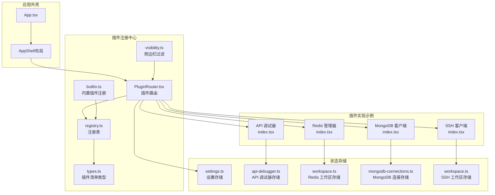
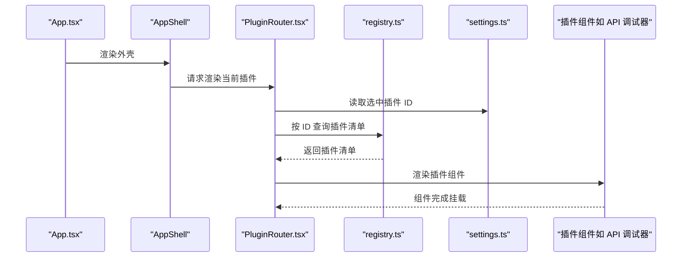
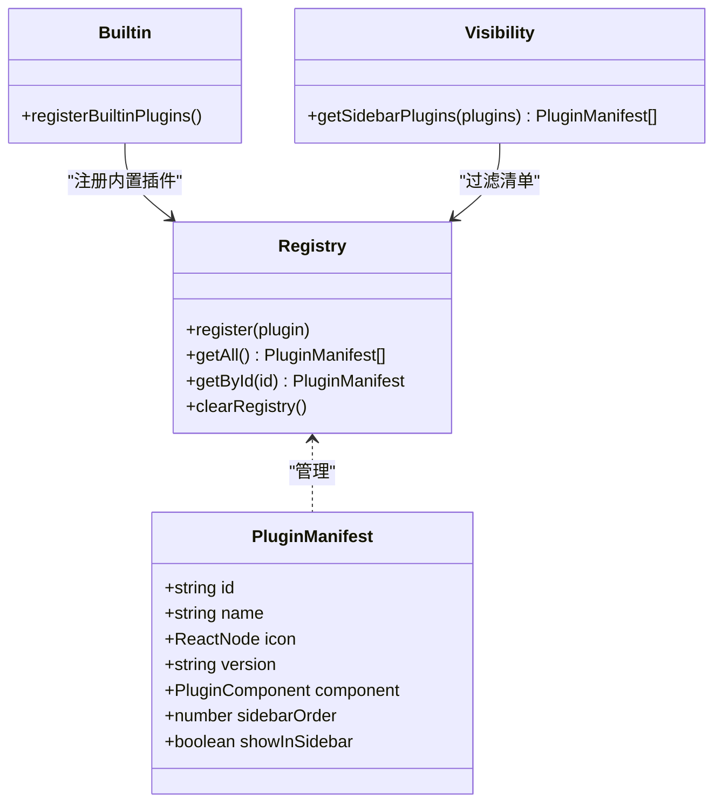
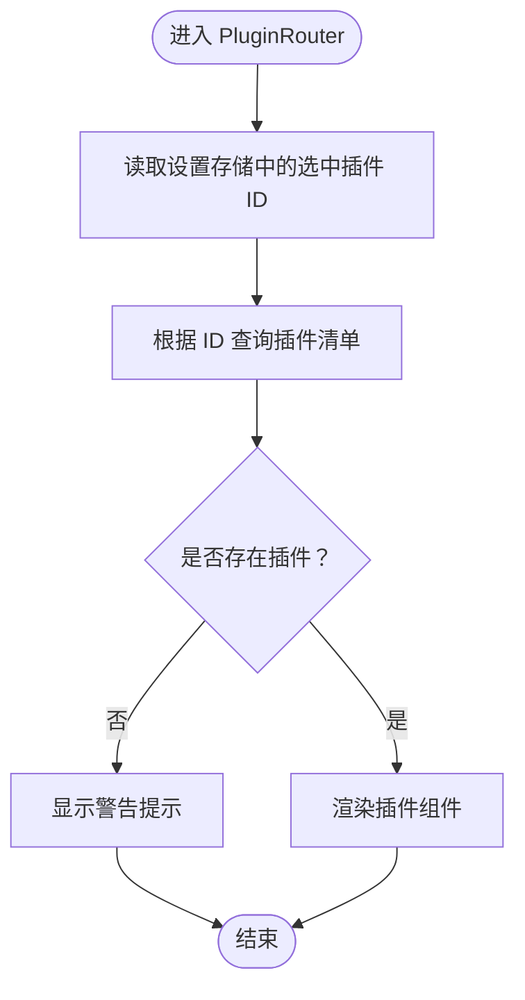
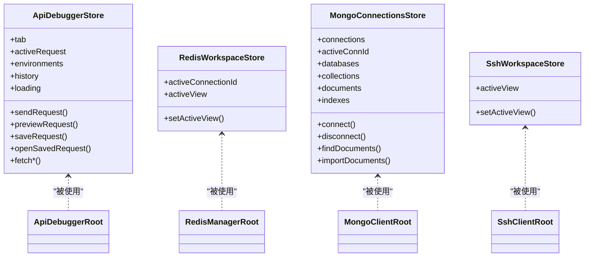
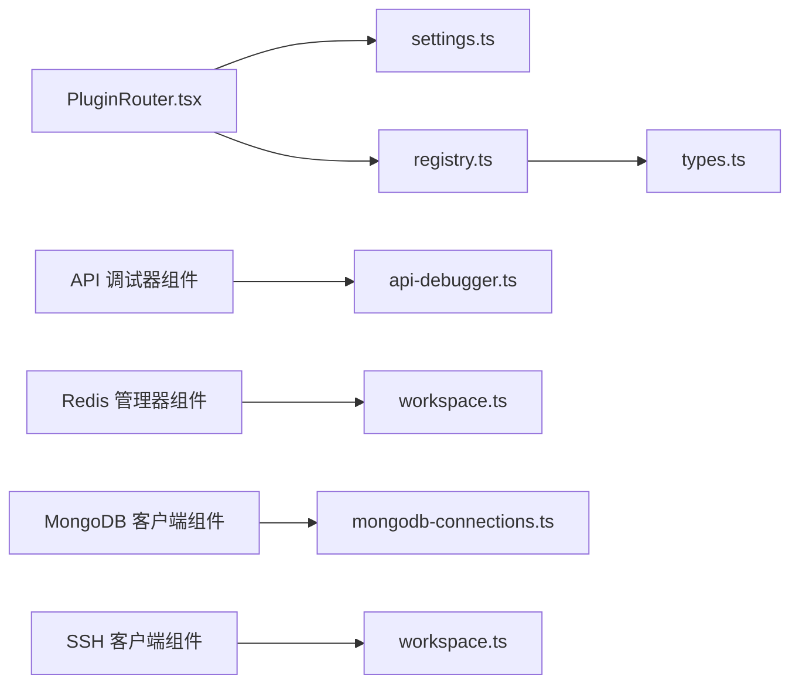

# 插件生命周期管理

<cite>
**本文引用的文件**
- [registry.ts](file://src/app/plugin-registry/registry.ts)
- [types.ts](file://src/app/plugin-registry/types.ts)
- [builtin.ts](file://src/app/plugin-registry/builtin.ts)
- [visibility.ts](file://src/app/plugin-registry/visibility.ts)
- [PluginRouter.tsx](file://src/app/plugin-registry/PluginRouter.tsx)
- [index.tsx（API 调试器）](file://src/plugins/api-debugger/index.tsx)
- [api-debugger.ts（API 调试器存储）](file://src/plugins/api-debugger/store/api-debugger.ts)
- [index.tsx（Redis 管理器）](file://src/plugins/redis-manager/index.tsx)
- [workspace.ts（Redis 工作区存储）](file://src/plugins/redis-manager/store/workspace.ts)
- [index.tsx（MongoDB 客户端）](file://src/plugins/mongodb-client/index.tsx)
- [mongodb-connections.ts（MongoDB 连接存储）](file://src/plugins/mongodb-client/store/mongodb-connections.ts)
- [index.tsx（SSH 客户端）](file://src/plugins/ssh-client/index.tsx)
- [workspace.ts（SSH 工作区存储）](file://src/plugins/ssh-client/store/workspace.ts)
- [settings.ts（设置存储）](file://src/app/store/settings.ts)
- [App.tsx](file://src/App.tsx)
</cite>

## 目录
1. [引言](#引言)
2. [项目结构](#项目结构)
3. [核心组件](#核心组件)
4. [架构总览](#架构总览)
5. [详细组件分析](#详细组件分析)
6. [依赖分析](#依赖分析)
7. [性能考虑](#性能考虑)
8. [故障排查指南](#故障排查指南)
9. [结论](#结论)
10. [附录](#附录)

## 引言
本文件围绕 DevNexus 的插件生命周期管理进行系统化技术说明，覆盖从插件注册、路由选择、渲染与激活、状态管理、到卸载与清理的全链路流程。文档同时解释插件间通信机制（通过命令调用与状态共享）、热重载与动态更新的实现思路、以及生命周期钩子（如 useEffect、useRef 的最佳实践）。为便于不同背景读者理解，文档采用由浅入深的结构，并辅以图示帮助把握整体架构。

## 项目结构
DevNexus 将“插件注册中心”与“插件实现”解耦：注册中心负责收集与排序插件清单；路由层根据用户选择渲染对应插件；各插件内部通过 Zustand 状态库管理自身工作区状态；跨插件通信通过 Tauri 命令桥接到后端或共享状态实现。

图表来源
- [App.tsx:1-11](file://src/App.tsx#L1-L11)
- [registry.ts:1-26](file://src/app/plugin-registry/registry.ts#L1-L26)
- [types.ts:1-14](file://src/app/plugin-registry/types.ts#L1-L14)
- [builtin.ts:1-29](file://src/app/plugin-registry/builtin.ts#L1-L29)
- [visibility.ts:1-6](file://src/app/plugin-registry/visibility.ts#L1-L6)
- [PluginRouter.tsx:1-29](file://src/app/plugin-registry/PluginRouter.tsx#L1-L29)
- [settings.ts:1-28](file://src/app/store/settings.ts#L1-L28)
- [index.tsx（API 调试器）:1-39](file://src/plugins/api-debugger/index.tsx#L1-L39)
- [api-debugger.ts（API 调试器存储）:1-129](file://src/plugins/api-debugger/store/api-debugger.ts#L1-L129)
- [index.tsx（Redis 管理器）:1-67](file://src/plugins/redis-manager/index.tsx#L1-L67)
- [workspace.ts（Redis 工作区存储）:1-26](file://src/plugins/redis-manager/store/workspace.ts#L1-L26)
- [index.tsx（MongoDB 客户端）:1-87](file://src/plugins/mongodb-client/index.tsx#L1-L87)
- [mongodb-connections.ts（MongoDB 连接存储）:1-296](file://src/plugins/mongodb-client/store/mongodb-connections.ts#L1-L296)
- [index.tsx（SSH 客户端）:1-66](file://src/plugins/ssh-client/index.tsx#L1-L66)
- [workspace.ts（SSH 工作区存储）:1-22](file://src/plugins/ssh-client/store/workspace.ts#L1-L22)

章节来源
- [registry.ts:1-26](file://src/app/plugin-registry/registry.ts#L1-L26)
- [types.ts:1-14](file://src/app/plugin-registry/types.ts#L1-L14)
- [builtin.ts:1-29](file://src/app/plugin-registry/builtin.ts#L1-L29)
- [visibility.ts:1-6](file://src/app/plugin-registry/visibility.ts#L1-L6)
- [PluginRouter.tsx:1-29](file://src/app/plugin-registry/PluginRouter.tsx#L1-L29)
- [settings.ts:1-28](file://src/app/store/settings.ts#L1-L28)
- [App.tsx:1-11](file://src/App.tsx#L1-L11)

## 核心组件
- 插件清单与类型定义：用于描述插件标识、名称、图标、版本、组件入口与侧边栏排序等元信息。
- 注册中心：维护插件清单映射，提供查询与清空能力，并按侧边栏顺序排序。
- 内置插件注册：集中注册所有内置插件，避免重复注册。
- 侧边栏可见性过滤：基于清单属性筛选需要显示在侧边栏的插件。
- 插件路由：依据设置存储中的选中插件 ID 获取清单并渲染对应组件。
- 插件工作区：每个插件通过 Zustand 存储管理自身工作区状态，支持跨视图切换与异步操作。
- 设置存储：持久化用户偏好，如侧边栏折叠状态、当前选中插件 ID。

章节来源
- [types.ts:1-14](file://src/app/plugin-registry/types.ts#L1-L14)
- [registry.ts:1-26](file://src/app/plugin-registry/registry.ts#L1-L26)
- [builtin.ts:1-29](file://src/app/plugin-registry/builtin.ts#L1-L29)
- [visibility.ts:1-6](file://src/app/plugin-registry/visibility.ts#L1-L6)
- [PluginRouter.tsx:1-29](file://src/app/plugin-registry/PluginRouter.tsx#L1-L29)
- [settings.ts:1-28](file://src/app/store/settings.ts#L1-L28)

## 架构总览
下图展示从应用启动到插件渲染的端到端流程，包括注册、路由选择与组件渲染的关键节点。

图表来源
- [App.tsx:1-11](file://src/App.tsx#L1-L11)
- [PluginRouter.tsx:1-29](file://src/app/plugin-registry/PluginRouter.tsx#L1-L29)
- [registry.ts:1-26](file://src/app/plugin-registry/registry.ts#L1-L26)
- [settings.ts:1-28](file://src/app/store/settings.ts#L1-L28)

## 详细组件分析

### 插件注册与清单管理
- 注册表：以 Map 存储插件清单，键为插件 ID，值为插件清单对象。提供注册、查询、排序与清空能力。
- 类型定义：统一约束插件清单字段，确保后续路由与渲染一致性。
- 内置插件注册：集中导入并注册内置插件，使用布尔标志避免重复注册。
- 侧边栏可见性：根据清单属性过滤出需要显示在侧边栏的插件集合。

图表来源
- [types.ts:1-14](file://src/app/plugin-registry/types.ts#L1-L14)
- [registry.ts:1-26](file://src/app/plugin-registry/registry.ts#L1-L26)
- [builtin.ts:1-29](file://src/app/plugin-registry/builtin.ts#L1-L29)
- [visibility.ts:1-6](file://src/app/plugin-registry/visibility.ts#L1-L6)

章节来源
- [types.ts:1-14](file://src/app/plugin-registry/types.ts#L1-L14)
- [registry.ts:1-26](file://src/app/plugin-registry/registry.ts#L1-L26)
- [builtin.ts:1-29](file://src/app/plugin-registry/builtin.ts#L1-L29)
- [visibility.ts:1-6](file://src/app/plugin-registry/visibility.ts#L1-L6)

### 插件路由与渲染
- 路由逻辑：从设置存储读取当前选中插件 ID；若未找到，则回退到第一个可用插件；最终渲染对应插件组件。
- 错误兜底：当无任何插件注册时，提示用户先注册插件。

图表来源
- [PluginRouter.tsx:1-29](file://src/app/plugin-registry/PluginRouter.tsx#L1-L29)
- [settings.ts:1-28](file://src/app/store/settings.ts#L1-L28)

章节来源
- [PluginRouter.tsx:1-29](file://src/app/plugin-registry/PluginRouter.tsx#L1-L29)
- [settings.ts:1-28](file://src/app/store/settings.ts#L1-L28)

### 插件工作区与状态管理
- API 调试器：通过 Zustand 管理标签页、请求、环境、历史、响应等状态；在组件挂载时触发数据拉取；支持发送请求、预览、保存、导入导出等操作。
- Redis 管理器：管理连接、数据库索引、键选择与视图切换；在无活动连接时自动切换到连接列表视图。
- MongoDB 客户端：管理连接、数据库、集合、文档、索引、查询历史与服务器状态；提供连接测试、集合 CRUD、聚合、导入导出等能力。
- SSH 客户端：管理连接、终端、密钥与隧道视图；支持视图切换与连接状态管理。

图表来源
- [api-debugger.ts（API 调试器存储）:1-129](file://src/plugins/api-debugger/store/api-debugger.ts#L1-L129)
- [index.tsx（API 调试器）:1-39](file://src/plugins/api-debugger/index.tsx#L1-L39)
- [workspace.ts（Redis 工作区存储）:1-26](file://src/plugins/redis-manager/store/workspace.ts#L1-L26)
- [index.tsx（Redis 管理器）:1-67](file://src/plugins/redis-manager/index.tsx#L1-L67)
- [mongodb-connections.ts（MongoDB 连接存储）:1-296](file://src/plugins/mongodb-client/store/mongodb-connections.ts#L1-L296)
- [index.tsx（MongoDB 客户端）:1-87](file://src/plugins/mongodb-client/index.tsx#L1-L87)
- [workspace.ts（SSH 工作区存储）:1-22](file://src/plugins/ssh-client/store/workspace.ts#L1-L22)
- [index.tsx（SSH 客户端）:1-66](file://src/plugins/ssh-client/index.tsx#L1-L66)

章节来源
- [api-debugger.ts（API 调试器存储）:1-129](file://src/plugins/api-debugger/store/api-debugger.ts#L1-L129)
- [index.tsx（API 调试器）:1-39](file://src/plugins/api-debugger/index.tsx#L1-L39)
- [workspace.ts（Redis 工作区存储）:1-26](file://src/plugins/redis-manager/store/workspace.ts#L1-L26)
- [index.tsx（Redis 管理器）:1-67](file://src/plugins/redis-manager/index.tsx#L1-L67)
- [mongodb-connections.ts（MongoDB 连接存储）:1-296](file://src/plugins/mongodb-client/store/mongodb-connections.ts#L1-L296)
- [index.tsx（MongoDB 客户端）:1-87](file://src/plugins/mongodb-client/index.tsx#L1-L87)
- [workspace.ts（SSH 工作区存储）:1-22](file://src/plugins/ssh-client/store/workspace.ts#L1-L22)
- [index.tsx（SSH 客户端）:1-66](file://src/plugins/ssh-client/index.tsx#L1-L66)

### 生命周期钩子与最佳实践
- useEffect：在插件根组件中使用，用于首次加载数据、监听依赖变化并触发异步任务；注意在依赖数组中包含所有外部依赖，避免闭包陷阱。
- useRef：用于访问 DOM 或缓存跨渲染不变的引用；避免在 effect 中直接修改 ref 导致不必要的重渲染。
- 状态初始化：在插件组件挂载时通过 useEffect 触发初始数据拉取，保证 UI 与数据一致。
- 清理与卸载：若插件存在长连接或定时任务，应在组件卸载时清理资源；当前代码主要通过状态驱动，未见显式清理逻辑，建议在具体插件中补充。

章节来源
- [index.tsx（API 调试器）:1-39](file://src/plugins/api-debugger/index.tsx#L1-L39)
- [index.tsx（Redis 管理器）:1-67](file://src/plugins/redis-manager/index.tsx#L1-L67)
- [index.tsx（MongoDB 客户端）:1-87](file://src/plugins/mongodb-client/index.tsx#L1-L87)
- [index.tsx（SSH 客户端）:1-66](file://src/plugins/ssh-client/index.tsx#L1-L66)

### 插件间通信与数据共享
- 命令调用：插件通过 invoke 调用后端命令，实现与原生模块的交互；例如发送网络请求、数据库连接、文件导入导出等。
- 共享状态：通过设置存储与插件内部状态实现有限共享；例如当前选中插件 ID 可影响路由渲染。
- 事件总线：当前代码未发现显式的事件总线实现；可通过自定义事件中心或 Zustand 订阅机制扩展。

章节来源
- [api-debugger.ts（API 调试器存储）:1-129](file://src/plugins/api-debugger/store/api-debugger.ts#L1-L129)
- [mongodb-connections.ts（MongoDB 连接存储）:1-296](file://src/plugins/mongodb-client/store/mongodb-connections.ts#L1-L296)
- [settings.ts:1-28](file://src/app/store/settings.ts#L1-L28)

### 热重载与动态更新机制
- 插件注册：通过注册中心集中管理插件清单，新增插件只需在内置注册处添加并调用注册函数即可生效。
- 路由切换：设置存储中的选中插件 ID 改变即触发路由重新渲染，实现“热切换”效果。
- 动态更新：插件清单可按需排序与过滤，支持运行时调整侧边栏显示。

章节来源
- [builtin.ts:1-29](file://src/app/plugin-registry/builtin.ts#L1-L29)
- [registry.ts:1-26](file://src/app/plugin-registry/registry.ts#L1-L26)
- [visibility.ts:1-6](file://src/app/plugin-registry/visibility.ts#L1-L6)
- [settings.ts:1-28](file://src/app/store/settings.ts#L1-L28)

## 依赖分析
- 组件耦合：插件路由依赖设置存储与注册中心；插件组件依赖各自的工作区存储；注册中心与类型定义低耦合。
- 外部依赖：Zustand 提供轻量状态管理；Ant Design 提供 UI 组件；@tauri-apps/api 提供命令调用能力。
- 循环依赖：当前结构未发现循环依赖；插件组件仅单向依赖其存储，存储不反向依赖组件。

图表来源
- [PluginRouter.tsx:1-29](file://src/app/plugin-registry/PluginRouter.tsx#L1-L29)
- [settings.ts:1-28](file://src/app/store/settings.ts#L1-L28)
- [registry.ts:1-26](file://src/app/plugin-registry/registry.ts#L1-L26)
- [types.ts:1-14](file://src/app/plugin-registry/types.ts#L1-L14)
- [api-debugger.ts（API 调试器存储）:1-129](file://src/plugins/api-debugger/store/api-debugger.ts#L1-L129)
- [workspace.ts（Redis 工作区存储）:1-26](file://src/plugins/redis-manager/store/workspace.ts#L1-L26)
- [mongodb-connections.ts（MongoDB 连接存储）:1-296](file://src/plugins/mongodb-client/store/mongodb-connections.ts#L1-L296)
- [workspace.ts（SSH 工作区存储）:1-22](file://src/plugins/ssh-client/store/workspace.ts#L1-L22)

章节来源
- [PluginRouter.tsx:1-29](file://src/app/plugin-registry/PluginRouter.tsx#L1-L29)
- [settings.ts:1-28](file://src/app/store/settings.ts#L1-L28)
- [registry.ts:1-26](file://src/app/plugin-registry/registry.ts#L1-L26)
- [types.ts:1-14](file://src/app/plugin-registry/types.ts#L1-L14)
- [api-debugger.ts（API 调试器存储）:1-129](file://src/plugins/api-debugger/store/api-debugger.ts#L1-L129)
- [workspace.ts（Redis 工作区存储）:1-26](file://src/plugins/redis-manager/store/workspace.ts#L1-L26)
- [mongodb-connections.ts（MongoDB 连接存储）:1-296](file://src/plugins/mongodb-client/store/mongodb-connections.ts#L1-L296)
- [workspace.ts（SSH 工作区存储）:1-22](file://src/plugins/ssh-client/store/workspace.ts#L1-L22)

## 性能考虑
- 渲染优化：插件路由使用 useMemo 缓存选中插件，减少不必要的重渲染。
- 状态粒度：插件内部状态按功能拆分（如 Redis 的连接、键、视图），降低无关状态变更对渲染的影响。
- 并行加载：API 调试器在初始化时并行拉取多个数据源，缩短首屏等待时间。
- 避免抖动：effect 依赖数组应包含所有外部依赖，防止因闭包导致的重复请求或渲染。

章节来源
- [PluginRouter.tsx:1-29](file://src/app/plugin-registry/PluginRouter.tsx#L1-L29)
- [api-debugger.ts（API 调试器存储）:1-129](file://src/plugins/api-debugger/store/api-debugger.ts#L1-L129)

## 故障排查指南
- 无插件可选：当注册中心为空时，路由会显示警告提示，请检查内置插件是否已正确注册。
- 选中插件不存在：若设置存储中的选中插件 ID 对应的插件不存在，路由会回退到第一个插件；请确认插件 ID 与清单一致。
- 数据未刷新：若插件初始化未拉取数据，检查组件是否在 useEffect 中触发了数据加载。
- 状态异常：若插件状态与预期不符，检查对应存储的 action 是否正确更新状态，以及 effect 依赖是否完整。

章节来源
- [PluginRouter.tsx:1-29](file://src/app/plugin-registry/PluginRouter.tsx#L1-L29)
- [builtin.ts:1-29](file://src/app/plugin-registry/builtin.ts#L1-L29)
- [settings.ts:1-28](file://src/app/store/settings.ts#L1-L28)

## 结论
DevNexus 的插件体系以“注册中心 + 路由 + 插件组件 + 存储”的方式实现了清晰的生命周期管理：从注册、路由选择、渲染与激活，到状态管理与卸载前的清理，均有明确的职责边界。通过 Zustand 的轻量状态管理与 Tauri 命令桥接，插件能够高效地完成数据加载、交互与持久化。未来可在事件总线、插件间共享状态与更完善的卸载清理方面进一步增强。

## 附录
- 插件清单字段说明
  - id：插件唯一标识
  - name：插件名称
  - icon：侧边栏图标
  - version：插件版本
  - component：插件根组件
  - sidebarOrder：侧边栏排序权重
  - showInSidebar：是否显示在侧边栏（默认显示）

章节来源
- [types.ts:1-14](file://src/app/plugin-registry/types.ts#L1-L14)