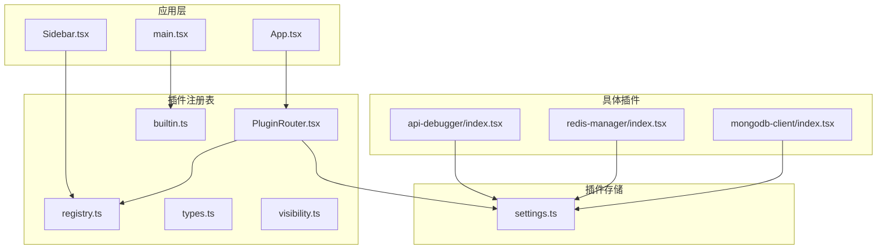
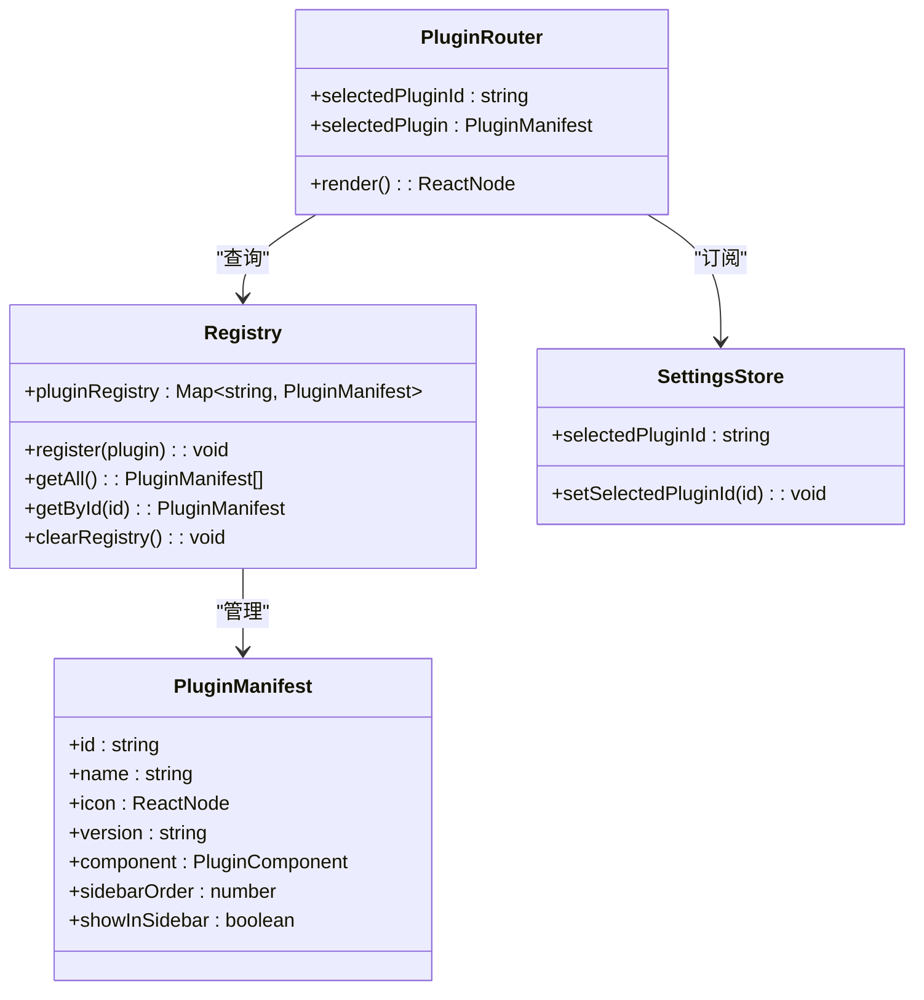
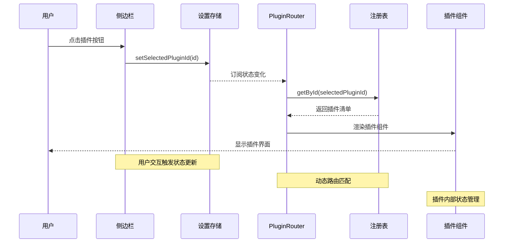
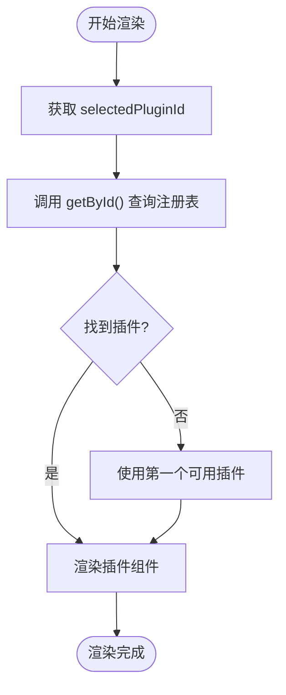
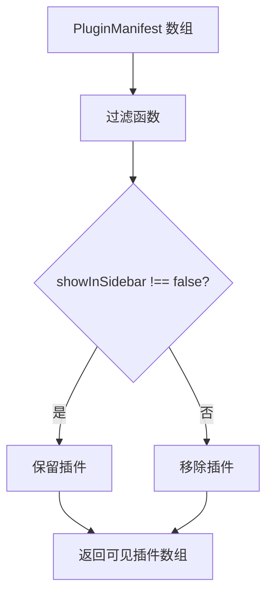
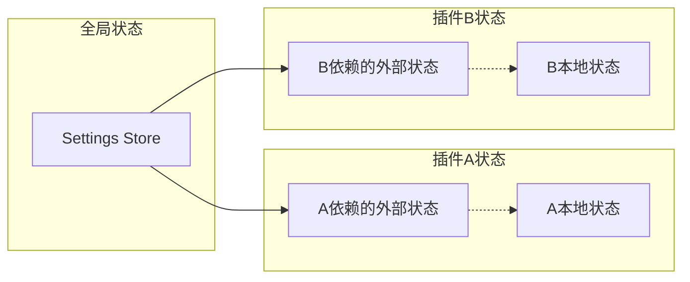
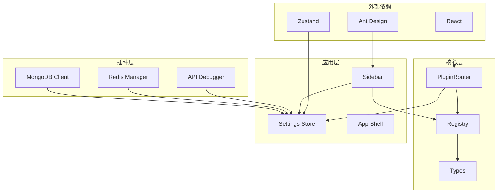

# 插件路由系统

<cite>
**本文档引用的文件**
- [PluginRouter.tsx](file://src/app/plugin-registry/PluginRouter.tsx)
- [registry.ts](file://src/app/plugin-registry/registry.ts)
- [types.ts](file://src/app/plugin-registry/types.ts)
- [visibility.ts](file://src/app/plugin-registry/visibility.ts)
- [builtin.ts](file://src/app/plugin-registry/builtin.ts)
- [settings.ts](file://src/app/store/settings.ts)
- [Sidebar.tsx](file://src/app/layout/Sidebar.tsx)
- [api-debugger/index.tsx](file://src/plugins/api-debugger/index.tsx)
- [redis-manager/index.tsx](file://src/plugins/redis-manager/index.tsx)
- [mongodb-client/index.tsx](file://src/plugins/mongodb-client/index.tsx)
- [api-debugger.ts](file://src/plugins/api-debugger/store/api-debugger.ts)
- [workspace.ts](file://src/plugins/redis-manager/store/workspace.ts)
- [mongodb-connections.ts](file://src/plugins/mongodb-client/store/mongodb-connections.ts)
- [main.tsx](file://src/main.tsx)
- [App.tsx](file://src/App.tsx)
</cite>

## 目录
1. [简介](#简介)
2. [项目结构](#项目结构)
3. [核心组件](#核心组件)
4. [架构概览](#架构概览)
5. [详细组件分析](#详细组件分析)
6. [依赖关系分析](#依赖关系分析)
7. [性能考虑](#性能考虑)
8. [故障排除指南](#故障排除指南)
9. [结论](#结论)

## 简介

DevNexus 的插件路由系统是一个基于 React 和 Zustand 的动态插件加载和渲染框架。该系统通过插件注册表管理多个插件实例，根据用户选择动态渲染对应的插件界面。系统采用声明式插件清单（PluginManifest）定义插件元数据，并通过全局设置存储管理当前选中的插件。

该路由系统的核心特点包括：
- 基于插件 ID 的动态路由匹配
- 插件清单注册和管理
- 可见性控制和侧边栏集成
- 内部状态管理和数据共享
- 懒加载和性能优化

## 项目结构

插件路由系统的文件组织遵循功能模块化原则：

**图表来源**
- [App.tsx:1-11](file://src/App.tsx#L1-L11)
- [main.tsx:1-38](file://src/main.tsx#L1-L38)
- [PluginRouter.tsx:1-29](file://src/app/plugin-registry/PluginRouter.tsx#L1-L29)

**章节来源**
- [App.tsx:1-11](file://src/App.tsx#L1-L11)
- [main.tsx:1-38](file://src/main.tsx#L1-L38)

## 核心组件

### PluginRouter 组件

PluginRouter 是插件路由系统的核心组件，负责根据当前选中的插件 ID 动态渲染对应的插件界面。

**图表来源**
- [PluginRouter.tsx:7-28](file://src/app/plugin-registry/PluginRouter.tsx#L7-L28)
- [registry.ts:3-26](file://src/app/plugin-registry/registry.ts#L3-L26)
- [types.ts:5-14](file://src/app/plugin-registry/types.ts#L5-L14)
- [settings.ts:9-21](file://src/app/store/settings.ts#L9-L21)

### 插件注册表系统

插件注册表采用 Map 数据结构存储插件清单，提供注册、查询和清理功能：

- **注册机制**：防止重复注册相同 ID 的插件
- **排序功能**：按 sidebarOrder 字段对插件进行排序
- **查询接口**：支持按 ID 获取特定插件或获取所有插件列表

**章节来源**
- [registry.ts:1-26](file://src/app/plugin-registry/registry.ts#L1-L26)
- [types.ts:1-14](file://src/app/plugin-registry/types.ts#L1-L14)

## 架构概览

插件路由系统采用分层架构设计，各层职责明确：

**图表来源**
- [Sidebar.tsx:34-43](file://src/app/layout/Sidebar.tsx#L34-L43)
- [settings.ts:20-21](file://src/app/store/settings.ts#L20-L21)
- [PluginRouter.tsx:8-13](file://src/app/plugin-registry/PluginRouter.tsx#L8-L13)
- [registry.ts:19-21](file://src/app/plugin-registry/registry.ts#L19-L21)

## 详细组件分析

### 路由匹配算法

插件路由系统采用基于插件 ID 的简单而高效的匹配算法：

**图表来源**
- [PluginRouter.tsx:10-13](file://src/app/plugin-registry/PluginRouter.tsx#L10-L13)
- [registry.ts:19-21](file://src/app/plugin-registry/registry.ts#L19-L21)

匹配算法的关键特性：
- **确定性**：每个插件 ID 对应唯一组件
- **容错性**：当目标插件不存在时自动回退到第一个插件
- **高效性**：基于 Map 的 O(1) 查找复杂度

**章节来源**
- [PluginRouter.tsx:1-29](file://src/app/plugin-registry/PluginRouter.tsx#L1-L29)

### 插件可见性控制机制

插件可见性控制通过 visibility.ts 实现，主要功能是过滤不显示在侧边栏的插件：

**图表来源**
- [visibility.ts:3-5](file://src/app/plugin-registry/visibility.ts#L3-L5)

可见性控制的实现要点：
- 默认显示所有插件（除非显式设置 `showInSidebar: false`）
- 与侧边栏渲染逻辑紧密集成
- 支持插件级别的显示控制

**章节来源**
- [visibility.ts:1-6](file://src/app/plugin-registry/visibility.ts#L1-L6)

### 插件间状态传递和数据共享

插件路由系统通过多种机制实现状态传递和数据共享：

#### 全局设置存储
settings.ts 提供跨插件共享的状态：
- `selectedPluginId`：当前选中的插件 ID
- `sidebarCollapsed`：侧边栏折叠状态
- `dbToolsCollapsed`：数据库工具组折叠状态

#### 插件内部状态管理
每个插件维护独立的状态管理系统：

**图表来源**
- [settings.ts:4-11](file://src/app/store/settings.ts#L4-L11)

**章节来源**
- [settings.ts:1-28](file://src/app/store/settings.ts#L1-L28)

### 插件内部导航管理

不同插件实现了各自的导航和状态管理模式：

#### API 调试器导航
api-debugger 通过 Tab 切换实现内部导航：
- Workspace 工作区
- Collections 集合
- Environments 环境
- History 历史记录

#### Redis 管理器导航
redis-manager 使用 Segmented 控件实现视图切换：
- Connections 连接列表
- Keys 键值浏览器
- Console 控制台
- Server 服务器信息

#### MongoDB 客户端导航
mongodb-client 提供最复杂的多级导航：
- Connections 连接管理
- Databases 数据库浏览
- Documents 文档管理
- Query 查询工作区
- Indexes 索引管理
- Import/Export 导入导出
- Server 服务器状态

**章节来源**
- [api-debugger/index.tsx:13-39](file://src/plugins/api-debugger/index.tsx#L13-L39)
- [redis-manager/index.tsx:14-67](file://src/plugins/redis-manager/index.tsx#L14-L67)
- [mongodb-client/index.tsx:14-87](file://src/plugins/mongodb-client/index.tsx#L14-L87)

## 依赖关系分析

插件路由系统的依赖关系清晰且层次分明：

**图表来源**
- [PluginRouter.tsx:4-5](file://src/app/plugin-registry/PluginRouter.tsx#L4-L5)
- [Sidebar.tsx:15-17](file://src/app/layout/Sidebar.tsx#L15-L17)
- [settings.ts:13-27](file://src/app/store/settings.ts#L13-L27)

**章节来源**
- [builtin.ts:1-29](file://src/app/plugin-registry/builtin.ts#L1-L29)

## 性能考虑

插件路由系统在设计时充分考虑了性能优化：

### 渲染优化
- **useMemo 缓存**：PluginRouter 使用 useMemo 缓存插件查找结果
- **条件渲染**：仅在插件存在时进行渲染
- **懒加载**：插件组件按需加载

### 状态管理优化
- **细粒度状态**：每个插件维护独立的状态，避免全局状态污染
- **持久化存储**：设置状态持久化到本地存储
- **最小化订阅**：组件仅订阅必要的状态变化

### 内存管理
- **插件卸载**：插件组件卸载时释放相关资源
- **事件清理**：插件内部清理定时器和事件监听器

## 故障排除指南

### 常见问题及解决方案

#### 插件未显示在侧边栏
**症状**：插件已注册但不在侧边栏中显示
**原因**：插件的 `showInSidebar` 属性被设置为 `false`
**解决方法**：检查插件清单中的 `showInSidebar` 配置

#### 插件路由错误
**症状**：点击插件按钮后页面空白或显示警告
**原因**：插件未正确注册或插件 ID 不匹配
**解决方法**：
1. 确认插件已通过 `register()` 函数注册
2. 检查插件 ID 是否与侧边栏按钮绑定的 ID 一致
3. 验证插件组件是否正确导出

#### 状态同步问题
**症状**：插件间状态不同步
**原因**：插件使用了不同的状态管理模式
**解决方法**：
1. 对于需要共享的状态，使用全局设置存储
2. 对于独立状态，确保插件内部正确管理状态
3. 避免跨插件直接修改对方的状态

**章节来源**
- [PluginRouter.tsx:15-24](file://src/app/plugin-registry/PluginRouter.tsx#L15-L24)
- [visibility.ts:3-5](file://src/app/plugin-registry/visibility.ts#L3-L5)

## 结论

DevNexus 的插件路由系统通过简洁而高效的架构实现了灵活的插件管理。系统的核心优势包括：

1. **简单而强大的路由机制**：基于插件 ID 的直接映射，实现 O(1) 复杂度的路由查找
2. **模块化的插件架构**：每个插件独立管理自己的状态和导航逻辑
3. **可扩展的设计**：支持动态插件注册和运行时插件管理
4. **良好的用户体验**：平滑的插件切换和状态持久化

该系统为 DevNexus 提供了坚实的基础，支持未来更多插件的集成和扩展。通过遵循现有的设计模式和最佳实践，开发者可以轻松地为系统添加新的插件功能。