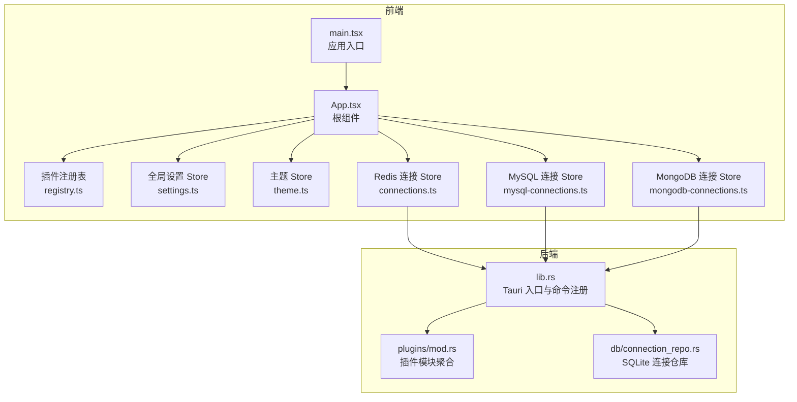
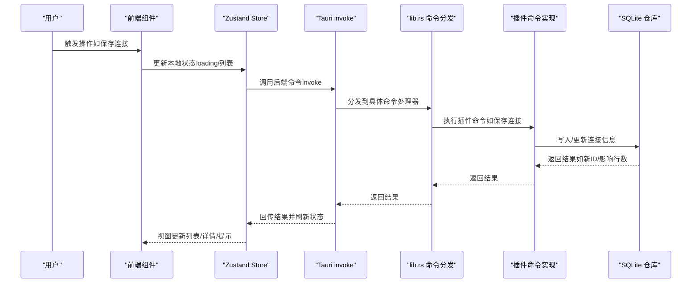
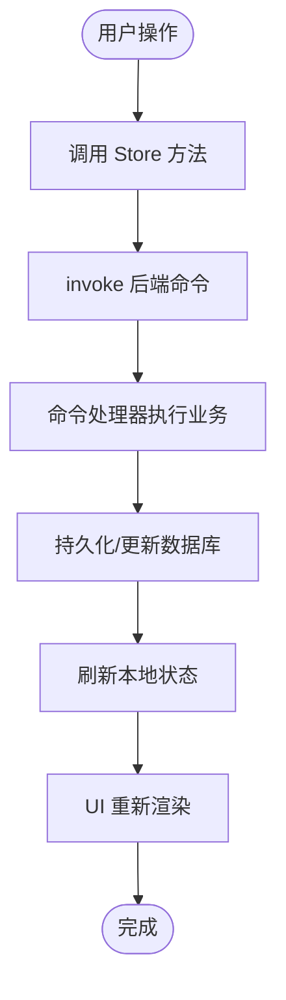
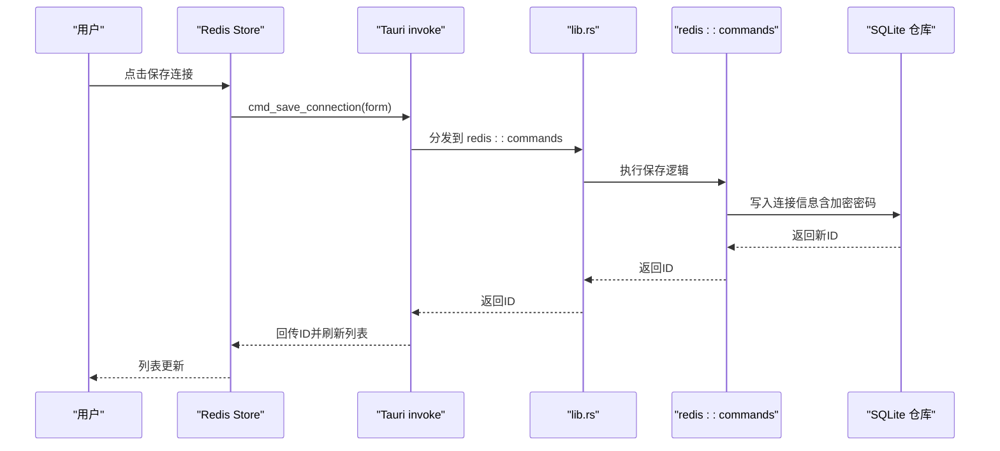
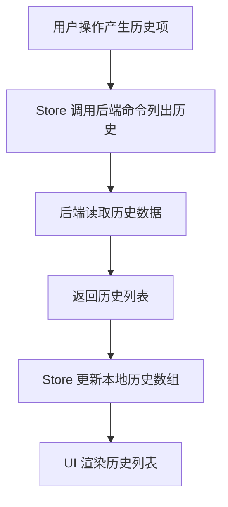
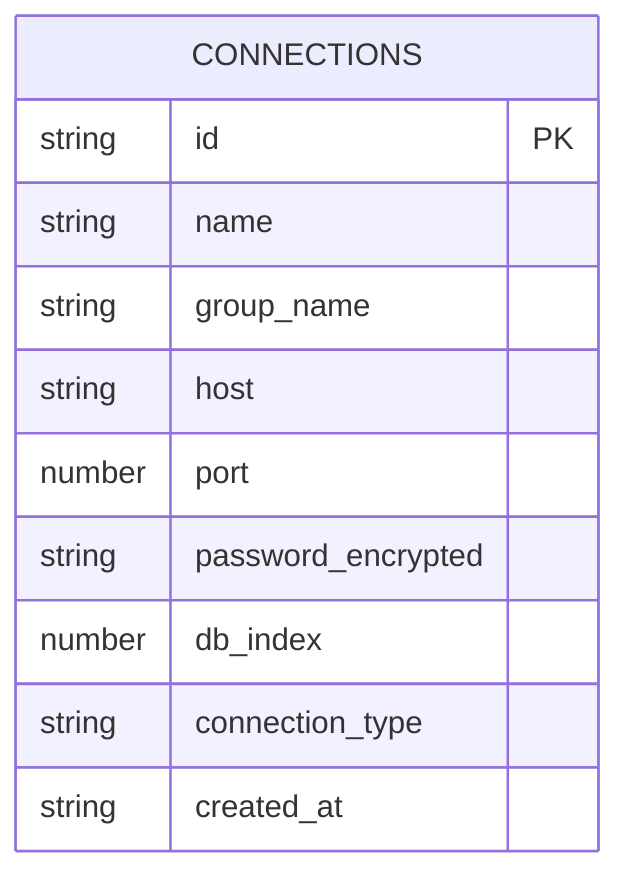
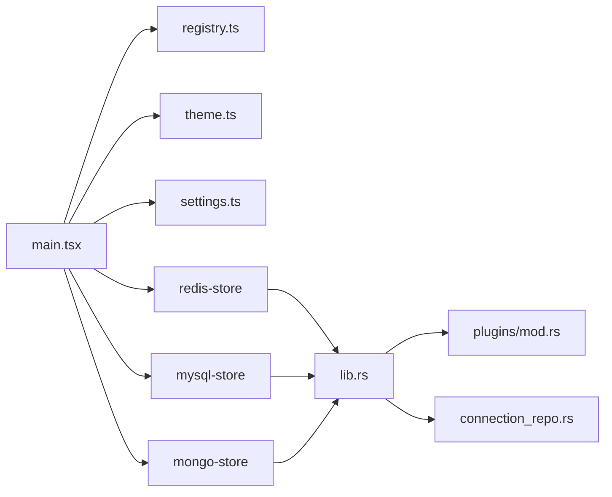

# 数据流设计

<cite>
**本文引用的文件**
- [src/main.tsx](file://src/main.tsx)
- [src/App.tsx](file://src/App.tsx)
- [src/app/store/settings.ts](file://src/app/store/settings.ts)
- [src/app/store/theme.ts](file://src/app/store/theme.ts)
- [src/app/plugin-registry/registry.ts](file://src/app/plugin-registry/registry.ts)
- [src/app/plugin-registry/types.ts](file://src/app/plugin-registry/types.ts)
- [src/plugins/redis-manager/store/connections.ts](file://src/plugins/redis-manager/store/connections.ts)
- [src/plugins/redis-manager/types.ts](file://src/plugins/redis-manager/types.ts)
- [src/plugins/mysql-client/store/mysql-connections.ts](file://src/plugins/mysql-client/store/mysql-connections.ts)
- [src/plugins/mysql-client/types.ts](file://src/plugins/mysql-client/types.ts)
- [src/plugins/mongodb-client/store/mongodb-connections.ts](file://src/plugins/mongodb-client/store/mongodb-connections.ts)
- [src/plugins/mongodb-client/types.ts](file://src/plugins/mongodb-client/types.ts)
- [src-tauri/src/lib.rs](file://src-tauri/src/lib.rs)
- [src-tauri/src/db/connection_repo.rs](file://src-tauri/src/db/connection_repo.rs)
- [src-tauri/src/plugins/mod.rs](file://src-tauri/src/plugins/mod.rs)
</cite>

## 目录
1. [简介](#简介)
2. [项目结构](#项目结构)
3. [核心组件](#核心组件)
4. [架构总览](#架构总览)
5. [详细组件分析](#详细组件分析)
6. [依赖关系分析](#依赖关系分析)
7. [性能考量](#性能考量)
8. [故障排查指南](#故障排查指南)
9. [结论](#结论)
10. [附录](#附录)

## 简介
本文件为 DevNexus 的数据流设计文档，聚焦于“从用户操作到最终数据持久化”的完整数据通路，覆盖以下方面：
- 用户交互触发与前端状态更新
- 后端命令执行与数据库写入
- 状态管理模式（Zustand 全局状态与插件状态隔离）
- 数据流向控制原则（单向数据流、状态提升、状态共享）
- 不同类型数据的存储与同步（连接配置、历史记录、用户偏好）
- 性能优化、内存管理与并发安全最佳实践
- 数据流图与实际流转示例

## 项目结构
DevNexus 前后端采用 Tauri 架构：前端使用 React + Zustand 管理状态；后端 Rust 提供插件能力并通过命令暴露给前端调用；SQLite 负责本地持久化。

图表来源
- [src/main.tsx:1-38](file://src/main.tsx#L1-L38)
- [src/App.tsx:1-11](file://src/App.tsx#L1-L11)
- [src/app/plugin-registry/registry.ts:1-26](file://src/app/plugin-registry/registry.ts#L1-L26)
- [src/app/store/settings.ts:1-28](file://src/app/store/settings.ts#L1-L28)
- [src/app/store/theme.ts:1-27](file://src/app/store/theme.ts#L1-L27)
- [src/plugins/redis-manager/store/connections.ts:1-91](file://src/plugins/redis-manager/store/connections.ts#L1-L91)
- [src/plugins/mysql-client/store/mysql-connections.ts:1-153](file://src/plugins/mysql-client/store/mysql-connections.ts#L1-L153)
- [src/plugins/mongodb-client/store/mongodb-connections.ts:1-296](file://src/plugins/mongodb-client/store/mongodb-connections.ts#L1-L296)
- [src-tauri/src/lib.rs:1-250](file://src-tauri/src/lib.rs#L1-L250)
- [src-tauri/src/db/connection_repo.rs:1-174](file://src-tauri/src/db/connection_repo.rs#L1-L174)
- [src-tauri/src/plugins/mod.rs:1-10](file://src-tauri/src/plugins/mod.rs#L1-L10)

章节来源
- [src/main.tsx:1-38](file://src/main.tsx#L1-L38)
- [src/App.tsx:1-11](file://src/App.tsx#L1-L11)
- [src/app/plugin-registry/registry.ts:1-26](file://src/app/plugin-registry/registry.ts#L1-L26)
- [src/app/store/settings.ts:1-28](file://src/app/store/settings.ts#L1-L28)
- [src/app/store/theme.ts:1-27](file://src/app/store/theme.ts#L1-L27)
- [src/plugins/redis-manager/store/connections.ts:1-91](file://src/plugins/redis-manager/store/connections.ts#L1-L91)
- [src/plugins/mysql-client/store/mysql-connections.ts:1-153](file://src/plugins/mysql-client/store/mysql-connections.ts#L1-L153)
- [src/plugins/mongodb-client/store/mongodb-connections.ts:1-296](file://src/plugins/mongodb-client/store/mongodb-connections.ts#L1-L296)
- [src-tauri/src/lib.rs:1-250](file://src-tauri/src/lib.rs#L1-L250)
- [src-tauri/src/db/connection_repo.rs:1-174](file://src-tauri/src/db/connection_repo.rs#L1-L174)
- [src-tauri/src/plugins/mod.rs:1-10](file://src-tauri/src/plugins/mod.rs#L1-L10)

## 核心组件
- 应用入口与主题注入
  - 入口在应用启动时注册内置插件，并根据主题状态动态切换 Ant Design 主题算法，同时将当前主题模式写入 DOM 属性以驱动 UI 渲染。
- 插件注册表
  - 维护插件清单（id、名称、图标、版本、组件、侧边栏顺序等），提供注册、查询与清空能力，保证插件发现与排序的一致性。
- 全局状态（Zustand）
  - 设置状态（settings.ts）：保存侧边栏折叠、数据库工具区折叠、选中插件 ID 等，使用持久化中间件存入浏览器存储。
  - 主题状态（theme.ts）：保存明暗主题模式与切换逻辑，同样持久化。
- 插件状态（Zustand）
  - Redis/MongoDB/MySQL 连接状态（connections.ts、mongodb-connections.ts、mysql-connections.ts）：统一通过 invoke 调用后端命令，完成连接、测试、增删改查、导入导出、历史记录等操作，并在成功后刷新本地状态或列表。
- 后端命令与持久化
  - lib.rs 汇总所有命令处理器，按插件分发至对应模块；db/connection_repo.rs 实现 SQLite 连接信息的读写、加解密密码、索引更新等。

章节来源
- [src/main.tsx:10-31](file://src/main.tsx#L10-L31)
- [src/app/plugin-registry/registry.ts:3-25](file://src/app/plugin-registry/registry.ts#L3-L25)
- [src/app/store/settings.ts:13-27](file://src/app/store/settings.ts#L13-L27)
- [src/app/store/theme.ts:12-26](file://src/app/store/theme.ts#L12-L26)
- [src/plugins/redis-manager/store/connections.ts:27-90](file://src/plugins/redis-manager/store/connections.ts#L27-L90)
- [src/plugins/mongodb-client/store/mongodb-connections.ts:96-295](file://src/plugins/mongodb-client/store/mongodb-connections.ts#L96-L295)
- [src/plugins/mysql-client/store/mysql-connections.ts:77-152](file://src/plugins/mysql-client/store/mysql-connections.ts#L77-L152)
- [src-tauri/src/lib.rs:25-246](file://src-tauri/src/lib.rs#L25-L246)
- [src-tauri/src/db/connection_repo.rs:34-138](file://src-tauri/src/db/connection_repo.rs#L34-L138)

## 架构总览
下图展示从前端用户交互到后端命令执行再到数据库写入的完整数据流。

图表来源
- [src/plugins/redis-manager/store/connections.ts:42-47](file://src/plugins/redis-manager/store/connections.ts#L42-L47)
- [src/plugins/mongodb-client/store/mongodb-connections.ts:132-137](file://src/plugins/mongodb-client/store/mongodb-connections.ts#L132-L137)
- [src/plugins/mysql-client/store/mysql-connections.ts:99-102](file://src/plugins/mysql-client/store/mysql-connections.ts#L99-L102)
- [src-tauri/src/lib.rs:25-246](file://src-tauri/src/lib.rs#L25-L246)
- [src-tauri/src/db/connection_repo.rs:96-131](file://src-tauri/src/db/connection_repo.rs#L96-L131)

## 详细组件分析

### 状态管理模式与控制原则
- 单向数据流
  - 前端通过 invoke 发起命令，后端返回结果，再由 Store 刷新状态，最后驱动 UI 更新，形成清晰的单向流动。
- 状态提升与共享
  - 全局设置与主题作为跨插件共享的状态，避免重复维护；插件内部状态（如连接列表、活动数据库、工作区标签页）保持隔离，仅通过命令进行交互。
- 状态持久化
  - settings.ts 与 theme.ts 使用持久化中间件，确保用户偏好在重启后恢复。

图表来源
- [src/plugins/redis-manager/store/connections.ts:33-41](file://src/plugins/redis-manager/store/connections.ts#L33-L41)
- [src/plugins/mongodb-client/store/mongodb-connections.ts:123-131](file://src/plugins/mongodb-client/store/mongodb-connections.ts#L123-L131)
- [src/plugins/mysql-client/store/mysql-connections.ts:94-98](file://src/plugins/mysql-client/store/mysql-connections.ts#L94-L98)

章节来源
- [src/app/store/settings.ts:13-27](file://src/app/store/settings.ts#L13-L27)
- [src/app/store/theme.ts:12-26](file://src/app/store/theme.ts#L12-L26)
- [src/plugins/redis-manager/store/connections.ts:33-41](file://src/plugins/redis-manager/store/connections.ts#L33-L41)
- [src/plugins/mongodb-client/store/mongodb-connections.ts:123-131](file://src/plugins/mongodb-client/store/mongodb-connections.ts#L123-L131)
- [src/plugins/mysql-client/store/mysql-connections.ts:94-98](file://src/plugins/mysql-client/store/mysql-connections.ts#L94-L98)

### 连接配置数据流（以 Redis 为例）
- 用户在连接表单填写参数并点击保存
- Store 调用后端命令保存连接，后端加密密码并写入 SQLite
- 成功后重新拉取连接列表并刷新本地状态
- UI 展示最新连接列表

图表来源
- [src/plugins/redis-manager/store/connections.ts:42-47](file://src/plugins/redis-manager/store/connections.ts#L42-L47)
- [src-tauri/src/lib.rs:25-67](file://src-tauri/src/lib.rs#L25-L67)
- [src-tauri/src/db/connection_repo.rs:96-131](file://src-tauri/src/db/connection_repo.rs#L96-L131)

章节来源
- [src/plugins/redis-manager/store/connections.ts:42-47](file://src/plugins/redis-manager/store/connections.ts#L42-L47)
- [src/plugins/redis-manager/types.ts:3-23](file://src/plugins/redis-manager/types.ts#L3-L23)
- [src-tauri/src/db/connection_repo.rs:96-131](file://src-tauri/src/db/connection_repo.rs#L96-L131)

### 历史记录与用户偏好同步
- 历史记录
  - 各插件 Store 提供列出历史的接口，后端命令负责从数据库或缓存中读取并返回，Store 接收后直接更新本地历史数组。
- 用户偏好
  - settings.ts 与 theme.ts 通过持久化中间件自动同步到浏览器存储，重启后恢复。

图表来源
- [src/plugins/mysql-client/store/mysql-connections.ts:143-143](file://src/plugins/mysql-client/store/mysql-connections.ts#L143-L143)
- [src/plugins/mongodb-client/store/mongodb-connections.ts:283-289](file://src/plugins/mongodb-client/store/mongodb-connections.ts#L283-L289)

章节来源
- [src/plugins/mysql-client/store/mysql-connections.ts:143-143](file://src/plugins/mysql-client/store/mysql-connections.ts#L143-L143)
- [src/plugins/mongodb-client/store/mongodb-connections.ts:283-289](file://src/plugins/mongodb-client/store/mongodb-connections.ts#L283-L289)
- [src/app/store/settings.ts:13-27](file://src/app/store/settings.ts#L13-L27)
- [src/app/store/theme.ts:12-26](file://src/app/store/theme.ts#L12-L26)

### 数据模型与持久化
- 连接信息模型
  - Redis/MongoDB/MySQL 插件均定义了连接表单与连接信息的数据结构，用于前后端传输与持久化。
- SQLite 仓库
  - connection_repo.rs 提供连接列表、新增/更新、删除、按 ID 查询、读取加密密码、更新数据库索引等能力；保存时对密码进行加密后再入库。

图表来源
- [src-tauri/src/db/connection_repo.rs:5-27](file://src-tauri/src/db/connection_repo.rs#L5-L27)
- [src/plugins/redis-manager/types.ts:14-23](file://src/plugins/redis-manager/types.ts#L14-L23)
- [src/plugins/mysql-client/types.ts:15-27](file://src/plugins/mysql-client/types.ts#L15-L27)
- [src/plugins/mongodb-client/types.ts:20-34](file://src/plugins/mongodb-client/types.ts#L20-L34)

章节来源
- [src-tauri/src/db/connection_repo.rs:34-138](file://src-tauri/src/db/connection_repo.rs#L34-L138)
- [src/plugins/redis-manager/types.ts:3-23](file://src/plugins/redis-manager/types.ts#L3-L23)
- [src/plugins/mysql-client/types.ts:1-40](file://src/plugins/mysql-client/types.ts#L1-L40)
- [src/plugins/mongodb-client/types.ts:1-95](file://src/plugins/mongodb-client/types.ts#L1-L95)

## 依赖关系分析
- 前端依赖
  - main.tsx 依赖插件注册表与主题 Store；App.tsx 作为根容器承载布局与插件区域。
  - 各插件 Store 依赖 @tauri-apps/api/core 的 invoke 能力与自身类型定义。
- 后端依赖
  - lib.rs 聚合所有命令处理器，plugins/mod.rs 汇总各插件模块；db/connection_repo.rs 提供 SQLite 访问与密码加解密。

图表来源
- [src/main.tsx:5-10](file://src/main.tsx#L5-L10)
- [src/app/plugin-registry/registry.ts:1-26](file://src/app/plugin-registry/registry.ts#L1-L26)
- [src/app/store/theme.ts:1-27](file://src/app/store/theme.ts#L1-L27)
- [src/app/store/settings.ts:1-28](file://src/app/store/settings.ts#L1-L28)
- [src/plugins/redis-manager/store/connections.ts:1-2](file://src/plugins/redis-manager/store/connections.ts#L1-L2)
- [src/plugins/mysql-client/store/mysql-connections.ts:1-2](file://src/plugins/mysql-client/store/mysql-connections.ts#L1-L2)
- [src/plugins/mongodb-client/store/mongodb-connections.ts:1-2](file://src/plugins/mongodb-client/store/mongodb-connections.ts#L1-L2)
- [src-tauri/src/lib.rs:1-250](file://src-tauri/src/lib.rs#L1-L250)
- [src-tauri/src/plugins/mod.rs:1-10](file://src-tauri/src/plugins/mod.rs#L1-L10)
- [src-tauri/src/db/connection_repo.rs:1-174](file://src-tauri/src/db/connection_repo.rs#L1-L174)

章节来源
- [src/main.tsx:5-10](file://src/main.tsx#L5-L10)
- [src-tauri/src/lib.rs:25-246](file://src-tauri/src/lib.rs#L25-L246)
- [src-tauri/src/plugins/mod.rs:1-10](file://src-tauri/src/plugins/mod.rs#L1-L10)
- [src-tauri/src/db/connection_repo.rs:29-174](file://src-tauri/src/db/connection_repo.rs#L29-L174)

## 性能考量
- 并发与异步
  - Store 中多数方法为异步，使用 try/finally 或 Promise.all 控制加载态与并发请求，避免阻塞 UI。
- 内存管理
  - 对象展开与去重（如连接集合）可减少不必要的拷贝；对大文档/行页等分页加载，降低一次性渲染压力。
- I/O 优化
  - 通过后端命令批量读取列表，前端再局部刷新，减少多次往返。
- 加密与安全
  - 密码在入库前加密，读取时解密，避免明文存储与泄露风险。
- 状态持久化
  - settings 与 theme 使用持久化中间件，减少用户重复配置成本。

[本节为通用指导，无需特定文件来源]

## 故障排查指南
- 保存连接失败
  - 检查后端命令是否正确注册（lib.rs）、命令处理器是否实现、数据库连接是否可用。
  - 关注 Store 中的错误分支与 loading 状态，确认 finally/await 是否正确处理。
- 列表为空或未刷新
  - 确认保存/删除/连接/断开等命令执行后是否调用了列表刷新逻辑。
- 密码无法读取
  - 检查加密/解密流程与数据库字段是否存在；确认 connection_repo.rs 的查询与映射是否正确。
- 主题切换无效
  - 确认 theme.ts 的持久化与 main.tsx 的 DOM 属性写入逻辑。

章节来源
- [src-tauri/src/lib.rs:25-246](file://src-tauri/src/lib.rs#L25-L246)
- [src/plugins/redis-manager/store/connections.ts:33-41](file://src/plugins/redis-manager/store/connections.ts#L33-L41)
- [src/plugins/mongodb-client/store/mongodb-connections.ts:123-131](file://src/plugins/mongodb-client/store/mongodb-connections.ts#L123-L131)
- [src/plugins/mysql-client/store/mysql-connections.ts:94-98](file://src/plugins/mysql-client/store/mysql-connections.ts#L94-L98)
- [src-tauri/src/db/connection_repo.rs:96-155](file://src-tauri/src/db/connection_repo.rs#L96-L155)
- [src/main.tsx:12-17](file://src/main.tsx#L12-L17)

## 结论
DevNexus 的数据流遵循“前端单向数据流 + 后端命令式执行 + SQLite 持久化”的设计，结合 Zustand 的轻量状态管理与 Tauri 的安全桥接，实现了连接配置、历史记录与用户偏好的高效管理与可靠持久化。通过插件状态隔离与全局状态共享，系统在扩展性与一致性之间取得平衡。

[本节为总结，无需特定文件来源]

## 附录
- 关键命令一览（部分）
  - Redis：保存/删除/测试/连接/断开/选择数据库/扫描键等
  - MySQL：保存/删除/测试/连接/断开/列举数据库/表/列/执行 SQL/导入导出/查看服务器状态等
  - MongoDB：保存/删除/测试/连接/断开/列举数据库/集合/文档/索引/聚合/命令等
  - SSH/S3/MQ/API调试/网络工具/LAN Chat 等插件亦通过类似模式接入

章节来源
- [src-tauri/src/lib.rs:25-246](file://src-tauri/src/lib.rs#L25-L246)