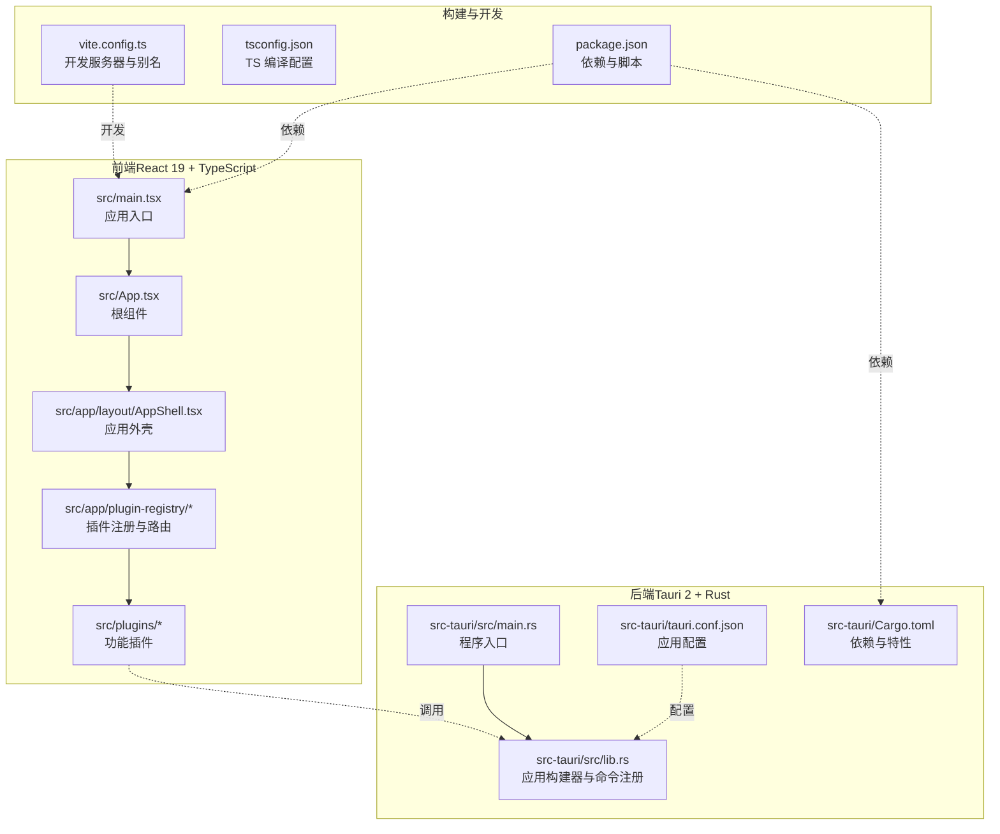
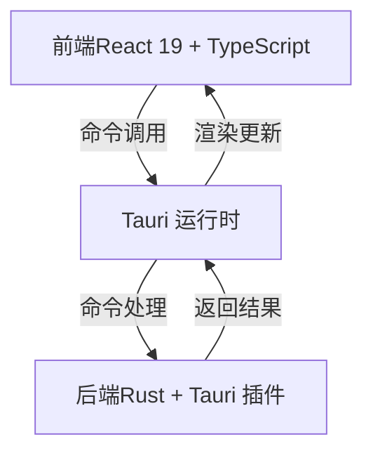
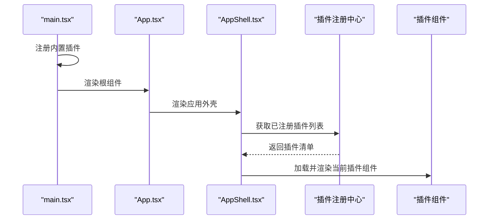
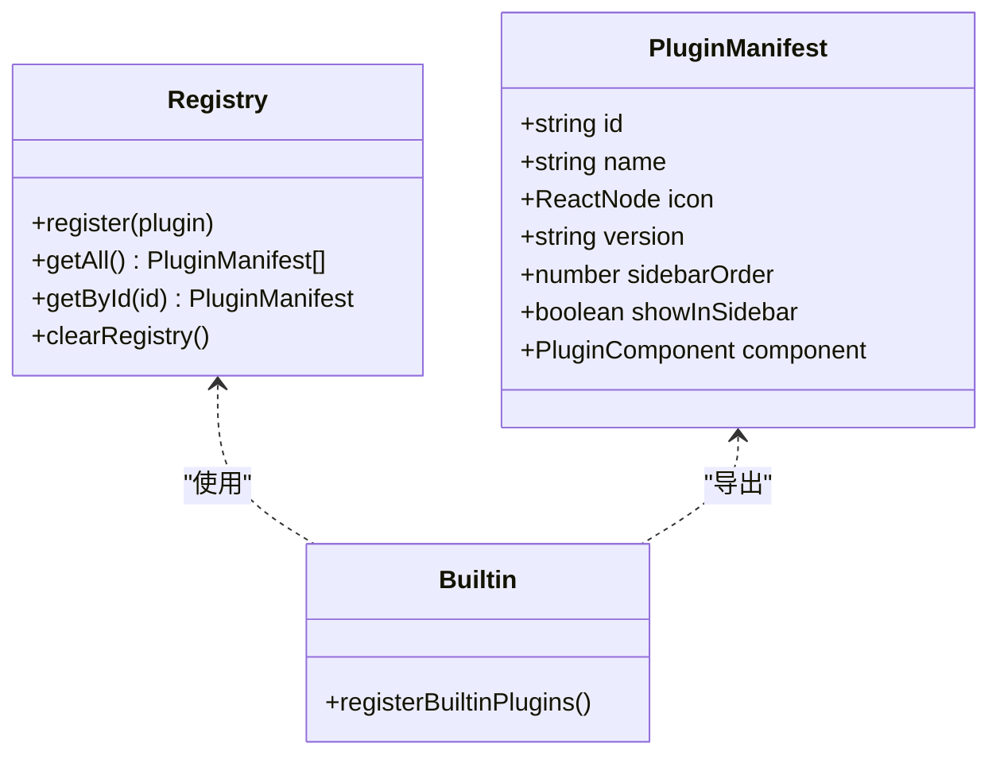
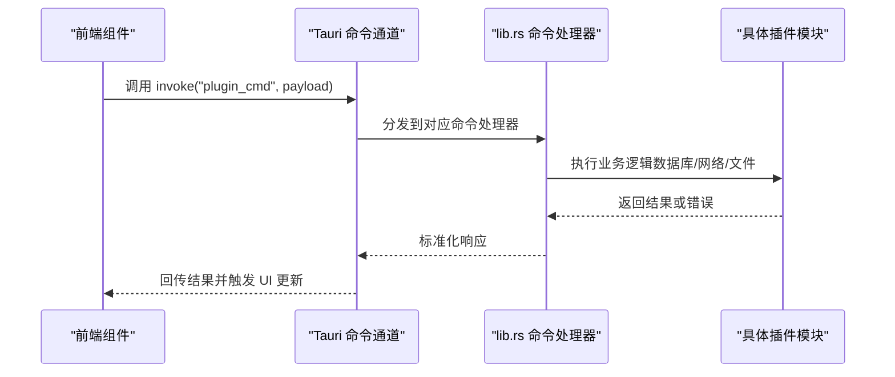
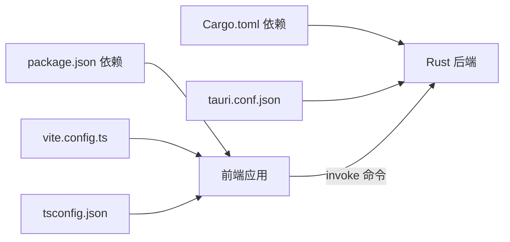

# 整体架构概览

<cite>
**本文档引用的文件**
- [src/main.tsx](file://src/main.tsx)
- [src/App.tsx](file://src/App.tsx)
- [src/app/layout/AppShell.tsx](file://src/app/layout/AppShell.tsx)
- [src/app/plugin-registry/registry.ts](file://src/app/plugin-registry/registry.ts)
- [src/app/plugin-registry/builtin.ts](file://src/app/plugin-registry/builtin.ts)
- [src/app/plugin-registry/types.ts](file://src/app/plugin-registry/types.ts)
- [src/plugins/api-debugger/index.tsx](file://src/plugins/api-debugger/index.tsx)
- [src/plugins/redis-manager/index.tsx](file://src/plugins/redis-manager/index.tsx)
- [src-tauri/src/lib.rs](file://src-tauri/src/lib.rs)
- [src-tauri/src/main.rs](file://src-tauri/src/main.rs)
- [src-tauri/tauri.conf.json](file://src-tauri/tauri.conf.json)
- [package.json](file://package.json)
- [src-tauri/Cargo.toml](file://src-tauri/Cargo.toml)
- [vite.config.ts](file://vite.config.ts)
- [tsconfig.json](file://tsconfig.json)
</cite>

## 目录
1. [引言](#引言)
2. [项目结构](#项目结构)
3. [核心组件](#核心组件)
4. [架构总览](#架构总览)
5. [详细组件分析](#详细组件分析)
6. [依赖关系分析](#依赖关系分析)
7. [性能考虑](#性能考虑)
8. [故障排除指南](#故障排除指南)
9. [结论](#结论)

## 引言
本文件为 DevNexus 的整体架构概览文档，系统阐述基于 Tauri 2 + React 19 + Rust 的混合桌面应用架构设计。该架构通过前端 React 应用与后端 Rust 服务的清晰分层，结合 Tauri 提供的跨平台运行时与原生能力桥接，实现高性能、安全且可维护的开发者工具箱桌面应用。

## 项目结构
DevNexus 采用前后端分离的混合架构：
- 前端（React 19 + TypeScript）：位于 src 目录，负责用户界面、状态管理与插件路由。
- 后端（Rust + Tauri 2）：位于 src-tauri 目录，负责系统级能力、数据库与各类插件的命令实现。
- 构建与开发：Vite 作为前端构建工具，Tauri CLI 管理打包与原生窗口；TypeScript 提供类型安全。

图表来源
- [src/main.tsx:1-38](file://src/main.tsx#L1-L38)
- [src/App.tsx:1-11](file://src/App.tsx#L1-L11)
- [src/app/layout/AppShell.tsx:1-207](file://src/app/layout/AppShell.tsx#L1-L207)
- [src-tauri/src/lib.rs:1-250](file://src-tauri/src/lib.rs#L1-L250)
- [src-tauri/src/main.rs:1-7](file://src-tauri/src/main.rs#L1-L7)
- [src-tauri/tauri.conf.json:1-39](file://src-tauri/tauri.conf.json#L1-L39)
- [package.json:1-40](file://package.json#L1-L40)
- [src-tauri/Cargo.toml:1-48](file://src-tauri/Cargo.toml#L1-L48)
- [vite.config.ts:1-42](file://vite.config.ts#L1-L42)
- [tsconfig.json:1-30](file://tsconfig.json#L1-L30)

章节来源
- [src/main.tsx:1-38](file://src/main.tsx#L1-L38)
- [src-tauri/src/main.rs:1-7](file://src-tauri/src/main.rs#L1-L7)
- [src-tauri/tauri.conf.json:1-39](file://src-tauri/tauri.conf.json#L1-L39)
- [package.json:1-40](file://package.json#L1-L40)
- [src-tauri/Cargo.toml:1-48](file://src-tauri/Cargo.toml#L1-L48)
- [vite.config.ts:1-42](file://vite.config.ts#L1-L42)
- [tsconfig.json:1-30](file://tsconfig.json#L1-L30)

## 核心组件
- 应用入口与主题初始化：前端入口在 main.tsx 中完成内置插件注册、主题切换与全局样式注入，并渲染根组件 App。
- 根组件与外壳：App.tsx 包裹 Ant Design 应用容器，AppShell.tsx 提供标题栏、侧边栏、内容区、底部状态栏与 LAN Chat 窗口宿主。
- 插件注册与发现：registry.ts 维护插件清单，builtin.ts 注册内置插件，types.ts 定义插件清单数据结构。
- 插件实现：各插件以 PluginManifest 形式导出，包含标识、名称、图标、版本与组件等信息。
- 后端构建与命令桥接：lib.rs 使用 Tauri Builder 注册插件与命令处理器，main.rs 调用 lib.rs.run 启动应用。
- 开发与打包：vite.config.ts 配置开发服务器与路径别名；tauri.conf.json 指定前端构建产物与窗口行为；package.json 管理依赖与脚本。

章节来源
- [src/main.tsx:1-38](file://src/main.tsx#L1-L38)
- [src/App.tsx:1-11](file://src/App.tsx#L1-L11)
- [src/app/layout/AppShell.tsx:1-207](file://src/app/layout/AppShell.tsx#L1-L207)
- [src/app/plugin-registry/registry.ts:1-26](file://src/app/plugin-registry/registry.ts#L1-L26)
- [src/app/plugin-registry/builtin.ts:1-29](file://src/app/plugin-registry/builtin.ts#L1-L29)
- [src/app/plugin-registry/types.ts:1-14](file://src/app/plugin-registry/types.ts#L1-L14)
- [src-tauri/src/lib.rs:1-250](file://src-tauri/src/lib.rs#L1-L250)
- [src-tauri/src/main.rs:1-7](file://src-tauri/src/main.rs#L1-L7)
- [src-tauri/tauri.conf.json:1-39](file://src-tauri/tauri.conf.json#L1-L39)
- [vite.config.ts:1-42](file://vite.config.ts#L1-L42)
- [tsconfig.json:1-30](file://tsconfig.json#L1-L30)

## 架构总览
DevNexus 采用“前端 UI + 后端能力”的双层架构：
- 前端层（React 19 + TypeScript）：负责视图渲染、交互逻辑与状态管理；通过 Tauri 暴露的命令接口调用后端能力。
- 后端层（Rust + Tauri 2）：提供系统级能力、网络通信、数据库访问与各类插件命令实现；通过命令处理器与前端解耦。
- 运行时：Tauri 在桌面端创建原生窗口，加载前端静态资源；在开发模式下由 Vite 提供热更新支持。

图表来源
- [src-tauri/src/lib.rs:10-249](file://src-tauri/src/lib.rs#L10-L249)
- [src-tauri/src/main.rs:4-6](file://src-tauri/src/main.rs#L4-L6)
- [src-tauri/tauri.conf.json:6-11](file://src-tauri/tauri.conf.json#L6-L11)

## 详细组件分析

### 应用启动流程（从 main.tsx 到插件组件）
应用启动流程遵循以下顺序：
1. main.tsx 初始化主题与全局样式，注册内置插件，渲染根组件 Root，再进入 App。
2. App.tsx 包裹 Ant Design 应用容器，内部嵌套 AppShell.tsx。
3. AppShell.tsx 渲染标题栏、侧边栏、内容区与底部状态栏；根据设置加载 PluginRouter 并显示当前选中插件。
4. 插件组件通过 PluginManifest 导入并在路由中按需渲染。

图表来源
- [src/main.tsx:10-31](file://src/main.tsx#L10-L31)
- [src/App.tsx:4-10](file://src/App.tsx#L4-L10)
- [src/app/layout/AppShell.tsx:31-56](file://src/app/layout/AppShell.tsx#L31-L56)
- [src/app/plugin-registry/builtin.ts:13-27](file://src/app/plugin-registry/builtin.ts#L13-L27)
- [src/app/plugin-registry/registry.ts:13-17](file://src/app/plugin-registry/registry.ts#L13-L17)

章节来源
- [src/main.tsx:1-38](file://src/main.tsx#L1-L38)
- [src/App.tsx:1-11](file://src/App.tsx#L1-L11)
- [src/app/layout/AppShell.tsx:1-207](file://src/app/layout/AppShell.tsx#L1-L207)
- [src/app/plugin-registry/builtin.ts:1-29](file://src/app/plugin-registry/builtin.ts#L1-L29)
- [src/app/plugin-registry/registry.ts:1-26](file://src/app/plugin-registry/registry.ts#L1-L26)

### 插件注册与路由机制
- 插件清单：registry.ts 提供注册、查询与清空操作，getAll 按侧边栏排序返回插件清单。
- 内置插件：builtin.ts 在首次调用时批量注册所有内置插件，避免重复注册。
- 插件清单结构：types.ts 定义 PluginManifest，包含 id、name、icon、version、sidebarOrder 与组件等字段。
- 插件示例：api-debugger 与 redis-manager 以 PluginManifest 形式导出，展示不同工作区布局与标签页组织方式。

图表来源
- [src/app/plugin-registry/types.ts:5-13](file://src/app/plugin-registry/types.ts#L5-L13)
- [src/app/plugin-registry/registry.ts:5-25](file://src/app/plugin-registry/registry.ts#L5-L25)
- [src/app/plugin-registry/builtin.ts:18-25](file://src/app/plugin-registry/builtin.ts#L18-L25)
- [src/plugins/api-debugger/index.tsx:38](file://src/plugins/api-debugger/index.tsx#L38)
- [src/plugins/redis-manager/index.tsx:59-66](file://src/plugins/redis-manager/index.tsx#L59-L66)

章节来源
- [src/app/plugin-registry/registry.ts:1-26](file://src/app/plugin-registry/registry.ts#L1-L26)
- [src/app/plugin-registry/builtin.ts:1-29](file://src/app/plugin-registry/builtin.ts#L1-L29)
- [src/app/plugin-registry/types.ts:1-14](file://src/app/plugin-registry/types.ts#L1-L14)
- [src/plugins/api-debugger/index.tsx:1-39](file://src/plugins/api-debugger/index.tsx#L1-L39)
- [src/plugins/redis-manager/index.tsx:1-67](file://src/plugins/redis-manager/index.tsx#L1-L67)

### 后端命令桥接与能力扩展
- 命令注册：lib.rs 使用 Tauri Builder 的 invoke_handler 注册大量命令，覆盖 Redis、SSH、S3、MongoDB、MySQL、消息队列、网络工具与 LAN Chat 等插件。
- 应用启动：lib.rs.setup 初始化数据库与日志记录；main.rs 调用 lib.rs.run 启动应用。
- 配置驱动：tauri.conf.json 指定开发/构建前置命令、前端产物目录与窗口属性；Cargo.toml 管理 Rust 依赖与特性。

图表来源
- [src-tauri/src/lib.rs:25-246](file://src-tauri/src/lib.rs#L25-L246)
- [src-tauri/src/main.rs:4-6](file://src-tauri/src/main.rs#L4-L6)
- [src-tauri/tauri.conf.json:6-11](file://src-tauri/tauri.conf.json#L6-L11)

章节来源
- [src-tauri/src/lib.rs:1-250](file://src-tauri/src/lib.rs#L1-L250)
- [src-tauri/src/main.rs:1-7](file://src-tauri/src/main.rs#L1-L7)
- [src-tauri/tauri.conf.json:1-39](file://src-tauri/tauri.conf.json#L1-L39)
- [src-tauri/Cargo.toml:1-48](file://src-tauri/Cargo.toml#L1-L48)

## 依赖关系分析
- 前端依赖：React 19、Ant Design、Zustand 状态管理、Xterm 终端、TanStack Virtual 等；通过 package.json 管理。
- 后端依赖：Tauri 2、Serde、Tokio、reqwest、rusqlite、aws-sdk-s3、mongodb、mysql_async、lapin、rdkafka 等；通过 Cargo.toml 管理。
- 构建链路：Vite 提供开发服务器与 HMR；Tauri CLI 在构建阶段整合前端产物；TypeScript 提供编译与类型检查。

图表来源
- [package.json:15-39](file://package.json#L15-L39)
- [src-tauri/Cargo.toml:20-47](file://src-tauri/Cargo.toml#L20-L47)
- [vite.config.ts:9-41](file://vite.config.ts#L9-L41)
- [tsconfig.json:2-26](file://tsconfig.json#L2-L26)
- [src-tauri/tauri.conf.json:6-11](file://src-tauri/tauri.conf.json#L6-L11)

章节来源
- [package.json:1-40](file://package.json#L1-L40)
- [src-tauri/Cargo.toml:1-48](file://src-tauri/Cargo.toml#L1-L48)
- [vite.config.ts:1-42](file://vite.config.ts#L1-L42)
- [tsconfig.json:1-30](file://tsconfig.json#L1-L30)
- [src-tauri/tauri.conf.json:1-39](file://src-tauri/tauri.conf.json#L1-L39)

## 性能考虑
- 前端性能
  - React 19 的并发特性与严格模式有助于减少不必要重渲染，提升交互流畅度。
  - Ant Design 主题算法按需切换，避免全量样式重算。
  - 路由与插件按需加载，降低首屏负载。
- 后端性能
  - Rust 的零成本抽象与内存安全保证高并发下的稳定性。
  - Tokio 异步运行时支撑数据库连接池与网络请求，减少阻塞。
  - Tauri 2 的轻量 WebView 与命令桥接减少跨语言调用开销。
- 构建与运行
  - Vite 的 HMR 与严格端口策略提升开发体验。
  - Tauri 的原生窗口与最小化系统占用，确保桌面应用性能。

## 故障排除指南
- 开发环境无法热更新
  - 检查 vite.config.ts 的 server.port 与 strictPort 设置是否被占用。
  - 确认 tauri.conf.json 的 devUrl 与前端开发端口一致。
- 命令调用失败
  - 核对 lib.rs 中 invoke_handler 是否包含目标命令。
  - 检查插件命令是否正确导入与导出。
- 插件未显示
  - 确认 builtin.ts 已注册插件且未重复初始化。
  - 检查 registry.ts 的注册表是否包含目标插件。
- 主题或样式异常
  - 确认 main.tsx 中的主题切换逻辑与 Ant Design ConfigProvider 配置。
  - 检查全局样式与 CSS 变量是否正确注入。

章节来源
- [vite.config.ts:25-35](file://vite.config.ts#L25-L35)
- [src-tauri/tauri.conf.json:7-10](file://src-tauri/tauri.conf.json#L7-L10)
- [src-tauri/src/lib.rs:25-246](file://src-tauri/src/lib.rs#L25-L246)
- [src/app/plugin-registry/builtin.ts:13-27](file://src/app/plugin-registry/builtin.ts#L13-L27)
- [src/app/plugin-registry/registry.ts:5-11](file://src/app/plugin-registry/registry.ts#L5-L11)
- [src/main.tsx:20-29](file://src/main.tsx#L20-L29)

## 结论
DevNexus 的混合架构以 Tauri 2 为核心，结合 React 19 的现代 UI 能力与 Rust 的高性能后端，实现了跨平台桌面应用的高可用与高扩展性。通过清晰的插件注册与命令桥接机制，前端与后端保持低耦合、高内聚；借助 TypeScript 的类型安全与 Vite/Tauri 的工程化工具链，保障了开发效率与运行性能。该架构在性能、安全性与可维护性之间取得良好平衡，适合长期演进的开发者工具类桌面应用。