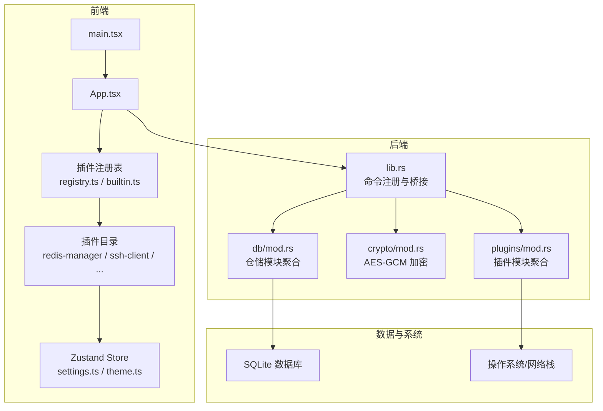
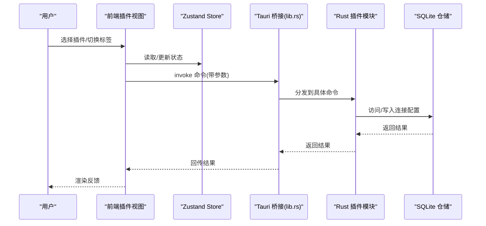
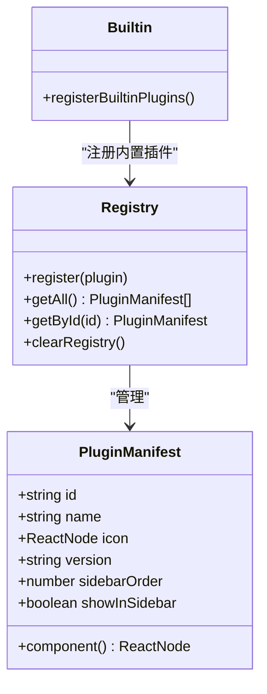
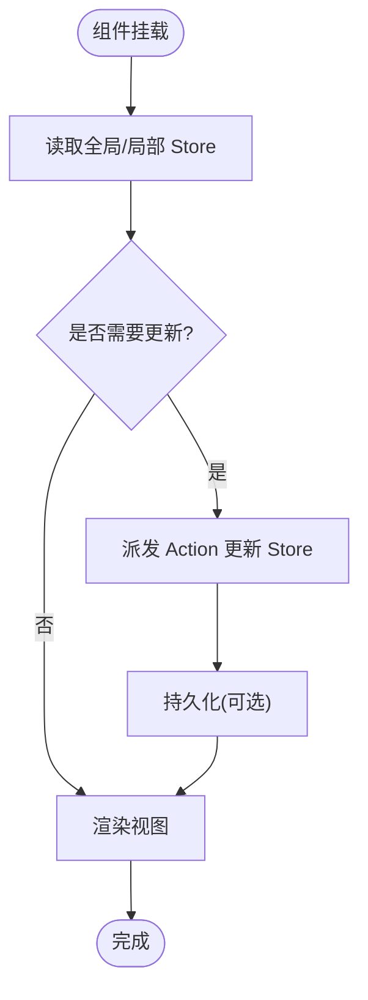
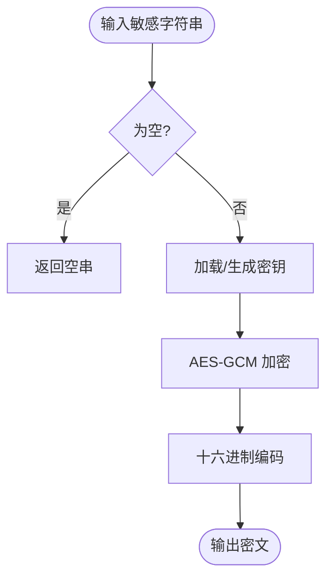
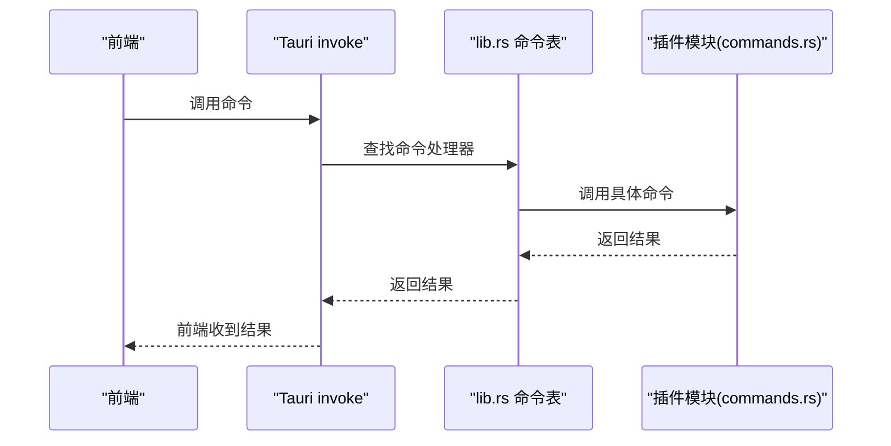
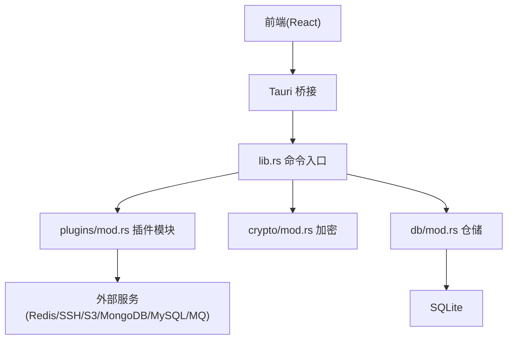

# 架构模式与设计原则

<cite>
**本文引用的文件**
- [README.md](file://README.md)
- [src-tauri/src/lib.rs](file://src-tauri/src/lib.rs)
- [src-tauri/src/main.rs](file://src-tauri/src/main.rs)
- [src-tauri/Cargo.toml](file://src-tauri/Cargo.toml)
- [src-tauri/src/crypto/mod.rs](file://src-tauri/src/crypto/mod.rs)
- [src-tauri/src/db/mod.rs](file://src-tauri/src/db/mod.rs)
- [src-tauri/src/plugins/mod.rs](file://src-tauri/src/plugins/mod.rs)
- [src/app/plugin-registry/registry.ts](file://src/app/plugin-registry/registry.ts)
- [src/app/plugin-registry/types.ts](file://src/app/plugin-registry/types.ts)
- [src/app/plugin-registry/builtin.ts](file://src/app/plugin-registry/builtin.ts)
- [src/app/store/settings.ts](file://src/app/store/settings.ts)
- [src/app/store/theme.ts](file://src/app/store/theme.ts)
- [src/main.tsx](file://src/main.tsx)
- [src/App.tsx](file://src/App.tsx)
- [src/plugins/redis-manager/index.tsx](file://src/plugins/redis-manager/index.tsx)
- [src/plugins/ssh-client/index.tsx](file://src/plugins/ssh-client/index.tsx)
</cite>

## 目录
1. [简介](#简介)
2. [项目结构](#项目结构)
3. [核心组件](#核心组件)
4. [架构总览](#架构总览)
5. [详细组件分析](#详细组件分析)
6. [依赖关系分析](#依赖关系分析)
7. [性能考量](#性能考量)
8. [故障排查指南](#故障排查指南)
9. [结论](#结论)
10. [附录](#附录)

## 简介
本文件系统性阐述 DevNexus 的架构模式与设计原则，聚焦以下主题：
- 插件化架构与命令模式在后端的落地
- 前端状态管理模式（Zustand）与 MVVM 思想的契合
- 仓储模式在本地数据库访问中的应用
- 设计原则在插件开发中的体现（关注点分离、开闭原则、依赖倒置）
- 状态管理（全局与局部）、原子性与一致性保障
- 加密与安全边界设计
- 架构演进与未来规划
- 可扩展性与性能优化策略
- 代码示例与最佳实践指引

## 项目结构
DevNexus 采用“前端插件 + Rust 后端插件 + 本地数据库”的分层架构：
- 前端层：React + Zustand，按插件组织 UI、状态与业务逻辑
- 后端层：Rust + Tauri，暴露命令接口给前端调用
- 数据层：SQLite + 仓储抽象，统一连接配置与敏感数据加密
- 安全层：AES-GCM 对敏感字段进行本地加密

图表来源
- [src-tauri/src/lib.rs:1-250](file://src-tauri/src/lib.rs#L1-L250)
- [src-tauri/src/plugins/mod.rs:1-10](file://src-tauri/src/plugins/mod.rs#L1-L10)
- [src-tauri/src/crypto/mod.rs:1-75](file://src-tauri/src/crypto/mod.rs#L1-L75)
- [src-tauri/src/db/mod.rs:1-8](file://src-tauri/src/db/mod.rs#L1-L8)
- [src/main.tsx:1-38](file://src/main.tsx#L1-L38)
- [src/App.tsx:1-11](file://src/App.tsx#L1-L11)

章节来源
- [README.md:56-93](file://README.md#L56-L93)
- [src-tauri/src/lib.rs:1-250](file://src-tauri/src/lib.rs#L1-L250)
- [src-tauri/src/plugins/mod.rs:1-10](file://src-tauri/src/plugins/mod.rs#L1-L10)
- [src-tauri/src/crypto/mod.rs:1-75](file://src-tauri/src/crypto/mod.rs#L1-L75)
- [src-tauri/src/db/mod.rs:1-8](file://src-tauri/src/db/mod.rs#L1-L8)
- [src/main.tsx:1-38](file://src/main.tsx#L1-L38)
- [src/App.tsx:1-11](file://src/App.tsx#L1-L11)

## 核心组件
- 插件注册表与清单：通过 Manifest 描述插件元数据，集中注册与排序，实现“插件即模块”的隔离与扩展
- 前端状态管理：Zustand Store 将设置与主题状态持久化到本地存储，支持全局与局部状态的清晰划分
- 后端命令桥接：Tauri 在 lib.rs 中集中注册各插件命令，形成统一的命令入口，便于扩展与维护
- 本地加密：AES-GCM 实现敏感字段的本地加密与解密，密钥文件按应用数据目录管理
- 仓储抽象：db/mod.rs 聚合各类连接配置仓储，统一初始化与访问接口

章节来源
- [src/app/plugin-registry/types.ts:1-14](file://src/app/plugin-registry/types.ts#L1-L14)
- [src/app/plugin-registry/registry.ts:1-26](file://src/app/plugin-registry/registry.ts#L1-L26)
- [src/app/plugin-registry/builtin.ts:1-29](file://src/app/plugin-registry/builtin.ts#L1-L29)
- [src/app/store/settings.ts:1-28](file://src/app/store/settings.ts#L1-L28)
- [src/app/store/theme.ts:1-27](file://src/app/store/theme.ts#L1-L27)
- [src-tauri/src/lib.rs:25-246](file://src-tauri/src/lib.rs#L25-L246)
- [src-tauri/src/crypto/mod.rs:1-75](file://src-tauri/src/crypto/mod.rs#L1-L75)
- [src-tauri/src/db/mod.rs:1-8](file://src-tauri/src/db/mod.rs#L1-L8)

## 架构总览
DevNexus 的整体交互链路如下：
- 前端启动时注册内置插件，渲染插件清单与侧边栏
- 用户在插件工作区内进行操作，Store 管理 UI 状态与用户偏好
- 前端通过 Tauri invoke 调用后端命令，命令在 lib.rs 中集中注册
- 后端插件模块处理业务逻辑，必要时访问 SQLite 仓储或调用外部服务
- 敏感数据通过 crypto 模块进行本地加解密

图表来源
- [src-tauri/src/lib.rs:25-246](file://src-tauri/src/lib.rs#L25-L246)
- [src/app/store/settings.ts:1-28](file://src/app/store/settings.ts#L1-L28)
- [src/app/store/theme.ts:1-27](file://src/app/store/theme.ts#L1-L27)

## 详细组件分析

### 插件注册表与命令模式
- 插件注册表：以 Map 存储 PluginManifest，提供注册、查询、排序与清空能力，确保插件生命周期可控
- 命令模式：前端通过 invoke 调用后端命令，命令在 lib.rs 中集中注册，形成“请求-分发-执行”的清晰链路
- 内置插件：builtin.ts 在应用启动时一次性注册所有内置插件，避免重复注册与顺序问题

图表来源
- [src/app/plugin-registry/types.ts:1-14](file://src/app/plugin-registry/types.ts#L1-L14)
- [src/app/plugin-registry/registry.ts:1-26](file://src/app/plugin-registry/registry.ts#L1-L26)
- [src/app/plugin-registry/builtin.ts:1-29](file://src/app/plugin-registry/builtin.ts#L1-L29)

章节来源
- [src/app/plugin-registry/registry.ts:1-26](file://src/app/plugin-registry/registry.ts#L1-L26)
- [src/app/plugin-registry/types.ts:1-14](file://src/app/plugin-registry/types.ts#L1-L14)
- [src/app/plugin-registry/builtin.ts:1-29](file://src/app/plugin-registry/builtin.ts#L1-L29)
- [src-tauri/src/lib.rs:25-246](file://src-tauri/src/lib.rs#L25-L246)

### 前端状态管理与 MVVM 思想
- MVVM 映射：Model 由 Zustand Store 表示；View 为插件组件；ViewModel 由 Store 的 selector 与 action 组成
- 全局状态：settings.ts 与 theme.ts 提供全局偏好与主题；main.tsx 将主题注入全局
- 局部状态：各插件内部 Store 管理工作区与视图状态，如 Redis 与 SSH 插件的工作区 Store

图表来源
- [src/app/store/settings.ts:1-28](file://src/app/store/settings.ts#L1-L28)
- [src/app/store/theme.ts:1-27](file://src/app/store/theme.ts#L1-L27)
- [src/main.tsx:1-38](file://src/main.tsx#L1-L38)

章节来源
- [src/app/store/settings.ts:1-28](file://src/app/store/settings.ts#L1-L28)
- [src/app/store/theme.ts:1-27](file://src/app/store/theme.ts#L1-L27)
- [src/main.tsx:1-38](file://src/main.tsx#L1-L38)
- [src/plugins/redis-manager/index.tsx:1-67](file://src/plugins/redis-manager/index.tsx#L1-L67)
- [src/plugins/ssh-client/index.tsx:1-66](file://src/plugins/ssh-client/index.tsx#L1-L66)

### 仓储模式与数据库访问
- 仓储聚合：db/mod.rs 聚合各类连接配置仓储，统一初始化入口
- 访问路径：后端命令在执行业务逻辑时调用相应仓储，实现“领域服务-仓储-数据源”的分层
- 数据库初始化：lib.rs 在应用启动时调用 db::init::run，确保仓储可用

图表来源
- [src-tauri/src/db/mod.rs:1-8](file://src-tauri/src/db/mod.rs#L1-L8)
- [src-tauri/src/lib.rs:20-21](file://src-tauri/src/lib.rs#L20-L21)

章节来源
- [src-tauri/src/db/mod.rs:1-8](file://src-tauri/src/db/mod.rs#L1-L8)
- [src-tauri/src/lib.rs:20-21](file://src-tauri/src/lib.rs#L20-L21)

### 加密与安全边界
- 加密算法：AES-GCM，密钥长度 256 位，nonce 固定
- 密钥管理：按应用数据目录生成/迁移密钥文件，首次运行自动生成
- 使用边界：仅对敏感字段（如连接凭据）进行加密存储；明文仅在内存中短暂存在
- 安全边界：前端不直接接触原始敏感数据；后端负责加密/解密与仓储访问

图表来源
- [src-tauri/src/crypto/mod.rs:40-55](file://src-tauri/src/crypto/mod.rs#L40-L55)

章节来源
- [src-tauri/src/crypto/mod.rs:1-75](file://src-tauri/src/crypto/mod.rs#L1-L75)
- [README.md:179-185](file://README.md#L179-L185)

### 命令模式在插件系统中的应用
- 命令注册：lib.rs 中集中列出所有插件命令，形成统一的命令表
- 命令分发：前端通过 invoke 调用指定命令，后端根据命令名路由到具体实现
- 可扩展性：新增插件只需在 plugins/mod.rs 暴露模块并在 lib.rs 注册命令即可

图表来源
- [src-tauri/src/lib.rs:25-246](file://src-tauri/src/lib.rs#L25-L246)
- [src-tauri/src/plugins/mod.rs:1-10](file://src-tauri/src/plugins/mod.rs#L1-L10)

章节来源
- [src-tauri/src/lib.rs:25-246](file://src-tauri/src/lib.rs#L25-L246)
- [src-tauri/src/plugins/mod.rs:1-10](file://src-tauri/src/plugins/mod.rs#L1-L10)

### 设计原则在插件开发中的体现
- 关注点分离：前端负责 UI 与状态；后端负责业务与数据；加密与仓储职责单一
- 开闭原则：新增插件无需修改现有命令注册与状态结构，只需遵循 Manifest 与 Store 约定
- 依赖倒置：前端依赖命令接口（invoke），不依赖具体实现；后端依赖仓储接口，不直接耦合具体数据源

章节来源
- [src/app/plugin-registry/types.ts:1-14](file://src/app/plugin-registry/types.ts#L1-L14)
- [src-tauri/src/lib.rs:25-246](file://src-tauri/src/lib.rs#L25-L246)
- [src-tauri/src/db/mod.rs:1-8](file://src-tauri/src/db/mod.rs#L1-L8)

## 依赖关系分析
- 前端依赖：React、Zustand、Ant Design、xterm.js 等
- 后端依赖：Tauri、Tokio、rusqlite、redis、russh、aws-sdk、mongodb、mysql_async、lapin、rdkafka 等
- 关键耦合点：lib.rs 作为命令入口，聚合所有插件命令；db/mod.rs 聚合仓储；crypto/mod.rs 提供加密能力

图表来源
- [src-tauri/src/lib.rs:1-250](file://src-tauri/src/lib.rs#L1-L250)
- [src-tauri/src/plugins/mod.rs:1-10](file://src-tauri/src/plugins/mod.rs#L1-L10)
- [src-tauri/src/crypto/mod.rs:1-75](file://src-tauri/src/crypto/mod.rs#L1-L75)
- [src-tauri/src/db/mod.rs:1-8](file://src-tauri/src/db/mod.rs#L1-L8)
- [src-tauri/Cargo.toml:20-48](file://src-tauri/Cargo.toml#L20-L48)

章节来源
- [src-tauri/Cargo.toml:1-48](file://src-tauri/Cargo.toml#L1-L48)
- [src-tauri/src/lib.rs:1-250](file://src-tauri/src/lib.rs#L1-L250)

## 性能考量
- 分页与虚拟化：大表/大集合场景建议使用分页、前缀过滤或查询条件，避免一次性加载
- 并发与异步：Tokio 提供高性能异步运行时，插件命令与连接池并发处理请求
- 本地优先：SQLite 本地存储减少网络往返；敏感数据加密在内存中进行，降低磁盘 IO
- 前端渲染：Zustand 精简状态更新，结合 React.memo 与 useMemo 减少重渲染

章节来源
- [README.md:192-193](file://README.md#L192-L193)
- [src-tauri/Cargo.toml:32-32](file://src-tauri/Cargo.toml#L32-L32)

## 故障排查指南
- 命令未生效：检查 lib.rs 中命令是否已注册，确认前端 invoke 的命令名一致
- 插件未显示：确认 builtin.ts 是否已调用注册，且 registry.ts 中未被重复注册
- 加密异常：检查密钥文件是否存在且格式正确，确认 data 目录权限
- 数据库初始化失败：确认 db::init::run 在 setup 阶段已执行

章节来源
- [src-tauri/src/lib.rs:20-21](file://src-tauri/src/lib.rs#L20-L21)
- [src-tauri/src/crypto/mod.rs:10-19](file://src-tauri/src/crypto/mod.rs#L10-L19)
- [src/app/plugin-registry/builtin.ts:13-27](file://src/app/plugin-registry/builtin.ts#L13-L27)

## 结论
DevNexus 通过“插件化 + 命令模式 + 仓储 + 加密”的组合，实现了高内聚、低耦合、可扩展的桌面工具箱架构。前端以 MVVM 思想管理状态，后端以命令入口统一调度，数据层以 SQLite 与仓储抽象实现可维护的持久化方案。设计原则贯穿始终，确保在快速迭代中保持系统的稳定性与安全性。

## 附录
- 最佳实践
  - 新增插件：定义 PluginManifest，实现组件与 Store，注册到 builtin.ts，并在 lib.rs 中注册命令
  - 状态设计：全局偏好使用 persist，局部状态尽量收敛在插件内部 Store
  - 安全实践：敏感字段一律加密存储，避免明文落盘；最小权限原则管理密钥文件
  - 性能优化：优先分页与前缀过滤；合理使用并发与缓存；避免不必要的重渲染