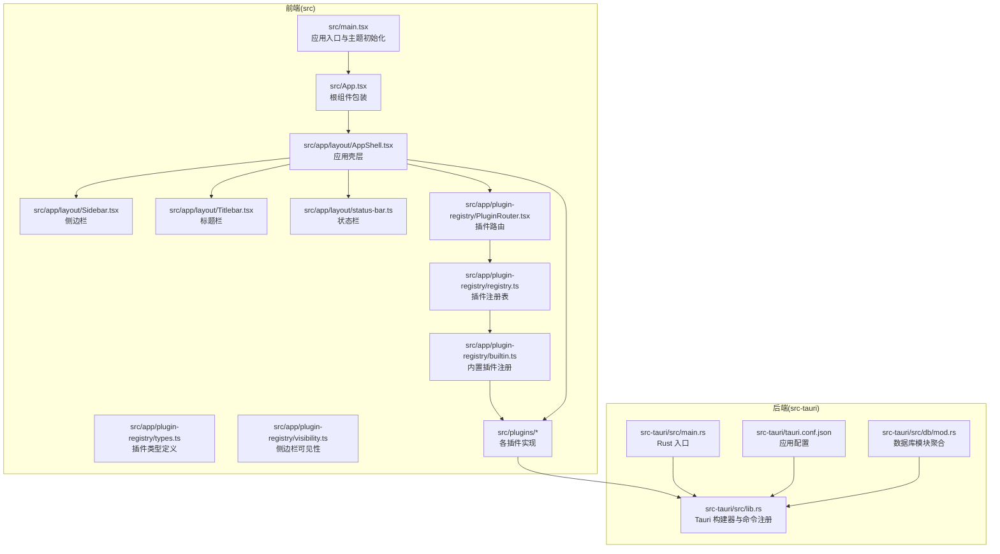
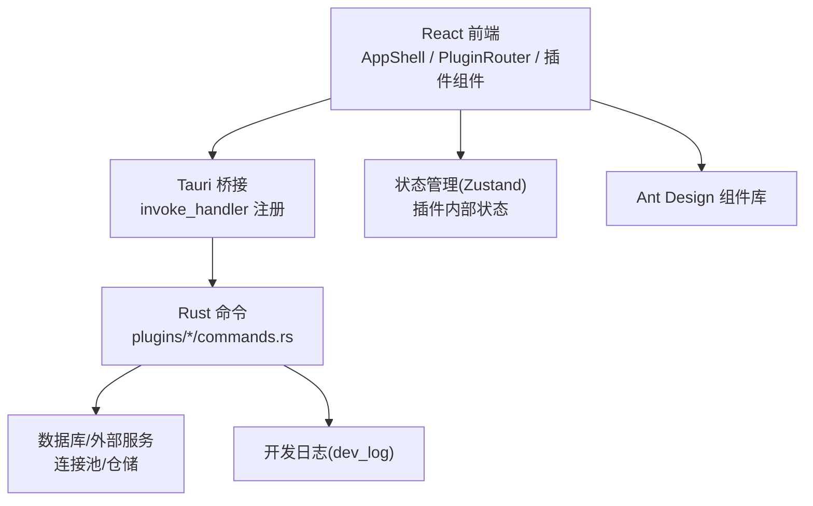
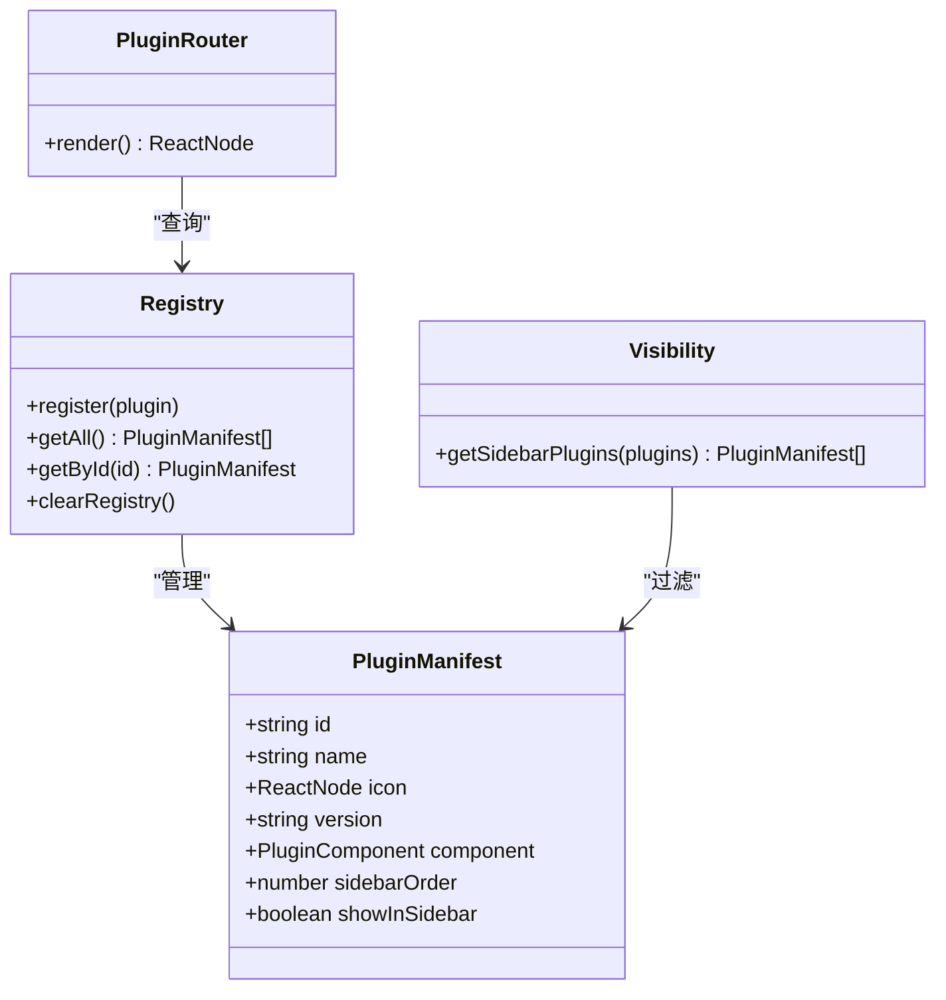
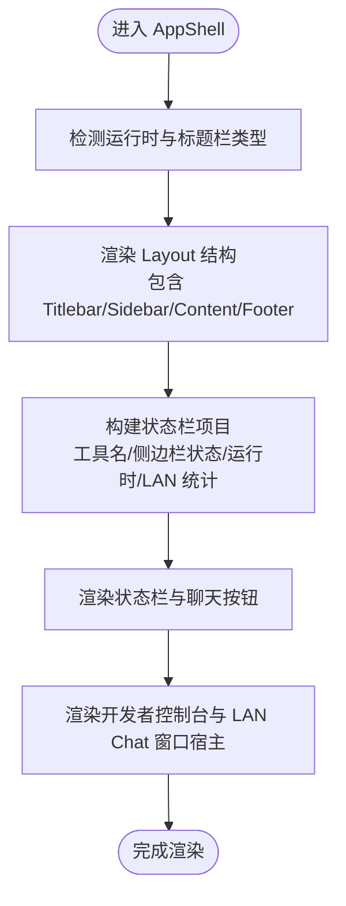
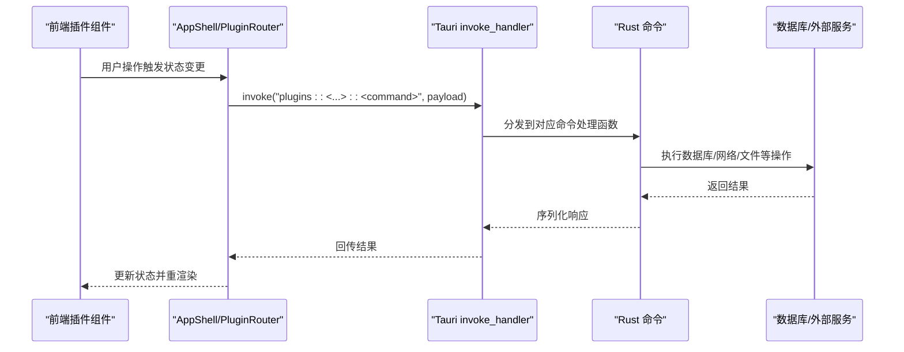
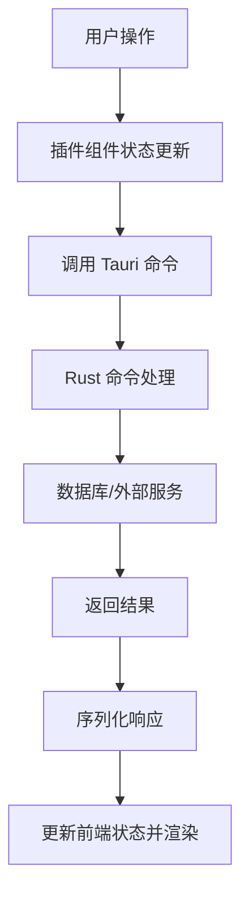
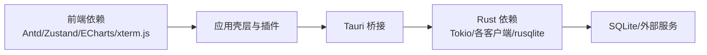

# 架构设计

<cite>
**本文引用的文件**
- [README.md](file://README.md)
- [src\App.tsx](file://src\App.tsx)
- [src\main.tsx](file://src\main.tsx)
- [src-tauri\tauri.conf.json](file://src-tauri\tauri.conf.json)
- [src-tauri\src\main.rs](file://src-tauri\src\main.rs)
- [src-tauri\src\lib.rs](file://src-tauri\src\lib.rs)
- [src-tauri\src\db\mod.rs](file://src-tauri\src\db\mod.rs)
- [src\app\layout\AppShell.tsx](file://src\app\layout\AppShell.tsx)
- [src\app\layout\Sidebar.tsx](file://src\app\layout\Sidebar.tsx)
- [src\app\layout\Titlebar.tsx](file://src\app\layout\Titlebar.tsx)
- [src\app\layout\status-bar.ts](file://src\app\layout\status-bar.ts)
- [src\app\plugin-registry\registry.ts](file://src\app\plugin-registry\registry.ts)
- [src\app\plugin-registry\builtin.ts](file://src\app\plugin-registry\builtin.ts)
- [src\app\plugin-registry\types.ts](file://src\app\plugin-registry\types.ts)
- [src\app\plugin-registry\visibility.ts](file://src\app\plugin-registry\visibility.ts)
- [src\app\plugin-registry\PluginRouter.tsx](file://src\app\plugin-registry\PluginRouter.tsx)
- [src\plugins\api-debugger\index.tsx](file://src\plugins\api-debugger\index.tsx)
- [src\plugins\redis-manager\index.tsx](file://src\plugins\redis-manager\index.tsx)
</cite>

## 目录
1. [简介](#简介)
2. [项目结构](#项目结构)
3. [核心组件](#核心组件)
4. [架构总览](#架构总览)
5. [详细组件分析](#详细组件分析)
6. [依赖关系分析](#依赖关系分析)
7. [性能考虑](#性能考虑)
8. [故障排查指南](#故障排查指南)
9. [结论](#结论)
10. [附录](#附录)

## 简介
本文件为 DevNexus 的架构设计文档，聚焦于插件化架构模式、前后端通信机制、应用壳层（AppShell）设计、插件注册表与路由、数据流路径、关键架构模式（MVVM、命令模式、仓储模式、状态管理）以及技术决策与权衡。DevNexus 采用 Tauri 2 + React 19 + TypeScript + Rust 的组合，以“插件优先”的设计理念将每个工具的前端视图、状态与后端命令进行隔离，形成高内聚、低耦合的模块化体系。

## 项目结构
DevNexus 的工程分为前端与后端两大部分：
- 前端（src/）：应用壳层、布局组件、插件注册表、内置插件、全局样式与状态管理。
- 后端（src-tauri/）：Tauri 应用入口、Rust 插件命令、数据库初始化与仓储、加密与日志等基础设施。

图表来源
- [src\main.tsx:1-38](file://src\main.tsx#L1-L38)
- [src\App.tsx:1-11](file://src\App.tsx#L1-L11)
- [src\app\layout\AppShell.tsx:1-207](file://src\app\layout\AppShell.tsx#L1-L207)
- [src\app\plugin-registry\PluginRouter.tsx:1-29](file://src\app\plugin-registry\PluginRouter.tsx#L1-L29)
- [src\app\plugin-registry\registry.ts:1-26](file://src\app\plugin-registry\registry.ts#L1-L26)
- [src\app\plugin-registry\builtin.ts:1-29](file://src\app\plugin-registry\builtin.ts#L1-L29)
- [src-tauri\tauri.conf.json:1-39](file://src-tauri\tauri.conf.json#L1-L39)
- [src-tauri\src\main.rs:1-7](file://src-tauri\src\main.rs#L1-L7)
- [src-tauri\src\lib.rs:1-250](file://src-tauri\src\lib.rs#L1-L250)
- [src-tauri\src\db\mod.rs:1-8](file://src-tauri\src\db\mod.rs#L1-L8)

章节来源
- [README.md:56-93](file://README.md#L56-L93)
- [src\main.tsx:1-38](file://src\main.tsx#L1-L38)
- [src\App.tsx:1-11](file://src\App.tsx#L1-L11)
- [src-tauri\tauri.conf.json:1-39](file://src-tauri\tauri.conf.json#L1-L39)

## 核心组件
- 应用壳层（AppShell）：负责主界面布局、侧边栏导航、标题栏自定义、状态栏功能、开发者控制台与 LAN Chat 窗口宿主。
- 插件注册表：集中管理插件清单（id、名称、图标、版本、组件、侧边栏排序），提供注册、查询与清理能力。
- 插件路由：根据当前选中的插件 ID 渲染对应插件组件。
- 内置插件注册：在应用启动时一次性注册所有内置插件，保证运行期可用。
- 前端插件：每个插件包含自身视图、状态与业务逻辑，遵循统一的插件清单接口。
- 后端命令注册：通过 Tauri 的 invoke_handler 将 Rust 插件命令暴露给前端调用。

章节来源
- [src\app\layout\AppShell.tsx:31-207](file://src\app\layout\AppShell.tsx#L31-L207)
- [src\app\plugin-registry\registry.ts:1-26](file://src\app\plugin-registry\registry.ts#L1-L26)
- [src\app\plugin-registry\PluginRouter.tsx:1-29](file://src\app\plugin-registry\PluginRouter.tsx#L1-L29)
- [src\app\plugin-registry\builtin.ts:1-29](file://src\app\plugin-registry\builtin.ts#L1-L29)
- [src\app\plugin-registry\types.ts:1-14](file://src\app\plugin-registry\types.ts#L1-L14)
- [src-tauri\src\lib.rs:25-246](file://src-tauri\src\lib.rs#L25-L246)

## 架构总览
DevNexus 采用“前端插件 + 后端命令”的双层架构。前端通过 Tauri 的 invoke 机制调用后端 Rust 命令，后端命令再对接数据库或外部服务完成具体业务。插件注册表与路由确保前端能够动态切换不同插件的工作区。

图表来源
- [src-tauri\src\lib.rs:25-246](file://src-tauri\src\lib.rs#L25-L246)
- [src\app\plugin-registry\PluginRouter.tsx:7-28](file://src\app\plugin-registry\PluginRouter.tsx#L7-L28)
- [src\app\layout\AppShell.tsx:1-207](file://src\app\layout\AppShell.tsx#L1-L207)

## 详细组件分析

### 插件化架构与注册表机制
- 设计理念：每个插件独立封装 UI、状态与后端命令，通过统一的插件清单接口接入应用壳层，实现高内聚与可扩展。
- 注册表：提供注册、查询、排序与清理能力；侧边栏可见性通过过滤函数实现。
- 内置插件：在应用启动阶段一次性注册，避免运行期重复注册开销。
- 路由系统：根据设置中的选中插件 ID 获取对应插件组件并渲染；若无插件则提示未注册。

图表来源
- [src\app\plugin-registry\types.ts:5-13](file://src\app\plugin-registry\types.ts#L5-L13)
- [src\app\plugin-registry\registry.ts:1-26](file://src\app\plugin-registry\registry.ts#L1-L26)
- [src\app\plugin-registry\visibility.ts:1-6](file://src\app\plugin-registry\visibility.ts#L1-L6)
- [src\app\plugin-registry\PluginRouter.tsx:7-28](file://src\app\plugin-registry\PluginRouter.tsx#L7-L28)

章节来源
- [src\app\plugin-registry\registry.ts:1-26](file://src\app\plugin-registry\registry.ts#L1-L26)
- [src\app\plugin-registry\builtin.ts:1-29](file://src\app\plugin-registry\builtin.ts#L1-L29)
- [src\app\plugin-registry\PluginRouter.tsx:1-29](file://src\app\plugin-registry\PluginRouter.tsx#L1-L29)
- [src\app\plugin-registry\types.ts:1-14](file://src\app\plugin-registry\types.ts#L1-L14)
- [src\app\plugin-registry\visibility.ts:1-6](file://src\app\plugin-registry\visibility.ts#L1-L6)

### 应用壳层（AppShell）设计
- 主界面布局：使用 Ant Design Layout 实现内容区域、侧边栏与底部状态栏的组合。
- 标题栏自定义：根据运行时判断是否使用原生标题栏，并在非原生标题栏时提供拖拽调整窗口大小的边缘遮罩。
- 侧边栏导航：集成侧边栏组件，配合插件注册表与路由实现插件切换。
- 状态栏功能：展示当前工具名、侧边栏折叠状态、运行时类型以及 LAN Chat 的设备/房间/传输统计。
- 开发者控制台与 LAN Chat 窗口宿主：在内容区域上方叠加开发者控制台，在底部状态栏提供聊天入口按钮。

图表来源
- [src\app\layout\AppShell.tsx:31-207](file://src\app\layout\AppShell.tsx#L31-L207)
- [src\app\layout\status-bar.ts](file://src\app\layout\status-bar.ts)

章节来源
- [src\app\layout\AppShell.tsx:1-207](file://src\app\layout\AppShell.tsx#L1-L207)

### 前后端通信机制（Tauri API）
- 前端通过 Tauri 的 invoke 机制调用后端命令；命令在 Tauri 构建器中集中注册。
- 后端命令位于各插件的 commands.rs 中，涵盖连接管理、查询执行、文件操作、网络诊断、消息队列、聊天等。
- 配置层面，前端开发服务器与打包后的静态资源由 tauri.conf.json 指定，窗口装饰与最小尺寸等由配置控制。

图表来源
- [src-tauri\src\lib.rs:25-246](file://src-tauri\src\lib.rs#L25-L246)
- [src-tauri\tauri.conf.json:6-11](file://src-tauri\tauri.conf.json#L6-L11)

章节来源
- [src-tauri\src\lib.rs:25-246](file://src-tauri\src\lib.rs#L25-L246)
- [src-tauri\tauri.conf.json:1-39](file://src-tauri\tauri.conf.json#L1-L39)

### 数据流设计（从用户操作到数据库/外部服务）
- 用户在插件工作区内进行操作（如连接、查询、发送请求、文件传输等）。
- 前端插件组件通过状态管理更新内部状态，必要时调用 Tauri 命令。
- 后端命令执行业务逻辑，访问数据库或外部服务（如 Redis、MongoDB、MySQL、S3、MQ、SSH 等）。
- 响应返回前端，更新 UI 并持久化必要的状态。

图表来源
- [src-tauri\src\lib.rs:25-246](file://src-tauri\src\lib.rs#L25-L246)
- [src-tauri\src\db\mod.rs:1-8](file://src-tauri\src\db\mod.rs#L1-L8)

章节来源
- [src-tauri\src\db\mod.rs:1-8](file://src-tauri\src\db\mod.rs#L1-L8)

### 关键架构模式
- MVVM 模式：前端插件组件作为 View，Zustand 状态作为 ViewModel，Rust 命令作为 Model 的一部分，通过 Tauri 协调交互。
- 命令模式：后端以命令形式暴露功能，前端通过统一的 invoke 接口调用，便于扩展与测试。
- 仓储模式：数据库连接与配置通过仓储抽象（connection_repo 等）封装，降低上层复杂度。
- 状态管理模式：插件内部使用 Zustand 管理局部状态，应用壳层通过设置存储管理全局状态（如选中插件、侧边栏折叠）。

章节来源
- [README.md:42-46](file://README.md#L42-L46)
- [src-tauri\src\db\mod.rs:1-8](file://src-tauri\src\db\mod.rs#L1-L8)

## 依赖关系分析
- 前端依赖：Ant Design、Zustand、ECharts、xterm.js 等；通过 Vite 构建，开发时由 Tauri 配置指向本地开发服务器。
- 后端依赖：Tokio、各协议客户端（Redis、MongoDB、MySQL、S3、MQ、SSH）、rusqlite 等；通过 Cargo 管理。
- 插件间解耦：每个插件拥有独立的 store、views 与 types，仅通过插件清单接口与注册表交互。

图表来源
- [README.md:41-54](file://README.md#L41-L54)
- [src-tauri\tauri.conf.json:6-11](file://src-tauri\tauri.conf.json#L6-L11)

章节来源
- [README.md:35-54](file://README.md#L35-L54)
- [src-tauri\tauri.conf.json:1-39](file://src-tauri\tauri.conf.json#L1-L39)

## 性能考虑
- 虚拟化与分页：针对大表、大桶、大集合场景建议使用分页与前缀过滤，避免一次性加载导致卡顿。
- 连接池与并发：后端为 Redis、SSH、S3、MongoDB、MySQL、MQ 等提供连接池，减少连接建立开销。
- 状态管理粒度：插件内部使用 Zustand，避免全局状态风暴；AppShell 仅维护少量全局状态。
- 构建与打包：Vite 与 Tauri 的组合在开发与生产环境下均有良好性能表现，注意避免大 chunk 与未使用依赖。

## 故障排查指南
- 启动失败：检查 tauri.conf.json 中的 devUrl 与前端构建产物路径是否正确；确认 Rust 后端命令注册是否完整。
- 插件未显示：确认已调用内置插件注册函数并在应用启动时执行；检查插件清单的 sidebarOrder 与 showInSidebar。
- 数据库问题：关注数据库初始化与连接仓储的错误日志；对敏感字段使用本地加密。
- LAN Chat 异常：检查网络发现与消息投递流程，确认设备身份与会话未读数更新逻辑。

章节来源
- [src-tauri\tauri.conf.json:6-11](file://src-tauri\tauri.conf.json#L6-L11)
- [src\app\plugin-registry\builtin.ts:1-29](file://src\app\plugin-registry\builtin.ts#L1-L29)
- [src-tauri\src\lib.rs:25-246](file://src-tauri\src\lib.rs#L25-L246)

## 结论
DevNexus 通过插件化架构实现了高度模块化的桌面工具箱，前端与后端职责清晰、边界明确。借助 Tauri 的 invoke 机制与 Rust 的高性能特性，应用在本地优先与跨平台打包方面具备优势。未来可在插件生态完善、导入导出细节与自动更新等方面持续演进。

## 附录
- 开发与打包：参考 README 的开发、验证与打包说明，确保本地与 CI 环境一致。
- 安全与合规：对敏感数据进行本地加密与脱敏处理，避免在仓库中提交凭证与产物。

章节来源
- [README.md:107-150](file://README.md#L107-L150)
- [README.md:179-193](file://README.md#L179-L193)