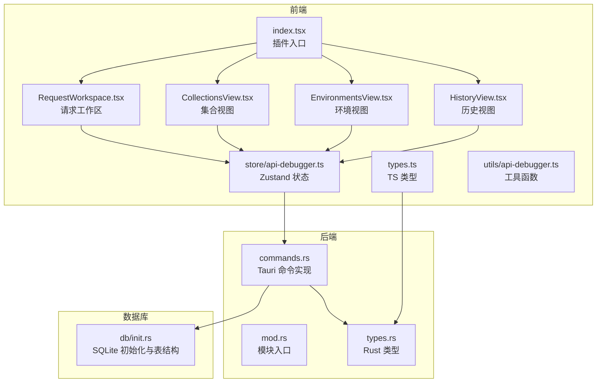
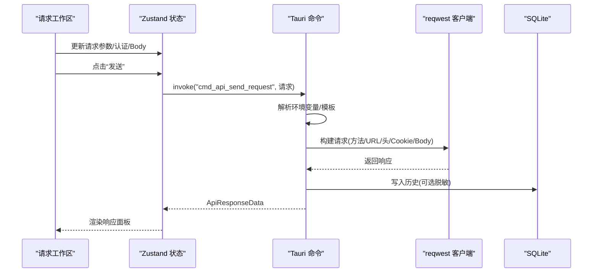
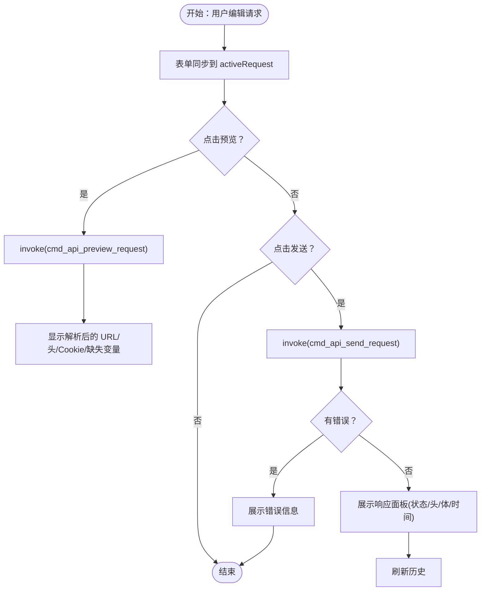
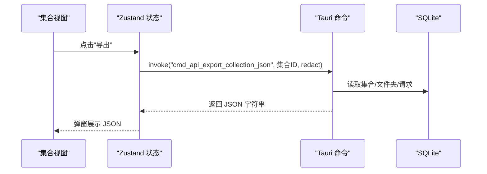
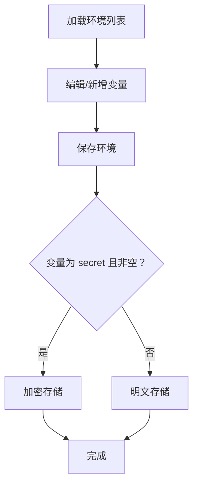
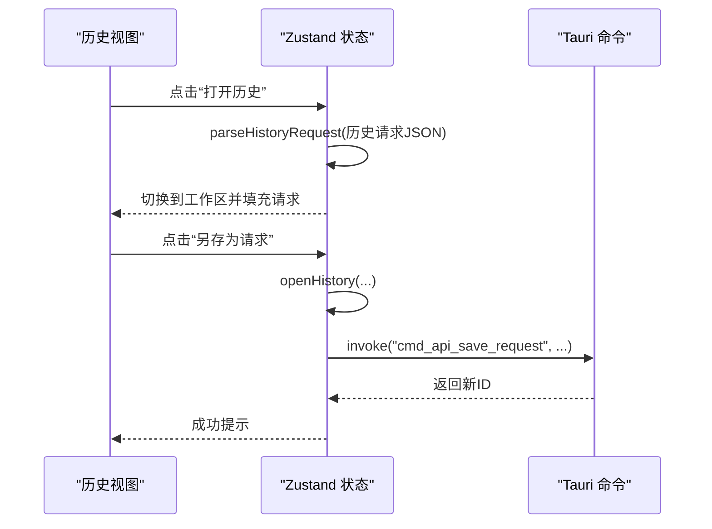
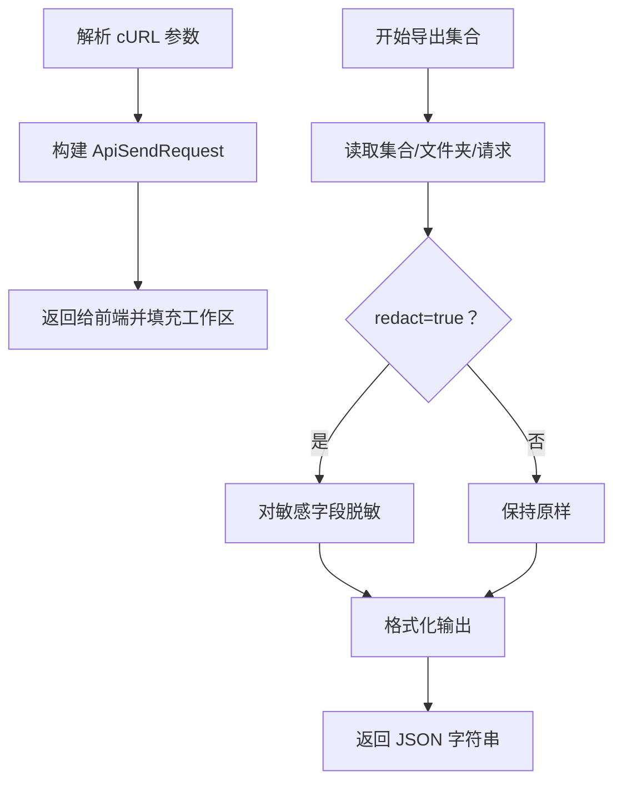
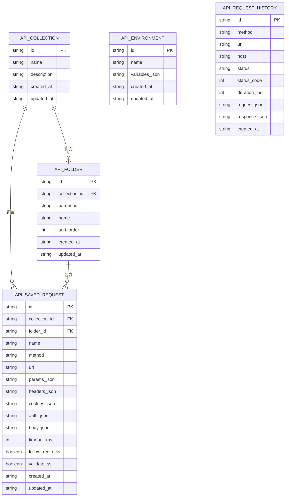
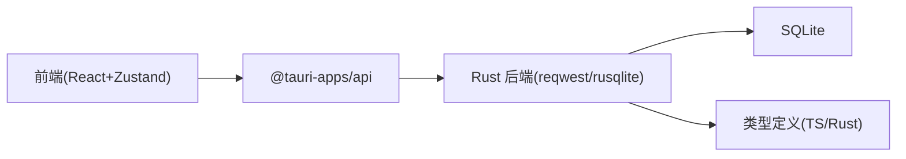

# API 调试器插件

<cite>
**本文档引用的文件**
- [src/plugins/api-debugger/index.tsx](file://src/plugins/api-debugger/index.tsx)
- [src/plugins/api-debugger/store/api-debugger.ts](file://src/plugins/api-debugger/store/api-debugger.ts)
- [src/plugins/api-debugger/types.ts](file://src/plugins/api-debugger/types.ts)
- [src/plugins/api-debugger/utils/api-debugger.ts](file://src/plugins/api-debugger/utils/api-debugger.ts)
- [src/plugins/api-debugger/views/RequestWorkspace.tsx](file://src/plugins/api-debugger/views/RequestWorkspace.tsx)
- [src/plugins/api-debugger/views/CollectionsView.tsx](file://src/plugins/api-debugger/views/CollectionsView.tsx)
- [src/plugins/api-debugger/views/EnvironmentsView.tsx](file://src/plugins/api-debugger/views/EnvironmentsView.tsx)
- [src/plugins/api-debugger/views/HistoryView.tsx](file://src/plugins/api-debugger/views/HistoryView.tsx)
- [src-tauri/src/plugins/api_debugger/mod.rs](file://src-tauri/src/plugins/api_debugger/mod.rs)
- [src-tauri/src/plugins/api_debugger/types.rs](file://src-tauri/src/plugins/api_debugger/types.rs)
- [src-tauri/src/plugins/api_debugger/commands.rs](file://src-tauri/src/plugins/api_debugger/commands.rs)
- [src-tauri/src/db/init.rs](file://src-tauri/src/db/init.rs)
- [README.md](file://README.md)
- [tests/app/api-debugger.test.ts](file://tests/app/api-debugger.test.ts)
</cite>

## 目录
1. [简介](#简介)
2. [项目结构](#项目结构)
3. [核心组件](#核心组件)
4. [架构总览](#架构总览)
5. [详细组件分析](#详细组件分析)
6. [依赖关系分析](#依赖关系分析)
7. [性能考量](#性能考量)
8. [故障排查指南](#故障排查指南)
9. [结论](#结论)
10. [附录](#附录)

## 简介
API 调试器插件是 DevNexus 桌面应用中的一个插件化模块，提供 HTTP 请求构建、集合与环境管理、响应查看、历史记录复跑、cURL 导入与脱敏导出等能力。它采用前端 React + Zustand 状态管理，后端 Rust + Tauri 命令桥接，数据持久化于本地 SQLite，并对敏感字段进行加密存储。

该插件的核心目标是帮助开发者快速构建、发送、验证和复盘 HTTP 请求，支持多种认证方式、请求体类型、环境变量模板解析与历史回放，同时提供安全的导出能力（可选脱敏）。

## 项目结构
API 调试器插件位于 src/plugins/api-debugger 目录，包含前端视图、状态管理、类型定义与工具函数；后端位于 src-tauri/src/plugins/api_debugger，包含命令实现与类型定义；数据库初始化位于 src-tauri/src/db/init.rs。

**图表来源**
- [src/plugins/api-debugger/index.tsx:1-39](file://src/plugins/api-debugger/index.tsx#L1-L39)
- [src/plugins/api-debugger/views/RequestWorkspace.tsx:1-223](file://src/plugins/api-debugger/views/RequestWorkspace.tsx#L1-L223)
- [src/plugins/api-debugger/views/CollectionsView.tsx:1-166](file://src/plugins/api-debugger/views/CollectionsView.tsx#L1-L166)
- [src/plugins/api-debugger/views/EnvironmentsView.tsx:1-64](file://src/plugins/api-debugger/views/EnvironmentsView.tsx#L1-L64)
- [src/plugins/api-debugger/views/HistoryView.tsx:1-37](file://src/plugins/api-debugger/views/HistoryView.tsx#L1-L37)
- [src/plugins/api-debugger/store/api-debugger.ts:1-129](file://src/plugins/api-debugger/store/api-debugger.ts#L1-L129)
- [src/plugins/api-debugger/types.ts:1-105](file://src/plugins/api-debugger/types.ts#L1-L105)
- [src/plugins/api-debugger/utils/api-debugger.ts:1-62](file://src/plugins/api-debugger/utils/api-debugger.ts#L1-L62)
- [src-tauri/src/plugins/api_debugger/mod.rs:1-3](file://src-tauri/src/plugins/api_debugger/mod.rs#L1-L3)
- [src-tauri/src/plugins/api_debugger/types.rs:1-170](file://src-tauri/src/plugins/api_debugger/types.rs#L1-L170)
- [src-tauri/src/plugins/api_debugger/commands.rs:1-791](file://src-tauri/src/plugins/api_debugger/commands.rs#L1-L791)
- [src-tauri/src/db/init.rs:179-236](file://src-tauri/src/db/init.rs#L179-L236)

**章节来源**
- [README.md:23-24](file://README.md#L23-L24)
- [src/plugins/api-debugger/index.tsx:1-39](file://src/plugins/api-debugger/index.tsx#L1-L39)

## 核心组件
- 插件入口与路由：负责渲染工作区、集合、环境、历史四个标签页，并显示当前激活的环境名称。
- 请求工作区：提供请求构建界面（方法、URL、参数、头、Cookie、认证、Body、设置），支持预览、发送、取消、保存、环境选择。
- 集合视图：管理请求集合与文件夹层级，支持新建、删除、导出集合（可选脱敏）、在树形结构中查看与打开请求。
- 环境视图：管理环境变量（键值对，支持敏感标记），支持新建、编辑、删除、启用为活动环境。
- 历史视图：展示请求历史，支持筛选（方法、主机、状态）、刷新、清空、从历史打开请求或另存为新请求。
- 状态管理：统一管理当前请求、响应、预览、集合、文件夹、请求、环境、历史、加载状态与各类 CRUD 操作。
- 后端命令：实现请求发送、预览、集合/环境/请求/历史的增删改查、cURL 导入、集合导出（可选脱敏）、历史保存等。

**章节来源**
- [src/plugins/api-debugger/index.tsx:13-38](file://src/plugins/api-debugger/index.tsx#L13-L38)
- [src/plugins/api-debugger/views/RequestWorkspace.tsx:61-222](file://src/plugins/api-debugger/views/RequestWorkspace.tsx#L61-L222)
- [src/plugins/api-debugger/views/CollectionsView.tsx:59-165](file://src/plugins/api-debugger/views/CollectionsView.tsx#L59-L165)
- [src/plugins/api-debugger/views/EnvironmentsView.tsx:8-63](file://src/plugins/api-debugger/views/EnvironmentsView.tsx#L8-L63)
- [src/plugins/api-debugger/views/HistoryView.tsx:6-36](file://src/plugins/api-debugger/views/HistoryView.tsx#L6-L36)
- [src/plugins/api-debugger/store/api-debugger.ts:47-128](file://src/plugins/api-debugger/store/api-debugger.ts#L47-L128)
- [src-tauri/src/plugins/api_debugger/commands.rs:391-746](file://src-tauri/src/plugins/api_debugger/commands.rs#L391-L746)

## 架构总览
前端通过 invoke 调用后端命令，后端使用 reqwest 发送 HTTP 请求，使用 SQLite 存储集合、请求、环境与历史。环境变量支持模板占位符解析，敏感字段在导出与历史中进行脱敏处理。

**图表来源**
- [src/plugins/api-debugger/views/RequestWorkspace.tsx:104-108](file://src/plugins/api-debugger/views/RequestWorkspace.tsx#L104-L108)
- [src/plugins/api-debugger/store/api-debugger.ts:62-72](file://src/plugins/api-debugger/store/api-debugger.ts#L62-L72)
- [src-tauri/src/plugins/api_debugger/commands.rs:404-475](file://src-tauri/src/plugins/api_debugger/commands.rs#L404-L475)
- [src-tauri/src/db/init.rs:225-236](file://src-tauri/src/db/init.rs#L225-L236)

## 详细组件分析

### 请求工作区（RequestWorkspace）
- 功能要点
  - 参数配置：方法（GET/POST/PUT/PATCH/DELETE/OPTIONS/HEAD）、URL、查询参数、请求头、Cookie。
  - 认证方式：无、Basic、Bearer、API Key（可选择添加到 Header 或 Query）。
  - Body 编辑：raw/json/xml/form/multipart/binary，支持 Content-Type 自定义与二进制文件路径。
  - 设置：超时、跟随重定向、校验 SSL、是否保存历史。
  - 预览：解析环境变量后的最终请求（含缺失变量提示）。
  - 发送/取消：异步发送，支持取消；成功后刷新历史。
  - 保存：保存到指定集合/文件夹，支持选择目标树节点。
  - 环境：选择活动环境，影响模板解析与敏感字段处理。
- 关键交互
  - 表单同步：onValuesChange 将 UI 变更合并到 activeRequest。
  - 预览：调用后端 cmd_api_preview_request，返回解析后的 URL/头/Cookie/Body 预览与缺失变量列表。
  - 发送：调用后端 cmd_api_send_request，返回响应数据并写入历史。
  - 取消：调用 cmd_api_cancel_request（当前实现为空操作，用于占位）。
  - 保存：调用 cmd_api_save_request，完成后刷新集合/请求列表。

**图表来源**
- [src/plugins/api-debugger/views/RequestWorkspace.tsx:89-108](file://src/plugins/api-debugger/views/RequestWorkspace.tsx#L89-L108)
- [src/plugins/api-debugger/store/api-debugger.ts:73-81](file://src/plugins/api-debugger/store/api-debugger.ts#L73-L81)
- [src-tauri/src/plugins/api_debugger/commands.rs:391-401](file://src-tauri/src/plugins/api_debugger/commands.rs#L391-L401)

**章节来源**
- [src/plugins/api-debugger/views/RequestWorkspace.tsx:61-222](file://src/plugins/api-debugger/views/RequestWorkspace.tsx#L61-L222)
- [src/plugins/api-debugger/store/api-debugger.ts:62-81](file://src/plugins/api-debugger/store/api-debugger.ts#L62-L81)
- [src/plugins/api-debugger/utils/api-debugger.ts:14-29](file://src/plugins/api-debugger/utils/api-debugger.ts#L14-L29)

### 集合与文件夹管理（CollectionsView）
- 功能要点
  - 新建集合/文件夹：输入名称并创建，支持在集合根或子文件夹下创建。
  - 删除：集合/文件夹/请求均可删除，删除集合会级联影响其下的文件夹与请求。
  - 导出：将集合及其请求导出为 JSON，支持脱敏选项。
  - 树形展示：集合 -> 文件夹（可嵌套）-> 请求，支持直接请求与文件夹内请求混合展示。
  - 打开请求：点击请求在工作区打开并切换到工作区标签。
- 数据流
  - 列表加载：fetchAll 并行获取集合、文件夹、请求、环境。
  - 保存/删除：调用后端命令，失败时回退到 fetchCollections。
  - 导出：调用 cmd_api_export_collection_json，返回 JSON 字符串并在弹窗中展示。

**图表来源**
- [src/plugins/api-debugger/views/CollectionsView.tsx:110-117](file://src/plugins/api-debugger/views/CollectionsView.tsx#L110-L117)
- [src/plugins/api-debugger/store/api-debugger.ts:127-128](file://src/plugins/api-debugger/store/api-debugger.ts#L127-L128)
- [src-tauri/src/plugins/api_debugger/commands.rs:740-746](file://src-tauri/src/plugins/api_debugger/commands.rs#L740-L746)

**章节来源**
- [src/plugins/api-debugger/views/CollectionsView.tsx:59-165](file://src/plugins/api-debugger/views/CollectionsView.tsx#L59-L165)
- [src/plugins/api-debugger/store/api-debugger.ts:90-117](file://src/plugins/api-debugger/store/api-debugger.ts#L90-L117)

### 环境变量管理（EnvironmentsView）
- 功能要点
  - 新建/编辑环境：输入名称与变量（键/值/启用/敏感标记），支持添加多行变量。
  - 删除：删除环境。
  - 启用为活动环境：选择后在请求工作区生效。
  - 敏感字段：支持 secret 标记，保存时对非空且未脱敏的值进行加密存储。
- 数据流
  - 列表加载：fetchAll 获取所有环境。
  - 保存：调用 cmd_api_save_environment，内部对 secret 变量进行加密。
  - 删除：调用 cmd_api_delete_environment。

**图表来源**
- [src/plugins/api-debugger/views/EnvironmentsView.tsx:21-26](file://src/plugins/api-debugger/views/EnvironmentsView.tsx#L21-L26)
- [src-tauri/src/plugins/api_debugger/commands.rs:642-661](file://src-tauri/src/plugins/api_debugger/commands.rs#L642-L661)

**章节来源**
- [src/plugins/api-debugger/views/EnvironmentsView.tsx:8-63](file://src/plugins/api-debugger/views/EnvironmentsView.tsx#L8-L63)
- [src-tauri/src/plugins/api_debugger/commands.rs:627-661](file://src-tauri/src/plugins/api_debugger/commands.rs#L627-L661)

### 历史记录（HistoryView）
- 功能要点
  - 展示历史：方法、URL、状态、耗时、创建时间。
  - 筛选：按方法、主机包含、状态（成功/错误）筛选，限制数量。
  - 操作：打开历史请求到工作区、另存为新请求、删除单条、清空历史。
- 数据流
  - 列表加载：fetchHistory 支持过滤参数。
  - 打开：parseHistoryRequest 将历史 JSON 转换为可编辑的 ApiSendRequest。
  - 另存：先 openHistory，再调用 saveRequest 保存为新请求。

**图表来源**
- [src/plugins/api-debugger/views/HistoryView.tsx:17-33](file://src/plugins/api-debugger/views/HistoryView.tsx#L17-L33)
- [src/plugins/api-debugger/store/api-debugger.ts:89-89](file://src/plugins/api-debugger/store/api-debugger.ts#L89-L89)
- [src/plugins/api-debugger/utils/api-debugger.ts:58-61](file://src/plugins/api-debugger/utils/api-debugger.ts#L58-L61)

**章节来源**
- [src/plugins/api-debugger/views/HistoryView.tsx:6-36](file://src/plugins/api-debugger/views/HistoryView.tsx#L6-L36)
- [src/plugins/api-debugger/utils/api-debugger.ts:58-61](file://src/plugins/api-debugger/utils/api-debugger.ts#L58-L61)

### cURL 导入与脱敏导出
- cURL 导入
  - 命令：cmd_api_import_curl
  - 支持解析 curl 命令中的方法、头、数据体、URL 等，生成 ApiSendRequest。
  - 若存在数据体且方法为 GET，则自动提升为 POST。
- 脱敏导出
  - 命令：cmd_api_export_collection_json
  - 支持 redact 参数决定是否对敏感字段进行脱敏（如 Authorization、Cookie、Token、Password、Secret、Key 等）。
  - 导出格式包含集合、文件夹、请求列表及元数据。

**图表来源**
- [src-tauri/src/plugins/api_debugger/commands.rs:713-738](file://src-tauri/src/plugins/api_debugger/commands.rs#L713-L738)
- [src-tauri/src/plugins/api_debugger/commands.rs:740-746](file://src-tauri/src/plugins/api_debugger/commands.rs#L740-L746)

**章节来源**
- [src-tauri/src/plugins/api_debugger/commands.rs:713-746](file://src-tauri/src/plugins/api_debugger/commands.rs#L713-L746)

### 数据模型与类型
- 前端 TS 类型与后端 Rust 类型一一对应，确保跨语言一致性。
- 关键模型
  - ApiSendRequest：请求主体，包含方法、URL、参数、头、Cookie、认证、Body、超时、重定向、SSL 校验、环境 ID、是否保存历史。
  - ApiResolvedPreview：预览结果，包含解析后的 URL/头/Cookie/Body 预览与缺失变量列表。
  - ApiResponseData：响应数据，包含状态、耗时、大小、头、Cookie、Body、内容类型、重定向链、错误、计时信息。
  - ApiCollection/ApiFolder/ApiSavedRequest/ApiEnvironment/ApiHistoryItem：集合、文件夹、已保存请求、环境、历史项。
- 工具函数
  - defaultRequest：生成带安全默认值的请求。
  - parseSavedRequest/parseHistoryRequest：从持久化 JSON 恢复请求。
  - prettyBody：美化 JSON 响应体。
  - normalizePairs/emptyKeyValue：键值对编辑辅助。

**图表来源**
- [src/plugins/api-debugger/types.ts:66-104](file://src/plugins/api-debugger/types.ts#L66-L104)
- [src-tauri/src/plugins/api_debugger/types.rs:84-169](file://src-tauri/src/plugins/api_debugger/types.rs#L84-L169)
- [src-tauri/src/db/init.rs:179-236](file://src-tauri/src/db/init.rs#L179-L236)

**章节来源**
- [src/plugins/api-debugger/types.ts:1-105](file://src/plugins/api-debugger/types.ts#L1-L105)
- [src-tauri/src/plugins/api_debugger/types.rs:1-170](file://src-tauri/src/plugins/api_debugger/types.rs#L1-L170)

## 依赖关系分析
- 前端依赖
  - Zustand：集中式状态管理。
  - Ant Design：UI 组件库。
  - @tauri-apps/api：与后端命令通信。
- 后端依赖
  - reqwest：HTTP 客户端。
  - rusqlite：SQLite 访问。
  - uuid/chro/chrono：ID 生成与时间戳。
  - base64：Basic/Bearer 认证编码。
  - serde：序列化/反序列化。
- 数据库
  - 本地 SQLite，表结构包含 api_collections、api_folders、api_requests、api_environments、api_request_history。

**图表来源**
- [src/plugins/api-debugger/store/api-debugger.ts:1-5](file://src/plugins/api-debugger/store/api-debugger.ts#L1-L5)
- [src-tauri/src/plugins/api_debugger/commands.rs:1-14](file://src-tauri/src/plugins/api_debugger/commands.rs#L1-L14)
- [src-tauri/src/db/init.rs:352-354](file://src-tauri/src/db/init.rs#L352-L354)

**章节来源**
- [README.md:35-54](file://README.md#L35-L54)
- [src-tauri/src/plugins/api_debugger/commands.rs:1-14](file://src-tauri/src/plugins/api_debugger/commands.rs#L1-L14)

## 性能考量
- 响应体大小限制：最大 2MB，超过部分截断并在响应体末尾标注。
- 超时与重定向：默认超时 30 秒，可配置；可选择跟随重定向（最多 10 次）。
- SSL 校验：默认开启，可禁用（开发调试场景）。
- 历史记录：默认限制 200 条，可通过过滤参数调整。
- 环境变量解析：模板占位符逐个替换，缺失变量会提示，避免发送无效请求。
- 导出与脱敏：导出时对敏感字段进行掩码处理，减少泄露风险。

**章节来源**
- [src-tauri/src/plugins/api_debugger/commands.rs:16-17](file://src-tauri/src/plugins/api_debugger/commands.rs#L16-L17)
- [src-tauri/src/plugins/api_debugger/commands.rs:410-416](file://src-tauri/src/plugins/api_debugger/commands.rs#L410-L416)
- [src-tauri/src/plugins/api_debugger/commands.rs:671-696](file://src-tauri/src/plugins/api_debugger/commands.rs#L671-L696)
- [src-tauri/src/plugins/api_debugger/commands.rs:47-88](file://src-tauri/src/plugins/api_debugger/commands.rs#L47-L88)

## 故障排查指南
- 发送失败
  - 检查网络连通性与目标 URL 正确性。
  - 查看响应面板中的错误分类（超时/连接失败/重定向过多/解码失败）。
  - 确认 SSL 校验与重定向设置。
- 环境变量缺失
  - 预览面板会列出缺失的模板变量，补充后重试。
  - 确保活动环境已正确启用。
- 敏感信息泄露
  - 使用脱敏导出（redact=true）。
  - 在环境变量中启用 secret 标记，保存时自动加密。
- 历史记录异常
  - 使用“刷新”重新加载；必要时“清空历史”后重试。
  - 检查过滤条件是否过于严格导致无结果。

**章节来源**
- [src-tauri/src/plugins/api_debugger/commands.rs:349-361](file://src-tauri/src/plugins/api_debugger/commands.rs#L349-L361)
- [src-tauri/src/plugins/api_debugger/commands.rs:391-401](file://src-tauri/src/plugins/api_debugger/commands.rs#L391-L401)
- [src-tauri/src/plugins/api_debugger/commands.rs:642-661](file://src-tauri/src/plugins/api_debugger/commands.rs#L642-L661)

## 结论
API 调试器插件提供了完整的 HTTP 请求调试闭环：从请求构建、环境模板解析、认证与 Body 编辑，到响应查看、历史复跑与集合管理，并支持 cURL 导入与脱敏导出。前后端类型一致、状态集中、数据本地化，适合日常开发与运维场景使用。建议在团队内规范环境变量命名与敏感字段标记，配合脱敏导出与历史复跑，提升测试效率与安全性。

## 附录

### 最佳实践
- 使用环境变量统一管理不同环境的主机、令牌与密钥，避免硬编码。
- 对包含敏感信息的变量启用 secret 标记，确保本地加密存储。
- 使用集合与文件夹组织请求，便于团队共享与复用。
- 发送前先“预览”，确认模板变量已解析且无缺失。
- 使用“脱敏导出”分享集合，避免泄露敏感信息。
- 合理设置超时与重定向策略，避免长时间阻塞。

### 性能测试方法
- 使用历史视图筛选“成功/错误”与“耗时”进行对比分析。
- 通过设置不同的超时与重定向策略评估服务端性能与稳定性。
- 对大响应体场景关注截断提示，必要时分页或限流。

### 调试技巧
- 在“响应”面板中切换“Body/Headers/Cookies/Raw/Timing”查看详细信息。
- 使用“取消”按钮中断长时间请求（当前命令占位，可用于后续扩展）。
- 从历史“另存为请求”快速复现问题场景。

**章节来源**
- [src/plugins/api-debugger/views/RequestWorkspace.tsx:25-44](file://src/plugins/api-debugger/views/RequestWorkspace.tsx#L25-L44)
- [src/plugins/api-debugger/views/HistoryView.tsx:27-33](file://src/plugins/api-debugger/views/HistoryView.tsx#L27-L33)
- [src/plugins/api-debugger/store/api-debugger.ts:77-81](file://src/plugins/api-debugger/store/api-debugger.ts#L77-L81)