# LAN 聊天插件

<cite>
**本文档引用的文件**
- [types.ts](file://src/plugins/lan-chat/types.ts)
- [lan-chat.ts](file://src/plugins/lan-chat/store/lan-chat.ts)
- [lan-chat.ts](file://src/plugins/lan-chat/utils/lan-chat.ts)
- [message-preview.ts](file://src/plugins/lan-chat/utils/message-preview.ts)
- [api.ts](file://src/plugins/lan-chat/api.ts)
- [mod.rs](file://src-tauri/src/plugins/lan_chat/mod.rs)
- [discovery.rs](file://src-tauri/src/plugins/lan_chat/discovery.rs)
- [commands.rs](file://src-tauri/src/plugins/lan_chat/commands.rs)
- [types.rs](file://src-tauri/src/plugins/lan_chat/types.rs)
- [init.rs](file://src-tauri/src/db/init.rs)
</cite>

## 目录
1. [简介](#简介)
2. [项目结构](#项目结构)
3. [核心组件](#核心组件)
4. [架构总览](#架构总览)
5. [详细组件分析](#详细组件分析)
6. [依赖关系分析](#依赖关系分析)
7. [性能考虑](#性能考虑)
8. [故障排除指南](#故障排除指南)
9. [结论](#结论)
10. [附录](#附录)

## 简介
LAN 聊天插件是一个基于局域网的即时通讯解决方案，支持设备自动发现、公共聊天室、点对点私聊、文件传输与预览、消息历史与状态同步等功能。系统采用前端 React + Zustand 状态管理与后端 Rust + Tauri 的混合架构，通过 UDP 广播进行设备发现，通过 TCP 进行消息与文件传输，并使用 SQLite 持久化存储设备、房间、消息与传输记录。

## 项目结构
前端位于 src/plugins/lan-chat，包含类型定义、状态管理、工具函数与 API 调用；后端位于 src-tauri/src/plugins/lan_chat，包含命令处理、发现与传输逻辑；数据库初始化位于 src-tauri/src/db/init.rs，负责创建并维护 LAN Chat 相关表。

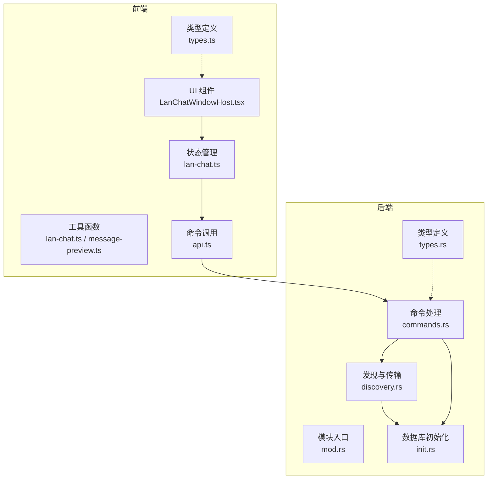

**图表来源**
- [mod.rs:1-8](file://src-tauri/src/plugins/lan_chat/mod.rs#L1-L8)
- [commands.rs:1-1242](file://src-tauri/src/plugins/lan_chat/commands.rs#L1-L1242)
- [discovery.rs:1-831](file://src-tauri/src/plugins/lan_chat/discovery.rs#L1-L831)
- [init.rs:280-351](file://src-tauri/src/db/init.rs#L280-L351)

**章节来源**
- [types.ts:1-74](file://src/plugins/lan-chat/types.ts#L1-L74)
- [lan-chat.ts:1-202](file://src/plugins/lan-chat/store/lan-chat.ts#L1-L202)
- [lan-chat.ts:1-72](file://src/plugins/lan-chat/utils/lan-chat.ts#L1-L72)
- [message-preview.ts:1-104](file://src/plugins/lan-chat/utils/message-preview.ts#L1-L104)
- [api.ts:1-117](file://src/plugins/lan-chat/api.ts#L1-L117)
- [mod.rs:1-8](file://src-tauri/src/plugins/lan_chat/mod.rs#L1-L8)
- [discovery.rs:1-831](file://src-tauri/src/plugins/lan_chat/discovery.rs#L1-L831)
- [commands.rs:1-1242](file://src-tauri/src/plugins/lan_chat/commands.rs#L1-L1242)
- [types.rs:1-159](file://src-tauri/src/plugins/lan_chat/types.rs#L1-L159)
- [init.rs:280-351](file://src-tauri/src/db/init.rs#L280-L351)

## 核心组件
- 类型系统：统一前后端数据模型，涵盖设备、房间、会话、消息与传输等。
- 前端状态与窗口：窗口状态、未读计数、活动会话等。
- 工具函数：设备格式化、尺寸格式化、端点解析、在线状态判断等。
- API 层：封装后端命令调用，提供创建房间、加入房间、发送消息、文件传输等接口。
- 发现与传输：UDP 广播发现、TCP 消息与文件传输、HTTP 文件服务。
- 数据持久化：SQLite 表结构与迁移，设备、房间、消息、传输与共享文件记录。

**章节来源**
- [types.ts:1-74](file://src/plugins/lan-chat/types.ts#L1-L74)
- [lan-chat.ts:73-202](file://src/plugins/lan-chat/store/lan-chat.ts#L73-L202)
- [lan-chat.ts:1-72](file://src/plugins/lan-chat/utils/lan-chat.ts#L1-L72)
- [message-preview.ts:75-104](file://src/plugins/lan-chat/utils/message-preview.ts#L75-L104)
- [api.ts:1-117](file://src/plugins/lan-chat/api.ts#L1-L117)
- [discovery.rs:1-831](file://src-tauri/src/plugins/lan_chat/discovery.rs#L1-L831)
- [commands.rs:1-1242](file://src-tauri/src/plugins/lan_chat/commands.rs#L1-L1242)
- [init.rs:280-351](file://src-tauri/src/db/init.rs#L280-L351)

## 架构总览
系统采用“前端 UI + 前端状态 + 后端命令 + 网络传输 + 数据库”的分层架构。前端通过 Tauri 命令调用后端，后端在独立线程中运行 UDP/TCP 服务，接收与广播消息，保存到 SQLite，并通过 HTTP 提供文件下载。

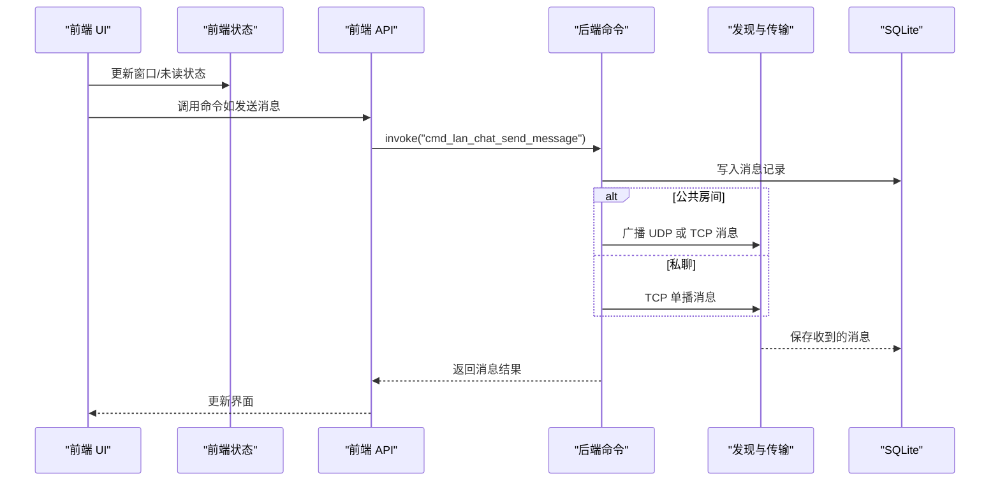

**图表来源**
- [api.ts:68-84](file://src/plugins/lan-chat/api.ts#L68-L84)
- [commands.rs:721-893](file://src-tauri/src/plugins/lan_chat/commands.rs#L721-L893)
- [discovery.rs:288-316](file://src-tauri/src/plugins/lan_chat/discovery.rs#L288-L316)

**章节来源**
- [api.ts:1-117](file://src/plugins/lan-chat/api.ts#L1-L117)
- [commands.rs:721-893](file://src-tauri/src/plugins/lan_chat/commands.rs#L721-L893)
- [discovery.rs:288-316](file://src-tauri/src/plugins/lan_chat/discovery.rs#L288-L316)

## 详细组件分析

### 设备发现与在线状态
- UDP 广播：监听本地端口，周期性广播“存在”消息，接收时解析并更新设备信息。
- TCP 接收：接受来自其他设备的 TCP 消息帧，解析为内部消息结构。
- 在线状态：根据 last_seen 时间与阈值判断是否在线，支持本地设备恒在线。

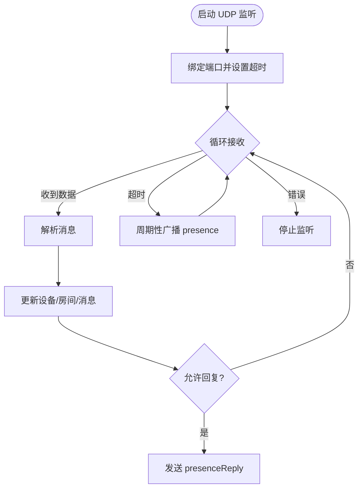

**图表来源**
- [discovery.rs:381-472](file://src-tauri/src/plugins/lan_chat/discovery.rs#L381-L472)
- [discovery.rs:288-316](file://src-tauri/src/plugins/lan_chat/discovery.rs#L288-L316)

**章节来源**
- [discovery.rs:1-831](file://src-tauri/src/plugins/lan_chat/discovery.rs#L1-L831)
- [message-preview.ts:75-104](file://src/plugins/lan-chat/utils/message-preview.ts#L75-L104)

### 房间与公共聊天室
- 公共房间：系统内置公共聊天室 ID 与名称，仅支持该房间，不支持自定义房间。
- 房间广播：当本地设备协调房间时，向局域网广播房间信息。
- 成员管理：维护房间成员在线状态与最后活跃时间。

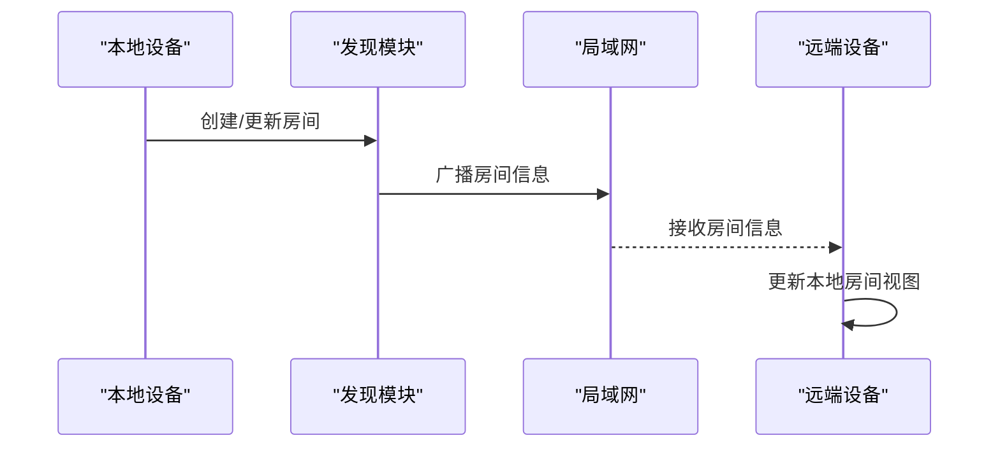

**图表来源**
- [commands.rs:521-583](file://src-tauri/src/plugins/lan_chat/commands.rs#L521-L583)
- [discovery.rs:689-727](file://src-tauri/src/plugins/lan_chat/discovery.rs#L689-L727)

**章节来源**
- [commands.rs:521-583](file://src-tauri/src/plugins/lan_chat/commands.rs#L521-L583)
- [discovery.rs:689-727](file://src-tauri/src/plugins/lan_chat/discovery.rs#L689-L727)

### 点对点私聊
- 直连会话：通过已发现设备的主机与端口建立 TCP 单播连接。
- 端点管理：支持从数据库加载远端设备端点，或手动输入 IP:Port。
- 在线判定：私聊会话在线状态由远端设备是否在线决定。

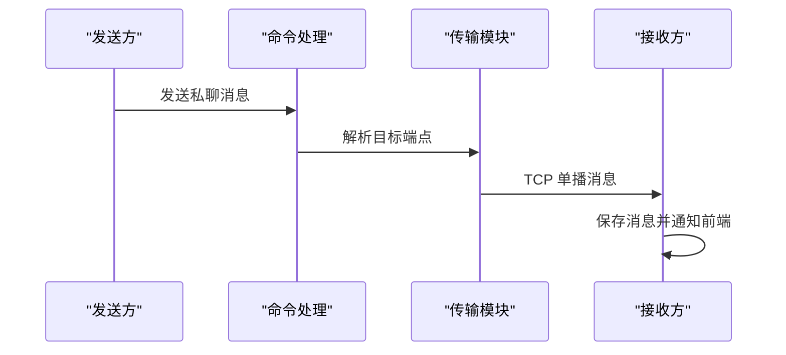

**图表来源**
- [commands.rs:721-893](file://src-tauri/src/plugins/lan_chat/commands.rs#L721-L893)
- [discovery.rs:729-797](file://src-tauri/src/plugins/lan_chat/discovery.rs#L729-L797)

**章节来源**
- [commands.rs:622-678](file://src-tauri/src/plugins/lan_chat/commands.rs#L622-L678)
- [commands.rs:721-893](file://src-tauri/src/plugins/lan_chat/commands.rs#L721-L893)

### 消息路由与转发
- 公共房间：消息长度超过 UDP 安全载荷限制时，自动回退到 TCP 单播转发给所有在线成员。
- 私聊：直接 TCP 单播到目标设备。
- 入站消息：解析后写入消息表，触发前端刷新。

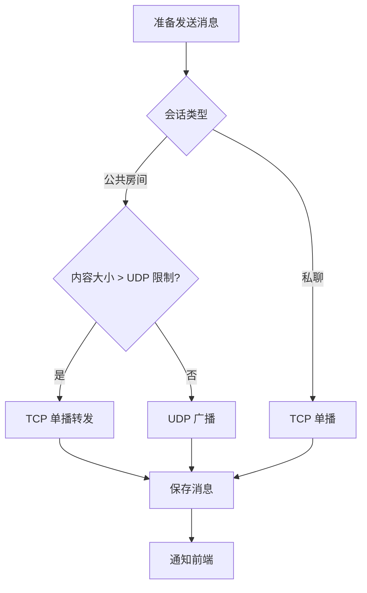

**图表来源**
- [commands.rs:864-890](file://src-tauri/src/plugins/lan_chat/commands.rs#L864-L890)

**章节来源**
- [commands.rs:864-890](file://src-tauri/src/plugins/lan_chat/commands.rs#L864-L890)

### 文件传输机制
- 引用消息：发送文件时生成共享文件记录与令牌，消息内容为固定引用字符串，元数据包含文件 ID、令牌、大小、MIME 等。
- HTTP 下载：本地文件可直接复制，远程文件通过 HTTP GET 从远端文件服务器下载。
- 传输状态：维护传输队列、进度与状态。

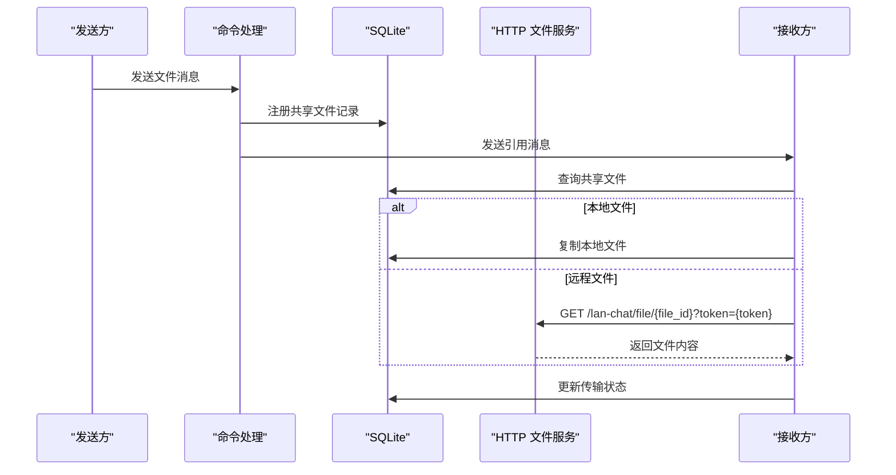

**图表来源**
- [commands.rs:896-957](file://src-tauri/src/plugins/lan_chat/commands.rs#L896-L957)
- [commands.rs:1135-1221](file://src-tauri/src/plugins/lan_chat/commands.rs#L1135-L1221)
- [discovery.rs:518-572](file://src-tauri/src/plugins/lan_chat/discovery.rs#L518-L572)

**章节来源**
- [commands.rs:896-957](file://src-tauri/src/plugins/lan_chat/commands.rs#L896-L957)
- [commands.rs:1135-1221](file://src-tauri/src/plugins/lan_chat/commands.rs#L1135-L1221)
- [discovery.rs:518-572](file://src-tauri/src/plugins/lan_chat/discovery.rs#L518-L572)

### 消息预览与元数据
- 元数据解析：从 JSON 字符串解析文件传输相关字段。
- 类型分类：根据消息类型、内容前缀或 MIME 判断图片/音频/视频/文件。
- 预览源解析：优先 data URI，其次根据 MIME 生成 data URI。
- 发送者名称：本地设备显示“我”，否则显示设备昵称。

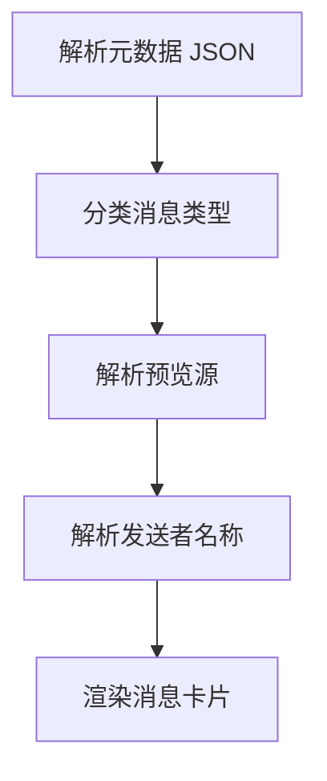

**图表来源**
- [message-preview.ts:11-73](file://src/plugins/lan-chat/utils/message-preview.ts#L11-L73)

**章节来源**
- [message-preview.ts:1-104](file://src/plugins/lan-chat/utils/message-preview.ts#L1-L104)

### 前端状态与窗口管理
- 窗口状态：打开/关闭/最小化/最大化/恢复/调整大小。
- 未读计数：全局与会话级未读统计，可见时清零。
- 活动会话：记录当前选中的会话 ID。

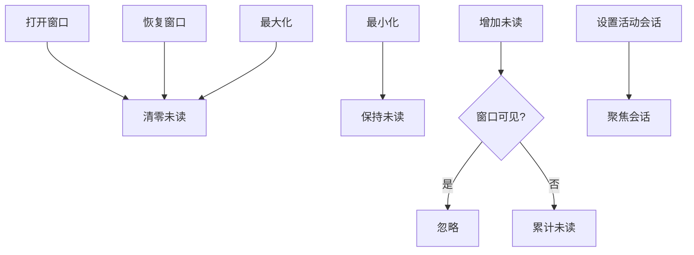

**图表来源**
- [lan-chat.ts:89-202](file://src/plugins/lan-chat/store/lan-chat.ts#L89-L202)

**章节来源**
- [lan-chat.ts:1-202](file://src/plugins/lan-chat/store/lan-chat.ts#L1-L202)

### 数据模型与持久化
- 设备表：存储设备标识、昵称、主机、端口、在线状态与版本。
- 房间表：存储房间 ID、名称、协调者、通道、状态与时间戳。
- 成员表：房间成员角色、在线状态与最后活跃时间。
- 消息表：会话类型、发送者、消息类型、内容与元数据。
- 传输表：文件名、大小、方向、状态与进度。
- 共享文件表：文件 ID、令牌、路径、MIME 与大小。

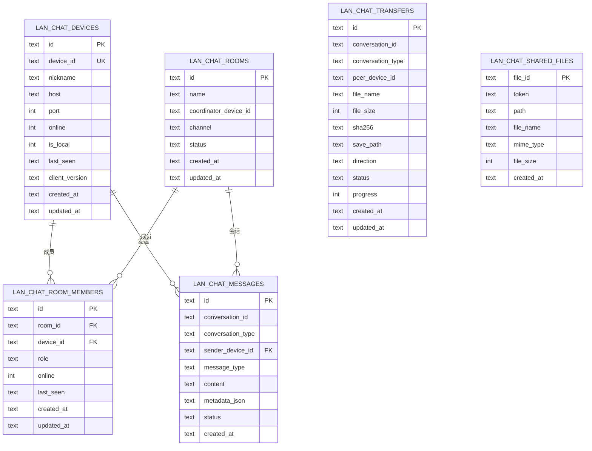

**图表来源**
- [init.rs:280-351](file://src-tauri/src/db/init.rs#L280-L351)

**章节来源**
- [init.rs:280-351](file://src-tauri/src/db/init.rs#L280-L351)

## 依赖关系分析
- 前端依赖：Zustand 持久化状态、Tauri invoke 调用后端命令。
- 后端依赖：Serde 序列化、Rusqlite SQLite 访问、UUID 生成、时间与时钟。
- 网络依赖：标准库 UDP/TCP 套接字、HTTP 请求库用于文件下载。
- 数据库依赖：SQLite 初始化与迁移脚本。

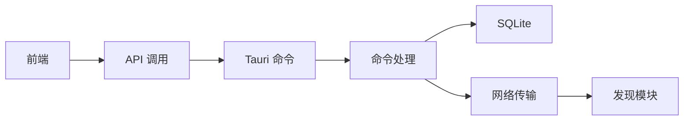

**图表来源**
- [api.ts:1-117](file://src/plugins/lan-chat/api.ts#L1-L117)
- [commands.rs:1-1242](file://src-tauri/src/plugins/lan_chat/commands.rs#L1-L1242)
- [discovery.rs:1-831](file://src-tauri/src/plugins/lan_chat/discovery.rs#L1-L831)
- [init.rs:280-351](file://src-tauri/src/db/init.rs#L280-L351)

**章节来源**
- [api.ts:1-117](file://src/plugins/lan-chat/api.ts#L1-L117)
- [commands.rs:1-1242](file://src-tauri/src/plugins/lan_chat/commands.rs#L1-L1242)
- [discovery.rs:1-831](file://src-tauri/src/plugins/lan_chat/discovery.rs#L1-L831)
- [init.rs:280-351](file://src-tauri/src/db/init.rs#L280-L351)

## 性能考虑
- UDP 广播频率：每约 3 秒广播一次“存在”消息，平衡发现速度与网络负载。
- UDP 安全载荷：公共房间消息超过 48KB 时回退到 TCP，避免 UDP 分片与丢包。
- 去重与合并：对已知设备列表进行去重与合并，减少重复广播。
- 文件下载：本地文件直接复制，远程文件通过 HTTP 流式下载，避免内存峰值。
- 线程模型：发现、TCP 监听与文件服务器分别在独立线程运行，避免阻塞。

[本节为通用性能建议，无需特定文件引用]

## 故障排除指南
- 无法发现设备
  - 检查 UDP 端口是否被占用或防火墙拦截。
  - 确认设备在同一子网内，且未启用网络隔离。
  - 触发快照命令以强制重新广播。
- 私聊消息失败
  - 确认远端设备已发现并具有有效主机与端口。
  - 检查 TCP 端口可达性与防火墙规则。
- 文件下载失败
  - 确认共享文件记录存在且令牌有效。
  - 检查远端文件服务器端口（本地端口 + 1）是否开放。
- 在线状态异常
  - 检查 last_seen 是否更新，确认设备未被清理。
  - 本地设备默认在线，远端设备根据时间阈值判断。

**章节来源**
- [discovery.rs:381-472](file://src-tauri/src/plugins/lan_chat/discovery.rs#L381-L472)
- [commands.rs:896-957](file://src-tauri/src/plugins/lan_chat/commands.rs#L896-L957)
- [message-preview.ts:75-104](file://src/plugins/lan-chat/utils/message-preview.ts#L75-L104)

## 结论
LAN 聊天插件通过简洁的 UDP/TCP 双通道设计实现了高效的局域网通信，结合 SQLite 持久化与前端状态管理，提供了稳定的设备发现、房间与私聊、文件传输与消息预览能力。系统在易用性与性能之间取得平衡，适合中小规模团队的本地协作场景。

[本节为总结性内容，无需特定文件引用]

## 附录

### 部署与配置要点
- 端口规划：聊天端口默认 45881，文件服务器端口为聊天端口 + 1。
- 防火墙：确保 UDP 与 TCP 端口在局域网内放行。
- 设备标识：优先使用稳定的 MAC 地址作为设备 ID，避免频繁变更。
- 下载目录：首次运行自动创建下载目录，用于保存附件。

**章节来源**
- [commands.rs:207-214](file://src-tauri/src/plugins/lan_chat/commands.rs#L207-L214)
- [discovery.rs:482-516](file://src-tauri/src/plugins/lan_chat/discovery.rs#L482-L516)