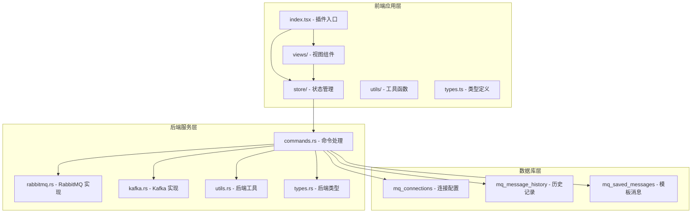
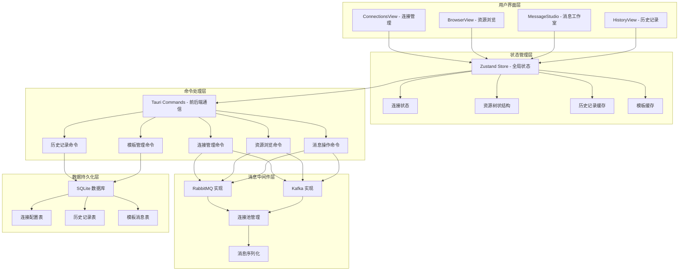
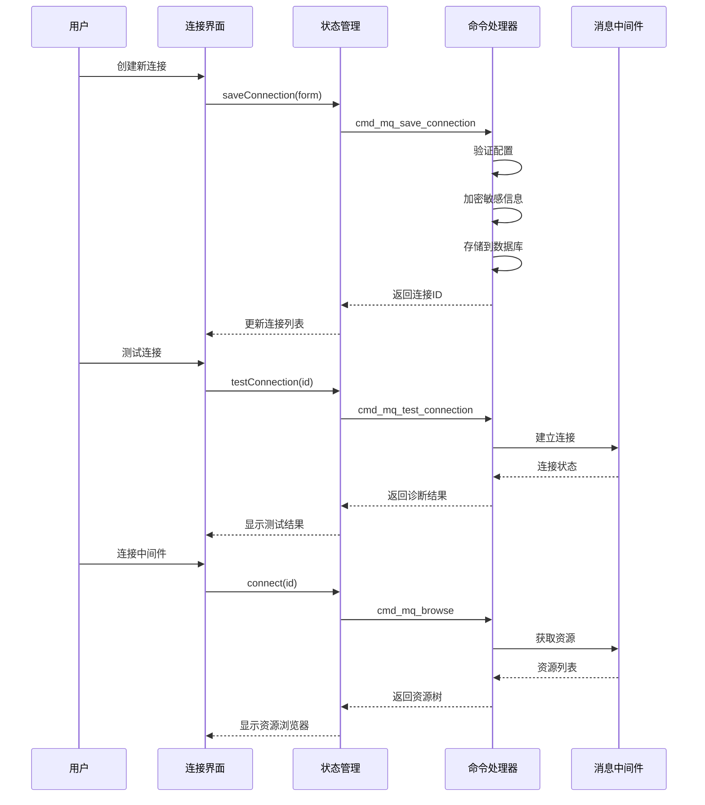
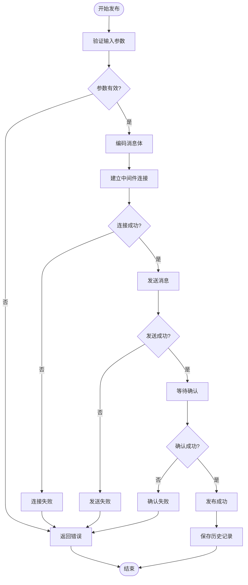
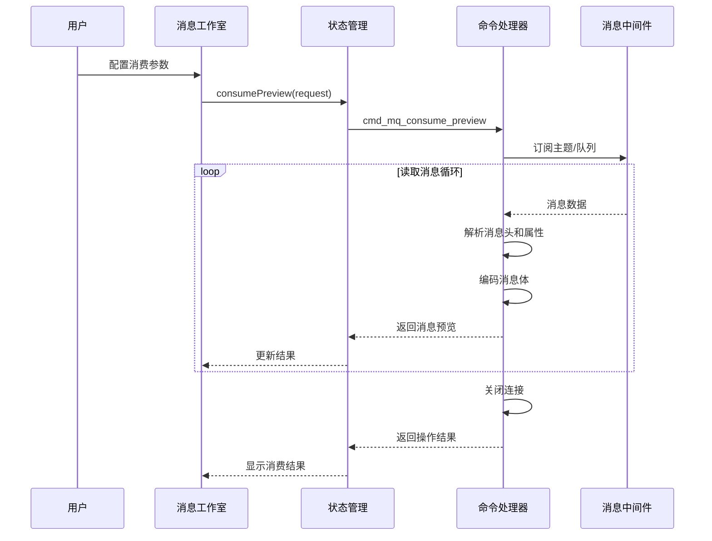
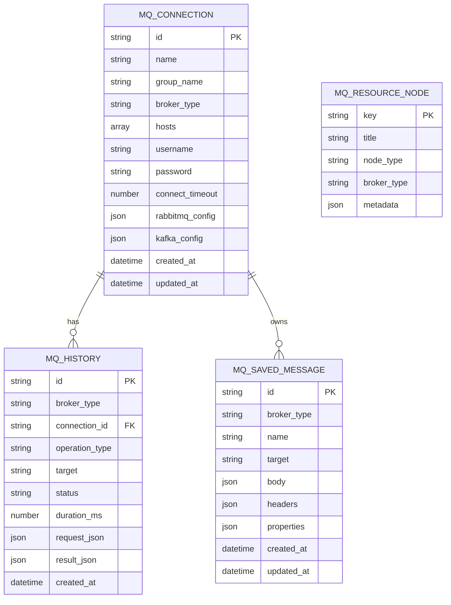
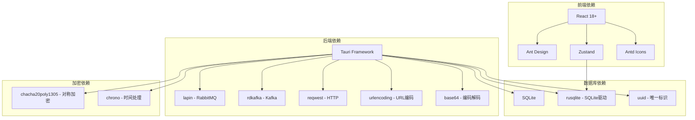

# MQ 客户端插件

<cite>
**本文档引用的文件**
- [index.tsx](file://src/plugins/mq-client/index.tsx)
- [types.ts](file://src/plugins/mq-client/types.ts)
- [mq-client.ts](file://src/plugins/mq-client/store/mq-client.ts)
- [mq.ts](file://src/plugins/mq-client/utils/mq.ts)
- [BrowserView.tsx](file://src/plugins/mq-client/views/BrowserView.tsx)
- [ConnectionsView.tsx](file://src/plugins/mq-client/views/ConnectionsView.tsx)
- [HistoryView.tsx](file://src/plugins/mq-client/views/HistoryView.tsx)
- [MessageStudio.tsx](file://src/plugins/mq-client/views/MessageStudio.tsx)
- [mod.rs](file://src-tauri/src/plugins/mq/mod.rs)
- [types.rs](file://src-tauri/src/plugins/mq/types.rs)
- [commands.rs](file://src-tauri/src/plugins/mq/commands.rs)
- [rabbitmq.rs](file://src-tauri/src/plugins/mq/rabbitmq.rs)
- [kafka.rs](file://src-tauri/src/plugins/mq/kafka.rs)
- [utils.rs](file://src-tauri/src/plugins/mq/utils.rs)
</cite>

## 目录
1. [简介](#简介)
2. [项目结构](#项目结构)
3. [核心组件](#核心组件)
4. [架构概览](#架构概览)
5. [详细组件分析](#详细组件分析)
6. [依赖关系分析](#依赖关系分析)
7. [性能考虑](#性能考虑)
8. [故障排除指南](#故障排除指南)
9. [结论](#结论)

## 简介

MQ 客户端插件是一个功能完整的消息队列管理工具，支持 RabbitMQ 和 Kafka 两种主流消息中间件。该插件提供了完整的连接管理、资源浏览、消息发送和消费、消息模板管理、历史记录查看等核心功能。

插件采用前后端分离的架构设计，前端使用 React + Ant Design 构建用户界面，后端基于 Tauri 框架，通过 Rust 实现高性能的消息中间件通信。支持安全的凭据存储、消息序列化、消费者组管理、消息确认机制等高级特性。

## 项目结构

MQ 客户端插件采用模块化的项目结构，主要分为前端应用层和后端服务层：

**图表来源**
- [index.tsx:1-38](file://src/plugins/mq-client/index.tsx#L1-L38)
- [commands.rs:1-276](file://src-tauri/src/plugins/mq/commands.rs#L1-L276)

**章节来源**
- [index.tsx:1-38](file://src/plugins/mq-client/index.tsx#L1-L38)
- [types.ts:1-90](file://src/plugins/mq-client/types.ts#L1-L90)

## 核心组件

### 连接管理组件

连接管理是 MQ 客户端插件的核心功能之一，负责管理与消息中间件的连接配置和状态。

**连接配置数据结构：**
- RabbitMQ 配置：AMQP URL、虚拟主机、管理端口、用户名密码
- Kafka 配置：引导服务器、客户端ID、安全协议、SASL认证信息

**连接生命周期管理：**
- 连接测试：验证网络连通性和认证信息
- 连接建立：建立持久化的消息中间件连接
- 连接维护：自动重连和状态监控
- 连接销毁：优雅关闭连接释放资源

**章节来源**
- [ConnectionsView.tsx:1-92](file://src/plugins/mq-client/views/ConnectionsView.tsx#L1-L92)
- [types.ts:22-39](file://src/plugins/mq-client/types.ts#L22-L39)

### 资源浏览组件

资源浏览功能允许用户直观地查看消息中间件中的资源结构。

**RabbitMQ 资源浏览：**
- 队列列表：显示所有可用队列及其状态
- 交换机列表：展示交换机类型和绑定关系
- 绑定关系：可视化队列与交换机的绑定结构

**Kafka 资源浏览：**
- 主题列表：显示所有主题及其分区信息
- 分区详情：展示每个分区的领导者和副本状态
- 消费者组：查看活跃的消费者组和成员状态

**章节来源**
- [BrowserView.tsx:1-23](file://src/plugins/mq-client/views/BrowserView.tsx#L1-L23)
- [rabbitmq.rs:123-134](file://src-tauri/src/plugins/mq/rabbitmq.rs#L123-L134)
- [kafka.rs:74-146](file://src-tauri/src/plugins/mq/kafka.rs#L74-L146)

### 消息工作室组件

消息工作室提供了一个集成的开发环境，支持消息的生产和预览消费。

**发布功能（RabbitMQ）：**
- 交换机选择：支持默认交换机和自定义交换机
- 路由键设置：指定消息路由规则
- 属性配置：设置消息属性如持久化级别

**发布功能（Kafka）：**
- 主题选择：指定目标主题名称
- 键值设置：支持消息键用于分区控制
- 分区选择：手动指定目标分区

**预览消费功能：**
- 消费限制：控制预览消息数量
- 超时设置：配置消费等待超时时间
- 确认模式：选择消息确认或重新入队策略

**章节来源**
- [MessageStudio.tsx:1-99](file://src/plugins/mq-client/views/MessageStudio.tsx#L1-L99)
- [rabbitmq.rs:136-165](file://src-tauri/src/plugins/mq/rabbitmq.rs#L136-L165)
- [kafka.rs:148-176](file://src-tauri/src/plugins/mq/kafka.rs#L148-L176)

### 历史记录组件

历史记录功能跟踪所有消息操作的执行情况，便于审计和问题排查。

**历史记录内容：**
- 操作类型：发布、预览消费等
- 执行状态：成功、失败
- 执行耗时：毫秒级性能指标
- 请求参数：序列化后的请求详情
- 结果数据：操作结果摘要

**历史记录管理：**
- 条件过滤：按中间件类型、连接ID、状态等筛选
- 数据清理：支持删除单条记录或清空全部历史
- 重放功能：支持对发布操作进行重放

**章节来源**
- [HistoryView.tsx:1-38](file://src/plugins/mq-client/views/HistoryView.tsx#L1-L38)
- [commands.rs:213-241](file://src-tauri/src/plugins/mq/commands.rs#L213-L241)

### 模板管理组件

模板管理功能允许用户保存常用的消息配置，提高工作效率。

**模板特性：**
- 消息体模板：保存常用的消息内容
- 头部模板：预设消息头部字段
- 属性模板：配置消息属性
- 跨中间件支持：模板在 RabbitMQ 和 Kafka 间可切换使用

**模板操作：**
- 模板保存：从当前消息配置创建模板
- 模板应用：快速填充消息表单
- 模板管理：查看、编辑、删除模板

**章节来源**
- [MessageStudio.tsx:58-68](file://src/plugins/mq-client/views/MessageStudio.tsx#L58-L68)
- [commands.rs:250-275](file://src-tauri/src/plugins/mq/commands.rs#L250-L275)

## 架构概览

MQ 客户端插件采用分层架构设计，确保了良好的可维护性和扩展性：

**图表来源**
- [index.tsx:13-35](file://src/plugins/mq-client/index.tsx#L13-L35)
- [mq-client.ts:52-102](file://src/plugins/mq-client/store/mq-client.ts#L52-L102)
- [commands.rs:68-276](file://src-tauri/src/plugins/mq/commands.rs#L68-L276)

## 详细组件分析

### 连接管理流程

连接管理是整个插件的基础，涉及多个复杂的状态转换和错误处理：

**图表来源**
- [ConnectionsView.tsx:29-34](file://src/plugins/mq-client/views/ConnectionsView.tsx#L29-L34)
- [mq-client.ts:63-82](file://src/plugins/mq-client/store/mq-client.ts#L63-L82)
- [commands.rs:91-170](file://src-tauri/src/plugins/mq/commands.rs#L91-L170)

**章节来源**
- [ConnectionsView.tsx:1-92](file://src/plugins/mq-client/views/ConnectionsView.tsx#L1-L92)
- [mq-client.ts:63-82](file://src/plugins/mq-client/store/mq-client.ts#L63-L82)

### 消息发布流程

消息发布功能需要处理不同类型消息中间件的特定要求：

**图表来源**
- [MessageStudio.tsx:33-49](file://src/plugins/mq-client/views/MessageStudio.tsx#L33-L49)
- [rabbitmq.rs:136-165](file://src-tauri/src/plugins/mq/rabbitmq.rs#L136-L165)
- [kafka.rs:148-176](file://src-tauri/src/plugins/mq/kafka.rs#L148-L176)

**章节来源**
- [MessageStudio.tsx:1-99](file://src/plugins/mq-client/views/MessageStudio.tsx#L1-L99)
- [rabbitmq.rs:136-165](file://src-tauri/src/plugins/mq/rabbitmq.rs#L136-L165)
- [kafka.rs:148-176](file://src-tauri/src/plugins/mq/kafka.rs#L148-L176)

### 消息消费流程

消息预览消费功能提供了安全的消费体验，避免影响实际业务：

**图表来源**
- [MessageStudio.tsx:51-56](file://src/plugins/mq-client/views/MessageStudio.tsx#L51-L56)
- [mq-client.ts:90-95](file://src/plugins/mq-client/store/mq-client.ts#L90-L95)
- [kafka.rs:178-242](file://src-tauri/src/plugins/mq/kafka.rs#L178-L242)

**章节来源**
- [MessageStudio.tsx:1-99](file://src/plugins/mq-client/views/MessageStudio.tsx#L1-L99)
- [kafka.rs:178-242](file://src-tauri/src/plugins/mq/kafka.rs#L178-L242)

### 数据模型设计

插件使用统一的数据模型来表示不同消息中间件的配置和操作：

**图表来源**
- [types.rs:3-15](file://src-tauri/src/plugins/mq/types.rs#L3-L15)
- [types.rs:164-175](file://src-tauri/src/plugins/mq/types.rs#L164-L175)
- [types.rs:190-200](file://src-tauri/src/plugins/mq/types.rs#L190-L200)

**章节来源**
- [types.rs:1-213](file://src-tauri/src/plugins/mq/types.rs#L1-L213)

## 依赖关系分析

MQ 客户端插件的依赖关系体现了清晰的分层架构：

**图表来源**
- [Cargo.toml](file://src-tauri/Cargo.toml)
- [package.json](file://package.json)

**章节来源**
- [Cargo.toml](file://src-tauri/Cargo.toml)
- [package.json](file://package.json)

## 性能考虑

### 连接池管理

插件实现了高效的连接池管理策略：

- **RabbitMQ 连接**：每个操作建立独立连接，操作完成后立即关闭，避免连接泄漏
- **Kafka 连接**：使用客户端配置优化，禁用自动提交以确保预览消费的安全性
- **连接超时**：默认10秒超时，可根据网络状况调整

### 内存管理

- **消息缓冲**：预览消费限制最多100条消息，防止内存溢出
- **字符串处理**：使用UTF-8和Base64编码，自动选择最优编码方式
- **资源清理**：及时关闭数据库连接和网络连接

### 并发处理

- **异步操作**：所有网络操作采用异步非阻塞模式
- **超时控制**：消费操作支持毫秒级超时配置
- **错误隔离**：单个操作失败不影响其他操作

## 故障排除指南

### 常见连接问题

**RabbitMQ 连接失败：**
1. 检查 AMQP URL 格式是否正确
2. 验证虚拟主机配置
3. 确认管理端口可达性
4. 检查用户名密码认证

**Kafka 连接失败：**
1. 验证引导服务器地址
2. 检查安全协议配置
3. 确认 SASL 认证信息
4. 验证网络防火墙设置

### 消息发送问题

**发布失败排查：**
1. 检查目标交换机/主题是否存在
2. 验证路由键/分区配置
3. 确认消息体编码格式
4. 查看历史记录获取详细错误信息

**消费预览问题：**
1. 检查队列/主题名称
2. 验证偏移量模式设置
3. 确认分区选择
4. 调整超时参数

### 性能优化建议

**高并发场景：**
- 增加连接超时时间
- 减少预览消息数量
- 使用模板减少重复配置
- 合理设置批处理大小

**网络优化：**
- 使用内网地址连接
- 配置适当的超时参数
- 启用连接复用
- 监控网络延迟

**章节来源**
- [rabbitmq.rs:66-104](file://src-tauri/src/plugins/mq/rabbitmq.rs#L66-L104)
- [kafka.rs:44-72](file://src-tauri/src/plugins/mq/kafka.rs#L44-L72)
- [utils.rs:39-55](file://src-tauri/src/plugins/mq/utils.rs#L39-L55)

## 结论

MQ 客户端插件提供了一个功能完整、性能优异的消息队列管理解决方案。通过精心设计的架构和丰富的功能特性，该插件能够满足开发者在消息中间件开发、测试和运维过程中的各种需求。

**主要优势：**
- 支持主流消息中间件（RabbitMQ、Kafka）
- 提供直观的图形化界面
- 完善的安全机制和凭据管理
- 详细的日志和历史记录
- 高性能的异步处理能力

**适用场景：**
- 消息中间件开发和测试
- 生产环境监控和调试
- 团队协作和知识共享
- 自动化脚本和批量操作

该插件将继续演进，支持更多消息中间件和高级功能，为用户提供更好的消息队列管理体验。