# MongoDB 客户端插件

<cite>
**本文档引用的文件**
- [index.tsx](file://src/plugins/mongodb-client/index.tsx)
- [types.ts](file://src/plugins/mongodb-client/types.ts)
- [mongodb-connections.ts](file://src/plugins/mongodb-client/store/mongodb-connections.ts)
- [MongoConnectionForm.tsx](file://src/plugins/mongodb-client/components/MongoConnectionForm.tsx)
- [DatabaseBrowser.tsx](file://src/plugins/mongodb-client/views/DatabaseBrowser.tsx)
- [DocumentBrowser.tsx](file://src/plugins/mongodb-client/views/DocumentBrowser.tsx)
- [QueryWorkspace.tsx](file://src/plugins/mongodb-client/views/QueryWorkspace.tsx)
- [IndexManager.tsx](file://src/plugins/mongodb-client/views/IndexManager.tsx)
- [ImportExport.tsx](file://src/plugins/mongodb-client/views/ImportExport.tsx)
- [ServerStatus.tsx](file://src/plugins/mongodb-client/views/ServerStatus.tsx)
- [mod.rs](file://src-tauri/src/plugins/mongodb/mod.rs)
- [commands.rs](file://src-tauri/src/plugins/mongodb/commands.rs)
- [client_pool.rs](file://src-tauri/src/plugins/mongodb/client_pool.rs)
- [types.rs](file://src-tauri/src/plugins/mongodb/types.rs)
- [mongodb_connection_repo.rs](file://src-tauri/src/db/mongodb_connection_repo.rs)
- [init.rs](file://src-tauri/src/db/init.rs)
- [crypto/mod.rs](file://src-tauri/src/crypto/mod.rs)
</cite>

## 目录
1. [简介](#简介)
2. [项目结构](#项目结构)
3. [核心组件](#核心组件)
4. [架构概览](#架构概览)
5. [详细组件分析](#详细组件分析)
6. [依赖关系分析](#依赖关系分析)
7. [性能考虑](#性能考虑)
8. [故障排除指南](#故障排除指南)
9. [结论](#结论)

## 简介

MongoDB 客户端插件是一个功能完整的数据库管理工具，提供了现代化的用户界面来管理 MongoDB 连接、浏览数据库和集合、执行 CRUD 操作、构建和运行查询、管理索引以及监控服务器状态。

该插件采用前端 React + 后端 Rust 的架构设计，通过 Tauri 框架实现桌面应用程序开发。前端负责用户界面交互和状态管理，后端提供安全的数据库连接池管理和数据持久化功能。

## 项目结构

MongoDB 客户端插件遵循模块化的项目组织方式，主要分为前端插件层和后端服务层：

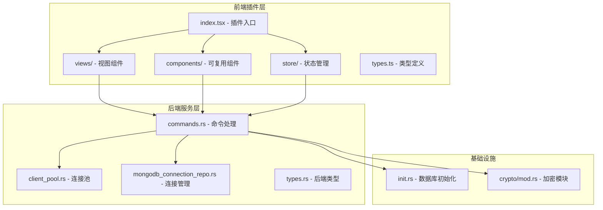

**图表来源**
- [index.tsx:1-87](file://src/plugins/mongodb-client/index.tsx#L1-L87)
- [commands.rs:1-788](file://src-tauri/src/plugins/mongodb/commands.rs#L1-L788)
- [client_pool.rs:1-132](file://src-tauri/src/plugins/mongodb/client_pool.rs#L1-L132)

**章节来源**
- [index.tsx:1-87](file://src/plugins/mongodb-client/index.tsx#L1-L87)
- [types.ts:1-95](file://src/plugins/mongodb-client/types.ts#L1-L95)

## 核心组件

### 插件入口和路由系统

插件入口文件定义了完整的功能路由系统，支持七个主要工作区：连接管理、数据库浏览、文档管理、查询工作区、索引管理、导入导出和服务器状态监控。

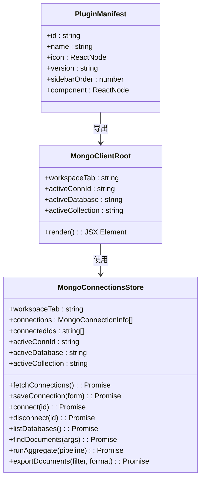

**图表来源**
- [index.tsx:14-86](file://src/plugins/mongodb-client/index.tsx#L14-L86)
- [mongodb-connections.ts:96-295](file://src/plugins/mongodb-client/store/mongodb-connections.ts#L96-L295)

### 数据模型和类型系统

插件定义了完整的数据传输对象（DTO），确保前后端数据交换的一致性和类型安全：

| 数据类型 | 字段描述 | 用途 |
|---------|----------|------|
| MongoConnectionInfo | 连接基本信息、认证信息、连接模式 | 存储和显示连接配置 |
| MongoDatabaseInfo | 数据库名称、大小、空数据库标识 | 数据库列表展示 |
| MongoCollectionInfo | 集合名称、类型信息 | 集合浏览和统计 |
| MongoDocumentPage | 文档数组、总数 | 分页查询结果 |
| MongoIndexInfo | 索引键、选项、属性 | 索引管理和展示 |
| MongoServerStatus | 版本、连接数、内存、操作计数器 | 服务器监控 |

**章节来源**
- [types.ts:20-95](file://src/plugins/mongodb-client/types.ts#L20-L95)
- [types.rs:3-80](file://src-tauri/src/plugins/mongodb/types.rs#L3-L80)

## 架构概览

MongoDB 客户端插件采用分层架构设计，实现了清晰的关注点分离：

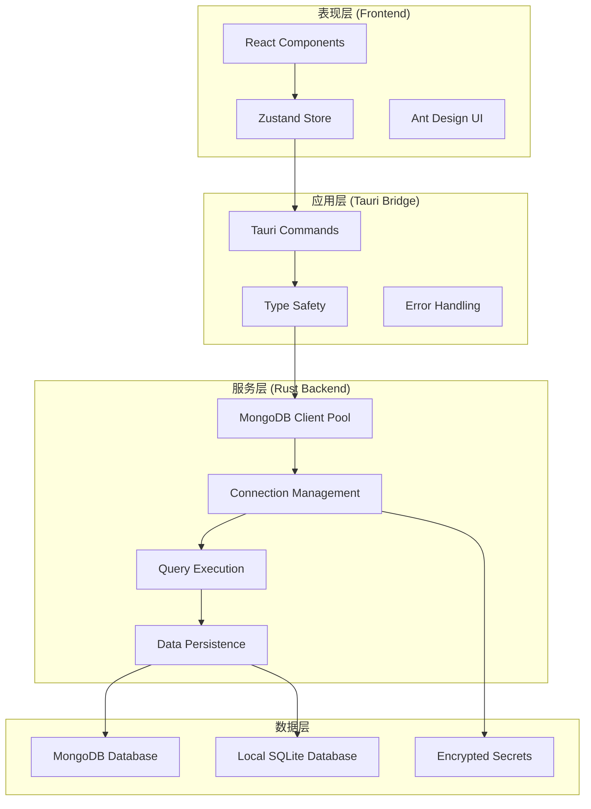

**图表来源**
- [commands.rs:124-169](file://src-tauri/src/plugins/mongodb/commands.rs#L124-L169)
- [client_pool.rs:9-132](file://src-tauri/src/plugins/mongodb/client_pool.rs#L9-L132)
- [mongodb_connection_repo.rs:72-249](file://src-tauri/src/db/mongodb_connection_repo.rs#L72-L249)

## 详细组件分析

### 连接管理组件

连接管理是整个插件的核心功能，提供了完整的连接生命周期管理：

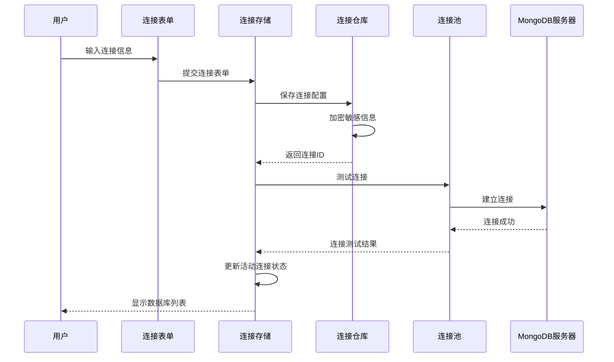

**图表来源**
- [MongoConnectionForm.tsx:13-169](file://src/plugins/mongodb-client/components/MongoConnectionForm.tsx#L13-L169)
- [mongodb-connections.ts:132-161](file://src/plugins/mongodb-client/store/mongodb-connections.ts#L132-L161)
- [commands.rs:145-169](file://src-tauri/src/plugins/mongodb/commands.rs#L145-L169)

连接管理功能包括：
- **连接配置**：支持 URI 和表单两种模式
- **认证管理**：用户名密码、认证数据库、TLS 支持
- **连接测试**：实时连接延迟和版本检测
- **连接池管理**：自动连接建立和资源清理

**章节来源**
- [MongoConnectionForm.tsx:13-169](file://src/plugins/mongodb-client/components/MongoConnectionForm.tsx#L13-L169)
- [mongodb-connections.ts:132-161](file://src/plugins/mongodb-client/store/mongodb-connections.ts#L132-L161)

### 数据库浏览器组件

数据库浏览器提供了直观的层次化导航界面：

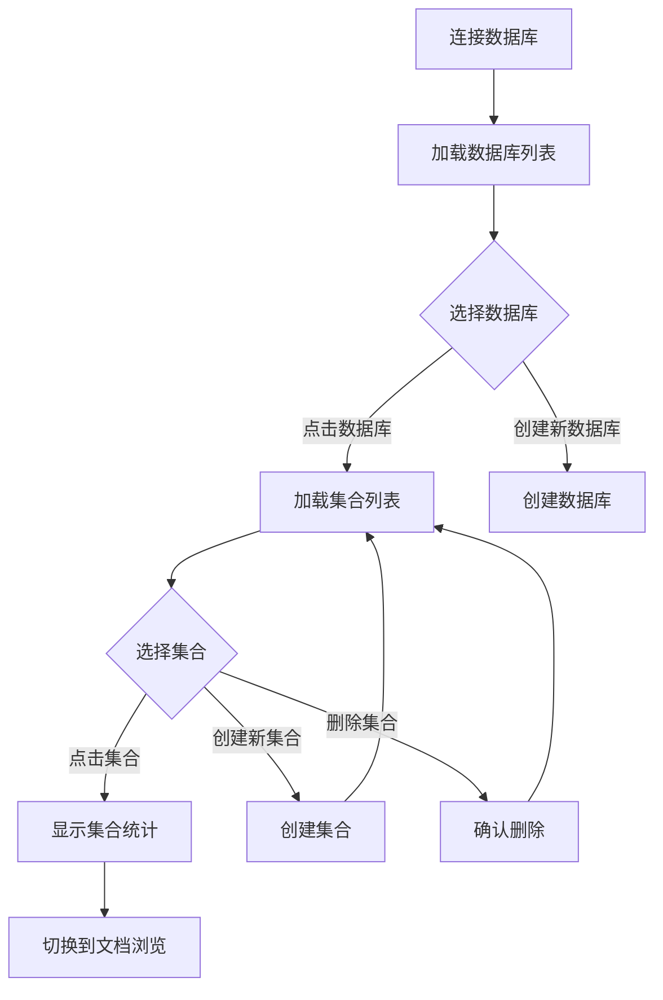

**图表来源**
- [DatabaseBrowser.tsx:7-137](file://src/plugins/mongodb-client/views/DatabaseBrowser.tsx#L7-L137)
- [commands.rs:171-233](file://src-tauri/src/plugins/mongodb/commands.rs#L171-L233)

数据库浏览器的主要功能：
- **数据库管理**：列出所有可用数据库，显示数据库大小和状态
- **集合管理**：动态创建、删除和浏览集合
- **统计信息**：实时显示集合文档数量、存储大小等指标

**章节来源**
- [DatabaseBrowser.tsx:7-137](file://src/plugins/mongodb-client/views/DatabaseBrowser.tsx#L7-L137)

### 文档浏览器组件

文档浏览器提供了强大的文档 CRUD 操作能力：

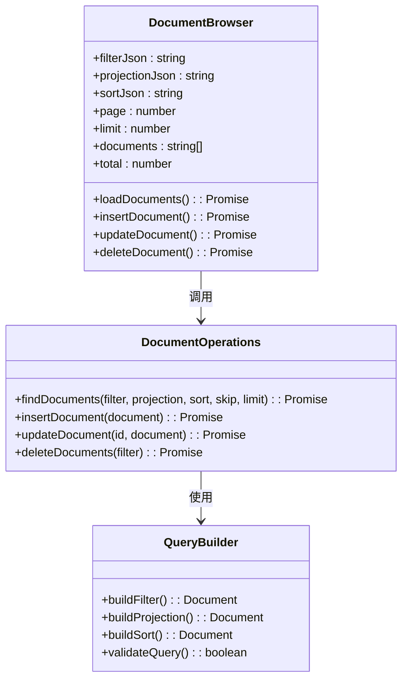

**图表来源**
- [DocumentBrowser.tsx:19-204](file://src/plugins/mongodb-client/views/DocumentBrowser.tsx#L19-L204)
- [commands.rs:266-371](file://src-tauri/src/plugins/mongodb/commands.rs#L266-L371)

文档浏览器的核心特性：
- **查询构建**：支持复杂的过滤、投影和排序条件
- **分页浏览**：高效的大数据集分页显示
- **编辑功能**：内联编辑、格式化和验证
- **批量操作**：支持批量插入、更新和删除

**章节来源**
- [DocumentBrowser.tsx:19-204](file://src/plugins/mongodb-client/views/DocumentBrowser.tsx#L19-L204)

### 查询工作区组件

查询工作区支持多种查询类型和安全保护机制：

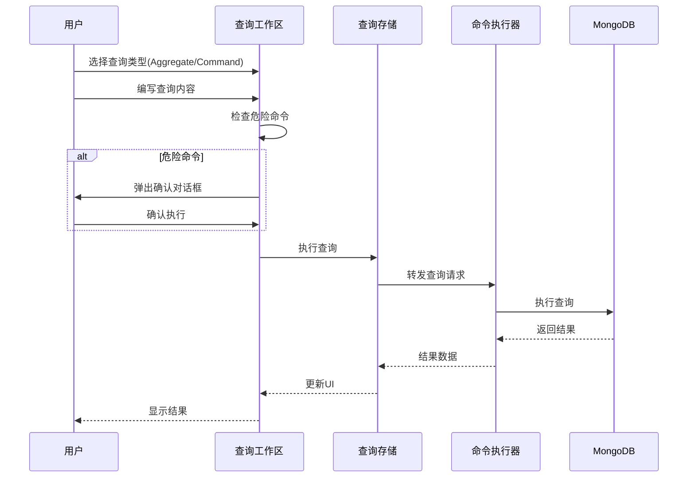

**图表来源**
- [QueryWorkspace.tsx:9-134](file://src/plugins/mongodb-client/views/QueryWorkspace.tsx#L9-L134)
- [commands.rs:479-545](file://src-tauri/src/plugins/mongodb/commands.rs#L479-L545)

查询工作区的安全特性：
- **危险命令检测**：自动识别可能破坏性操作
- **历史记录**：完整查询历史追踪和重放
- **多格式支持**：聚合管道和数据库命令两种模式

**章节来源**
- [QueryWorkspace.tsx:9-134](file://src/plugins/mongodb-client/views/QueryWorkspace.tsx#L9-L134)

### 索引管理组件

索引管理提供了完整的索引生命周期管理：

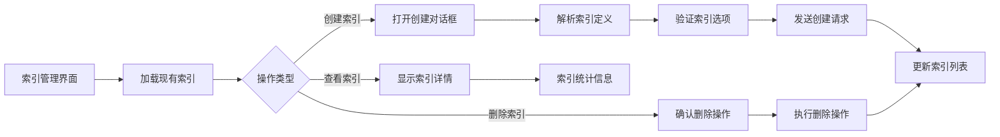

**图表来源**
- [IndexManager.tsx:7-109](file://src/plugins/mongodb-client/views/IndexManager.tsx#L7-L109)
- [commands.rs:547-634](file://src-tauri/src/plugins/mongodb/commands.rs#L547-L634)

索引管理功能：
- **索引创建**：支持复合索引、唯一索引、稀疏索引
- **TTL 支持**：自动过期索引配置
- **索引删除**：安全的索引移除操作
- **性能监控**：索引使用统计和优化建议

**章节来源**
- [IndexManager.tsx:7-109](file://src/plugins/mongodb-client/views/IndexManager.tsx#L7-L109)

### 导入导出组件

导入导出组件支持多种数据格式和批量操作：

```mermaid
flowchart TD
A[导入导出界面] --> B{操作类型}
B --> |导出数据| C[配置导出参数]
B --> |导入数据| D[选择导入文件]
C --> E[选择格式(JSON/JSONL)]
C --> F[设置过滤条件]
E --> G[执行导出]
F --> G
G --> H[保存到文件系统]
D --> I[预览导入数据]
I --> J[选择导入模式]
J --> K[执行导入操作]
K --> L[显示导入结果]
H --> M[导出完成通知]
L --> N[导入完成通知]
```

**图表来源**
- [ImportExport.tsx:6-100](file://src/plugins/mongodb-client/views/ImportExport.tsx#L6-L100)
- [commands.rs:636-755](file://src-tauri/src/plugins/mongodb/commands.rs#L636-L755)

导入导出特性：
- **格式支持**：标准 JSON 数组和 JSON Lines 格式
- **批量处理**：支持大量数据的高效导入导出
- **错误处理**：详细的导入失败报告和重试机制
- **预览功能**：导入前的数据预览和验证

**章节来源**
- [ImportExport.tsx:6-100](file://src/plugins/mongodb-client/views/ImportExport.tsx#L6-L100)

### 服务器状态监控

服务器状态监控提供了实时的性能指标展示：

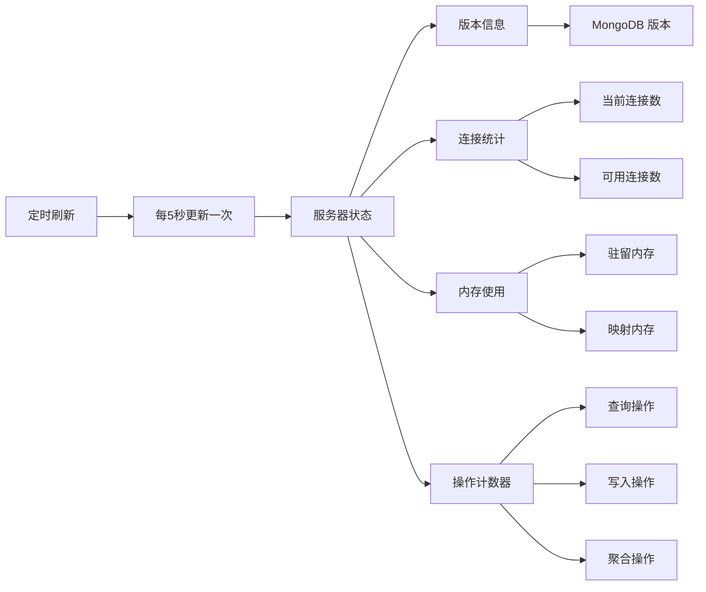

**图表来源**
- [ServerStatus.tsx:10-86](file://src/plugins/mongodb-client/views/ServerStatus.tsx#L10-L86)
- [commands.rs:757-781](file://src-tauri/src/plugins/mongodb/commands.rs#L757-L781)

监控指标：
- **基础信息**：服务器版本、运行时间、启动时间
- **连接监控**：活跃连接、峰值连接、连接池状态
- **内存监控**：物理内存、虚拟内存、缓存使用
- **性能监控**：读写操作计数、慢查询统计

**章节来源**
- [ServerStatus.tsx:10-86](file://src/plugins/mongodb-client/views/ServerStatus.tsx#L10-L86)

## 依赖关系分析

### 前端依赖关系

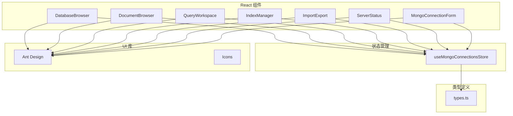

**图表来源**
- [mongodb-connections.ts:96-295](file://src/plugins/mongodb-client/store/mongodb-connections.ts#L96-L295)
- [types.ts:1-95](file://src/plugins/mongodb-client/types.ts#L1-L95)

### 后端依赖关系

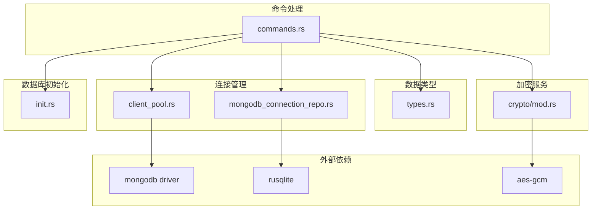

**图表来源**
- [commands.rs:1-788](file://src-tauri/src/plugins/mongodb/commands.rs#L1-L788)
- [client_pool.rs:1-132](file://src-tauri/src/plugins/mongodb/client_pool.rs#L1-L132)
- [mongodb_connection_repo.rs:1-249](file://src-tauri/src/db/mongodb_connection_repo.rs#L1-L249)

**章节来源**
- [commands.rs:1-788](file://src-tauri/src/plugins/mongodb/commands.rs#L1-L788)

## 性能考虑

### 连接池优化

插件实现了高效的连接池管理策略：

- **连接复用**：避免频繁建立和销毁数据库连接
- **超时控制**：合理的连接超时和查询超时设置
- **资源清理**：自动清理断开的连接和过期会话
- **并发控制**：限制同时活跃的连接数量

### 查询性能优化

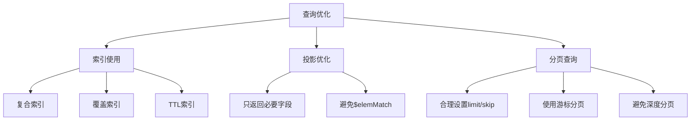

### 内存管理

- **流式处理**：大结果集采用流式处理避免内存溢出
- **数据压缩**：对传输的数据进行适当的压缩
- **缓存策略**：智能缓存常用查询结果
- **垃圾回收**：及时释放不再使用的资源

## 故障排除指南

### 常见连接问题

| 问题类型 | 症状 | 解决方案 |
|---------|------|---------|
| 认证失败 | 连接被拒绝或权限错误 | 检查用户名密码、认证数据库配置 |
| 网络连接 | 连接超时或主机不可达 | 验证主机地址、端口和防火墙设置 |
| TLS 证书 | SSL/TLS 握手失败 | 检查 TLS 配置和证书有效性 |
| SRV 记录 | DNS 解析失败 | 验证 SRV 记录配置和网络连接 |

### 查询执行问题

- **查询超时**：检查查询条件是否过于复杂或缺少索引
- **内存不足**：优化查询投影，使用分页处理大数据集
- **权限不足**：确认用户权限和数据库访问权限
- **语法错误**：验证 JSON 格式和 MongoDB 语法

### 导入导出问题

- **文件格式**：确保导入文件符合预期的 JSON 或 JSONL 格式
- **内存限制**：对于大文件，考虑分批导入或增加系统内存
- **编码问题**：检查文件编码和特殊字符处理
- **权限问题**：验证文件读写权限和路径有效性

**章节来源**
- [commands.rs:24-63](file://src-tauri/src/plugins/mongodb/commands.rs#L24-L63)
- [client_pool.rs:107-131](file://src-tauri/src/plugins/mongodb/client_pool.rs#L107-L131)

## 结论

MongoDB 客户端插件提供了一个功能完整、性能优异的数据库管理解决方案。通过精心设计的架构和丰富的功能特性，该插件能够满足从日常开发到生产环境的各种需求。

### 主要优势

1. **安全性**：完整的连接加密、敏感信息保护和权限控制
2. **易用性**：直观的用户界面和丰富的交互功能
3. **性能**：优化的连接池、查询执行和内存管理
4. **可靠性**：完善的错误处理、日志记录和故障恢复
5. **扩展性**：模块化的架构设计便于功能扩展和维护

### 技术亮点

- **全栈 TypeScript/Rust**：前后端类型安全的完整实现
- **现代 UI 框架**：基于 React 和 Ant Design 的现代化界面
- **高性能后端**：Rust 编写的高性能数据库操作层
- **安全存储**：SQLite 数据库存储配置和历史记录
- **加密保护**：AES-GCM 加密算法保护敏感信息

该插件为 MongoDB 数据库管理提供了一个专业级的解决方案，适合各种规模的项目和用户需求。