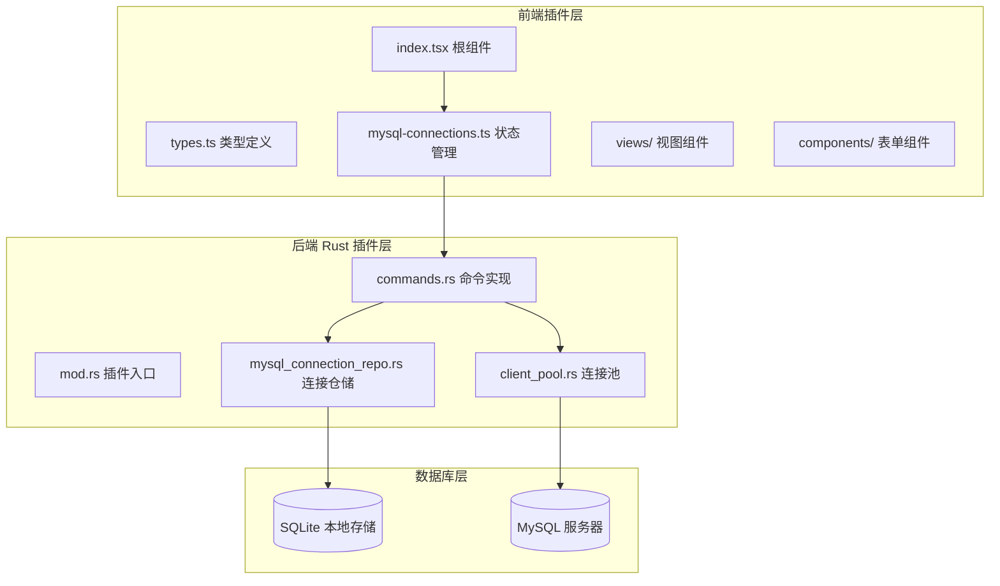
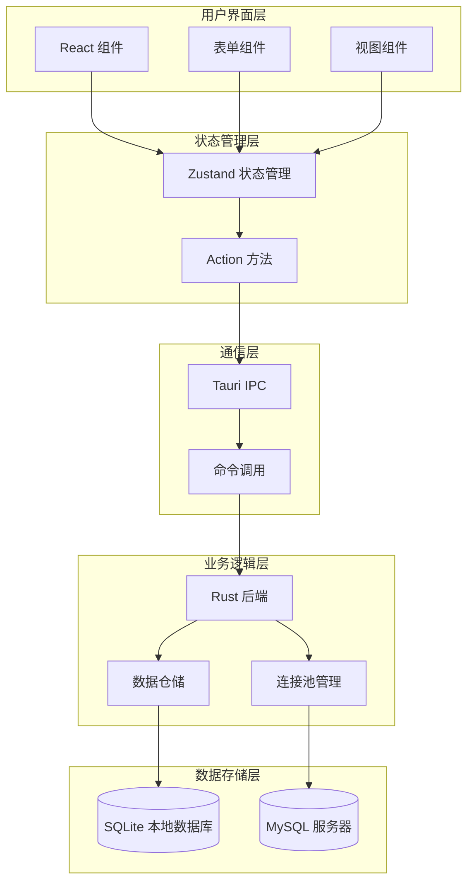
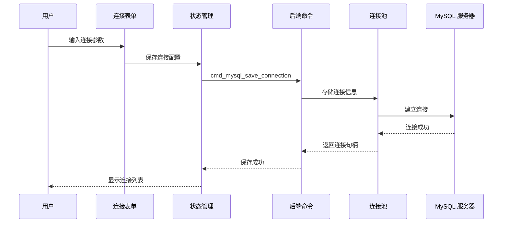
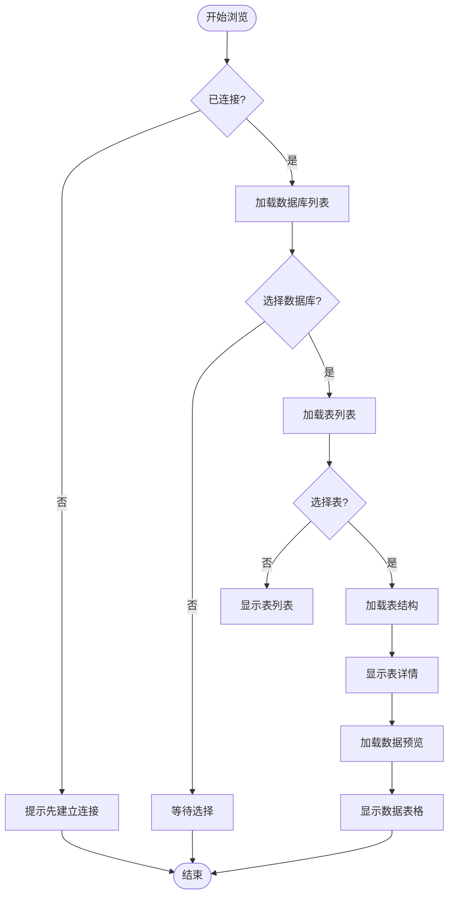
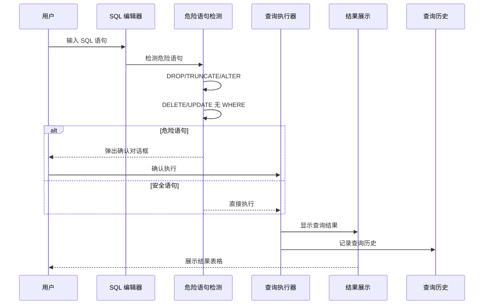
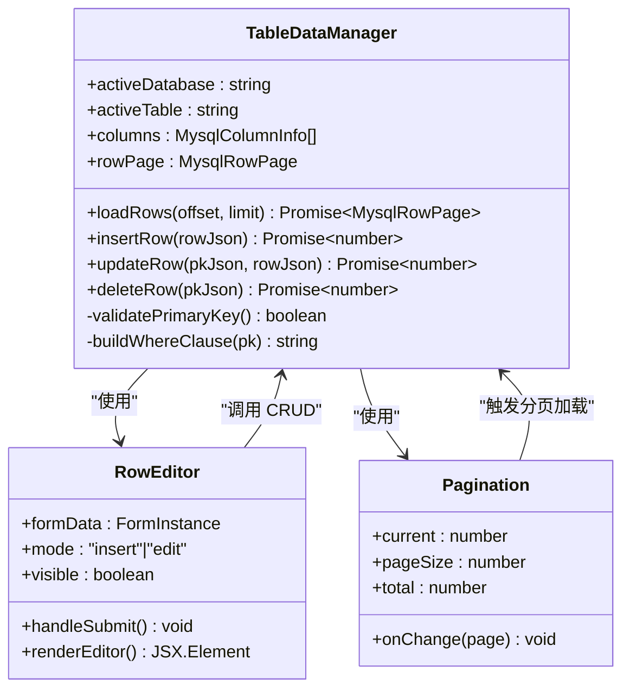
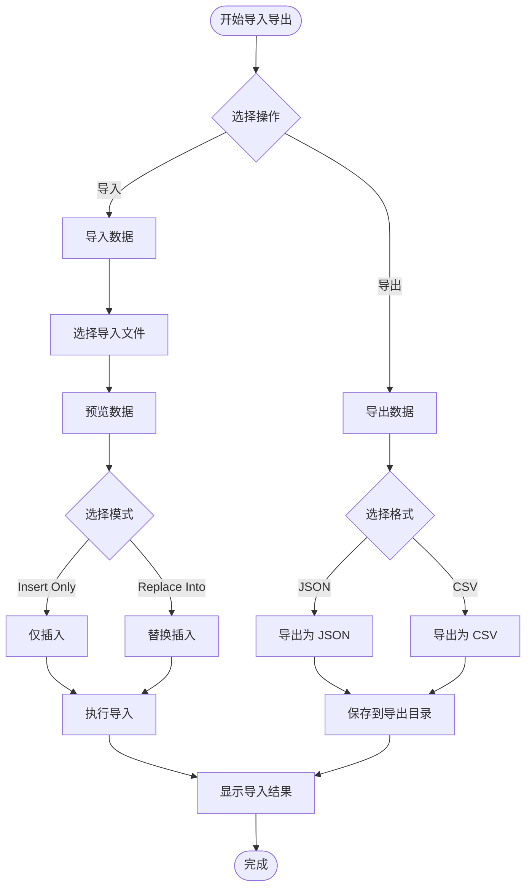
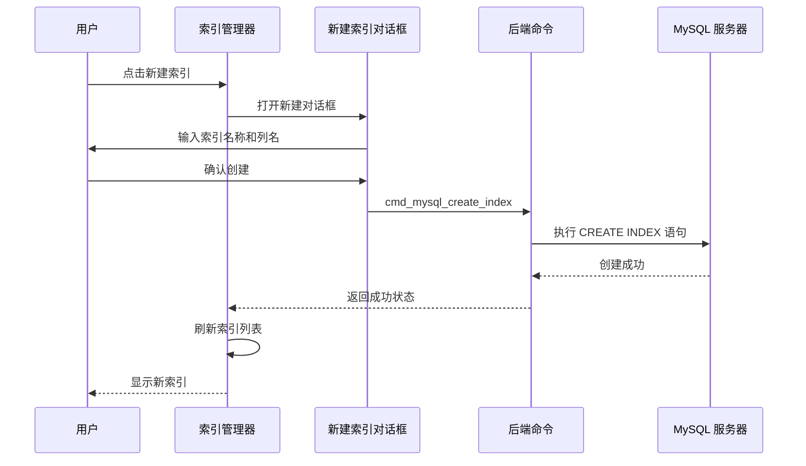
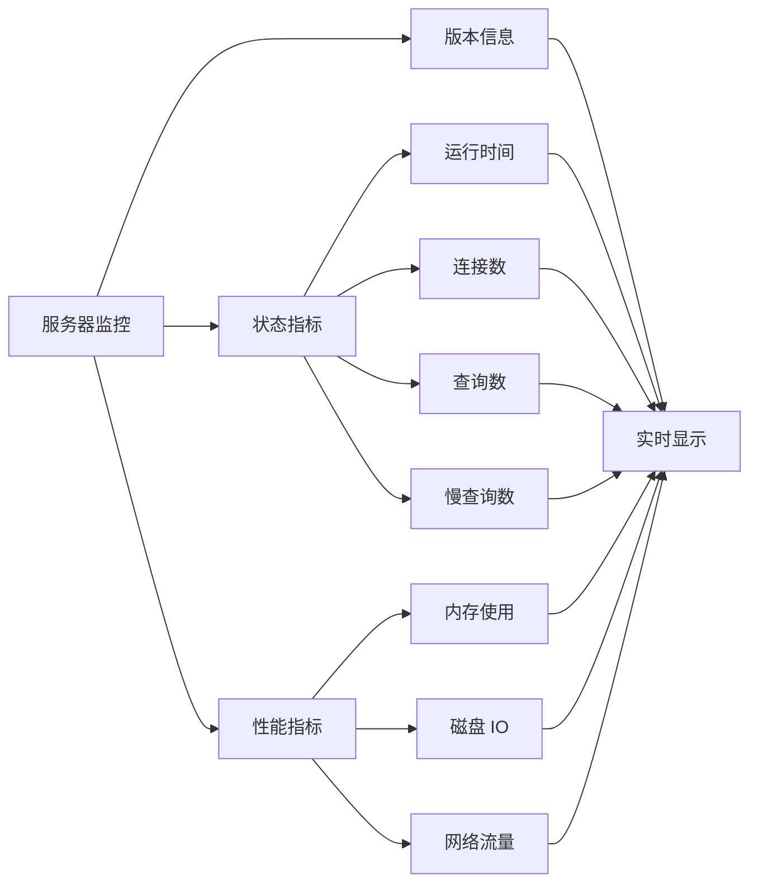
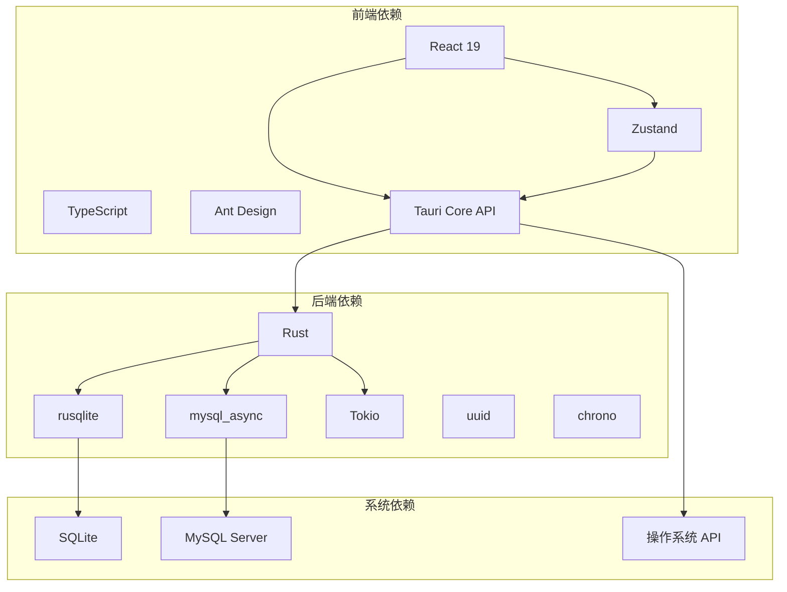

# MySQL 客户端插件

<cite>
**本文档引用的文件**
- [index.tsx](file://src/plugins/mysql-client/index.tsx)
- [types.ts](file://src/plugins/mysql-client/types.ts)
- [mysql-connections.ts](file://src/plugins/mysql-client/store/mysql-connections.ts)
- [MysqlConnectionForm.tsx](file://src/plugins/mysql-client/components/MysqlConnectionForm.tsx)
- [SqlWorkspace.tsx](file://src/plugins/mysql-client/views/SqlWorkspace.tsx)
- [DatabaseBrowser.tsx](file://src/plugins/mysql-client/views/DatabaseBrowser.tsx)
- [TableData.tsx](file://src/plugins/mysql-client/views/TableData.tsx)
- [ImportExport.tsx](file://src/plugins/mysql-client/views/ImportExport.tsx)
- [IndexManager.tsx](file://src/plugins/mysql-client/views/IndexManager.tsx)
- [ServerStatus.tsx](file://src/plugins/mysql-client/views/ServerStatus.tsx)
- [mod.rs](file://src-tauri/src/plugins/mysql/mod.rs)
- [commands.rs](file://src-tauri/src/plugins/mysql/commands.rs)
- [client_pool.rs](file://src-tauri/src/plugins/mysql/client_pool.rs)
- [mysql_connection_repo.rs](file://src-tauri/src/db/mysql_connection_repo.rs)
- [README.md](file://README.md)
</cite>

## 目录
1. [简介](#简介)
2. [项目结构](#项目结构)
3. [核心组件](#核心组件)
4. [架构总览](#架构总览)
5. [详细组件分析](#详细组件分析)
6. [依赖关系分析](#依赖关系分析)
7. [性能考虑](#性能考虑)
8. [故障排除指南](#故障排除指南)
9. [结论](#结论)
10. [附录](#附录)

## 简介
MySQL 客户端插件是 DevNexus 桌面应用中的一个插件模块，提供完整的 MySQL 数据库管理能力。该插件采用插件化架构设计，前端使用 React + TypeScript + Ant Design，后端使用 Rust + mysql_async，通过 Tauri 框架实现桌面应用集成。

该插件的核心目标是为开发者和运维人员提供一个轻量、安全、易用的 MySQL 管理工具，涵盖连接配置、数据库浏览、SQL 工作区、表数据管理、导入导出、索引管理、服务器状态监控等核心功能。

## 项目结构
MySQL 客户端插件遵循插件化架构，主要分为前端插件层和后端 Rust 插件层：

**图表来源**
- [index.tsx:1-38](file://src/plugins/mysql-client/index.tsx#L1-L38)
- [mod.rs:1-4](file://src-tauri/src/plugins/mysql/mod.rs#L1-L4)

**章节来源**
- [README.md:56-93](file://README.md#L56-L93)
- [index.tsx:1-38](file://src/plugins/mysql-client/index.tsx#L1-L38)

## 核心组件
MySQL 客户端插件包含以下核心组件：

### 连接管理组件
- **MysqlConnectionForm**: MySQL 连接配置表单，支持主机、端口、用户名、密码、默认数据库、字符集、SSL 模式、超时设置等配置
- **MysqlConnectionList**: 连接列表管理，支持连接的创建、编辑、删除、测试连接等功能

### 数据库浏览组件
- **DatabaseBrowser**: 数据库浏览器，提供数据库和表的层次化浏览功能
- **TableData**: 表数据管理，支持数据的增删改查、分页浏览、JSON 编辑等操作

### SQL 工作区组件
- **SqlWorkspace**: SQL 查询工作区，支持 SQL 语句编写、执行、结果展示、查询历史管理
- **IndexManager**: 索引管理，支持索引的创建、删除、查看等功能

### 导入导出组件
- **ImportExport**: 数据导入导出功能，支持 JSON 和 CSV 格式的导入导出
- **ServerStatus**: 服务器状态监控，显示 MySQL 服务器版本和关键状态指标

**章节来源**
- [MysqlConnectionForm.tsx:1-45](file://src/plugins/mysql-client/components/MysqlConnectionForm.tsx#L1-L45)
- [DatabaseBrowser.tsx:1-13](file://src/plugins/mysql-client/views/DatabaseBrowser.tsx#L1-L13)
- [TableData.tsx:1-22](file://src/plugins/mysql-client/views/TableData.tsx#L1-L22)
- [SqlWorkspace.tsx:1-27](file://src/plugins/mysql-client/views/SqlWorkspace.tsx#L1-L27)
- [ImportExport.tsx:1-19](file://src/plugins/mysql-client/views/ImportExport.tsx#L1-L19)
- [IndexManager.tsx:1-15](file://src/plugins/mysql-client/views/IndexManager.tsx#L1-L15)
- [ServerStatus.tsx:1-15](file://src/plugins/mysql-client/views/ServerStatus.tsx#L1-L15)

## 架构总览
MySQL 客户端插件采用分层架构设计，实现了前后端分离和职责清晰的模块化组织：

**图表来源**
- [mysql-connections.ts:77-153](file://src/plugins/mysql-client/store/mysql-connections.ts#L77-L153)
- [commands.rs:176-214](file://src-tauri/src/plugins/mysql/commands.rs#L176-L214)

该架构的主要特点：
- **插件化设计**: 每个插件独立开发、独立部署
- **类型安全**: 前后端通过 TypeScript 和 Rust 类型系统保证数据一致性
- **异步处理**: 使用 Promise 和 async/await 处理异步操作
- **连接池管理**: 后端维护 MySQL 连接池，提高性能和资源利用率

**章节来源**
- [README.md:28-34](file://README.md#L28-L34)
- [mysql-connections.ts:1-153](file://src/plugins/mysql-client/store/mysql-connections.ts#L1-L153)

## 详细组件分析

### 连接配置与管理
连接配置是整个插件的基础，提供了完整的连接生命周期管理：

**图表来源**
- [MysqlConnectionForm.tsx:19-42](file://src/plugins/mysql-client/components/MysqlConnectionForm.tsx#L19-L42)
- [mysql-connections.ts:99-107](file://src/plugins/mysql-client/store/mysql-connections.ts#L99-L107)
- [commands.rs:182-184](file://src-tauri/src/plugins/mysql/commands.rs#L182-L184)

连接配置的关键特性：
- **参数完整性**: 支持主机名、端口、用户名、密码、默认数据库等完整配置
- **安全性**: 密码字段支持加密存储，测试连接时验证配置有效性
- **灵活性**: 支持不同的字符集和 SSL 模式配置
- **超时控制**: 可配置连接超时时间，避免长时间阻塞

**章节来源**
- [MysqlConnectionForm.tsx:14-17](file://src/plugins/mysql-client/components/MysqlConnectionForm.tsx#L14-L17)
- [types.ts:1-13](file://src/plugins/mysql-client/types.ts#L1-L13)

### 数据库浏览与表结构管理
数据库浏览功能提供了直观的层次化浏览体验：

**图表来源**
- [DatabaseBrowser.tsx:4-12](file://src/plugins/mysql-client/views/DatabaseBrowser.tsx#L4-L12)
- [mysql-connections.ts:118-133](file://src/plugins/mysql-client/store/mysql-connections.ts#L118-L133)

表结构管理的核心功能：
- **数据库发现**: 自动发现可用的数据库，过滤系统数据库
- **表结构查询**: 获取表的列信息、索引信息、存储引擎等元数据
- **数据预览**: 支持分页加载，避免大数据量时的性能问题
- **实时更新**: 选择不同表时自动刷新相关数据

**章节来源**
- [DatabaseBrowser.tsx:7-11](file://src/plugins/mysql-client/views/DatabaseBrowser.tsx#L7-L11)
- [types.ts:30-36](file://src/plugins/mysql-client/types.ts#L30-L36)

### SQL 工作区与查询执行
SQL 工作区提供了强大的查询构建和执行能力：

**图表来源**
- [SqlWorkspace.tsx:16-19](file://src/plugins/mysql-client/views/SqlWorkspace.tsx#L16-L19)
- [commands.rs:387-415](file://src-tauri/src/plugins/mysql/commands.rs#L387-L415)

SQL 工作区的高级特性：
- **危险语句防护**: 自动检测可能破坏性操作，提供二次确认
- **结果集展示**: 支持表格和 JSON 两种结果显示方式
- **查询历史**: 自动保存执行历史，支持快速重放
- **数据库切换**: 支持在不同数据库间切换执行上下文

**章节来源**
- [SqlWorkspace.tsx:6-9](file://src/plugins/mysql-client/views/SqlWorkspace.tsx#L6-L9)
- [SqlWorkspace.tsx:20-24](file://src/plugins/mysql-client/views/SqlWorkspace.tsx#L20-L24)

### 表数据管理与 CRUD 操作
表数据管理提供了完整的增删改查功能：

**图表来源**
- [TableData.tsx:5-21](file://src/plugins/mysql-client/views/TableData.tsx#L5-L21)
- [mysql-connections.ts:134-141](file://src/plugins/mysql-client/store/mysql-connections.ts#L134-L141)

数据管理的关键特性：
- **主键约束**: 自动检测表的主键，禁用无主键表的编辑功能
- **JSON 编辑**: 提供 JSON 格式的行编辑界面
- **分页加载**: 支持大数据量的分页浏览，每页最多 500 条记录
- **批量操作**: 支持插入、更新、删除操作的批量执行

**章节来源**
- [TableData.tsx:10-12](file://src/plugins/mysql-client/views/TableData.tsx#L10-L12)
- [commands.rs:324-385](file://src-tauri/src/plugins/mysql/commands.rs#L324-L385)

### 导入导出功能
导入导出功能支持多种数据格式和批量操作：

**图表来源**
- [ImportExport.tsx:5-18](file://src/plugins/mysql-client/views/ImportExport.tsx#L5-L18)
- [commands.rs:503-601](file://src-tauri/src/plugins/mysql/commands.rs#L503-L601)

导入导出的特色功能：
- **多格式支持**: 支持 JSON 和 CSV 两种格式
- **智能解析**: 自动识别 CSV 文件的列名和数据类型
- **批量处理**: 支持大量数据的批量导入，提供进度反馈
- **错误处理**: 导入失败的数据会被单独记录，便于排查

**章节来源**
- [ImportExport.tsx:12-15](file://src/plugins/mysql-client/views/ImportExport.tsx#L12-L15)
- [commands.rs:558-577](file://src-tauri/src/plugins/mysql/commands.rs#L558-L577)

### 索引管理
索引管理提供了完整的索引生命周期管理：

**图表来源**
- [IndexManager.tsx:5-14](file://src/plugins/mysql-client/views/IndexManager.tsx#L5-L14)
- [commands.rs:474-501](file://src-tauri/src/plugins/mysql/commands.rs#L474-L501)

索引管理的核心功能：
- **索引发现**: 自动获取表的所有索引信息，包括唯一性、类型、基数等
- **索引创建**: 支持创建普通索引和唯一索引，多列组合索引
- **索引删除**: 提供安全的索引删除功能，防止误删主键索引
- **可视化展示**: 以表格形式展示索引信息，便于理解和管理

**章节来源**
- [IndexManager.tsx:10-12](file://src/plugins/mysql-client/views/IndexManager.tsx#L10-L12)
- [types.ts:36](file://src/plugins/mysql-client/types.ts#L36)

### 服务器状态监控
服务器状态监控提供了实时的 MySQL 服务器健康状况：

**图表来源**
- [ServerStatus.tsx:5-14](file://src/plugins/mysql-client/views/ServerStatus.tsx#L5-L14)
- [commands.rs:603-614](file://src-tauri/src/plugins/mysql/commands.rs#L603-L614)

服务器监控的关键指标：
- **基础信息**: MySQL 版本、编译信息等基本信息
- **连接状态**: 当前连接数、活跃线程数、最大连接数等
- **性能指标**: 查询处理速度、慢查询数量、缓存命中率等
- **资源使用**: 内存、磁盘、网络等系统资源使用情况

**章节来源**
- [ServerStatus.tsx:9-12](file://src/plugins/mysql-client/views/ServerStatus.tsx#L9-L12)
- [types.ts:39](file://src/plugins/mysql-client/types.ts#L39)

## 依赖关系分析
MySQL 客户端插件的依赖关系体现了清晰的分层架构：

**图表来源**
- [README.md:44-54](file://README.md#L44-L54)
- [commands.rs:1-16](file://src-tauri/src/plugins/mysql/commands.rs#L1-L16)

依赖关系的特点：
- **最小依赖原则**: 后端仅依赖必要的核心库，减少攻击面
- **类型安全**: 前后端通过严格的类型定义确保数据一致性
- **异步并发**: 使用 tokio 提供高性能的异步处理能力
- **加密安全**: 敏感数据使用 AES-GCM 加密存储

**章节来源**
- [README.md:228-247](file://README.md#L228-L247)
- [mysql_connection_repo.rs:185-209](file://src-tauri/src/db/mysql_connection_repo.rs#L185-L209)

## 性能考虑
MySQL 客户端插件在设计时充分考虑了性能优化：

### 连接池管理
- **连接复用**: 后端维护连接池，避免频繁创建和销毁连接
- **超时控制**: 支持可配置的连接超时和查询超时
- **资源清理**: 自动清理断开的连接，释放系统资源

### 分页加载策略
- **数据分页**: 默认每页 100 条记录，最大支持 500 条
- **懒加载**: 仅在需要时加载数据，减少内存占用
- **虚拟滚动**: 大数据量时使用虚拟滚动技术提升渲染性能

### 缓存机制
- **查询结果缓存**: 对常用查询结果进行短期缓存
- **连接状态缓存**: 缓存连接状态和元数据信息
- **配置缓存**: 缓存用户配置和最近使用的连接

### 并发处理
- **异步操作**: 所有数据库操作都是异步执行
- **并发限制**: 控制同时进行的数据库操作数量
- **错误恢复**: 自动处理连接中断和重试机制

## 故障排除指南
MySQL 客户端插件提供了完善的错误处理和故障排除机制：

### 常见连接问题
1. **连接超时**: 检查网络连通性和防火墙设置
2. **认证失败**: 验证用户名和密码，确认用户权限
3. **SSL 连接失败**: 检查 SSL 配置和证书有效性
4. **端口被占用**: 更换 MySQL 端口号或停止冲突服务

### 数据操作异常
1. **主键缺失**: 无主键表无法进行更新和删除操作
2. **权限不足**: 确认用户对目标表具有相应权限
3. **数据类型不匹配**: 检查导入数据的格式和类型
4. **约束冲突**: 处理唯一性约束和外键约束冲突

### 性能问题诊断
1. **查询缓慢**: 使用 EXPLAIN 分析查询计划，考虑添加索引
2. **内存占用高**: 检查是否有大数据量查询，考虑分页处理
3. **连接数过多**: 优化应用程序的连接池配置
4. **磁盘空间不足**: 清理日志文件和临时数据

### 日志和调试
- **查询历史**: 查看最近执行的 SQL 语句和执行结果
- **错误日志**: 查看应用程序和数据库的错误日志
- **性能监控**: 监控数据库的性能指标和资源使用情况
- **连接状态**: 检查当前的连接状态和活动会话

**章节来源**
- [commands.rs:157-174](file://src-tauri/src/plugins/mysql/commands.rs#L157-L174)
- [mysql-connections.ts:66-75](file://src/plugins/mysql-client/store/mysql-connections.ts#L66-L75)

## 结论
MySQL 客户端插件是一个功能完整、设计合理的数据库管理工具。它通过插件化架构实现了良好的可扩展性和维护性，通过前后端分离提供了清晰的职责划分，通过类型安全保证了数据的一致性和可靠性。

该插件的主要优势包括：
- **功能全面**: 涵盖了 MySQL 数据库管理的各个方面
- **用户体验**: 提供直观的图形界面和流畅的操作体验
- **安全性**: 采用加密存储和权限控制，保护敏感数据
- **性能优化**: 通过连接池、分页加载等技术提升性能
- **错误处理**: 完善的错误处理和故障排除机制

未来可以进一步改进的方向包括：
- 增强对 MariaDB 的兼容性支持
- 添加更多的 SQL 语法高亮和智能补全功能
- 扩展导入导出格式的支持
- 增加更多高级的数据库管理功能

## 附录

### 快速开始指南
1. **安装和启动**: 运行 `npm install` 和 `npm run tauri dev`
2. **创建连接**: 在连接列表中点击新建，填写 MySQL 连接参数
3. **测试连接**: 使用测试连接功能验证配置正确性
4. **浏览数据库**: 连接成功后即可浏览数据库和表结构
5. **执行查询**: 在 SQL 工作区编写和执行 SQL 语句
6. **管理数据**: 使用表数据视图进行数据的增删改查操作

### 高级功能使用
- **查询历史**: 通过历史面板查看和重放之前的查询
- **索引管理**: 创建和管理表的索引以优化查询性能
- **导入导出**: 支持 JSON 和 CSV 格式的批量数据操作
- **服务器监控**: 实时监控 MySQL 服务器的状态和性能指标

### 安全最佳实践
- **密码管理**: 使用强密码，定期更换连接密码
- **权限控制**: 为不同用户分配最小必要权限
- **网络隔离**: 在受信任的网络环境中使用数据库连接
- **数据备份**: 定期备份重要数据，制定灾难恢复计划