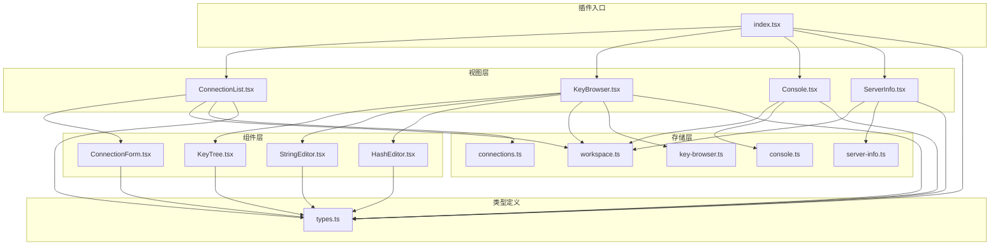
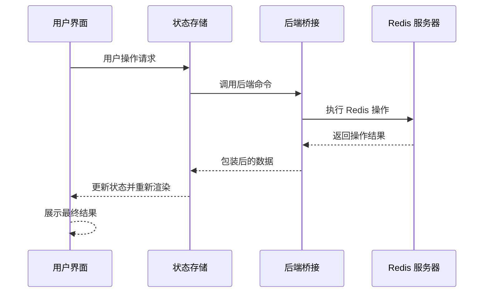
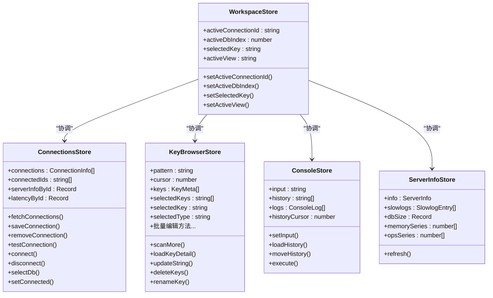
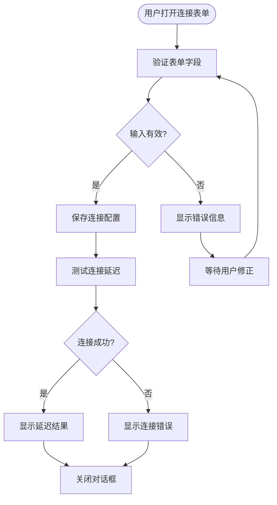
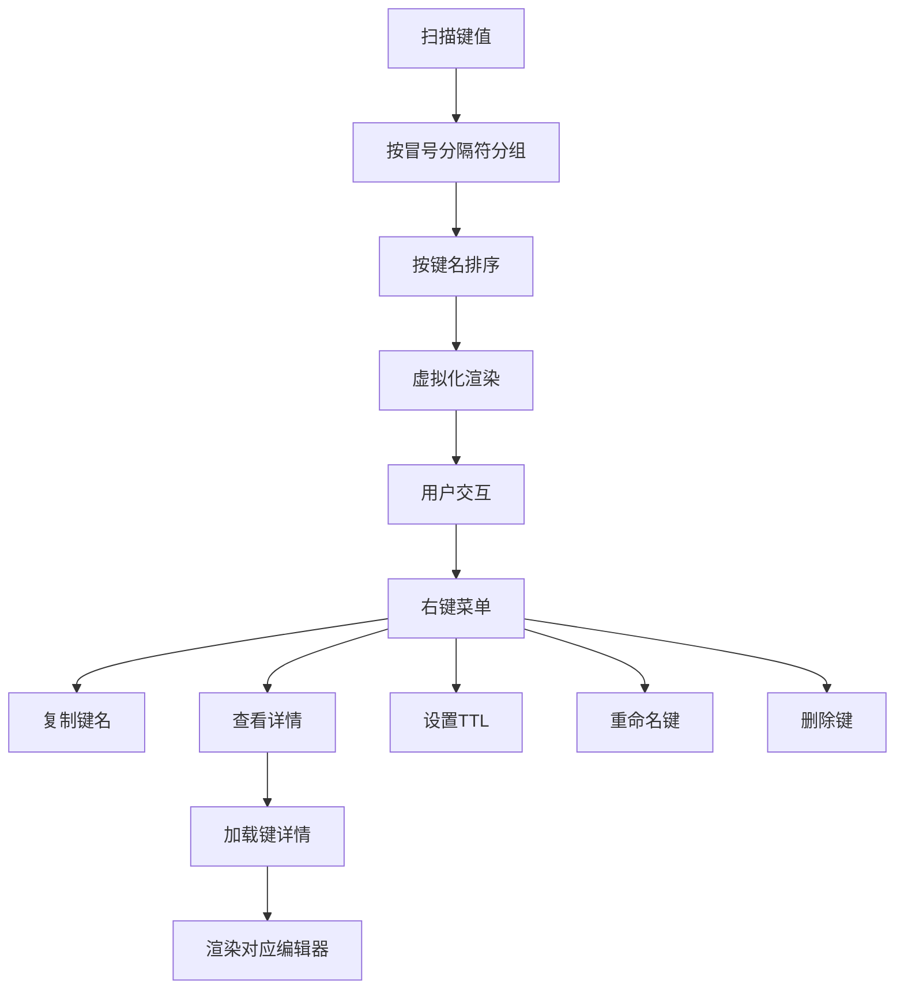
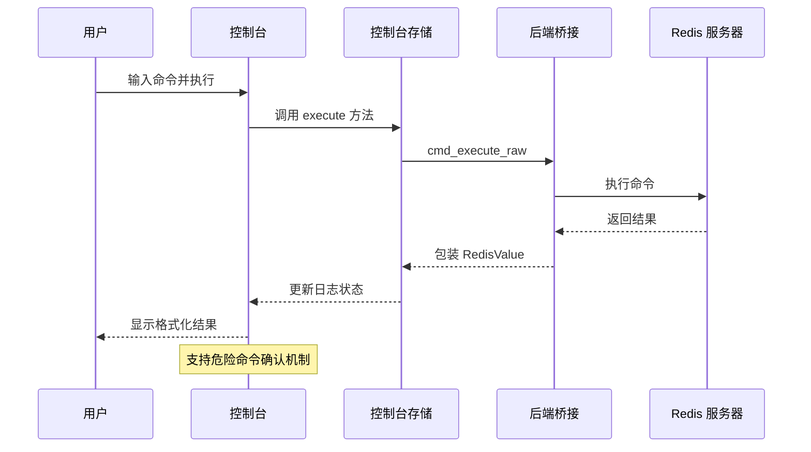
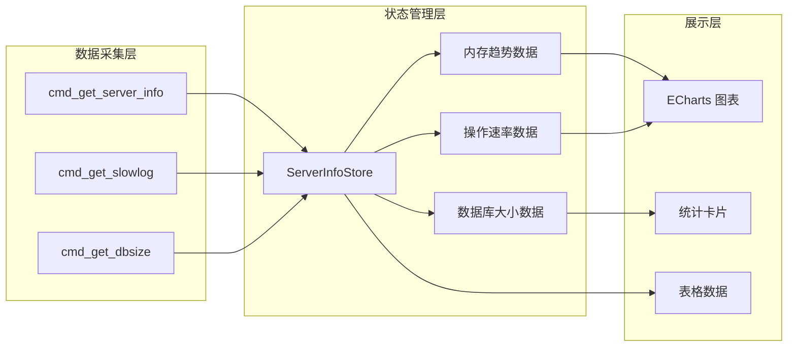
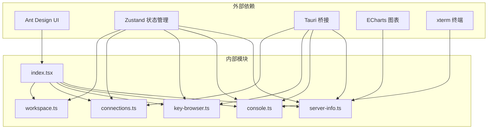

# Redis 管理器插件

<cite>
**本文档引用的文件**
- [index.tsx](file://src/plugins/redis-manager/index.tsx)
- [types.ts](file://src/plugins/redis-manager/types.ts)
- [connections.ts](file://src/plugins/redis-manager/store/connections.ts)
- [key-browser.ts](file://src/plugins/redis-manager/store/key-browser.ts)
- [console.ts](file://src/plugins/redis-manager/store/console.ts)
- [server-info.ts](file://src/plugins/redis-manager/store/server-info.ts)
- [workspace.ts](file://src/plugins/redis-manager/store/workspace.ts)
- [ConnectionList.tsx](file://src/plugins/redis-manager/views/ConnectionList.tsx)
- [KeyBrowser.tsx](file://src/plugins/redis-manager/views/KeyBrowser.tsx)
- [Console.tsx](file://src/plugins/redis-manager/views/Console.tsx)
- [ServerInfo.tsx](file://src/plugins/redis-manager/views/ServerInfo.tsx)
- [ConnectionForm.tsx](file://src/plugins/redis-manager/components/ConnectionForm.tsx)
- [KeyTree.tsx](file://src/plugins/redis-manager/components/KeyTree.tsx)
- [StringEditor.tsx](file://src/plugins/redis-manager/components/editors/StringEditor.tsx)
- [HashEditor.tsx](file://src/plugins/redis-manager/components/editors/HashEditor.tsx)
</cite>

## 目录
1. [简介](#简介)
2. [项目结构](#项目结构)
3. [核心组件](#核心组件)
4. [架构总览](#架构总览)
5. [详细组件分析](#详细组件分析)
6. [依赖关系分析](#依赖关系分析)
7. [性能考虑](#性能考虑)
8. [故障排除指南](#故障排除指南)
9. [结论](#结论)
10. [附录](#附录)

## 简介
Redis 管理器插件为 DevNexus 提供了完整的 Redis 数据库管理能力，包含连接管理、键值浏览与编辑、命令控制台以及服务器信息监控四大核心功能。该插件采用工作区布局设计，通过四个标签页（Connections、Keys、Console、Server）组织不同功能模块，支持多种 Redis 连接类型，并提供丰富的交互式编辑器用于字符串、哈希、列表、集合和有序集合的增删改查操作。

## 项目结构
插件采用按功能域划分的目录结构，主要包含以下层次：
- 视图层：负责用户界面渲染和交互逻辑
- 组件层：可复用的 UI 组件和编辑器
- 存储层：基于 Zustand 的状态管理，封装数据获取和业务逻辑
- 类型定义：统一的数据结构和接口规范
- 插件入口：注册插件到 DevNexus 平台

**图表来源**
- [index.tsx:1-67](file://src/plugins/redis-manager/index.tsx#L1-L67)
- [ConnectionList.tsx:1-213](file://src/plugins/redis-manager/views/ConnectionList.tsx#L1-L213)
- [KeyBrowser.tsx:1-525](file://src/plugins/redis-manager/views/KeyBrowser.tsx#L1-L525)
- [Console.tsx:1-280](file://src/plugins/redis-manager/views/Console.tsx#L1-L280)
- [ServerInfo.tsx:1-193](file://src/plugins/redis-manager/views/ServerInfo.tsx#L1-L193)

**章节来源**
- [index.tsx:1-67](file://src/plugins/redis-manager/index.tsx#L1-L67)
- [types.ts:1-91](file://src/plugins/redis-manager/types.ts#L1-L91)

## 核心组件
插件的核心由五个状态存储模块构成，每个模块负责特定领域的数据管理和业务逻辑：

### 连接管理存储 (Connections Store)
负责 Redis 连接的生命周期管理，包括连接建立、断开、测试延迟、数据库选择等操作。该存储维护连接列表、连接状态映射、服务器信息缓存和延迟测量结果。

### 键浏览器存储 (Key Browser Store)
提供键值扫描、详情加载、批量操作和各种数据类型的编辑功能。支持字符串、哈希、列表、集合和有序集合的增删改查操作。

### 控制台存储 (Console Store)
实现命令执行、历史记录管理和结果渲染。支持危险命令确认机制和终端样式输出。

### 服务器信息存储 (Server Info Store)
收集和展示 Redis 服务器的实时状态信息，包括内存使用、客户端连接数、操作速率、慢查询日志等指标。

### 工作区存储 (Workspace Store)
管理当前活动连接、数据库索引、选中键和视图状态，确保跨组件的状态一致性。

**章节来源**
- [connections.ts:1-91](file://src/plugins/redis-manager/store/connections.ts#L1-L91)
- [key-browser.ts:1-224](file://src/plugins/redis-manager/store/key-browser.ts#L1-L224)
- [console.ts:1-75](file://src/plugins/redis-manager/store/console.ts#L1-L75)
- [server-info.ts:1-48](file://src/plugins/redis-manager/store/server-info.ts#L1-L48)
- [workspace.ts:1-26](file://src/plugins/redis-manager/store/workspace.ts#L1-L26)

## 架构总览
插件采用分层架构设计，通过清晰的职责分离实现了高内聚低耦合的系统结构。整体架构遵循以下原则：

### 数据流架构

**图表来源**
- [connections.ts:55-68](file://src/plugins/redis-manager/store/connections.ts#L55-L68)
- [key-browser.ts:66-82](file://src/plugins/redis-manager/store/key-browser.ts#L66-L82)
- [console.ts:54-73](file://src/plugins/redis-manager/store/console.ts#L54-L73)

### 组件交互模式

**图表来源**
- [workspace.ts:3-14](file://src/plugins/redis-manager/store/workspace.ts#L3-L14)
- [connections.ts:11-25](file://src/plugins/redis-manager/store/connections.ts#L11-L25)
- [key-browser.ts:6-41](file://src/plugins/redis-manager/store/key-browser.ts#L6-L41)
- [console.ts:12-21](file://src/plugins/redis-manager/store/console.ts#L12-L21)
- [server-info.ts:6-15](file://src/plugins/redis-manager/store/server-info.ts#L6-L15)

## 详细组件分析

### 连接管理模块
连接管理是整个插件的基础，提供了完整的连接生命周期管理功能。

#### 连接表单组件
连接表单支持多种连接配置选项，包括连接名称、主机地址、端口、密码、数据库索引和连接类型。表单验证确保输入数据的有效性，支持连接测试功能以测量网络延迟。

**图表来源**
- [ConnectionForm.tsx:42-53](file://src/plugins/redis-manager/components/ConnectionForm.tsx#L42-L53)
- [connections.ts:42-47](file://src/plugins/redis-manager/store/connections.ts#L42-L47)

#### 连接列表视图
连接列表提供了可视化的连接管理界面，支持连接分组、搜索过滤、上下文菜单操作和批量管理功能。

**章节来源**
- [ConnectionList.tsx:1-213](file://src/plugins/redis-manager/views/ConnectionList.tsx#L1-L213)
- [ConnectionForm.tsx:1-115](file://src/plugins/redis-manager/components/ConnectionForm.tsx#L1-L115)
- [connections.ts:1-91](file://src/plugins/redis-manager/store/connections.ts#L1-L91)

### 键浏览器模块
键浏览器提供了强大的键值管理功能，支持树形结构浏览、批量操作和多种数据类型的编辑。

#### 键树组件
键树组件实现了高效的虚拟化渲染，支持动态分组、搜索过滤和上下文菜单操作。组件能够智能地将键名按冒号分隔符进行层级分组，提供直观的树形结构展示。

**图表来源**
- [KeyTree.tsx:35-79](file://src/plugins/redis-manager/components/KeyTree.tsx#L35-L79)
- [KeyTree.tsx:154-160](file://src/plugins/redis-manager/components/KeyTree.tsx#L154-L160)

#### 多类型编辑器
插件为不同数据类型提供了专门的编辑器组件：

**字符串编辑器**：支持 JSON 格式化、字节大小计算和文本编辑功能。

**哈希编辑器**：提供字段搜索、添加新字段、编辑现有字段和删除字段的操作界面。

**章节来源**
- [KeyBrowser.tsx:1-525](file://src/plugins/redis-manager/views/KeyBrowser.tsx#L1-L525)
- [KeyTree.tsx:1-278](file://src/plugins/redis-manager/components/KeyTree.tsx#L1-L278)
- [StringEditor.tsx:1-45](file://src/plugins/redis-manager/components/editors/StringEditor.tsx#L1-L45)
- [HashEditor.tsx:1-127](file://src/plugins/redis-manager/components/editors/HashEditor.tsx#L1-L127)
- [key-browser.ts:1-224](file://src/plugins/redis-manager/store/key-browser.ts#L1-L224)

### 命令控制台模块
控制台提供了交互式的 Redis 命令执行环境，支持命令历史、自动补全和终端样式输出。

#### 命令执行流程

**图表来源**
- [Console.tsx:131-153](file://src/plugins/redis-manager/views/Console.tsx#L131-L153)
- [console.ts:54-73](file://src/plugins/redis-manager/store/console.ts#L54-L73)

#### 历史记录管理
控制台实现了完整的命令历史管理功能，支持上下箭头键导航、历史搜索和快速执行。

**章节来源**
- [Console.tsx:1-280](file://src/plugins/redis-manager/views/Console.tsx#L1-L280)
- [console.ts:1-75](file://src/plugins/redis-manager/store/console.ts#L1-L75)

### 服务器信息模块
服务器信息模块提供了实时的 Redis 服务器状态监控，包括性能指标图表和慢查询日志分析。

#### 性能监控架构

**图表来源**
- [server-info.ts:25-46](file://src/plugins/redis-manager/store/server-info.ts#L25-L46)
- [ServerInfo.tsx:81-89](file://src/plugins/redis-manager/views/ServerInfo.tsx#L81-L89)

**章节来源**
- [ServerInfo.tsx:1-193](file://src/plugins/redis-manager/views/ServerInfo.tsx#L1-L193)
- [server-info.ts:1-48](file://src/plugins/redis-manager/store/server-info.ts#L1-L48)

## 依赖关系分析
插件内部依赖关系清晰，各模块间通过明确的接口进行通信，避免了循环依赖问题。

**图表来源**
- [index.tsx:1-67](file://src/plugins/redis-manager/index.tsx#L1-L67)
- [workspace.ts:1-26](file://src/plugins/redis-manager/store/workspace.ts#L1-L26)
- [connections.ts:1-91](file://src/plugins/redis-manager/store/connections.ts#L1-L91)

**章节来源**
- [types.ts:1-91](file://src/plugins/redis-manager/types.ts#L1-L91)

## 性能考虑
插件在设计时充分考虑了性能优化，采用了多种策略来提升用户体验：

### 虚拟化渲染
键浏览器使用 @tanstack/react-virtual 实现虚拟化渲染，仅渲染可见区域内的元素，大幅提升了大数据量场景下的渲染性能。

### 懒加载和分页
键扫描采用游标分页机制，默认每次加载 200 个键，避免一次性加载大量数据造成内存压力。

### 缓存策略
连接状态、服务器信息和历史记录都采用了适当的缓存策略，减少重复请求和网络开销。

### 异步操作
所有网络操作都是异步执行，避免阻塞主线程，保持界面响应性。

## 故障排除指南
常见问题及解决方案：

### 连接失败
- 检查网络连通性和防火墙设置
- 验证 Redis 服务器配置和认证信息
- 使用连接测试功能检查延迟和可用性

### 键扫描缓慢
- 使用更精确的键名模式减少扫描范围
- 考虑使用 SCAN 命令的游标参数进行分批处理
- 避免在生产环境中使用 KEYS 命令

### 内存使用过高
- 清理不需要的历史记录和日志
- 关闭长时间不使用的连接
- 调整虚拟化渲染的预估尺寸

### 命令执行超时
- 检查 Redis 服务器负载情况
- 避免执行耗时过长的命令
- 考虑使用更高效的替代方案

**章节来源**
- [ConnectionForm.tsx:49-53](file://src/plugins/redis-manager/components/ConnectionForm.tsx#L49-L53)
- [KeyTree.tsx:81-86](file://src/plugins/redis-manager/components/KeyTree.tsx#L81-L86)

## 结论
Redis 管理器插件通过精心设计的架构和丰富的功能特性，为用户提供了完整的 Redis 数据库管理解决方案。插件采用现代化的技术栈，结合了良好的用户体验设计和高效的性能优化策略。其模块化的架构便于维护和扩展，为未来的功能增强奠定了坚实基础。

## 附录

### 使用场景和最佳实践
- **连接测试**：在建立新连接前使用测试功能验证网络连通性
- **批量操作**：利用键树的多选功能进行批量 TTL 设置和删除操作
- **性能优化**：合理使用键名模式和分页机制，避免一次性加载过多数据
- **安全操作**：对于可能修改数据的危险命令，务必确认执行

### 快速开始步骤
1. 在连接列表中点击新建按钮
2. 填写连接配置信息并进行连接测试
3. 点击连接卡片进入键浏览器
4. 使用搜索功能定位目标键值
5. 选择合适的编辑器进行数据操作