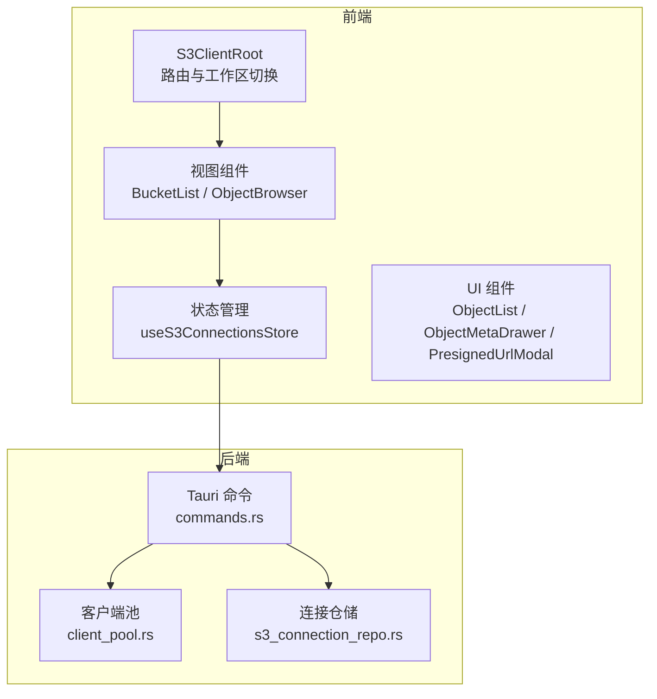
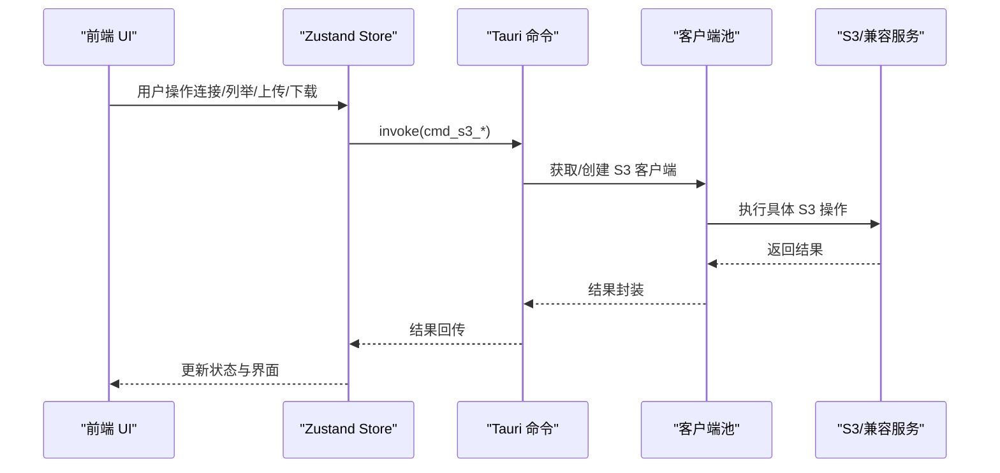
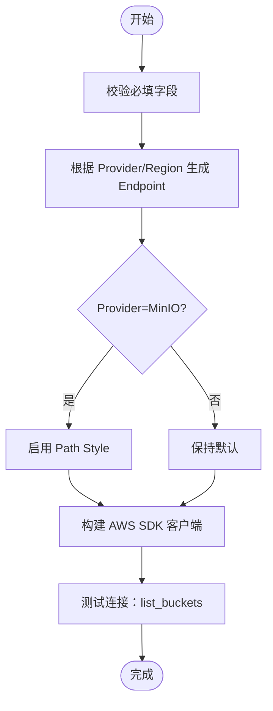
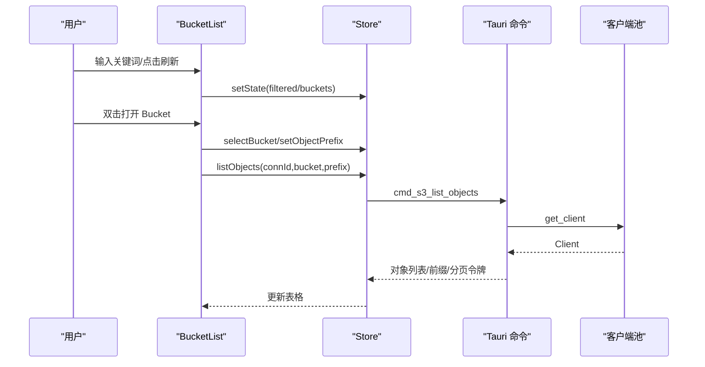
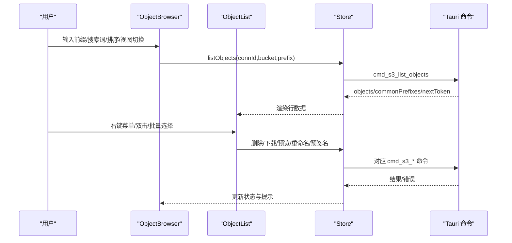
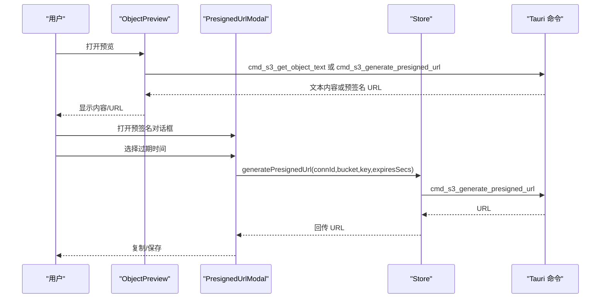
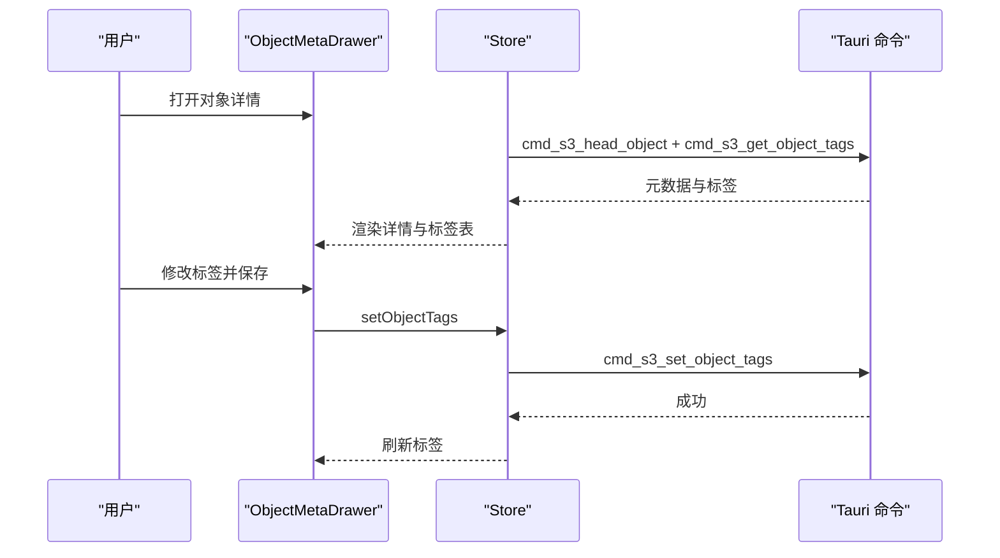
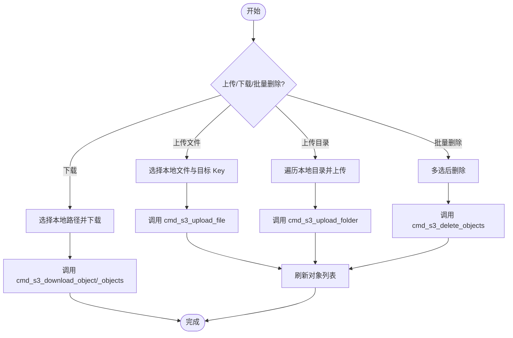
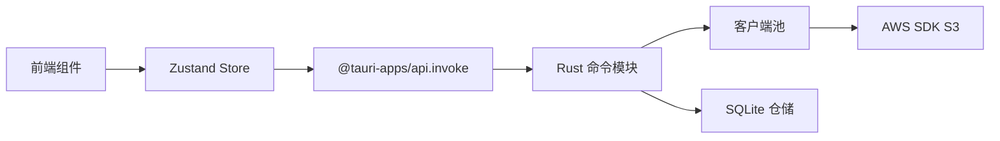

# S3 浏览器插件

<cite>
**本文档引用的文件**
- [README.md](file://README.md)
- [index.tsx](file://src/plugins/s3-client/index.tsx)
- [types.ts](file://src/plugins/s3-client/types.ts)
- [s3-connections.ts](file://src/plugins/s3-client/store/s3-connections.ts)
- [BucketList.tsx](file://src/plugins/s3-client/views/BucketList.tsx)
- [ObjectBrowser.tsx](file://src/plugins/s3-client/views/ObjectBrowser.tsx)
- [S3ConnectionForm.tsx](file://src/plugins/s3-client/components/S3ConnectionForm.tsx)
- [ObjectList.tsx](file://src/plugins/s3-client/components/ObjectList.tsx)
- [ObjectMetaDrawer.tsx](file://src/plugins/s3-client/components/ObjectMetaDrawer.tsx)
- [ObjectPreview.tsx](file://src/plugins/s3-client/components/ObjectPreview.tsx)
- [PresignedUrlModal.tsx](file://src/plugins/s3-client/components/PresignedUrlModal.tsx)
- [mod.rs](file://src-tauri/src/plugins/s3/mod.rs)
- [client_pool.rs](file://src-tauri/src/plugins/s3/client_pool.rs)
- [commands.rs](file://src-tauri/src/plugins/s3/commands.rs)
- [s3_connection_repo.rs](file://src-tauri/src/db/s3_connection_repo.rs)
</cite>

## 目录
1. [简介](#简介)
2. [项目结构](#项目结构)
3. [核心组件](#核心组件)
4. [架构总览](#架构总览)
5. [详细组件分析](#详细组件分析)
6. [依赖关系分析](#依赖关系分析)
7. [性能考虑](#性能考虑)
8. [故障排除指南](#故障排除指南)
9. [结论](#结论)
10. [附录](#附录)

## 简介
本文件为 S3 浏览器插件的详细云存储功能文档，涵盖 S3 连接配置、Bucket 浏览、对象管理、预签名 URL 生成与分享、文件上传下载、在线预览、批量操作、搜索过滤、分页加载、进度跟踪与错误处理等核心能力。同时提供对 AWS、阿里云 OSS、腾讯云 COS、Cloudflare R2 等主流云厂商的兼容性说明与配置指南。

## 项目结构
S3 插件采用前端 React + Zustand 状态管理 + Rust 后端 Tauri 命令的分层设计：
- 前端插件层：负责用户界面、交互逻辑与状态管理
- 后端插件层：通过 Tauri 命令桥接 Rust AWS SDK，执行 S3 操作
- 数据持久化：SQLite 存储连接配置，敏感字段加密

**图表来源**
- [index.tsx:10-58](file://src/plugins/s3-client/index.tsx#L10-L58)
- [s3-connections.ts:137-431](file://src/plugins/s3-client/store/s3-connections.ts#L137-L431)
- [BucketList.tsx:19-191](file://src/plugins/s3-client/views/BucketList.tsx#L19-L191)
- [ObjectBrowser.tsx:26-445](file://src/plugins/s3-client/views/ObjectBrowser.tsx#L26-L445)
- [commands.rs:14-95](file://src-tauri/src/plugins/s3/commands.rs#L14-L95)
- [client_pool.rs:10-86](file://src-tauri/src/plugins/s3/client_pool.rs#L10-L86)
- [s3_connection_repo.rs:38-72](file://src-tauri/src/db/s3_connection_repo.rs#L38-L72)

**章节来源**
- [README.md:13-34](file://README.md#L13-L34)
- [index.tsx:1-68](file://src/plugins/s3-client/index.tsx#L1-L68)
- [s3-connections.ts:1-136](file://src/plugins/s3-client/store/s3-connections.ts#L1-L136)

## 核心组件
- 插件入口与工作区：S3ClientRoot 提供连接、Bucket、对象三段式工作区切换与激活连接显示
- 连接管理：S3ConnectionForm 支持多厂商 Provider（AWS、MinIO、阿里云、腾讯云、R2、Custom），自动推断 Endpoint 与 Path Style
- Bucket 管理：BucketList 支持搜索、刷新、新建、删除、设置
- 对象浏览：ObjectBrowser 支持前缀导航、搜索、排序、列表/网格视图、批量选择、预览、下载、上传、重命名、复制路径、删除、预签名 URL 分享
- 预签名 URL：PresignedUrlModal 与 ObjectPreview 统一生成与复制临时链接
- 元数据与标签：ObjectMetaDrawer 展示对象详情与元数据，并支持标签增删改

**章节来源**
- [index.tsx:10-58](file://src/plugins/s3-client/index.tsx#L10-L58)
- [S3ConnectionForm.tsx:14-40](file://src/plugins/s3-client/components/S3ConnectionForm.tsx#L14-L40)
- [BucketList.tsx:38-158](file://src/plugins/s3-client/views/BucketList.tsx#L38-L158)
- [ObjectBrowser.tsx:74-332](file://src/plugins/s3-client/views/ObjectBrowser.tsx#L74-L332)
- [ObjectMetaDrawer.tsx:15-137](file://src/plugins/s3-client/components/ObjectMetaDrawer.tsx#L15-L137)

## 架构总览
前后端通过 Tauri 命令通信，前端调用 Zustand Store，Store 通过 invoke 调用后端命令，后端使用 AWS Rust SDK 与 S3 兼容服务交互。

**图表来源**
- [s3-connections.ts:151-177](file://src/plugins/s3-client/store/s3-connections.ts#L151-L177)
- [commands.rs:14-95](file://src-tauri/src/plugins/s3/commands.rs#L14-L95)
- [client_pool.rs:34-58](file://src-tauri/src/plugins/s3/client_pool.rs#L34-L58)

## 详细组件分析

### 连接配置与认证
- 支持 Provider：aws、minio、aliyun、tencent、r2、custom
- 自动 Endpoint 推断：根据 Provider 与 Region 自动生成 Endpoint
- Path Style：MinIO 等兼容服务启用强制 Path Style
- 连接测试：调用 list_buckets 并返回耗时

**图表来源**
- [S3ConnectionForm.tsx:34-94](file://src/plugins/s3-client/components/S3ConnectionForm.tsx#L34-L94)
- [client_pool.rs:34-58](file://src-tauri/src/plugins/s3/client_pool.rs#L34-L58)
- [commands.rs:36-80](file://src-tauri/src/plugins/s3/commands.rs#L36-L80)

**章节来源**
- [S3ConnectionForm.tsx:14-40](file://src/plugins/s3-client/components/S3ConnectionForm.tsx#L14-L40)
- [client_pool.rs:15-32](file://src-tauri/src/plugins/s3/client_pool.rs#L15-L32)
- [commands.rs:36-80](file://src-tauri/src/plugins/s3/commands.rs#L36-L80)

### Bucket 浏览与管理
- 搜索过滤：按名称大小写无关匹配
- 分页与刷新：支持分页控件与一键刷新
- 新建/删除：弹窗输入与二次确认
- 设置：打开 Bucket 设置抽屉（如版本化、位置等）

**图表来源**
- [BucketList.tsx:38-114](file://src/plugins/s3-client/views/BucketList.tsx#L38-L114)
- [s3-connections.ts:197-245](file://src/plugins/s3-client/store/s3-connections.ts#L197-L245)

**章节来源**
- [BucketList.tsx:38-158](file://src/plugins/s3-client/views/BucketList.tsx#L38-L158)
- [s3-connections.ts:197-245](file://src/plugins/s3-client/store/s3-connections.ts#L197-L245)

### 对象浏览与操作
- 前缀导航：面包屑逐级进入子目录
- 搜索与排序：按名称/大小/最后修改时间排序
- 视图模式：列表/网格双模式
- 批量操作：多选删除、复制路径、下载、预览、重命名、预签名 URL
- 文件上传/下载：支持单文件、整目录上传与下载
- 在线预览：文本/图片/其他类型生成临时预签名 URL

**图表来源**
- [ObjectBrowser.tsx:74-100](file://src/plugins/s3-client/views/ObjectBrowser.tsx#L74-L100)
- [ObjectList.tsx:51-246](file://src/plugins/s3-client/components/ObjectList.tsx#L51-L246)
- [s3-connections.ts:225-245](file://src/plugins/s3-client/store/s3-connections.ts#L225-L245)

**章节来源**
- [ObjectBrowser.tsx:74-332](file://src/plugins/s3-client/views/ObjectBrowser.tsx#L74-L332)
- [ObjectList.tsx:51-246](file://src/plugins/s3-client/components/ObjectList.tsx#L51-L246)
- [s3-connections.ts:225-245](file://src/plugins/s3-client/store/s3-connections.ts#L225-L245)

### 预签名 URL 生成与分享
- 生成策略：根据内容类型决定直接读取文本或生成临时预签名 URL
- 时间选项：5 分钟至 7 天
- 复制与分享：一键复制到剪贴板

**图表来源**
- [ObjectPreview.tsx:28-61](file://src/plugins/s3-client/components/ObjectPreview.tsx#L28-L61)
- [PresignedUrlModal.tsx:11-61](file://src/plugins/s3-client/components/PresignedUrlModal.tsx#L11-L61)
- [s3-connections.ts:421-428](file://src/plugins/s3-client/store/s3-connections.ts#L421-L428)

**章节来源**
- [ObjectPreview.tsx:28-61](file://src/plugins/s3-client/components/ObjectPreview.tsx#L28-L61)
- [PresignedUrlModal.tsx:11-61](file://src/plugins/s3-client/components/PresignedUrlModal.tsx#L11-L61)
- [s3-connections.ts:421-428](file://src/plugins/s3-client/store/s3-connections.ts#L421-L428)

### 元数据查看与标签管理
- 元数据：展示 Key、内容类型、大小、ETag、最后修改、存储类型、版本 ID 等
- 标签：支持增删改查，保存后刷新

**图表来源**
- [ObjectMetaDrawer.tsx:15-137](file://src/plugins/s3-client/components/ObjectMetaDrawer.tsx#L15-L137)
- [s3-connections.ts:331-341](file://src/plugins/s3-client/store/s3-connections.ts#L331-L341)

**章节来源**
- [ObjectMetaDrawer.tsx:15-137](file://src/plugins/s3-client/components/ObjectMetaDrawer.tsx#L15-L137)
- [s3-connections.ts:331-341](file://src/plugins/s3-client/store/s3-connections.ts#L331-L341)

### 上传下载与批量操作
- 单文件上传：选择本地路径与可选对象 Key
- 整目录上传：遍历本地目录，按相对路径映射到 S3 前缀
- 下载：支持单对象与目录下载，自动创建本地目录
- 批量删除：多选后统一删除，返回成功计数与错误列表

**图表来源**
- [ObjectBrowser.tsx:362-441](file://src/plugins/s3-client/views/ObjectBrowser.tsx#L362-L441)
- [s3-connections.ts:363-420](file://src/plugins/s3-client/store/s3-connections.ts#L363-L420)
- [commands.rs:651-725](file://src-tauri/src/plugins/s3/commands.rs#L651-L725)

**章节来源**
- [ObjectBrowser.tsx:362-441](file://src/plugins/s3-client/views/ObjectBrowser.tsx#L362-L441)
- [s3-connections.ts:363-420](file://src/plugins/s3-client/store/s3-connections.ts#L363-L420)
- [commands.rs:651-725](file://src-tauri/src/plugins/s3/commands.rs#L651-L725)

## 依赖关系分析
- 前端依赖：Ant Design UI、Zustand 状态管理、@tauri-apps/api 核心通信
- 后端依赖：aws-config、aws-sdk-s3、rusqlite、uuid、urlencoding
- 数据流：前端 Store -> Tauri 命令 -> AWS SDK -> S3/兼容服务

**图表来源**
- [s3-connections.ts:1-13](file://src/plugins/s3-client/store/s3-connections.ts#L1-L13)
- [commands.rs:1-12](file://src-tauri/src/plugins/s3/commands.rs#L1-L12)
- [client_pool.rs:1-8](file://src-tauri/src/plugins/s3/client_pool.rs#L1-L8)
- [s3_connection_repo.rs:1-31](file://src-tauri/src/db/s3_connection_repo.rs#L1-L31)

**章节来源**
- [s3-connections.ts:1-13](file://src/plugins/s3-client/store/s3-connections.ts#L1-L13)
- [commands.rs:1-12](file://src-tauri/src/plugins/s3/commands.rs#L1-L12)
- [client_pool.rs:1-8](file://src-tauri/src/plugins/s3/client_pool.rs#L1-L8)
- [s3_connection_repo.rs:1-31](file://src-tauri/src/db/s3_connection_repo.rs#L1-L31)

## 性能考虑
- 分页加载：list_objects 默认每页 200 条，支持 continuationToken 追加加载
- 虚拟滚动：表格启用虚拟化，提升大数据量浏览性能
- 路径规范化：上传目录时规范化前缀与斜杠，避免重复层级
- 连接池：Rust 层维护连接池，避免频繁重建客户端
- 预览策略：文本直接读取，非文本生成短期预签名 URL，减少大对象直读压力

**章节来源**
- [s3-connections.ts:225-245](file://src/plugins/s3-client/store/s3-connections.ts#L225-L245)
- [ObjectList.tsx:134-135](file://src/plugins/s3-client/components/ObjectList.tsx#L134-L135)
- [ObjectBrowser.tsx:385-402](file://src/plugins/s3-client/views/ObjectBrowser.tsx#L385-L402)
- [client_pool.rs:61-77](file://src-tauri/src/plugins/s3/client_pool.rs#L61-L77)

## 故障排除指南
- 连接失败：检查 Provider/Region/Endpoint/Access Key/Secret Key 是否正确；使用“测试连接”查看耗时与错误
- 无法列出 Bucket：确认权限与 Endpoint；部分区域需指定 Location Constraint
- 上传/下载异常：检查本地路径可读写、网络连通性；查看返回的错误列表
- 预签名 URL 无效：确认过期时间与对象存在性；浏览器可能缓存旧 URL
- MinIO 兼容：确保启用 Path Style；Endpoint 使用 MinIO 地址

**章节来源**
- [S3ConnectionForm.tsx:103-107](file://src/plugins/s3-client/components/S3ConnectionForm.tsx#L103-L107)
- [commands.rs:265-291](file://src-tauri/src/plugins/s3/commands.rs#L265-L291)
- [commands.rs:443-496](file://src-tauri/src/plugins/s3/commands.rs#L443-L496)
- [client_pool.rs:54-56](file://src-tauri/src/plugins/s3/client_pool.rs#L54-L56)

## 结论
该 S3 浏览器插件通过清晰的前后端分层与完善的 AWS Rust SDK 集成，提供了从连接配置到对象管理、预签名分享、批量操作与在线预览的一体化体验。其多厂商兼容性与分页/虚拟化等性能优化，使其适用于生产环境的大规模对象浏览与管理需求。

## 附录

### 兼容性与配置指南
- AWS S3：默认 Provider，Endpoint 由 Region 推断
- MinIO：Provider=MinIO，自动启用 Path Style，建议自定义 Endpoint
- 阿里云 OSS：Provider=aliyun，Endpoint 由 oss-{region}.aliyuncs.com 推断
- 腾讯云 COS：Provider=tencent，Endpoint 由 cos.{region}.myqcloud.com 推断
- Cloudflare R2：Provider=r2，Endpoint 由 {region}.r2.cloudflarestorage.com 推断
- Custom：自定义 Provider，必须填写 Endpoint

**章节来源**
- [S3ConnectionForm.tsx:14-40](file://src/plugins/s3-client/components/S3ConnectionForm.tsx#L14-L40)
- [client_pool.rs:15-22](file://src-tauri/src/plugins/s3/client_pool.rs#L15-L22)

### 数据模型概览
- 连接配置：包含 Provider、Region、Endpoint、Access Key、Path Style、默认 Bucket 等
- Bucket 信息：名称、创建时间、区域、版本化状态
- 对象项：Key、大小、最后修改、ETag、存储类型
- 列表结果：对象数组、公共前缀、分页令牌、是否截断
- 对象元数据：Key、内容类型、长度、ETag、元数据、版本 ID、存储类型
- 标签：键值对列表
- 统计：对象数量、总大小、按存储类型的分布

**章节来源**
- [types.ts:1-110](file://src/plugins/s3-client/types.ts#L1-L110)