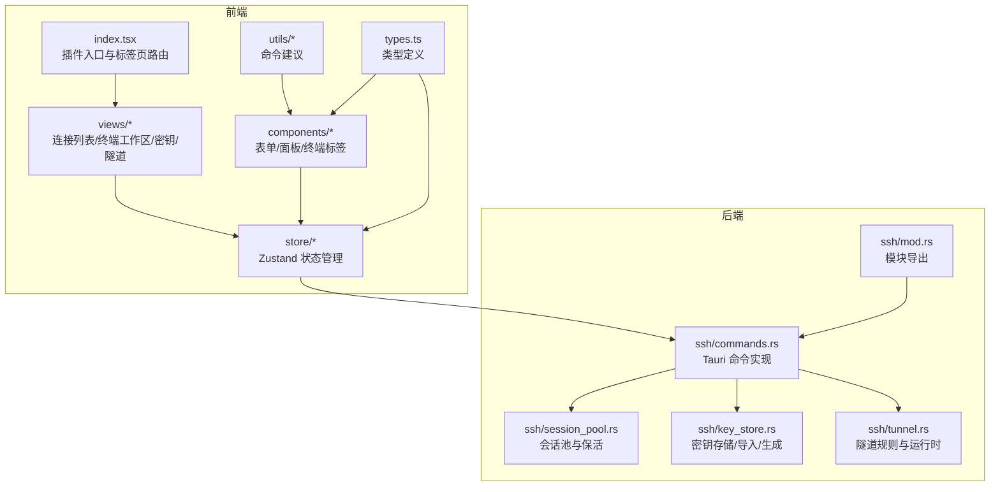
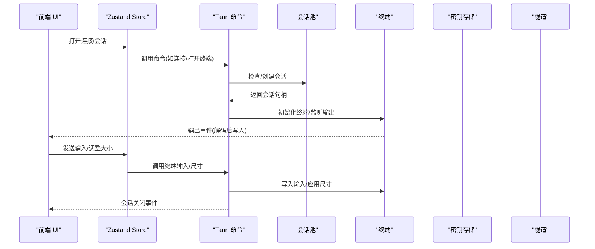
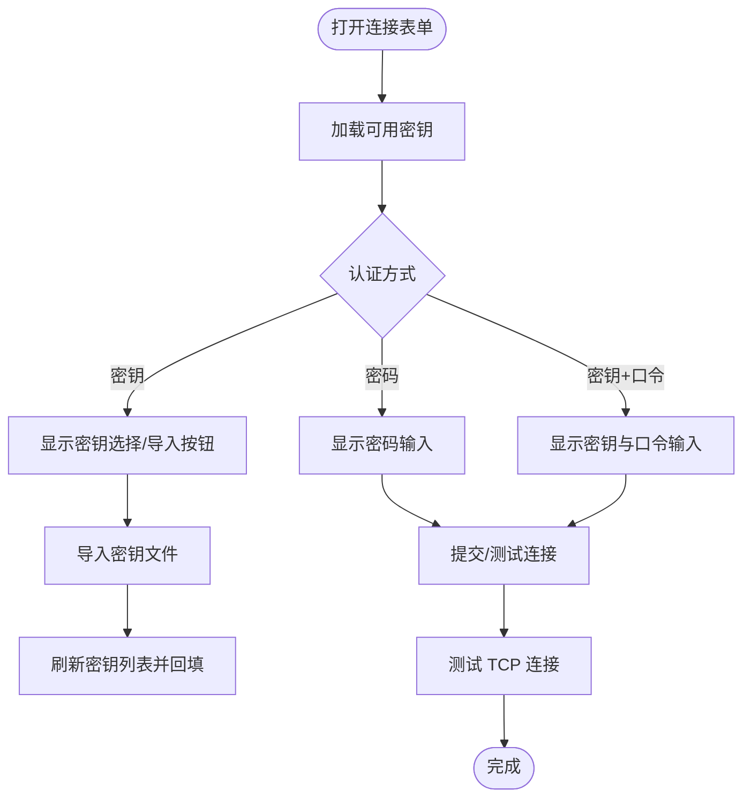
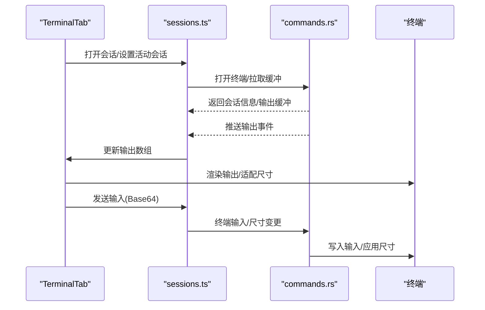
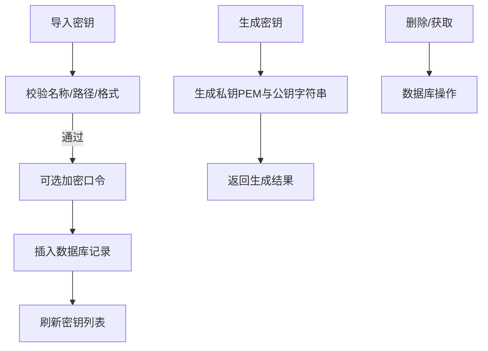
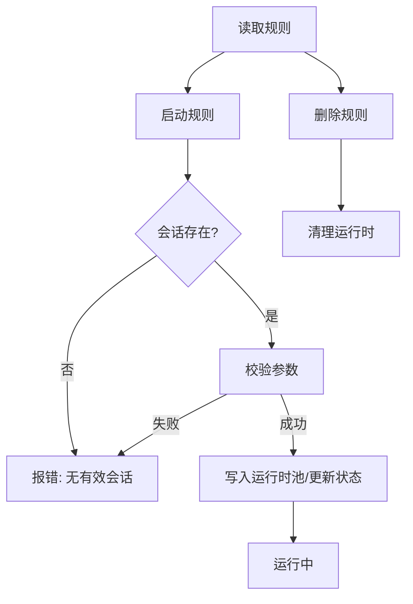
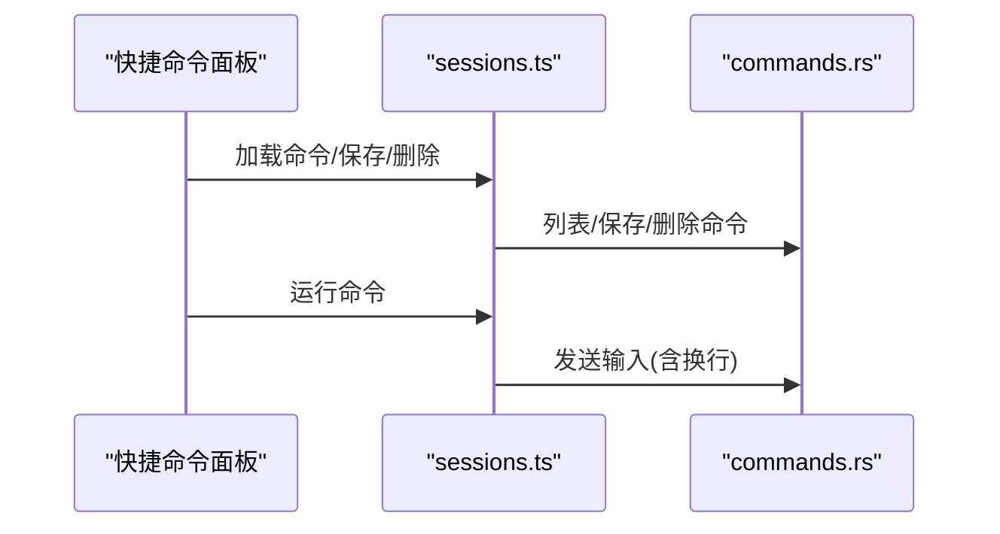
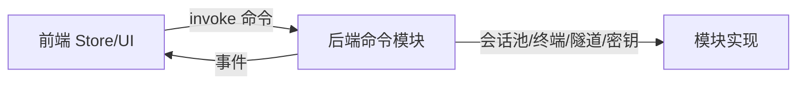

# SSH 客户端插件

<cite>
**本文引用的文件**
- [index.tsx](file://src/plugins/ssh-client/index.tsx)
- [types.ts](file://src/plugins/ssh-client/types.ts)
- [ssh-connections.ts](file://src/plugins/ssh-client/store/ssh-connections.ts)
- [sessions.ts](file://src/plugins/ssh-client/store/sessions.ts)
- [keys.ts](file://src/plugins/ssh-client/store/keys.ts)
- [tunnels.ts](file://src/plugins/ssh-client/store/tunnels.ts)
- [SshConnectionForm.tsx](file://src/plugins/ssh-client/components/SshConnectionForm.tsx)
- [KeyImportForm.tsx](file://src/plugins/ssh-client/components/KeyImportForm.tsx)
- [QuickCommandPanel.tsx](file://src/plugins/ssh-client/components/QuickCommandPanel.tsx)
- [TerminalTab.tsx](file://src/plugins/ssh-client/components/TerminalTab.tsx)
- [command-suggestions.ts](file://src/plugins/ssh-client/utils/command-suggestions.ts)
- [SshConnectionList.tsx](file://src/plugins/ssh-client/views/SshConnectionList.tsx)
- [mod.rs](file://src-tauri/src/plugins/ssh/mod.rs)
- [session_pool.rs](file://src-tauri/src/plugins/ssh/session_pool.rs)
- [key_store.rs](file://src-tauri/src/plugins/ssh/key_store.rs)
- [tunnel.rs](file://src-tauri/src/plugins/ssh/tunnel.rs)
- [commands.rs](file://src-tauri/src/plugins/ssh/commands.rs)
</cite>

## 目录
1. [简介](#简介)
2. [项目结构](#项目结构)
3. [核心组件](#核心组件)
4. [架构总览](#架构总览)
5. [详细组件分析](#详细组件分析)
6. [依赖关系分析](#依赖关系分析)
7. [性能考虑](#性能考虑)
8. [故障排除指南](#故障排除指南)
9. [结论](#结论)
10. [附录](#附录)

## 简介
本文件为 SSH 客户端插件的技术文档，覆盖连接管理、多标签终端会话、密钥管理、端口转发与快捷命令面板等核心功能。文档从系统架构、组件关系、数据流与处理逻辑、集成点与错误处理等方面进行深入说明，并结合前端 React/Zustand 与后端 Tauri/Rust 的实现细节，提供可操作的排障建议、性能优化与安全配置最佳实践。

## 项目结构
该插件采用“视图层 + 状态层 + 工具层 + 类型定义”的组织方式，前端通过 Tauri 命令与后端通信；后端以模块化方式组织 SSH 会话池、密钥存储、隧道与终端处理。

**图表来源**
- [index.tsx:12-56](file://src/plugins/ssh-client/index.tsx#L12-L56)
- [SshConnectionList.tsx:27-100](file://src/plugins/ssh-client/views/SshConnectionList.tsx#L27-L100)
- [ssh-connections.ts:25-76](file://src/plugins/ssh-client/store/ssh-connections.ts#L25-L76)
- [sessions.ts:50-191](file://src/plugins/ssh-client/store/sessions.ts#L50-L191)
- [keys.ts:17-46](file://src/plugins/ssh-client/store/keys.ts#L17-L46)
- [tunnels.ts:27-63](file://src/plugins/ssh-client/store/tunnels.ts#L27-L63)
- [mod.rs:1-7](file://src-tauri/src/plugins/ssh/mod.rs#L1-L7)
- [commands.rs:8-266](file://src-tauri/src/plugins/ssh/commands.rs#L8-L266)
- [session_pool.rs:17-172](file://src-tauri/src/plugins/ssh/session_pool.rs#L17-L172)
- [key_store.rs:39-153](file://src-tauri/src/plugins/ssh/key_store.rs#L39-L153)
- [tunnel.rs:45-220](file://src-tauri/src/plugins/ssh/tunnel.rs#L45-L220)

**章节来源**
- [index.tsx:1-66](file://src/plugins/ssh-client/index.tsx#L1-L66)
- [types.ts:1-115](file://src/plugins/ssh-client/types.ts#L1-L115)

## 核心组件
- 插件入口与标签页路由：负责在主界面中切换“连接”“终端”“密钥”“隧道”四个视图。
- 连接管理：提供连接配置表单、测试连通性、保存/删除/连接/断开。
- 终端会话：多标签页终端，支持输入、输出缓冲、自适应大小、命令建议与快捷命令面板。
- 密钥管理：列出/导入/删除密钥，生成密钥对，导出公钥。
- 隧道管理：本地/远程/动态端口转发规则的增删改查与启停。
- 快捷命令：按连接或全局作用域保存常用命令，一键执行。

**章节来源**
- [index.tsx:12-56](file://src/plugins/ssh-client/index.tsx#L12-L56)
- [SshConnectionList.tsx:27-100](file://src/plugins/ssh-client/views/SshConnectionList.tsx#L27-L100)
- [TerminalTab.tsx:24-189](file://src/plugins/ssh-client/components/TerminalTab.tsx#L24-L189)
- [QuickCommandPanel.tsx:23-123](file://src/plugins/ssh-client/components/QuickCommandPanel.tsx#L23-L123)
- [SshConnectionForm.tsx:27-256](file://src/plugins/ssh-client/components/SshConnectionForm.tsx#L27-L256)
- [KeyImportForm.tsx:9-43](file://src/plugins/ssh-client/components/KeyImportForm.tsx#L9-L43)
- [tunnels.ts:27-63](file://src/plugins/ssh-client/store/tunnels.ts#L27-L63)

## 架构总览
前端通过 Tauri 命令调用后端实现，后端以模块化方式提供会话池、密钥存储、隧道与终端能力。事件驱动用于会话关闭通知与终端输出/退出事件。

**图表来源**
- [commands.rs:64-106](file://src-tauri/src/plugins/ssh/commands.rs#L64-L106)
- [session_pool.rs:105-139](file://src-tauri/src/plugins/ssh/session_pool.rs#L105-L139)
- [sessions.ts:85-139](file://src/plugins/ssh-client/store/sessions.ts#L85-L139)

**章节来源**
- [commands.rs:8-266](file://src-tauri/src/plugins/ssh/commands.rs#L8-L266)
- [session_pool.rs:17-172](file://src-tauri/src/plugins/ssh/session_pool.rs#L17-L172)
- [sessions.ts:50-191](file://src/plugins/ssh-client/store/sessions.ts#L50-L191)

## 详细组件分析

### 连接配置与认证
- 表单支持基础与高级两部分：主机、端口、用户名、认证方式（密码/密钥/密钥+口令）；高级项包含跳板机、编码与保活间隔。
- 认证方式选择影响字段显示；密钥模式下可直接选择已有密钥或导入新密钥。
- 测试连接仅做 TCP 握手与耗时统计，不进行 SSH 握手。

**图表来源**
- [SshConnectionForm.tsx:34-96](file://src/plugins/ssh-client/components/SshConnectionForm.tsx#L34-L96)
- [KeyImportForm.tsx:9-43](file://src/plugins/ssh-client/components/KeyImportForm.tsx#L9-L43)
- [ssh-connections.ts:29-63](file://src/plugins/ssh-client/store/ssh-connections.ts#L29-L63)

**章节来源**
- [SshConnectionForm.tsx:27-256](file://src/plugins/ssh-client/components/SshConnectionForm.tsx#L27-L256)
- [KeyImportForm.tsx:9-43](file://src/plugins/ssh-client/components/KeyImportForm.tsx#L9-L43)
- [ssh-connections.ts:25-76](file://src/plugins/ssh-client/store/ssh-connections.ts#L25-L76)

### 会话状态管理与终端渲染
- 多标签会话：每个会话有独立 sessionId、连接 id、标签名与状态（连接中/活跃/已关闭）。
- 输出缓冲与事件：后端通过事件推送输出块，前端解码后增量写入 xterm；会话退出时标记状态并清理监听。
- 输入与尺寸：输入前进行 Base64 编码，尺寸变更时同步 cols/rows。
- 命令建议：基于已保存的快捷命令与内置常用命令，按输入草稿匹配并展示候选。

**图表来源**
- [sessions.ts:85-139](file://src/plugins/ssh-client/store/sessions.ts#L85-L139)
- [TerminalTab.tsx:44-112](file://src/plugins/ssh-client/components/TerminalTab.tsx#L44-L112)
- [command-suggestions.ts:69-105](file://src/plugins/ssh-client/utils/command-suggestions.ts#L69-L105)
- [commands.rs:78-106](file://src-tauri/src/plugins/ssh/commands.rs#L78-L106)

**章节来源**
- [sessions.ts:50-191](file://src/plugins/ssh-client/store/sessions.ts#L50-L191)
- [TerminalTab.tsx:24-189](file://src/plugins/ssh-client/components/TerminalTab.tsx#L24-L189)
- [command-suggestions.ts:1-106](file://src/plugins/ssh-client/utils/command-suggestions.ts#L1-L106)

### 密钥管理与存储
- 列表/导入/删除/生成/获取公钥：导入时校验文件存在与格式，必要时加密存储口令；生成虚拟公钥字符串用于展示。
- 数据持久化：密钥信息存于数据库表，包含名称、类型、私钥路径、公钥预览与创建时间。

**图表来源**
- [keys.ts:17-46](file://src/plugins/ssh-client/store/keys.ts#L17-L46)
- [key_store.rs:66-153](file://src-tauri/src/plugins/ssh/key_store.rs#L66-L153)

**章节来源**
- [keys.ts:17-46](file://src/plugins/ssh-client/store/keys.ts#L17-L46)
- [key_store.rs:39-153](file://src-tauri/src/plugins/ssh/key_store.rs#L39-L153)

### 端口转发与隧道规则
- 规则模型：支持本地/远程/动态三种类型，包含本地/远端主机与端口、自动启动与状态。
- 启停控制：启动前校验会话存在与参数完整性；运行时维护内存映射表并更新状态。
- 命令接口：统一通过 Tauri 命令暴露列表/保存/删除/启动/停止。

**图表来源**
- [tunnels.ts:27-63](file://src/plugins/ssh-client/store/tunnels.ts#L27-L63)
- [tunnel.rs:132-219](file://src-tauri/src/plugins/ssh/tunnel.rs#L132-L219)

**章节来源**
- [tunnels.ts:27-63](file://src/plugins/ssh-client/store/tunnels.ts#L27-L63)
- [tunnel.rs:45-220](file://src-tauri/src/plugins/ssh/tunnel.rs#L45-L220)

### 快捷命令面板
- 作用域：支持连接级与全局级命令；按排序与名称排序展示。
- 功能：新建、运行、删除；运行时将命令追加换行并发送到当前活动会话。
- 建议：与终端内命令草稿联动，提供快速补全。

**图表来源**
- [QuickCommandPanel.tsx:23-123](file://src/plugins/ssh-client/components/QuickCommandPanel.tsx#L23-L123)
- [sessions.ts:69-84](file://src/plugins/ssh-client/store/sessions.ts#L69-L84)
- [commands.rs:147-215](file://src-tauri/src/plugins/ssh/commands.rs#L147-L215)

**章节来源**
- [QuickCommandPanel.tsx:23-123](file://src/plugins/ssh-client/components/QuickCommandPanel.tsx#L23-L123)
- [sessions.ts:69-84](file://src/plugins/ssh-client/store/sessions.ts#L69-L84)
- [command-suggestions.ts:69-105](file://src/plugins/ssh-client/utils/command-suggestions.ts#L69-L105)

## 依赖关系分析
- 前端依赖：Ant Design UI、xterm 及其插件、Zustand 状态管理、@tauri-apps API。
- 后端依赖：Tauri 异步运行时、SQLite(rusqlite)、UUID、Base64、加密模块。
- 事件与命令：前端通过 invoke 调用后端命令；后端通过 Emitter 发布事件（会话关闭、终端输出/退出）。

**图表来源**
- [commands.rs:8-266](file://src-tauri/src/plugins/ssh/commands.rs#L8-L266)
- [mod.rs:1-7](file://src-tauri/src/plugins/ssh/mod.rs#L1-L7)

**章节来源**
- [commands.rs:8-266](file://src-tauri/src/plugins/ssh/commands.rs#L8-L266)
- [mod.rs:1-7](file://src-tauri/src/plugins/ssh/mod.rs#L1-L7)

## 性能考虑
- 会话保活与断线恢复：后端定时探测 TCP 可达性，若中断则尝试重连并清理资源，避免僵尸会话占用。
- 终端输出批处理：后端事件推送输出块，前端解码后批量写入，减少渲染抖动。
- 尺寸同步：ResizeObserver 监听容器变化，及时触发终端适配与尺寸同步。
- 建议
  - 合理设置 keepalive 间隔，避免频繁探测。
  - 大量输出时启用滚动缓冲上限，避免内存膨胀。
  - 使用连接池复用会话，避免重复握手成本。

[本节为通用性能建议，无需特定文件引用]

## 故障排除指南
- 连接测试失败
  - 现象：TCP 握手超时或解析失败。
  - 排查：确认主机/端口可达、DNS 解析正常、防火墙放行。
  - 参考
    - [cmd_ssh_test_connection:30-62](file://src-tauri/src/plugins/ssh/commands.rs#L30-L62)
- 会话无法打开/终端无输出
  - 现象：打开会话后无输出或立即退出。
  - 排查：检查会话是否仍处于“连接中/活跃”，查看后端会话池状态与事件推送；确认终端输入/尺寸命令正确。
  - 参考
    - [cmd_ssh_open_terminal:78-83](file://src-tauri/src/plugins/ssh/commands.rs#L78-L83)
    - [cmd_ssh_terminal_input:86-91](file://src-tauri/src/plugins/ssh/commands.rs#L86-L91)
    - [cmd_ssh_terminal_resize:94-96](file://src-tauri/src/plugins/ssh/commands.rs#L94-L96)
- 断线后未自动恢复
  - 现象：网络波动后会话被移除且无自动重连。
  - 排查：检查 keepalive 任务是否仍在运行，TCP 探测是否成功，会话池是否清理。
  - 参考
    - [session_pool.rs:50-103](file://src-tauri/src/plugins/ssh/session_pool.rs#L50-L103)
- 隧道启动失败
  - 现象：启动本地/远程/动态隧道时报参数缺失或会话无效。
  - 排查：核对本地/远端主机与端口配置，确保连接存在且状态为运行中。
  - 参考
    - [tunnel.rs:132-199](file://src-tauri/src/plugins/ssh/tunnel.rs#L132-L199)
- 密钥导入失败
  - 现象：导入提示格式不支持或文件不存在。
  - 排查：确认私钥文件存在且包含“PRIVATE KEY”标识，口令可选加密。
  - 参考
    - [key_store.rs:66-108](file://src-tauri/src/plugins/ssh/key_store.rs#L66-L108)

**章节来源**
- [commands.rs:30-106](file://src-tauri/src/plugins/ssh/commands.rs#L30-L106)
- [session_pool.rs:50-103](file://src-tauri/src/plugins/ssh/session_pool.rs#L50-L103)
- [tunnel.rs:132-199](file://src-tauri/src/plugins/ssh/tunnel.rs#L132-L199)
- [key_store.rs:66-108](file://src-tauri/src/plugins/ssh/key_store.rs#L66-L108)

## 结论
该 SSH 客户端插件通过清晰的前后端分层与模块化设计，实现了连接管理、多标签终端、密钥与隧道的完整闭环。前端以 Zustand 管理状态与事件，后端以 Tauri 命令桥接 Rust 能力，具备良好的扩展性与可维护性。建议在生产使用中完善日志与监控、强化密钥与口令的安全策略，并根据场景优化会话保活与终端渲染性能。

[本节为总结性内容，无需特定文件引用]

## 附录
- 类型定义概览：连接、会话元数据、快捷命令、密钥、隧道规则等。
- 命令清单：连接、会话、密钥、隧道、快捷命令等命令的参数与返回值。

**章节来源**
- [types.ts:1-115](file://src/plugins/ssh-client/types.ts#L1-L115)
- [commands.rs:8-266](file://src-tauri/src/plugins/ssh/commands.rs#L8-L266)