# 核心插件

<cite>
**本文引用的文件**
- [src/plugins/redis-manager/index.tsx](file://src/plugins/redis-manager/index.tsx)
- [src/plugins/redis-manager/store/connections.ts](file://src/plugins/redis-manager/store/connections.ts)
- [src/plugins/ssh-client/index.tsx](file://src/plugins/ssh-client/index.tsx)
- [src/plugins/ssh-client/store/ssh-connections.ts](file://src/plugins/ssh-client/store/ssh-connections.ts)
- [src/plugins/s3-client/index.tsx](file://src/plugins/s3-client/index.tsx)
- [src/plugins/s3-client/store/s3-connections.ts](file://src/plugins/s3-client/store/s3-connections.ts)
- [src/plugins/mongodb-client/index.tsx](file://src/plugins/mongodb-client/index.tsx)
- [src/plugins/mongodb-client/store/mongodb-connections.ts](file://src/plugins/mongodb-client/store/mongodb-connections.ts)
- [src/plugins/mysql-client/index.tsx](file://src/plugins/mysql-client/index.tsx)
- [src/plugins/mysql-client/store/mysql-connections.ts](file://src/plugins/mysql-client/store/mysql-connections.ts)
- [src/plugins/network-tools/index.tsx](file://src/plugins/network-tools/index.tsx)
- [src/plugins/network-tools/store/network-tools.ts](file://src/plugins/network-tools/store/network-tools.ts)
- [src/plugins/api-debugger/index.tsx](file://src/plugins/api-debugger/index.tsx)
- [src/plugins/api-debugger/store/api-debugger.ts](file://src/plugins/api-debugger/store/api-debugger.ts)
- [src/plugins/mq-client/index.tsx](file://src/plugins/mq-client/index.tsx)
- [src/plugins/mq-client/store/mq-client.ts](file://src/plugins/mq-client/store/mq-client.ts)
</cite>

## 目录
1. [简介](#简介)
2. [项目结构](#项目结构)
3. [核心组件](#核心组件)
4. [架构总览](#架构总览)
5. [详细组件分析](#详细组件分析)
6. [依赖关系分析](#依赖关系分析)
7. [性能考量](#性能考量)
8. [故障排查指南](#故障排查指南)
9. [结论](#结论)
10. [附录](#附录)

## 简介
本文件面向 DevNexus 的核心插件，系统性梳理各插件的功能特性、实现架构与使用方法。覆盖以下插件：
- Redis 管理器：连接管理、DB 切换、Key 树浏览、命令控制台、服务器信息展示
- SSH 客户端：连接管理、多标签终端、密钥管理、端口转发
- S3 浏览器：连接配置、Bucket 浏览、对象管理、预签名 URL 生成
- MongoDB 客户端：数据库/集合浏览、文档 CRUD、查询聚合、导入导出
- MySQL 客户端：表数据管理、SQL 工作区、索引管理
- 网络工具：Ping、TCP 端口检测、DNS 解析、Traceroute
- API 调试器：HTTP 请求构建、集合/环境管理、历史复跑
- MQ 客户端：RabbitMQ/Kafka 资源浏览、消息发送
- LAN 聊天：局域网通信与文件传输（在仓库中未发现对应插件）

每个插件均包含核心功能、配置项、使用场景与最佳实践说明。

## 项目结构
DevNexus 插件采用“插件注册 + 视图 + 状态存储”的分层组织方式：
- 插件入口：位于 src/plugins/<plugin>/index.tsx，定义插件清单与工作区 Tab 切换
- 视图层：位于 src/plugins/<plugin>/views/*，负责 UI 呈现与交互
- 状态层：位于 src/plugins/<plugin>/store/*，使用 Zustand 管理状态与后端调用
- 后端桥接：通过 @tauri-apps/api/core 的 invoke 调用 Rust 插件命令

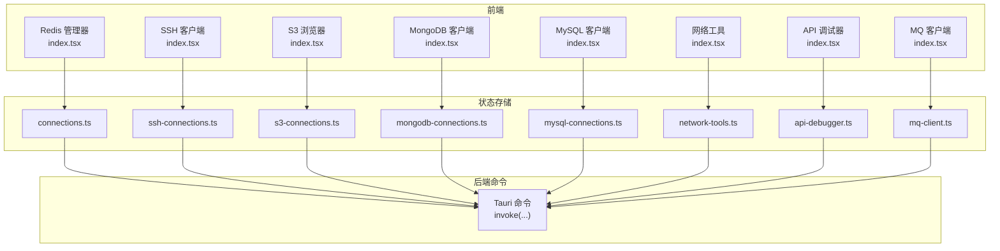

图表来源
- [src/plugins/redis-manager/index.tsx:14-57](file://src/plugins/redis-manager/index.tsx#L14-L57)
- [src/plugins/ssh-client/index.tsx:12-56](file://src/plugins/ssh-client/index.tsx#L12-L56)
- [src/plugins/s3-client/index.tsx:10-58](file://src/plugins/s3-client/index.tsx#L10-L58)
- [src/plugins/mongodb-client/index.tsx:14-77](file://src/plugins/mongodb-client/index.tsx#L14-L77)
- [src/plugins/mysql-client/index.tsx:14-35](file://src/plugins/mysql-client/index.tsx#L14-L35)
- [src/plugins/network-tools/index.tsx:9-24](file://src/plugins/network-tools/index.tsx#L9-L24)
- [src/plugins/api-debugger/index.tsx:13-36](file://src/plugins/api-debugger/index.tsx#L13-L36)
- [src/plugins/mq-client/index.tsx:13-35](file://src/plugins/mq-client/index.tsx#L13-L35)

章节来源
- [src/plugins/redis-manager/index.tsx:1-67](file://src/plugins/redis-manager/index.tsx#L1-L67)
- [src/plugins/ssh-client/index.tsx:1-66](file://src/plugins/ssh-client/index.tsx#L1-L66)
- [src/plugins/s3-client/index.tsx:1-68](file://src/plugins/s3-client/index.tsx#L1-L68)
- [src/plugins/mongodb-client/index.tsx:1-87](file://src/plugins/mongodb-client/index.tsx#L1-L87)
- [src/plugins/mysql-client/index.tsx:1-38](file://src/plugins/mysql-client/index.tsx#L1-L38)
- [src/plugins/network-tools/index.tsx:1-27](file://src/plugins/network-tools/index.tsx#L1-L27)
- [src/plugins/api-debugger/index.tsx:1-39](file://src/plugins/api-debugger/index.tsx#L1-L39)
- [src/plugins/mq-client/index.tsx:1-38](file://src/plugins/mq-client/index.tsx#L1-L38)

## 核心组件
- 插件清单与工作区
  - 每个插件在 index.tsx 中导出 PluginManifest，包含 id、名称、图标、版本与侧边栏顺序，并定义工作区 Tab 切换逻辑
  - Tab 切换通过本地状态驱动，切换时根据当前 Tab 渲染对应视图
- 状态存储（Zustand）
  - 统一通过 invoke 调用后端命令，封装连接生命周期、列表刷新、CRUD 操作与业务流程
  - 多数插件提供 fetchConnections/saveConnection/deleteConnection/testConnection/connect/disconnect 等标准操作
- 后端桥接
  - 所有前端动作最终通过 invoke 调用 Rust 插件命令，完成实际连接与数据操作

章节来源
- [src/plugins/redis-manager/index.tsx:14-57](file://src/plugins/redis-manager/index.tsx#L14-L57)
- [src/plugins/ssh-client/index.tsx:12-56](file://src/plugins/ssh-client/index.tsx#L12-L56)
- [src/plugins/s3-client/index.tsx:10-58](file://src/plugins/s3-client/index.tsx#L10-L58)
- [src/plugins/mongodb-client/index.tsx:14-77](file://src/plugins/mongodb-client/index.tsx#L14-L77)
- [src/plugins/mysql-client/index.tsx:14-35](file://src/plugins/mysql-client/index.tsx#L14-L35)
- [src/plugins/network-tools/index.tsx:9-24](file://src/plugins/network-tools/index.tsx#L9-L24)
- [src/plugins/api-debugger/index.tsx:13-36](file://src/plugins/api-debugger/index.tsx#L13-L36)
- [src/plugins/mq-client/index.tsx:13-35](file://src/plugins/mq-client/index.tsx#L13-L35)

## 架构总览
下图展示插件工作流：用户在工作区 Tab 中选择功能，前端状态存储发起 invoke 调用，后端执行具体任务并返回结果，状态存储更新 UI。

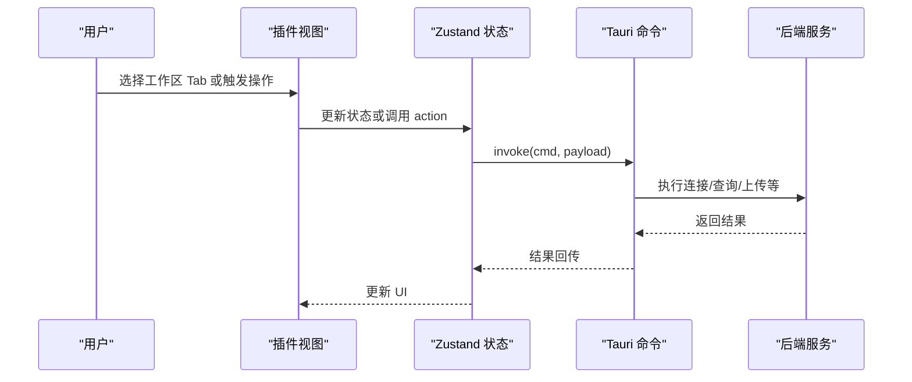

图表来源
- [src/plugins/redis-manager/store/connections.ts:33-83](file://src/plugins/redis-manager/store/connections.ts#L33-L83)
- [src/plugins/s3-client/store/s3-connections.ts:151-196](file://src/plugins/s3-client/store/s3-connections.ts#L151-L196)
- [src/plugins/mongodb-client/store/mongodb-connections.ts:123-161](file://src/plugins/mongodb-client/store/mongodb-connections.ts#L123-L161)
- [src/plugins/mysql-client/store/mysql-connections.ts:94-113](file://src/plugins/mysql-client/store/mysql-connections.ts#L94-L113)
- [src/plugins/network-tools/store/network-tools.ts:42-77](file://src/plugins/network-tools/store/network-tools.ts#L42-L77)
- [src/plugins/api-debugger/store/api-debugger.ts:62-72](file://src/plugins/api-debugger/store/api-debugger.ts#L62-L72)
- [src/plugins/mq-client/store/mq-client.ts:63-82](file://src/plugins/mq-client/store/mq-client.ts#L63-L82)

## 详细组件分析

### Redis 管理器
- 核心功能
  - 连接管理：保存、删除、测试、连接/断开
  - 数据库切换：选择逻辑库索引
  - Key 树浏览：按前缀/分页列出键、查看 TTL
  - 命令控制台：执行 Redis 命令并查看结果
  - 服务器信息：展示连接服务器的基础信息
- 配置选项
  - 连接参数（主机、端口、密码、超时等）由后端命令校验与测试
- 使用场景
  - 缓存调试、键空间巡检、慢查询定位、运维排障
- 最佳实践
  - 在生产环境谨慎执行写类命令；优先使用只读命令进行诊断
  - 使用 DB 切换前先确认目标逻辑库
  - 控制台命令建议先在测试环境验证

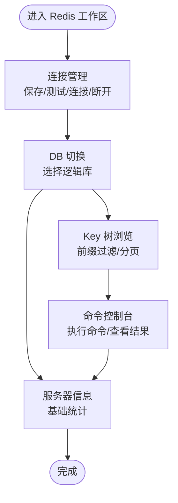

图表来源
- [src/plugins/redis-manager/index.tsx:14-57](file://src/plugins/redis-manager/index.tsx#L14-L57)
- [src/plugins/redis-manager/store/connections.ts:11-25](file://src/plugins/redis-manager/store/connections.ts#L11-L25)

章节来源
- [src/plugins/redis-manager/index.tsx:1-67](file://src/plugins/redis-manager/index.tsx#L1-L67)
- [src/plugins/redis-manager/store/connections.ts:1-91](file://src/plugins/redis-manager/store/connections.ts#L1-L91)

### SSH 客户端
- 核心功能
  - 连接管理：保存、删除、测试、连接/断开
  - 多标签终端：会话池化、事件监听会话关闭
  - 密钥管理：导入、存储与使用
  - 端口转发：隧道规则配置与管理
- 配置选项
  - 主机、端口、认证方式（密码/密钥）、超时、用户名
- 使用场景
  - 远程运维、日志采集、服务巡检、安全审计
- 最佳实践
  - 优先使用密钥认证；定期轮换私钥
  - 使用隧道转发敏感端口，避免明文暴露
  - 注意会话关闭事件，及时清理资源

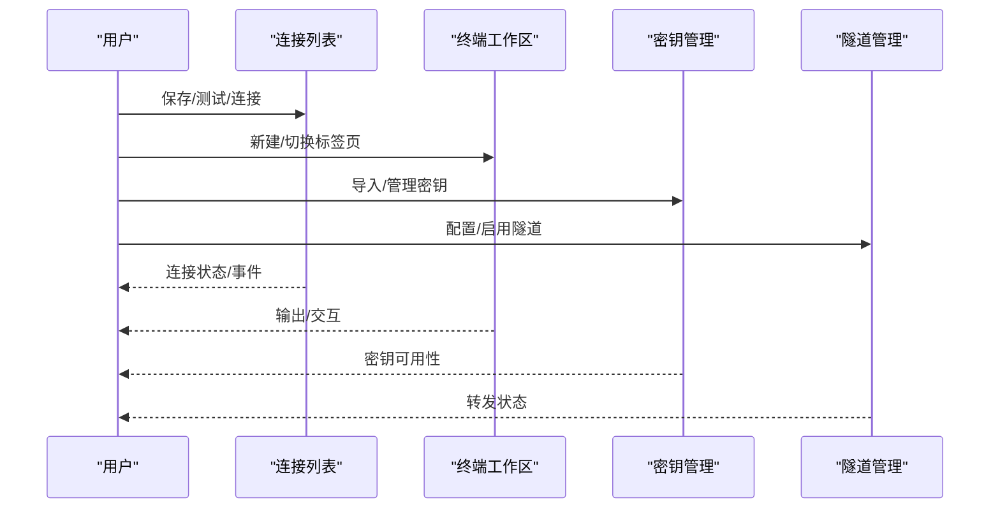

图表来源
- [src/plugins/ssh-client/index.tsx:12-56](file://src/plugins/ssh-client/index.tsx#L12-L56)
- [src/plugins/ssh-client/store/ssh-connections.ts:25-77](file://src/plugins/ssh-client/store/ssh-connections.ts#L25-L77)

章节来源
- [src/plugins/ssh-client/index.tsx:1-66](file://src/plugins/ssh-client/index.tsx#L1-L66)
- [src/plugins/ssh-client/store/ssh-connections.ts:1-77](file://src/plugins/ssh-client/store/ssh-connections.ts#L1-L77)

### S3 浏览器
- 核心功能
  - 连接配置：保存、测试、连接/断开
  - Bucket 浏览：列举、创建、删除 Bucket
  - 对象管理：分页列举、前缀筛选、删除、复制、重命名、文件夹创建
  - 文件上传/下载：单文件/文件夹
  - 元数据与标签：查看/设置对象标签
  - 预签名 URL：生成带过期时间的 URL
- 配置选项
  - 访问密钥、区域、端点、超时
- 使用场景
  - 存储巡检、批量对象操作、合规审计、临时授权访问
- 最佳实践
  - 使用最小权限策略；对敏感数据启用加密与标签
  - 分批处理大目录，避免一次性列举过多对象
  - 生成预签名 URL 时合理设置过期时间

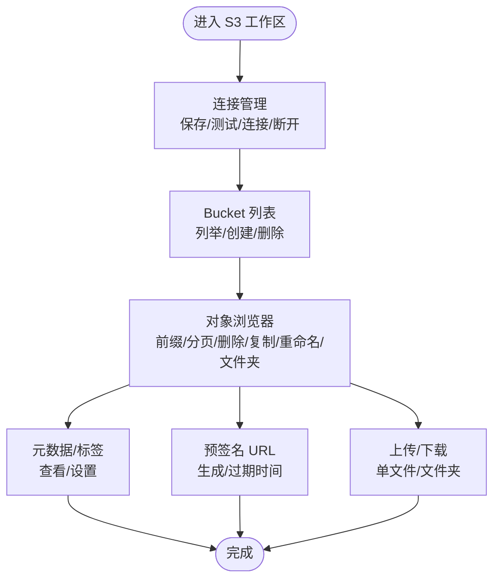

图表来源
- [src/plugins/s3-client/index.tsx:10-58](file://src/plugins/s3-client/index.tsx#L10-L58)
- [src/plugins/s3-client/store/s3-connections.ts:137-431](file://src/plugins/s3-client/store/s3-connections.ts#L137-L431)

章节来源
- [src/plugins/s3-client/index.tsx:1-68](file://src/plugins/s3-client/index.tsx#L1-L68)
- [src/plugins/s3-client/store/s3-connections.ts:1-432](file://src/plugins/s3-client/store/s3-connections.ts#L1-L432)

### MongoDB 客户端
- 核心功能
  - 连接管理：保存、测试、连接/断开
  - 数据库/集合浏览：列举数据库与集合，查看集合统计
  - 文档 CRUD：插入、更新、删除；支持分页查询
  - 查询与聚合：JSON 输入执行查询与聚合管道
  - 索引管理：列举、创建、删除索引
  - 导入导出：从文件导入文档，导出查询结果
  - 服务器状态：获取服务器运行状态
- 配置选项
  - 连接字符串、认证、TLS、超时
- 使用场景
  - 数据库调试、Schema 设计验证、性能分析、迁移验证
- 最佳实践
  - 聚合管道需先在 shell 验证；注意索引对写入性能的影响
  - 导入导出前先预览文件内容与大小
  - 生产环境避免全量扫描与高成本聚合

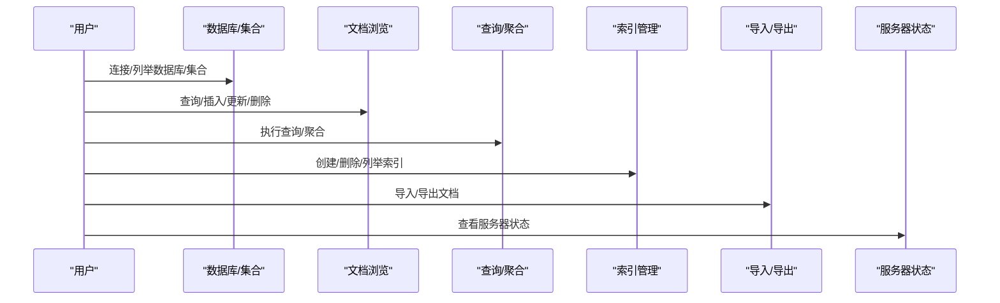

图表来源
- [src/plugins/mongodb-client/index.tsx:14-77](file://src/plugins/mongodb-client/index.tsx#L14-L77)
- [src/plugins/mongodb-client/store/mongodb-connections.ts:96-295](file://src/plugins/mongodb-client/store/mongodb-connections.ts#L96-L295)

章节来源
- [src/plugins/mongodb-client/index.tsx:1-87](file://src/plugins/mongodb-client/index.tsx#L1-L87)
- [src/plugins/mongodb-client/store/mongodb-connections.ts:1-296](file://src/plugins/mongodb-client/store/mongodb-connections.ts#L1-L296)

### MySQL 客户端
- 核心功能
  - 连接管理：保存、测试、连接/断开
  - 数据库/表浏览：列举数据库与表，描述表结构
  - 表数据管理：分页加载行、插入/更新/删除行
  - SQL 工作区：执行任意 SQL，查看结果
  - 索引管理：列举、创建、删除索引
  - 导入导出：CSV/JSON 导入导出
  - 服务器状态：获取服务器运行状态
- 配置选项
  - 主机、端口、用户名、密码、数据库、字符集、SSL
- 使用场景
  - 数据库开发、报表查询、Schema 变更验证、备份恢复演练
- 最佳实践
  - 写操作前先在只读副本验证；避免在高峰期执行长事务
  - 导入前预览文件格式与字段映射
  - 索引设计需平衡查询与写入性能

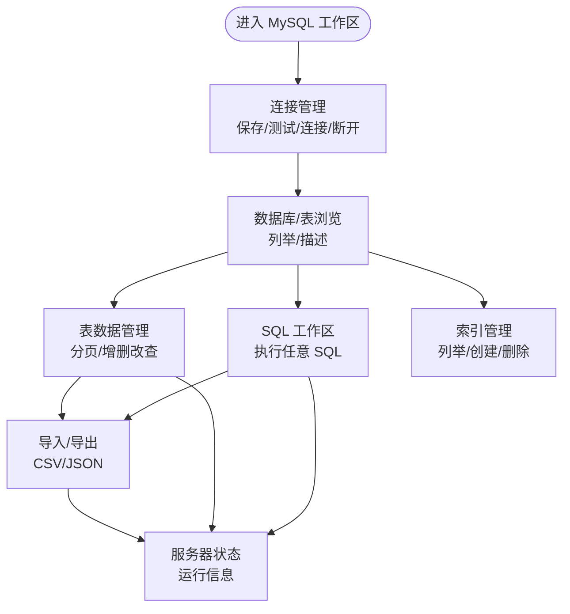

图表来源
- [src/plugins/mysql-client/index.tsx:14-35](file://src/plugins/mysql-client/index.tsx#L14-L35)
- [src/plugins/mysql-client/store/mysql-connections.ts:77-152](file://src/plugins/mysql-client/store/mysql-connections.ts#L77-L152)

章节来源
- [src/plugins/mysql-client/index.tsx:1-38](file://src/plugins/mysql-client/index.tsx#L1-L38)
- [src/plugins/mysql-client/store/mysql-connections.ts:1-153](file://src/plugins/mysql-client/store/mysql-connections.ts#L1-L153)

### 网络工具
- 核心功能
  - TCP 端口检测：指定主机与端口，返回连通性结果
  - Ping：指定目标与探测次数，返回延迟统计
  - DNS 解析：指定记录类型，返回解析结果
  - Traceroute：指定最大跳数，返回路由路径
  - 历史记录：查看/删除/清空/复跑历史
- 配置选项
  - 超时、次数、记录类型、最大跳数
- 使用场景
  - 网络排障、连通性验证、DNS 问题定位、路由分析
- 最佳实践
  - 合理设置超时与探测次数，避免阻塞
  - 复跑历史时注意网络环境变化

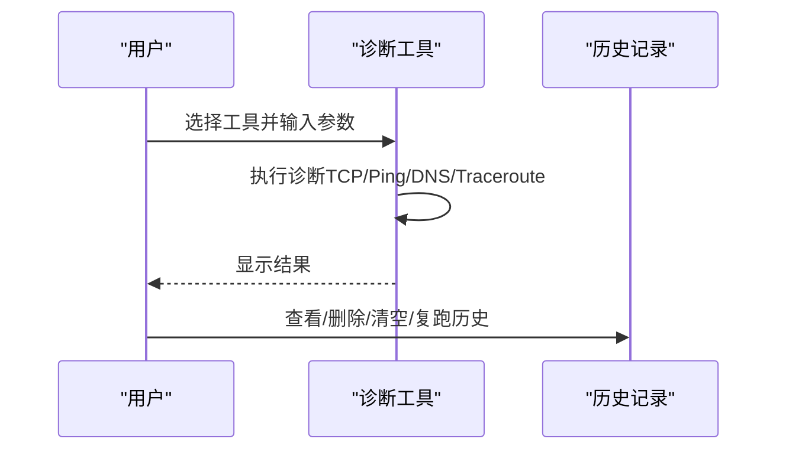

图表来源
- [src/plugins/network-tools/index.tsx:9-24](file://src/plugins/network-tools/index.tsx#L9-L24)
- [src/plugins/network-tools/store/network-tools.ts:34-96](file://src/plugins/network-tools/store/network-tools.ts#L34-L96)

章节来源
- [src/plugins/network-tools/index.tsx:1-27](file://src/plugins/network-tools/index.tsx#L1-L27)
- [src/plugins/network-tools/store/network-tools.ts:1-97](file://src/plugins/network-tools/store/network-tools.ts#L1-L97)

### API 调试器
- 核心功能
  - 请求构建：HTTP 方法、URL、Headers、Body、认证、变量
  - 集合/环境管理：保存集合、文件夹、请求与环境变量
  - 历史复跑：查看历史并一键复跑
  - 预览与取消：请求预览、发送中可取消
  - 导入导出：cURL 导入、集合导出
- 配置选项
  - 环境变量、请求模板、认证方案
- 使用场景
  - 接口联调、自动化测试、协议验证、问题复现
- 最佳实践
  - 使用环境隔离不同环境变量；为关键请求设置名称与分组
  - 导入 cURL 后检查变量替换与认证

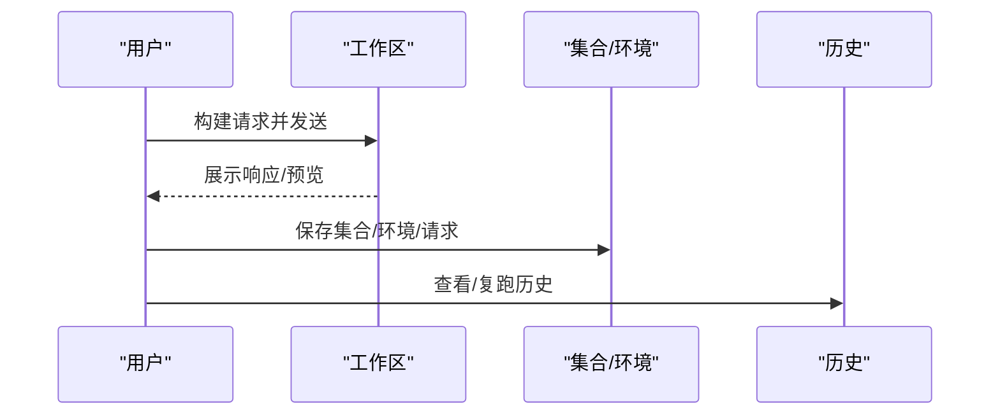

图表来源
- [src/plugins/api-debugger/index.tsx:13-36](file://src/plugins/api-debugger/index.tsx#L13-L36)
- [src/plugins/api-debugger/store/api-debugger.ts:47-129](file://src/plugins/api-debugger/store/api-debugger.ts#L47-L129)

章节来源
- [src/plugins/api-debugger/index.tsx:1-39](file://src/plugins/api-debugger/index.tsx#L1-L39)
- [src/plugins/api-debugger/store/api-debugger.ts:1-129](file://src/plugins/api-debugger/store/api-debugger.ts#L1-L129)

### MQ 客户端
- 核心功能
  - 连接管理：保存、测试、连接/断开
  - 资源浏览：RabbitMQ/Kafka 资源树（队列/交换机/主题/分区）
  - 消息发送：发布消息并查看结果
  - 消费预览：消费消息并查看结果
  - 历史与模板：查看历史、保存消息模板
- 配置选项
  - Broker 类型、地址、认证、超时
- 使用场景
  - 消息中间件调试、异步链路验证、消费者行为观察
- 最佳实践
  - 发布前确认路由/主题与消费者订阅
  - 使用模板统一消息格式，便于复用与审计

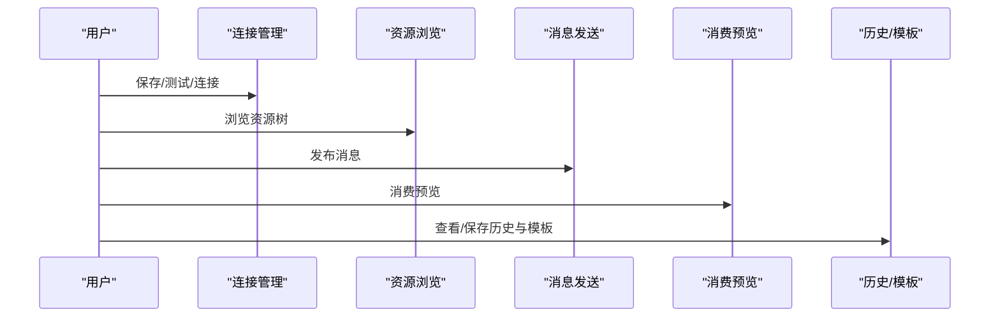

图表来源
- [src/plugins/mq-client/index.tsx:13-35](file://src/plugins/mq-client/index.tsx#L13-L35)
- [src/plugins/mq-client/store/mq-client.ts:52-102](file://src/plugins/mq-client/store/mq-client.ts#L52-L102)

章节来源
- [src/plugins/mq-client/index.tsx:1-38](file://src/plugins/mq-client/index.tsx#L1-L38)
- [src/plugins/mq-client/store/mq-client.ts:1-103](file://src/plugins/mq-client/store/mq-client.ts#L1-L103)

### LAN 聊天
- 当前仓库未发现 LAN 聊天插件实现，无法提供功能与使用说明。

## 依赖关系分析
- 插件间耦合度低，均通过统一的 invoke 调用后端命令
- 状态存储模块内部职责清晰：连接管理、业务操作、历史与缓存
- 事件机制：SSH 插件通过事件监听会话关闭，保证状态一致性

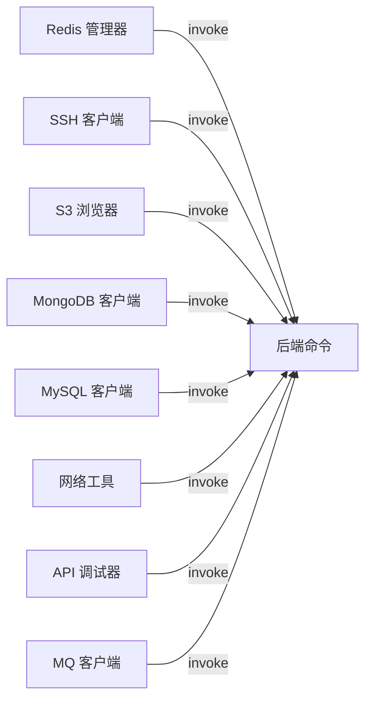

图表来源
- [src/plugins/redis-manager/store/connections.ts:36-83](file://src/plugins/redis-manager/store/connections.ts#L36-L83)
- [src/plugins/s3-client/store/s3-connections.ts:154-196](file://src/plugins/s3-client/store/s3-connections.ts#L154-L196)
- [src/plugins/mongodb-client/store/mongodb-connections.ts:126-161](file://src/plugins/mongodb-client/store/mongodb-connections.ts#L126-L161)
- [src/plugins/mysql-client/store/mysql-connections.ts:96-113](file://src/plugins/mysql-client/store/mysql-connections.ts#L96-L113)
- [src/plugins/network-tools/store/network-tools.ts:45-77](file://src/plugins/network-tools/store/network-tools.ts#L45-L77)
- [src/plugins/api-debugger/store/api-debugger.ts:66-72](file://src/plugins/api-debugger/store/api-debugger.ts#L66-L72)
- [src/plugins/mq-client/store/mq-client.ts:66-82](file://src/plugins/mq-client/store/mq-client.ts#L66-L82)

章节来源
- [src/plugins/redis-manager/store/connections.ts:1-91](file://src/plugins/redis-manager/store/connections.ts#L1-L91)
- [src/plugins/s3-client/store/s3-connections.ts:1-432](file://src/plugins/s3-client/store/s3-connections.ts#L1-L432)
- [src/plugins/mongodb-client/store/mongodb-connections.ts:1-296](file://src/plugins/mongodb-client/store/mongodb-connections.ts#L1-L296)
- [src/plugins/mysql-client/store/mysql-connections.ts:1-153](file://src/plugins/mysql-client/store/mysql-connections.ts#L1-L153)
- [src/plugins/network-tools/store/network-tools.ts:1-97](file://src/plugins/network-tools/store/network-tools.ts#L1-L97)
- [src/plugins/api-debugger/store/api-debugger.ts:1-129](file://src/plugins/api-debugger/store/api-debugger.ts#L1-L129)
- [src/plugins/mq-client/store/mq-client.ts:1-103](file://src/plugins/mq-client/store/mq-client.ts#L1-L103)

## 性能考量
- 分页与批量
  - S3 对象列举默认每页 200 条；MongoDB/MySQL 提供分页接口，避免一次性加载大量数据
- 并发与会话
  - SSH 插件监听会话关闭事件，确保连接状态一致性；Redis/MongoDB/MySQL 插件在连接建立后复用连接池
- 超时与重试
  - 网络工具与各客户端均提供超时参数，建议根据网络状况调整
- 导入导出
  - 大文件导入前先预览；导出时选择合适格式（如 JSONL 以降低内存占用）

## 故障排查指南
- 连接失败
  - 使用“测试连接”功能快速定位网络、认证与权限问题
  - 检查后端命令返回的错误码与日志
- 会话异常
  - SSH 插件监听会话关闭事件，若出现意外断开，检查事件是否正确派发
- 性能问题
  - 大数据量操作建议分页或分批；避免在高峰期执行全表扫描/全量聚合
- 历史复跑
  - 网络工具与 API 调试器支持历史复跑，注意网络环境变化导致的结果差异

章节来源
- [src/plugins/ssh-client/store/ssh-connections.ts:23-38](file://src/plugins/ssh-client/store/ssh-connections.ts#L23-L38)
- [src/plugins/network-tools/store/network-tools.ts:78-96](file://src/plugins/network-tools/store/network-tools.ts#L78-L96)
- [src/plugins/api-debugger/store/api-debugger.ts:124-126](file://src/plugins/api-debugger/store/api-debugger.ts#L124-L126)

## 结论
DevNexus 核心插件围绕“统一工作区 + Zustand 状态 + Tauri 命令”的架构设计，实现了对多种数据与网络系统的高效管理。通过标准化的连接生命周期与丰富的业务操作，满足日常开发、运维与排障需求。建议在生产环境中遵循最小权限、分批处理与预演验证的最佳实践，确保安全与稳定。

## 附录
- 版本与侧边栏顺序
  - Redis：版本 0.1.0，sidebarOrder 10
  - SSH：版本 0.2.0-alpha，sidebarOrder 20
  - S3：版本 0.3.0-alpha，sidebarOrder 30
  - MongoDB：版本 0.4.0-alpha，sidebarOrder 40
  - MySQL：版本 0.5.0-alpha，sidebarOrder 45
  - 网络工具：版本 0.6.0-alpha，sidebarOrder 50
  - API：版本 0.7.0-alpha，sidebarOrder 55
  - MQ：版本 0.8.0-alpha，sidebarOrder 60