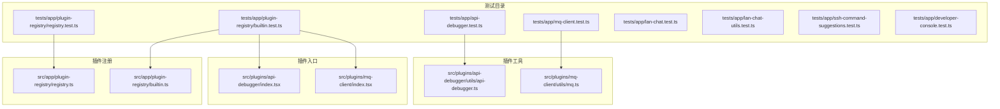
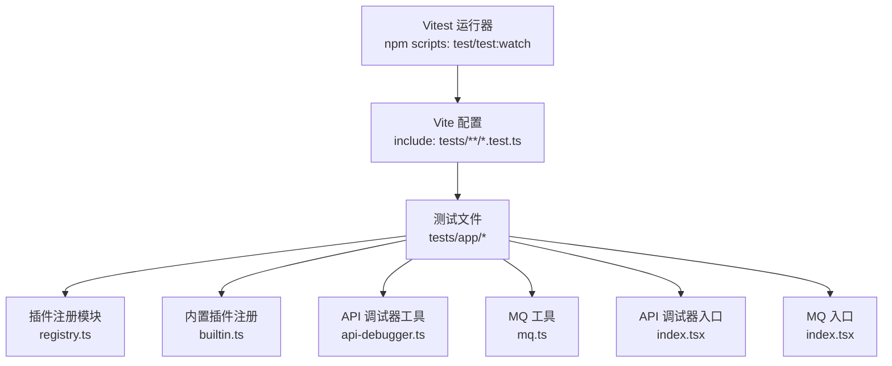
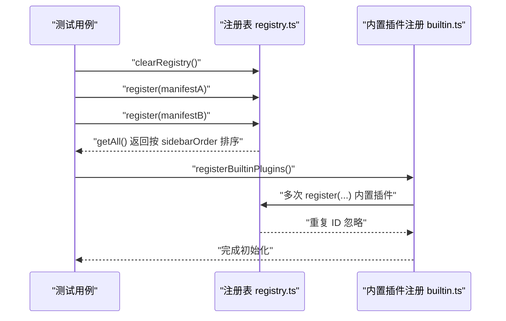
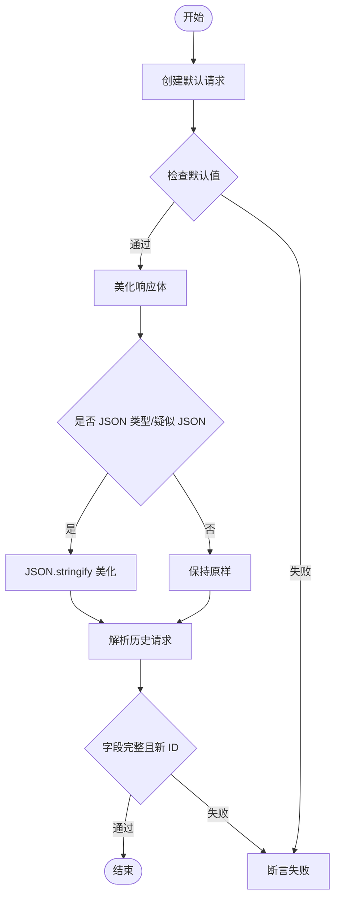
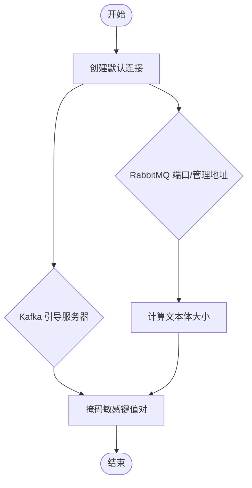
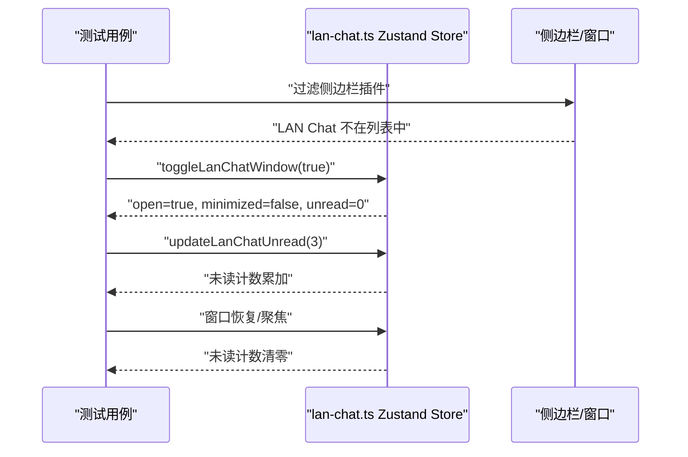
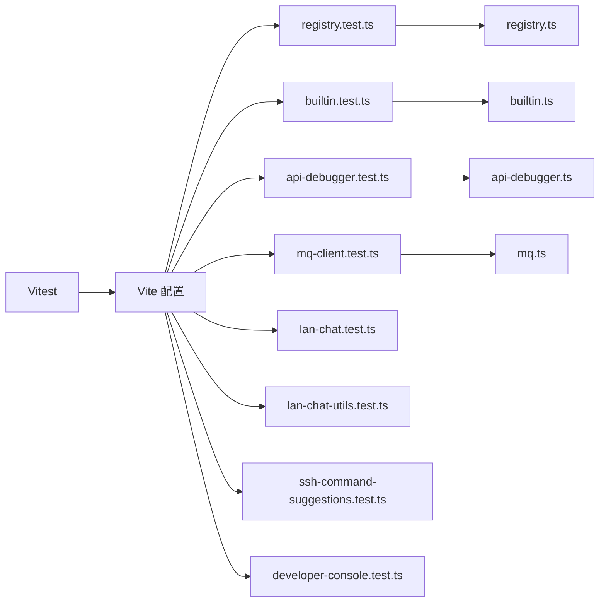

# 测试策略

<cite>
**本文引用的文件**
- [package.json](file://package.json)
- [vite.config.ts](file://vite.config.ts)
- [tests/app/plugin-registry/registry.test.ts](file://tests/app/plugin-registry/registry.test.ts)
- [tests/app/plugin-registry/builtin.test.ts](file://tests/app/plugin-registry/builtin.test.ts)
- [src/app/plugin-registry/registry.ts](file://src/app/plugin-registry/registry.ts)
- [src/app/plugin-registry/builtin.ts](file://src/app/plugin-registry/builtin.ts)
- [src/plugins/api-debugger/index.tsx](file://src/plugins/api-debugger/index.tsx)
- [src/plugins/mq-client/index.tsx](file://src/plugins/mq-client/index.tsx)
- [src/plugins/api-debugger/utils/api-debugger.ts](file://src/plugins/api-debugger/utils/api-debugger.ts)
- [src/plugins/mq-client/utils/mq.ts](file://src/plugins/mq-client/utils/mq.ts)
- [tests/app/api-debugger.test.ts](file://tests/app/api-debugger.test.ts)
- [tests/app/mq-client.test.ts](file://tests/app/mq-client.test.ts)
- [tests/app/lan-chat.test.ts](file://tests/app/lan-chat.test.ts)
- [tests/app/lan-chat-utils.test.ts](file://tests/app/lan-chat-utils.test.ts)
- [tests/app/ssh-command-suggestions.test.ts](file://tests/app/ssh-command-suggestions.test.ts)
- [tests/app/developer-console.test.ts](file://tests/app/developer-console.test.ts)
- [src/plugins/lan-chat/store/lan-chat.ts](file://src/plugins/lan-chat/store/lan-chat.ts)
</cite>

## 目录
1. [引言](#引言)
2. [项目结构](#项目结构)
3. [核心组件](#核心组件)
4. [架构总览](#架构总览)
5. [详细组件分析](#详细组件分析)
6. [依赖关系分析](#依赖关系分析)
7. [性能考量](#性能考量)
8. [故障排查指南](#故障排查指南)
9. [结论](#结论)
10. [附录](#附录)

## 引言
本测试策略文档面向 DevNexus 的前端与应用层测试，聚焦以下目标：
- 单元测试框架与配置：基于 Vitest 的配置、测试环境与常用工具函数。
- 插件注册测试：验证插件注册机制、路由行为与生命周期相关逻辑。
- 功能测试示例：覆盖各插件核心功能、边界条件与异常处理。
- 覆盖率与质量：覆盖率目标、用例设计原则与质量保障流程。
- 测试开发指南：编写规范、模拟对象、异步测试与断言最佳实践。
- 持续集成：自动化测试执行、报告生成与失败处理。
- 性能与压力：性能测试与压力测试考虑点。
- 数据管理与清理：测试数据与状态清理策略。

## 项目结构
DevNexus 使用 Vite + React + TypeScript 构建，测试采用 Vitest 并通过 Vite 配置进行统一管理。测试目录 tests/app 下按功能模块组织测试文件，插件注册与内置插件清单位于 src/app/plugin-registry。

图表来源
- [vite.config.ts:16-18](file://vite.config.ts#L16-L18)
- [tests/app/plugin-registry/registry.test.ts:1-40](file://tests/app/plugin-registry/registry.test.ts#L1-L40)
- [tests/app/plugin-registry/builtin.test.ts:1-31](file://tests/app/plugin-registry/builtin.test.ts#L1-L31)
- [src/app/plugin-registry/registry.ts:1-26](file://src/app/plugin-registry/registry.ts#L1-L26)
- [src/app/plugin-registry/builtin.ts:1-29](file://src/app/plugin-registry/builtin.ts#L1-L29)
- [src/plugins/api-debugger/index.tsx:1-39](file://src/plugins/api-debugger/index.tsx#L1-L39)
- [src/plugins/mq-client/index.tsx:1-38](file://src/plugins/mq-client/index.tsx#L1-L38)
- [src/plugins/api-debugger/utils/api-debugger.ts:1-62](file://src/plugins/api-debugger/utils/api-debugger.ts#L1-L62)
- [src/plugins/mq-client/utils/mq.ts:1-20](file://src/plugins/mq-client/utils/mq.ts#L1-L20)

章节来源
- [vite.config.ts:16-18](file://vite.config.ts#L16-L18)
- [package.json:10-11](file://package.json#L10-L11)

## 核心组件
- 测试框架与脚本
  - Vitest 作为测试运行器与断言库，通过 npm scripts 提供运行与监听模式。
  - Vite 配置中指定测试文件匹配规则，确保仅扫描 tests 目录下的测试文件。
- 插件注册系统
  - 注册表：以 Map 存储插件清单，支持去重、排序与查询。
  - 内置插件注册：集中注册所有内置插件，避免重复初始化。
- 插件工具函数
  - API 调试器：默认请求、历史请求解析、JSON 美化等。
  - MQ 客户端：默认连接参数、敏感信息掩码、文本体大小计算等。

章节来源
- [package.json:10-11](file://package.json#L10-L11)
- [vite.config.ts:16-18](file://vite.config.ts#L16-L18)
- [src/app/plugin-registry/registry.ts:1-26](file://src/app/plugin-registry/registry.ts#L1-L26)
- [src/app/plugin-registry/builtin.ts:1-29](file://src/app/plugin-registry/builtin.ts#L1-L29)
- [src/plugins/api-debugger/utils/api-debugger.ts:14-29](file://src/plugins/api-debugger/utils/api-debugger.ts#L14-L29)
- [src/plugins/mq-client/utils/mq.ts:3-9](file://src/plugins/mq-client/utils/mq.ts#L3-L9)

## 架构总览
下图展示测试策略在系统中的位置：Vitest 作为测试执行引擎，读取 Vite 配置并定位测试文件；测试用例驱动被测模块（插件注册、插件工具与插件入口），验证其行为与输出。

图表来源
- [package.json:10-11](file://package.json#L10-L11)
- [vite.config.ts:16-18](file://vite.config.ts#L16-L18)
- [src/app/plugin-registry/registry.ts:1-26](file://src/app/plugin-registry/registry.ts#L1-L26)
- [src/app/plugin-registry/builtin.ts:1-29](file://src/app/plugin-registry/builtin.ts#L1-L29)
- [src/plugins/api-debugger/utils/api-debugger.ts:1-62](file://src/plugins/api-debugger/utils/api-debugger.ts#L1-L62)
- [src/plugins/mq-client/utils/mq.ts:1-20](file://src/plugins/mq-client/utils/mq.ts#L1-L20)
- [src/plugins/api-debugger/index.tsx:1-39](file://src/plugins/api-debugger/index.tsx#L1-L39)
- [src/plugins/mq-client/index.tsx:1-38](file://src/plugins/mq-client/index.tsx#L1-L38)

## 详细组件分析

### 插件注册测试
- 目标
  - 验证注册表对重复 ID 的去重、按侧边栏顺序排序的行为。
  - 验证内置插件清单可成功注册到注册表。
- 关键点
  - 注册表使用 Map 存储，重复 ID 将被忽略。
  - 获取列表时按 sidebarOrder 排序返回。
  - 内置插件注册函数仅初始化一次，避免重复注册。
- 测试要点
  - 用例覆盖排序、去重与注册清单完整性。
  - 建议在每个测试前清理注册表，确保测试隔离性。

图表来源
- [tests/app/plugin-registry/registry.test.ts:20-39](file://tests/app/plugin-registry/registry.test.ts#L20-L39)
- [tests/app/plugin-registry/builtin.test.ts:8-30](file://tests/app/plugin-registry/builtin.test.ts#L8-L30)
- [src/app/plugin-registry/registry.ts:5-21](file://src/app/plugin-registry/registry.ts#L5-L21)
- [src/app/plugin-registry/builtin.ts:13-27](file://src/app/plugin-registry/builtin.ts#L13-L27)

章节来源
- [tests/app/plugin-registry/registry.test.ts:1-40](file://tests/app/plugin-registry/registry.test.ts#L1-L40)
- [tests/app/plugin-registry/builtin.test.ts:1-31](file://tests/app/plugin-registry/builtin.test.ts#L1-L31)
- [src/app/plugin-registry/registry.ts:1-26](file://src/app/plugin-registry/registry.ts#L1-L26)
- [src/app/plugin-registry/builtin.ts:1-29](file://src/app/plugin-registry/builtin.ts#L1-L29)

### API 调试器工具测试
- 目标
  - 验证默认请求的安全默认值、历史请求解析与 JSON 美化。
- 关键点
  - 默认请求包含方法、URL、超时、SSL 校验等安全默认。
  - 历史请求解析保留字段并生成新的请求 ID。
  - JSON 美化仅对 JSON 类型或疑似 JSON 文本生效。
- 测试要点
  - 边界：非 JSON 文本、空内容、非法 JSON。
  - 异常：解析失败时回退原内容。

图表来源
- [tests/app/api-debugger.test.ts:5-23](file://tests/app/api-debugger.test.ts#L5-L23)
- [src/plugins/api-debugger/utils/api-debugger.ts:14-29](file://src/plugins/api-debugger/utils/api-debugger.ts#L14-L29)
- [src/plugins/api-debugger/utils/api-debugger.ts:31-39](file://src/plugins/api-debugger/utils/api-debugger.ts#L31-L39)
- [src/plugins/api-debugger/utils/api-debugger.ts:58-61](file://src/plugins/api-debugger/utils/api-debugger.ts#L58-L61)

章节来源
- [tests/app/api-debugger.test.ts:1-24](file://tests/app/api-debugger.test.ts#L1-L24)
- [src/plugins/api-debugger/utils/api-debugger.ts:1-62](file://src/plugins/api-debugger/utils/api-debugger.ts#L1-L62)

### MQ 客户端工具测试
- 目标
  - 验证默认连接参数、UTF-8 字节大小计算与敏感信息掩码。
- 关键点
  - RabbitMQ 默认管理端口与 Kafka 默认引导服务器端口。
  - 文本体大小基于 UTF-8 编码长度。
  - 敏感键名（如密码、令牌、密钥）统一掩码。
- 测试要点
  - 边界：空字符串、特殊字符、大小写混合键名。
  - 异常：非敏感键名不被替换。

图表来源
- [tests/app/mq-client.test.ts:5-19](file://tests/app/mq-client.test.ts#L5-L19)
- [src/plugins/mq-client/utils/mq.ts:15-19](file://src/plugins/mq-client/utils/mq.ts#L15-L19)
- [src/plugins/mq-client/utils/mq.ts:3-5](file://src/plugins/mq-client/utils/mq.ts#L3-L5)
- [src/plugins/mq-client/utils/mq.ts:7-9](file://src/plugins/mq-client/utils/mq.ts#L7-L9)

章节来源
- [tests/app/mq-client.test.ts:1-20](file://tests/app/mq-client.test.ts#L1-L20)
- [src/plugins/mq-client/utils/mq.ts:1-20](file://src/plugins/mq-client/utils/mq.ts#L1-L20)

### LAN Chat 行为与状态测试
- 目标
  - 验证侧边栏过滤、浮动窗口开关与未读计数策略。
- 关键点
  - 侧边栏插件过滤排除 LAN Chat。
  - 打开窗口不影响当前选中插件。
  - 最小化/关闭时不丢失未读计数，恢复时清零。
- 测试要点
  - 边界：窗口初始状态、最小化状态、活跃会话。
  - 异常：窗口打开与最小化的组合状态。

图表来源
- [tests/app/lan-chat.test.ts:22-57](file://tests/app/lan-chat.test.ts#L22-L57)
- [src/plugins/lan-chat/store/lan-chat.ts:44-71](file://src/plugins/lan-chat/store/lan-chat.ts#L44-L71)

章节来源
- [tests/app/lan-chat.test.ts:1-58](file://tests/app/lan-chat.test.ts#L1-L58)
- [src/plugins/lan-chat/store/lan-chat.ts:1-202](file://src/plugins/lan-chat/store/lan-chat.ts#L1-L202)

### LAN Chat 工具函数测试
- 目标
  - 验证设备协调选择、尺寸格式化、Z-index、窗口停靠、设备 ID 显示、对话拆分与端点格式化/解析。
- 关键点
  - 协调器优先本地在线设备。
  - 文件大小按 B/KB/MB 格式化。
  - 对话拆分为房间与直接会话两类。
  - 端点格式化与解析遵循固定端口默认值。
- 测试要点
  - 边界：空主机、默认端口、不同精度数值。
  - 异常：非法输入解析回退。

章节来源
- [tests/app/lan-chat-utils.test.ts:1-78](file://tests/app/lan-chat-utils.test.ts#L1-L78)

### SSH 命令建议测试
- 目标
  - 验证命令前缀匹配、内置命令与快捷命令组合，以及草稿同步。
- 关键点
  - 前缀匹配返回候选命令集合。
  - 草稿支持可打印字符与控制键（删除、回车）同步。
- 测试要点
  - 边界：空输入、删除至空、回车清空。
  - 异常：非法控制键处理。

章节来源
- [tests/app/ssh-command-suggestions.test.ts:1-39](file://tests/app/ssh-command-suggestions.test.ts#L1-L39)

### 开发者控制台工具测试
- 目标
  - 验证日志条目上限与颜色映射。
- 关键点
  - 新日志插入后保持在配置上限内。
  - 日志级别映射稳定颜色标签。
- 测试要点
  - 边界：超过上限时的截断行为。
  - 异常：未知级别映射。

章节来源
- [tests/app/developer-console.test.ts:1-26](file://tests/app/developer-console.test.ts#L1-L26)

## 依赖关系分析
- 组件耦合
  - 测试对被测模块的依赖主要集中在工具函数与状态管理，耦合度低，便于独立测试。
  - 插件注册模块与插件入口之间存在清单依赖，但入口仅消费只读清单，降低耦合。
- 外部依赖
  - Vitest 与 Vite 作为测试基础设施，无额外运行时依赖。
- 循环依赖
  - 当前模块间无循环导入，测试文件与被测模块分离良好。

图表来源
- [vite.config.ts:16-18](file://vite.config.ts#L16-L18)
- [tests/app/plugin-registry/registry.test.ts:1-40](file://tests/app/plugin-registry/registry.test.ts#L1-L40)
- [tests/app/plugin-registry/builtin.test.ts:1-31](file://tests/app/plugin-registry/builtin.test.ts#L1-L31)
- [tests/app/api-debugger.test.ts:1-24](file://tests/app/api-debugger.test.ts#L1-L24)
- [tests/app/mq-client.test.ts:1-20](file://tests/app/mq-client.test.ts#L1-L20)
- [tests/app/lan-chat.test.ts:1-58](file://tests/app/lan-chat.test.ts#L1-L58)
- [tests/app/lan-chat-utils.test.ts:1-78](file://tests/app/lan-chat-utils.test.ts#L1-L78)
- [tests/app/ssh-command-suggestions.test.ts:1-39](file://tests/app/ssh-command-suggestions.test.ts#L1-L39)
- [tests/app/developer-console.test.ts:1-26](file://tests/app/developer-console.test.ts#L1-L26)
- [src/app/plugin-registry/registry.ts:1-26](file://src/app/plugin-registry/registry.ts#L1-L26)
- [src/app/plugin-registry/builtin.ts:1-29](file://src/app/plugin-registry/builtin.ts#L1-L29)
- [src/plugins/api-debugger/utils/api-debugger.ts:1-62](file://src/plugins/api-debugger/utils/api-debugger.ts#L1-L62)
- [src/plugins/mq-client/utils/mq.ts:1-20](file://src/plugins/mq-client/utils/mq.ts#L1-L20)

## 性能考量
- 单元测试性能
  - 优先使用纯函数与内存态，避免网络与磁盘 IO。
  - 对于状态管理（如 Zustand），可通过局部快照与最小化更新减少重渲染成本。
- 异步测试
  - 使用 Vitest 的异步断言与超时控制，避免长轮询与定时器泄漏。
- 压力测试建议
  - 在独立基准测试中评估工具函数（如 JSON 美化、掩码）在大文本上的表现。
  - 对注册表大规模注册场景进行性能回归测试（可选）。

## 故障排查指南
- 常见问题
  - 测试未执行：确认 Vite 配置 include 是否匹配测试文件路径。
  - 注册重复插件：检查注册表去重逻辑与内置注册函数的幂等性。
  - 断言失败：核对默认值、边界输入与异常分支。
- 调试技巧
  - 使用 Vitest 的 watch 模式快速迭代。
  - 对复杂状态转换（如 LAN Chat 窗口）绘制状态机图辅助定位。

章节来源
- [vite.config.ts:16-18](file://vite.config.ts#L16-L18)
- [tests/app/plugin-registry/registry.test.ts:20-39](file://tests/app/plugin-registry/registry.test.ts#L20-L39)
- [tests/app/lan-chat.test.ts:22-57](file://tests/app/lan-chat.test.ts#L22-L57)

## 结论
本测试策略以 Vitest 为核心，围绕插件注册与工具函数构建了系统化的单元测试体系。通过明确的测试目标、清晰的断言与边界覆盖，确保关键功能的稳定性与可维护性。建议在 CI 中引入覆盖率阈值与自动化报告，持续提升质量。

## 附录

### 测试覆盖率要求
- 目标
  - 语句覆盖率、分支覆盖率、函数覆盖率与行覆盖率不低于 80%。
- 设计原则
  - 每个导出函数至少一个正常路径与一个异常路径。
  - 对关键状态转换（如窗口开关、未读计数）进行组合测试。
  - 对工具函数的大文本与边界输入进行专项测试。
- 质量保证流程
  - 本地提交前运行全部测试并通过覆盖率检查。
  - CI 中生成覆盖率报告并与基线对比，失败时阻断合并。

### 测试开发指南
- 编写规范
  - 使用 describe/it 分层组织测试，命名清晰表达意图。
  - 每个测试聚焦单一行为，避免“一揽子”断言。
- 模拟对象
  - 对外部依赖（如网络请求）使用虚拟实现或拦截。
- 异步测试
  - 使用 Promise/async await 或 Vitest 提供的异步断言。
- 断言最佳实践
  - 使用具体断言（toBe、toEqual、toContain）替代模糊断言。
  - 对时间相关逻辑使用时间模拟或可控时钟。

### 持续集成中的测试流程
- 自动化执行
  - 使用 npm scripts 触发 Vitest 运行，确保测试环境变量一致。
- 报告生成
  - 集成覆盖率报告与测试结果，便于审查。
- 失败处理
  - 失败时输出详细日志与堆栈，必要时触发回滚或通知。