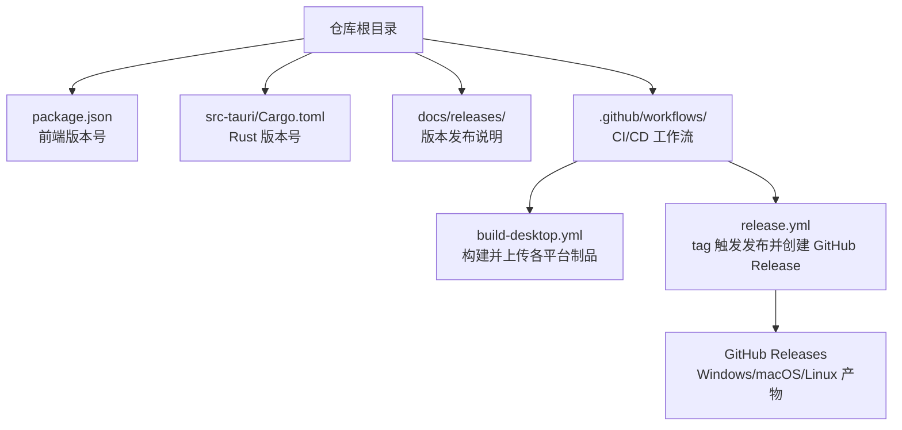
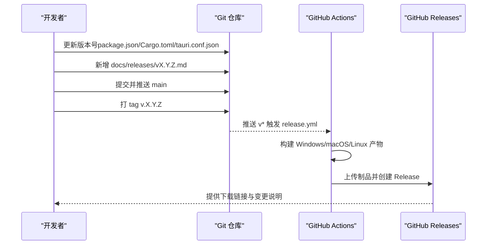
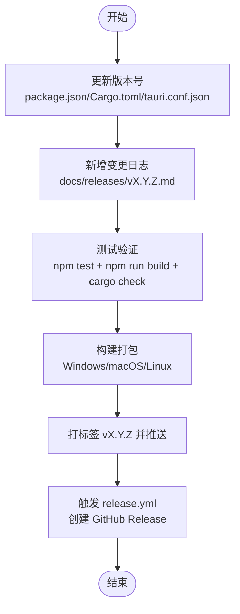
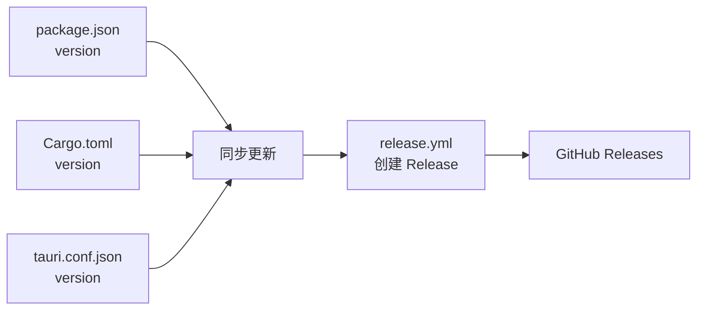

# 版本发布

<cite>
**本文引用的文件**
- [README.md](file://README.md)
- [package.json](file://package.json)
- [Cargo.toml](file://src-tauri/Cargo.toml)
- [.github/workflows/release.yml](file://.github/workflows/release.yml)
- [.github/workflows/build-desktop.yml](file://.github/workflows/build-desktop.yml)
- [docs/releases/v0.9.3.md](file://docs/releases/v0.9.3.md)
- [docs/releases/v0.9.2.md](file://docs/releases/v0.9.2.md)
- [docs/releases/v0.8.0.md](file://docs/releases/v0.8.0.md)
- [docs/releases/v0.7.1.md](file://docs/releases/v0.7.1.md)
- [docs/releases/v0.1.0.md](file://docs/releases/v0.1.0.md)
- [docs/releases/v0.2.0.md](file://docs/releases/v0.2.0.md)
- [docs/releases/v0.3.0.md](file://docs/releases/v0.3.0.md)
- [docs/releases/v0.4.0.md](file://docs/releases/v0.4.0.md)
- [docs/releases/v0.5.0.md](file://docs/releases/v0.5.0.md)
</cite>

## 目录
1. [简介](#简介)
2. [项目结构](#项目结构)
3. [核心组件](#核心组件)
4. [架构总览](#架构总览)
5. [详细组件分析](#详细组件分析)
6. [依赖分析](#依赖分析)
7. [性能考虑](#性能考虑)
8. [故障排查指南](#故障排查指南)
9. [结论](#结论)
10. [附录](#附录)

## 简介
本文件为 DevNexus 的版本发布文档，围绕版本管理策略、发布流程规范、变更日志维护、兼容性说明、版本对比分析、发布渠道与回滚机制、用户升级指南等方面进行系统化说明。DevNexus 是一个基于 Tauri 2 + React 19 + TypeScript + Rust 的插件化桌面工具箱，当前版本为 0.9.2，仓库提供了完整的 GitHub Actions 发布流水线与多平台产物输出。

## 项目结构
DevNexus 的版本发布相关结构主要分布在以下位置：
- 版本号与发布说明：前端 package.json、Rust 侧 Cargo.toml、docs/releases 下的版本说明文档
- 发布流水线：.github/workflows/release.yml（tag 触发）、.github/workflows/build-desktop.yml（main 推送/手动触发）
- 平台产物：Windows（NSIS 安装包）、macOS（.app/.dmg，含 Intel 与 Apple Silicon 双架构）、Linux（.deb/.AppImage）

**图表来源**
- [README.md:158-177](file://README.md#L158-L177)
- [.github/workflows/release.yml:1-178](file://.github/workflows/release.yml#L1-L178)
- [.github/workflows/build-desktop.yml:1-142](file://.github/workflows/build-desktop.yml#L1-L142)

**章节来源**
- [README.md:56-93](file://README.md#L56-L93)
- [README.md:158-177](file://README.md#L158-L177)
- [.github/workflows/release.yml:1-178](file://.github/workflows/release.yml#L1-L178)
- [.github/workflows/build-desktop.yml:1-142](file://.github/workflows/build-desktop.yml#L1-L142)

## 核心组件
- 版本号管理
  - 前端版本号：package.json 中的 version 字段
  - Rust 后端版本号：src-tauri/Cargo.toml 中的 version 字段
  - 应用配置版本号：src-tauri/tauri.conf.json 中的 version 字段（在 README 的发布流程步骤中被提及）
- 发布说明维护：docs/releases/ 下按语义化版本命名的 Markdown 文档，包含亮点、范围说明、验证清单等
- CI/CD 工作流：
  - build-desktop.yml：在 main 推送或手动触发时，构建并上传各平台制品
  - release.yml：在推送 v* 标签时，构建 Windows/macOS/Linux 产物并创建 GitHub Release

**章节来源**
- [package.json:1-40](file://package.json#L1-L40)
- [Cargo.toml:1-48](file://src-tauri/Cargo.toml#L1-L48)
- [README.md:168-177](file://README.md#L168-L177)
- [.github/workflows/release.yml:1-178](file://.github/workflows/release.yml#L1-L178)
- [.github/workflows/build-desktop.yml:1-142](file://.github/workflows/build-desktop.yml#L1-L142)

## 架构总览
DevNexus 的发布架构由“版本号同步 + 变更日志 + CI 工作流 + 发布渠道”构成，确保跨平台一致性与可追溯性。

**图表来源**
- [README.md:168-177](file://README.md#L168-L177)
- [.github/workflows/release.yml:1-178](file://.github/workflows/release.yml#L1-L178)

## 详细组件分析

### 版本管理策略
- 语义化版本控制
  - 采用主版本.次版本.修订号（X.Y.Z）格式，遵循语义化版本控制原则
  - 依据 README 的发布流程，版本号需同时更新前端与后端配置文件
- 版本号规则
  - 前端：package.json 的 version
  - 后端：src-tauri/Cargo.toml 的 version
  - 应用配置：tauri.conf.json 的 version（在发布流程步骤中明确）
- 发布周期
  - 仓库提供两条工作流：build-desktop.yml（main 推送/手动触发）用于快速构建与验证；release.yml（v* 标签触发）用于正式发布与 GitHub Release

**章节来源**
- [README.md:168-177](file://README.md#L168-L177)
- [package.json:1-40](file://package.json#L1-L40)
- [Cargo.toml:1-48](file://src-tauri/Cargo.toml#L1-L48)

### 发布流程规范
- 版本准备
  - 同步更新前端、后端与应用配置中的版本号
  - 编写并提交对应 docs/releases/vX.Y.Z.md
- 测试验证
  - 运行测试、前端构建、Rust 后端检查
- 构建打包
  - Windows：NSIS 安装包
  - macOS：.app/.dmg（含 Intel 与 Apple Silicon 双架构）
  - Linux：.deb/.AppImage
- 发布执行
  - 推送 v* 标签，触发 release.yml，自动上传制品并创建 GitHub Release

**图表来源**
- [README.md:168-177](file://README.md#L168-L177)
- [.github/workflows/release.yml:151-178](file://.github/workflows/release.yml#L151-L178)

**章节来源**
- [README.md:168-177](file://README.md#L168-L177)
- [.github/workflows/release.yml:1-178](file://.github/workflows/release.yml#L1-L178)

### 变更日志维护
- 结构与内容
  - 每个版本在 docs/releases/ 下有独立 Markdown 文件，标题为“# DevNexus vX.Y.Z”
  - 常见板块：Highlights（亮点）、Scope（范围说明，如 LAN Chat）、Validation/Verification（验证清单）
- 示例
  - v0.9.3：强调 macOS 双架构 DMG、窗口布局修复、暗色主题改进、LAN Chat 稳定性与体验优化
  - v0.9.2：合并 v0.9.0/v0.9.1，引入底部聊天入口、浮动聊天窗、本地身份与文件直连传输等
  - v0.8.0：统一 MQ 客户端插件，支持 RabbitMQ/Kafka 的连接、浏览、发布/预览、历史与脱敏
  - v0.7.1：SSH 终端工作区体验优化、全屏模式、命令建议
  - v0.1.0：首个正式版本，涵盖插件化架构、跨平台构建与三大插件体系

**章节来源**
- [docs/releases/v0.9.3.md:1-20](file://docs/releases/v0.9.3.md#L1-L20)
- [docs/releases/v0.9.2.md:1-32](file://docs/releases/v0.9.2.md#L1-L32)
- [docs/releases/v0.8.0.md:1-22](file://docs/releases/v0.8.0.md#L1-L22)
- [docs/releases/v0.7.1.md:1-22](file://docs/releases/v0.7.1.md#L1-L22)
- [docs/releases/v0.1.0.md:1-46](file://docs/releases/v0.1.0.md#L1-L46)

### 兼容性说明
- 向后兼容性
  - README 的“已知限制”与各版本发布说明中的“Scope/Notes”体现了对已有行为的稳定性承诺与未来演进边界
- API 变更影响分析
  - 变更日志中明确列出新增能力、安全边界（如 MQ 首发版本的非破坏性操作限制）、体验改进与限制说明，便于评估对现有用户的使用影响
- 迁移指南
  - 对于 LAN Chat 的设备标识迁移、文件直连传输等关键变更，发布说明提供了行为差异与使用提示，帮助用户理解迁移要点

**章节来源**
- [README.md:186-192](file://README.md#L186-L192)
- [docs/releases/v0.9.2.md:18-25](file://docs/releases/v0.9.2.md#L18-L25)
- [docs/releases/v0.8.0.md:10-14](file://docs/releases/v0.8.0.md#L10-L14)

### 版本对比分析
- 功能演进轨迹
  - v0.1.0：基础插件化架构与三大插件体系
  - v0.2.0：Redis Key Browser 交互升级
  - v0.3.0：S3 客户端从基础浏览升级为对象管理工具
  - v0.4.0：新增 MongoDB 客户端
  - v0.5.0：新增 MySQL 客户端
  - v0.7.1：SSH 终端体验优化
  - v0.8.0：统一 MQ 客户端插件
  - v0.9.2：LAN Chat 引入底部入口与浮动窗口、本地身份与文件直连传输
  - v0.9.3：macOS 双架构 DMG、窗口布局与暗色主题修复
- 性能改进记录
  - README 的“当前限制”与各版本发布说明中的“Validation/Verification”体现了对构建与运行时稳定性的关注
- 用户体验改善
  - LAN Chat 的 WeChat 风格界面、自动滚动、可调整尺寸、未读角标、成员列表等

**章节来源**
- [docs/releases/v0.1.0.md:1-46](file://docs/releases/v0.1.0.md#L1-L46)
- [docs/releases/v0.2.0.md:1-29](file://docs/releases/v0.2.0.md#L1-L29)
- [docs/releases/v0.3.0.md:1-31](file://docs/releases/v0.3.0.md#L1-L31)
- [docs/releases/v0.4.0.md:1-20](file://docs/releases/v0.4.0.md#L1-L20)
- [docs/releases/v0.5.0.md:1-20](file://docs/releases/v0.5.0.md#L1-L20)
- [docs/releases/v0.7.1.md:1-22](file://docs/releases/v0.7.1.md#L1-L22)
- [docs/releases/v0.8.0.md:1-22](file://docs/releases/v0.8.0.md#L1-L22)
- [docs/releases/v0.9.2.md:1-32](file://docs/releases/v0.9.2.md#L1-L32)
- [docs/releases/v0.9.3.md:1-20](file://docs/releases/v0.9.3.md#L1-L20)

### 发布渠道管理
- GitHub Releases
  - release.yml 在推送 v* 标签后自动创建 Release，并上传 Windows（NSIS）、macOS（.app/.dmg，含 x64/arm64）、Linux（.deb/.AppImage）产物
- 应用商店发布
  - README 未提供应用商店发布策略；当前以 GitHub Releases 为主要分发渠道
- 分发策略
  - Windows：NSIS 安装包
  - macOS：.app/.dmg（双架构 DMG）
  - Linux：.deb/.AppImage

**章节来源**
- [.github/workflows/release.yml:12-178](file://.github/workflows/release.yml#L12-L178)
- [README.md:340-341](file://README.md#L340-L341)

### 版本回滚机制与紧急修复流程
- 回滚机制
  - 通过 Git 标签与 GitHub Releases 的版本管理，可回溯到上一稳定版本
- 紧急修复流程
  - 在 main 上修复后，打补丁标签（如 v0.9.4），触发 release.yml 重新发布对应平台制品

**章节来源**
- [.github/workflows/release.yml:3-7](file://.github/workflows/release.yml#L3-L7)
- [README.md:168-177](file://README.md#L168-L177)

### 用户升级指南
- 升级注意事项
  - 遵循 README 的“安全说明”，避免提交敏感数据
  - 关注“已知限制”与各版本发布说明中的 Scope/Notes，了解功能边界与行为变化
- 数据迁移说明
  - LAN Chat 的设备标识迁移与文件直连传输策略在发布说明中有明确说明
- 常见问题解答
  - 变更日志中的“Validation/Verification”可作为本地验证清单，确保升级后功能正常

**章节来源**
- [README.md:179-192](file://README.md#L179-L192)
- [docs/releases/v0.9.2.md:18-25](file://docs/releases/v0.9.2.md#L18-L25)

## 依赖分析
- 版本号耦合关系
  - 前端版本号与后端版本号需保持一致，且需与应用配置版本号同步
- 工作流依赖
  - release.yml 依赖 docs/releases/vX.Y.Z.md 的存在；若该文件缺失，发布会被阻止
- 平台依赖
  - macOS 双架构构建依赖不同 runner 与 target
  - Linux 构建依赖系统依赖安装

**图表来源**
- [README.md:168-177](file://README.md#L168-L177)
- [.github/workflows/release.yml:166-177](file://.github/workflows/release.yml#L166-L177)

**章节来源**
- [README.md:168-177](file://README.md#L168-L177)
- [.github/workflows/release.yml:166-177](file://.github/workflows/release.yml#L166-L177)

## 性能考虑
- 构建阶段
  - README 明确指出当前构建可能出现 Vite 大 chunk 警告与既有未使用类型警告，但不影响发布（只要命令退出码为 0）
- 运行时体验
  - 各版本发布说明多次强调分页、前缀过滤、查询条件等在大数据场景下的使用建议，以避免一次性加载过多数据

**章节来源**
- [README.md:134](file://README.md#L134)
- [README.md:192](file://README.md#L192)

## 故障排查指南
- 常见问题
  - docs/releases/vX.Y.Z.md 不存在导致 release.yml 失败
  - 版本号未同步导致发布说明与版本不一致
- 排查步骤
  - 确认 docs/releases/vX.Y.Z.md 已存在并正确编写
  - 确保 package.json、Cargo.toml、tauri.conf.json 的版本号一致
  - 在本地执行测试、构建与后端检查，确保退出码为 0

**章节来源**
- [.github/workflows/release.yml:166-177](file://.github/workflows/release.yml#L166-L177)
- [README.md:168-177](file://README.md#L168-L177)

## 结论
DevNexus 的版本发布体系以“语义化版本 + 变更日志 + CI 工作流 + GitHub Releases”为核心，实现了跨平台的一致性发布与可追溯性。通过严格的版本号同步、详尽的发布说明与验证清单，以及明确的回滚与紧急修复流程，保障了用户升级的安全与顺畅。建议在后续版本中进一步完善应用商店分发策略与自动化回归测试，持续提升发布效率与质量。

## 附录
- 发布说明样例路径
  - [docs/releases/v0.9.3.md](file://docs/releases/v0.9.3.md)
  - [docs/releases/v0.9.2.md](file://docs/releases/v0.9.2.md)
  - [docs/releases/v0.8.0.md](file://docs/releases/v0.8.0.md)
  - [docs/releases/v0.7.1.md](file://docs/releases/v0.7.1.md)
  - [docs/releases/v0.1.0.md](file://docs/releases/v0.1.0.md)
  - [docs/releases/v0.2.0.md](file://docs/releases/v0.2.0.md)
  - [docs/releases/v0.3.0.md](file://docs/releases/v0.3.0.md)
  - [docs/releases/v0.4.0.md](file://docs/releases/v0.4.0.md)
  - [docs/releases/v0.5.0.md](file://docs/releases/v0.5.0.md)