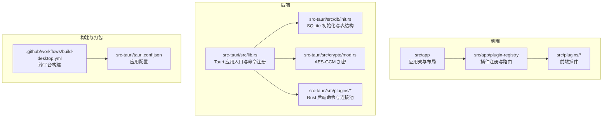
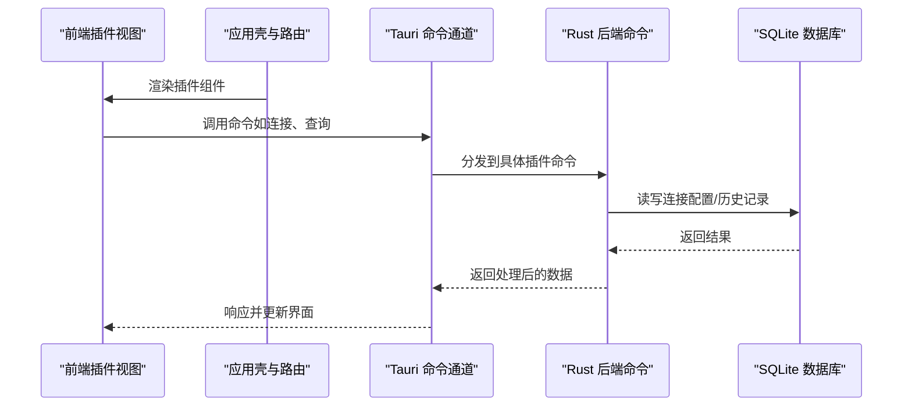
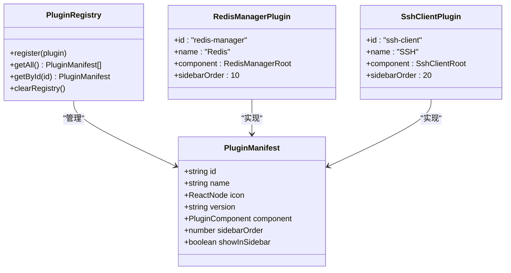
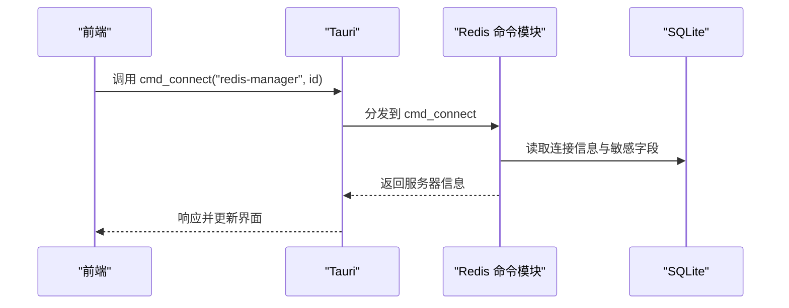
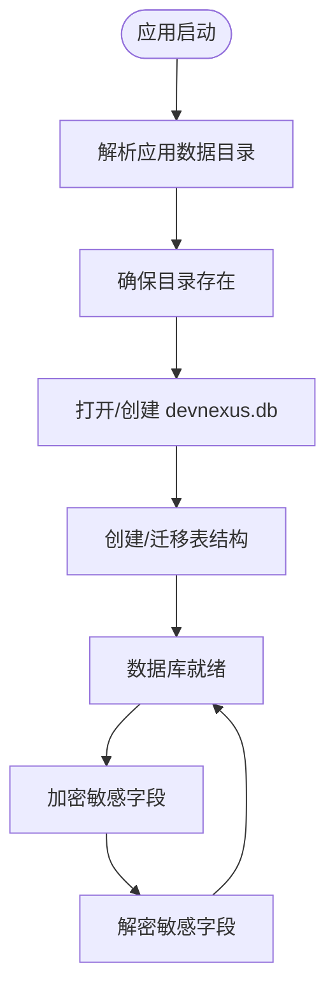
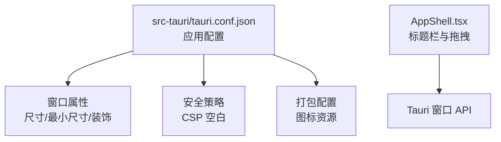
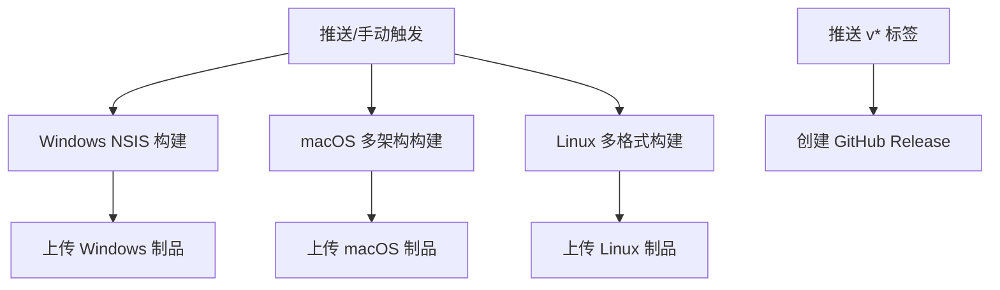
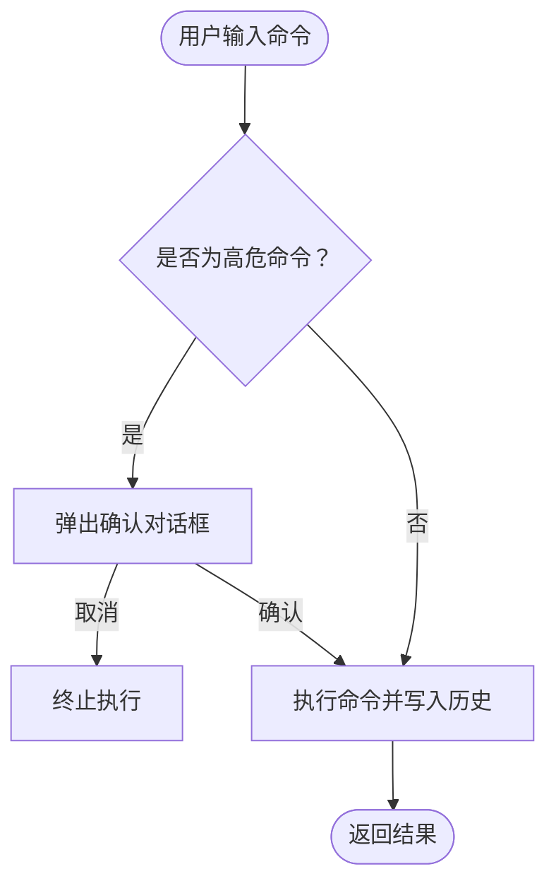
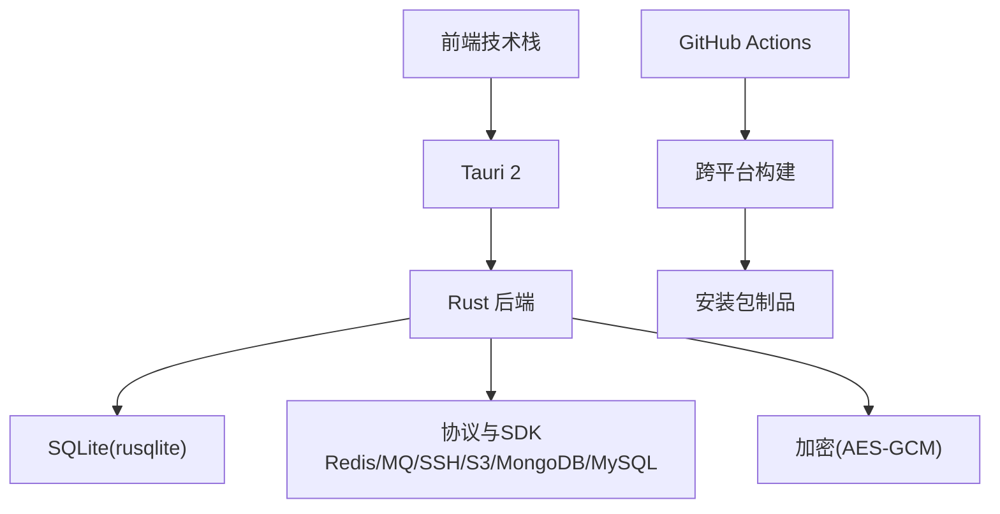

# 产品核心特点

<cite>
**本文档引用的文件**
- [README.md](file://README.md)
- [registry.ts](file://src/app/plugin-registry/registry.ts)
- [builtin.ts](file://src/app/plugin-registry/builtin.ts)
- [types.ts](file://src/app/plugin-registry/types.ts)
- [index.tsx（Redis 管理器）](file://src/plugins/redis-manager/index.tsx)
- [index.tsx（SSH 客户端）](file://src/plugins/ssh-client/index.tsx)
- [lib.rs](file://src-tauri/src/lib.rs)
- [main.rs](file://src-tauri/src/main.rs)
- [Cargo.toml](file://src-tauri/Cargo.toml)
- [mod.rs（加密模块）](file://src-tauri/src/crypto/mod.rs)
- [init.rs（数据库初始化）](file://src-tauri/src/db/init.rs)
- [tauri.conf.json](file://src-tauri/tauri.conf.json)
- [build-desktop.yml](file://.github/workflows/build-desktop.yml)
- [commands.rs（Redis 后端命令）](file://src-tauri/src/plugins/redis/commands.rs)
- [commands.rs（SSH 后端命令）](file://src-tauri/src/plugins/ssh/commands.rs)
- [AppShell.tsx](file://src/app/layout/AppShell.tsx)
</cite>

## 目录
1. [简介](#简介)
2. [项目结构](#项目结构)
3. [核心组件](#核心组件)
4. [架构总览](#架构总览)
5. [详细组件分析](#详细组件分析)
6. [依赖关系分析](#依赖关系分析)
7. [性能考虑](#性能考虑)
8. [故障排查指南](#故障排查指南)
9. [结论](#结论)
10. [附录](#附录)

## 简介
DevNexus 是一款基于 Tauri 2 + React 19 + TypeScript + Rust 的插件化桌面工具箱，面向开发、运维与日常数据管理场景。其核心特点包括：
- 插件化架构：每个工具以独立插件组织，前端视图、状态与 Rust 后端命令按插件隔离。
- 本地优先：连接配置存储于本地 SQLite 数据库，敏感字段采用 AES-GCM 加密。
- 轻量桌面体验：Tauri 提供小体积原生外壳，Rust 负责协议与系统能力。
- 跨平台打包：通过 GitHub Actions 实现 Windows、macOS、Linux 的自动化构建与发布。
- 面向实际运维：提供虚拟列表、分页加载、危险命令确认、可滚动监控页面等安全与性能优化。

## 项目结构
DevNexus 采用“前端插件 + Rust 后端插件”的双层插件化架构，并通过 Tauri 将前端与后端桥接为统一的桌面应用。项目主要目录与职责如下：
- src/app：应用壳、布局、插件注册表与全局状态。
- src/plugins：前端插件实现，每个插件包含自身的视图、状态与类型定义。
- src-tauri/src：Rust 后端，包含数据库初始化、加密模块、各插件命令与连接池。
- .github/workflows：CI/CD 工作流，负责跨平台构建与发布。

**图表来源**
- [lib.rs:10-249](file://src-tauri/src/lib.rs#L10-L249)
- [init.rs:28-362](file://src-tauri/src/db/init.rs#L28-L362)
- [mod.rs（加密模块）:1-75](file://src-tauri/src/crypto/mod.rs#L1-L75)
- [tauri.conf.json:1-39](file://src-tauri/tauri.conf.json#L1-L39)

**章节来源**
- [README.md:56-93](file://README.md#L56-L93)
- [tauri.conf.json:1-39](file://src-tauri/tauri.conf.json#L1-L39)

## 核心组件
- 插件注册与路由：通过注册表集中管理插件清单，按侧边栏顺序排序并渲染对应组件。
- 前端插件：每个插件自包含视图、状态与类型定义，如 Redis 管理器与 SSH 客户端。
- Rust 后端命令：每个插件在后端提供一组命令函数，负责与数据库、外部服务交互。
- 本地存储与加密：SQLite 存储连接配置与历史记录，敏感字段使用 AES-GCM 加密。
- 跨平台打包：GitHub Actions 在 Windows、macOS、Linux 上分别构建安装包。

**章节来源**
- [registry.ts:1-26](file://src/app/plugin-registry/registry.ts#L1-L26)
- [builtin.ts:1-29](file://src/app/plugin-registry/builtin.ts#L1-L29)
- [types.ts:1-14](file://src/app/plugin-registry/types.ts#L1-L14)
- [index.tsx（Redis 管理器）:1-67](file://src/plugins/redis-manager/index.tsx#L1-L67)
- [index.tsx（SSH 客户端）:1-66](file://src/plugins/ssh-client/index.tsx#L1-L66)
- [lib.rs:25-246](file://src-tauri/src/lib.rs#L25-L246)
- [mod.rs（加密模块）:1-75](file://src-tauri/src/crypto/mod.rs#L1-L75)
- [init.rs（数据库初始化）:35-354](file://src-tauri/src/db/init.rs#L35-L354)
- [build-desktop.yml:1-142](file://.github/workflows/build-desktop.yml#L1-L142)

## 架构总览
DevNexus 的整体架构围绕“插件化”展开：前端插件负责 UI 与用户交互，Rust 后端提供系统与网络能力，二者通过 Tauri 的命令通道通信。应用启动时初始化数据库与日志，随后注册所有插件命令，确保前端调用后端功能时具备一致的上下文与权限。

**图表来源**
- [lib.rs:25-246](file://src-tauri/src/lib.rs#L25-L246)
- [init.rs（数据库初始化）:28-362](file://src-tauri/src/db/init.rs#L28-L362)

**章节来源**
- [lib.rs:10-249](file://src-tauri/src/lib.rs#L10-L249)
- [main.rs:1-7](file://src-tauri/src/main.rs#L1-L7)

## 详细组件分析

### 插件化架构设计与实现
- 插件注册表：集中维护插件清单，提供注册、查询与排序能力，保证插件生命周期可控。
- 内置插件注册：在应用启动阶段一次性注册所有内置插件，避免重复注册与运行时开销。
- 插件清单类型：定义插件标识、名称、图标、版本、组件与侧边栏排序等元数据。
- 前端插件组织：每个插件自包含视图与状态，通过统一的插件清单进行装配与渲染。

**图表来源**
- [registry.ts:1-26](file://src/app/plugin-registry/registry.ts#L1-L26)
- [types.ts:1-14](file://src/app/plugin-registry/types.ts#L1-L14)
- [index.tsx（Redis 管理器）:59-67](file://src/plugins/redis-manager/index.tsx#L59-L67)
- [index.tsx（SSH 客户端）:58-66](file://src/plugins/ssh-client/index.tsx#L58-L66)

**章节来源**
- [registry.ts:1-26](file://src/app/plugin-registry/registry.ts#L1-L26)
- [builtin.ts:1-29](file://src/app/plugin-registry/builtin.ts#L1-L29)
- [types.ts:1-14](file://src/app/plugin-registry/types.ts#L1-L14)
- [index.tsx（Redis 管理器）:1-67](file://src/plugins/redis-manager/index.tsx#L1-L67)
- [index.tsx（SSH 客户端）:1-66](file://src/plugins/ssh-client/index.tsx#L1-L66)

### Rust 后端命令的插件隔离机制
- 命令注册：应用启动时集中注册所有插件命令，前端通过命令名调用对应后端逻辑。
- 插件命令实现：每个插件在后端提供一组命令函数，封装数据库访问、外部服务调用与业务逻辑。
- 示例：Redis 插件命令包括连接管理、键值操作、慢查询与历史记录；SSH 插件命令包括会话管理、终端输入输出、密钥与隧道管理。

**图表来源**
- [lib.rs:25-246](file://src-tauri/src/lib.rs#L25-L246)
- [commands.rs（Redis 后端命令）:139-194](file://src-tauri/src/plugins/redis/commands.rs#L139-L194)

**章节来源**
- [lib.rs:25-246](file://src-tauri/src/lib.rs#L25-L246)
- [commands.rs（Redis 后端命令）:139-194](file://src-tauri/src/plugins/redis/commands.rs#L139-L194)
- [commands.rs（SSH 后端命令）:6-75](file://src-tauri/src/plugins/ssh/commands.rs#L6-L75)

### 本地优先存储策略与数据保护
- SQLite 本地数据库：应用启动时初始化数据目录与数据库文件，创建连接配置、历史记录等表结构。
- 敏感数据保护：使用 AES-GCM 对连接密码、密钥等敏感字段进行加密存储，密钥文件位于应用数据目录。
- 数据迁移：支持从旧版本数据库与密钥文件路径迁移，确保升级过程的数据连续性。

**图表来源**
- [init.rs（数据库初始化）:28-362](file://src-tauri/src/db/init.rs#L28-L362)
- [mod.rs（加密模块）:1-75](file://src-tauri/src/crypto/mod.rs#L1-L75)

**章节来源**
- [init.rs（数据库初始化）:6-362](file://src-tauri/src/db/init.rs#L6-L362)
- [mod.rs（加密模块）:1-75](file://src-tauri/src/crypto/mod.rs#L1-L75)

### 轻量桌面体验与 Tauri 2
- Tauri 2 配置：设置窗口尺寸、最小尺寸、无装饰窗口与图标资源，适配不同平台的外观与行为。
- 原生外壳：通过 Tauri 提供轻量原生外壳，前端由 Vite 构建，后端由 Rust 提供高性能系统与协议能力。
- 平台差异：在 macOS 上启用原生标题栏，在其他平台使用自定义标题栏与拖拽调整大小。

**图表来源**
- [tauri.conf.json:1-39](file://src-tauri/tauri.conf.json#L1-L39)
- [AppShell.tsx:147-167](file://src/app/layout/AppShell.tsx#L147-L167)

**章节来源**
- [tauri.conf.json:1-39](file://src-tauri/tauri.conf.json#L1-L39)
- [AppShell.tsx:147-167](file://src/app/layout/AppShell.tsx#L147-L167)

### 跨平台打包与 GitHub Actions
- Windows：使用 NSIS 安装包，构建完成后上传制品。
- macOS：分别构建 x64 与 arm64 架构的 .app 与 .dmg，收集并上传制品。
- Linux：构建 .deb 与 .AppImage，安装系统依赖后执行打包。
- 工作流：在推送到 main 或手动触发时运行构建任务，发布时根据标签构建并创建 Release。

**图表来源**
- [build-desktop.yml:1-142](file://.github/workflows/build-desktop.yml#L1-L142)

**章节来源**
- [build-desktop.yml:1-142](file://.github/workflows/build-desktop.yml#L1-L142)

### 面向实际运维的安全设计理念
- 危险命令确认：对高危 Redis 命令（如 FLUSHALL、CONFIG SET）进行二次确认，防止误操作。
- 分页与虚拟化：在大数据浏览场景采用分页与虚拟化技术，避免一次性加载造成卡顿。
- 可滚动监控页面：通过定时刷新与增量检测，实现对 LAN Chat 等模块的滚动监控，减少不必要的重绘与请求。

**图表来源**
- [commands.rs（Redis 后端命令）:668-695](file://src-tauri/src/plugins/redis/commands.rs#L668-L695)

**章节来源**
- [commands.rs（Redis 后端命令）:668-695](file://src-tauri/src/plugins/redis/commands.rs#L668-L695)
- [AppShell.tsx:59-92](file://src/app/layout/AppShell.tsx#L59-L92)

## 依赖关系分析
- 前端依赖：React 19、TypeScript、Vite、Ant Design、Zustand、ECharts、xterm.js 等。
- 后端依赖：Tauri 2、Tokio、rusqlite、redis、russh、aws-sdk、mongodb、mysql_async、lapin、rdkafka 等。
- 加密与安全：aes-gcm、hex、uuid、base64、reqwest 等。
- 构建与打包：Tauri 构建工具、GitHub Actions、平台特定系统依赖。

**图表来源**
- [Cargo.toml:20-48](file://src-tauri/Cargo.toml#L20-L48)
- [README.md:228-247](file://README.md#L228-L247)

**章节来源**
- [Cargo.toml:1-48](file://src-tauri/Cargo.toml#L1-L48)
- [README.md:228-247](file://README.md#L228-L247)

## 性能考虑
- 插件隔离：前后端均按插件隔离，降低耦合度，便于独立优化与扩展。
- 本地存储：SQLite 本地数据库减少网络往返，结合分页与虚拟化提升大数据浏览性能。
- 原生外壳：Tauri 提供更小的运行时体积与更低的内存占用，适合频繁使用的工具箱场景。
- 并发模型：Rust + Tokio 提供高效的并发能力，适用于多连接、多会话与高吞吐的运维场景。

## 故障排查指南
- 数据库初始化失败：检查应用数据目录权限与磁盘空间，确认数据库文件可读写。
- 加密密钥异常：确认密钥文件存在且长度正确，必要时清理旧密钥并重新生成。
- 命令调用错误：查看后端命令返回的错误信息，确认参数格式与目标资源可用性。
- 跨平台构建问题：核对系统依赖安装情况与目标平台的 Tauri 前置条件。

**章节来源**
- [init.rs（数据库初始化）:6-362](file://src-tauri/src/db/init.rs#L6-L362)
- [mod.rs（加密模块）:1-75](file://src-tauri/src/crypto/mod.rs#L1-L75)
- [commands.rs（Redis 后端命令）:139-194](file://src-tauri/src/plugins/redis/commands.rs#L139-L194)
- [build-desktop.yml:112-121](file://.github/workflows/build-desktop.yml#L112-L121)

## 结论
DevNexus 通过插件化架构实现了前端与后端的强隔离与高内聚，结合本地优先存储与 AES-GCM 加密保障了数据安全，借助 Tauri 2 与 Rust 的高性能特性提供了轻量而强大的桌面体验。配合 GitHub Actions 的跨平台打包流程与面向运维的安全设计，使 DevNexus 成为开发与运维场景下的高效工具箱。

## 附录
- 与传统工具对比：相比分散的浏览器插件或命令行工具，DevNexus 将常用连接与诊断工具整合为统一桌面应用，减少切换成本，提升操作效率与安全性。
- 优势总结：
  - 插件化隔离：便于扩展与维护。
  - 本地优先：降低对外部服务依赖。
  - 轻量原生：更好的性能与资源占用。
  - 跨平台：一次构建，多平台发布。
  - 运维安全：危险命令确认、分页与虚拟化、滚动监控等细节优化。