# 功能特性概览

<cite>
**本文档引用的文件**
- [src/plugins/redis-manager/index.tsx](file://src/plugins/redis-manager/index.tsx)
- [src/plugins/redis-manager/types.ts](file://src/plugins/redis-manager/types.ts)
- [src/plugins/redis-manager/store/connections.ts](file://src/plugins/redis-manager/store/connections.ts)
- [src/plugins/ssh-client/index.tsx](file://src/plugins/ssh-client/index.tsx)
- [src/plugins/ssh-client/types.ts](file://src/plugins/ssh-client/types.ts)
- [src/plugins/ssh-client/store/ssh-connections.ts](file://src/plugins/ssh-client/store/ssh-connections.ts)
- [src/plugins/s3-client/index.tsx](file://src/plugins/s3-client/index.tsx)
- [src/plugins/s3-client/types.ts](file://src/plugins/s3-client/types.ts)
- [src/plugins/mongodb-client/index.tsx](file://src/plugins/mongodb-client/index.tsx)
- [src/plugins/mongodb-client/types.ts](file://src/plugins/mongodb-client/types.ts)
- [src/plugins/mysql-client/index.tsx](file://src/plugins/mysql-client/index.tsx)
- [src/plugins/mysql-client/types.ts](file://src/plugins/mysql-client/types.ts)
- [src/plugins/network-tools/index.tsx](file://src/plugins/network-tools/index.tsx)
- [src/plugins/network-tools/types.ts](file://src/plugins/network-tools/types.ts)
- [src/plugins/api-debugger/index.tsx](file://src/plugins/api-debugger/index.tsx)
- [src/plugins/api-debugger/types.ts](file://src/plugins/api-debugger/types.ts)
- [src/plugins/mq-client/index.tsx](file://src/plugins/mq-client/index.tsx)
- [src/plugins/mq-client/types.ts](file://src/plugins/mq-client/types.ts)
- [src/app/plugin-registry/builtin.ts](file://src/app/plugin-registry/builtin.ts)
</cite>

## 目录
1. [简介](#简介)
2. [项目结构](#项目结构)
3. [核心组件](#核心组件)
4. [架构总览](#架构总览)
5. [详细组件分析](#详细组件分析)
6. [依赖关系分析](#依赖关系分析)
7. [性能考虑](#性能考虑)
8. [故障排除指南](#故障排除指南)
9. [结论](#结论)

## 简介
本概览面向 DevNexus 的八类核心插件，系统性阐述其功能定位与主要能力，并提供典型使用场景与操作流程建议，帮助用户快速理解并高效使用各插件。

## 项目结构
DevNexus 采用插件化架构，内置插件在注册中心统一注册，每个插件包含：
- 插件入口（manifest）：定义插件标识、名称、图标、版本与侧边栏顺序
- 视图容器：通过分段控件切换不同工作区视图
- 存储层（Zustand）：封装状态与后端命令交互
- 类型定义：描述连接配置、结果数据结构与历史记录等

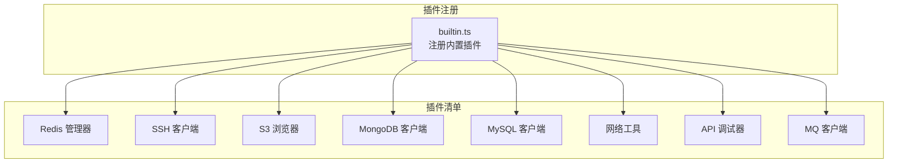

**图表来源**
- [src/app/plugin-registry/builtin.ts:13-27](file://src/app/plugin-registry/builtin.ts#L13-L27)

**章节来源**
- [src/app/plugin-registry/builtin.ts:1-29](file://src/app/plugin-registry/builtin.ts#L1-L29)

## 核心组件
本节概述八个插件的功能定位与关键能力：

- Redis 管理器
  - 连接管理：保存、测试、连接/断开 Redis 连接，支持 Standalone/Sentinel/Cluster
  - DB 切换：按连接选择数据库索引
  - Key 树浏览：扫描与展示键列表，支持多种键类型元信息
  - 命令控制台：执行 Redis 命令并查看结果
  - 典型场景：缓存调试、键空间排查、慢日志分析与导出

- SSH 客户端
  - 多标签 Terminal：会话管理与标签页切换
  - 密钥管理：导入、生成与管理私钥对
  - 端口转发：本地/远程/动态隧道规则配置与启停
  - 典型场景：运维远程主机、安全代理访问受限服务

- S3 浏览器
  - Bucket 浏览：列出存储桶、查看统计信息
  - 对象管理：目录式浏览、上传/下载、删除、元数据查看
  - 预签名 URL：生成可临时访问的对象链接
  - 典型场景：对象存储运维、文件共享与审计

- MongoDB 客户端
  - 数据库/集合浏览：查看数据库与集合信息
  - 文档 CRUD：分页浏览、编辑、插入、删除
  - 查询聚合：工作区执行查询与聚合管道
  - 典型场景：文档数据调试、索引与统计分析

- MySQL 客户端
  - 表数据管理：浏览与编辑表数据，分页与筛选
  - SQL 工作区：编写与执行 SQL，查看结果集
  - 索引管理：查看与管理索引信息
  - 典型场景：数据库开发与排障、报表与迁移

- 网络工具
  - Ping：主机连通性与丢包率、时延统计
  - TCP 端口检测：连通性与耗时检测
  - DNS 解析：域名到地址映射
  - Traceroute：路径追踪与跳点解析
  - 典型场景：网络诊断与连通性验证

- API 调试器
  - HTTP 请求构建：方法、URL、参数、头、Cookie、认证、请求体
  - 集合/环境管理：组织请求模板与环境变量
  - 响应查看：状态码、头、体、时序与重定向链
  - 典型场景：接口联调、自动化测试与问题复现

- MQ 客户端
  - RabbitMQ/Kafka 资源浏览：连接、虚拟主机/命名空间、队列/主题、消费者组
  - 消息发送：指定目标、路由键/分区、头部属性、编码体
  - 典型场景：消息中间件调试、生产者/消费者联调

**章节来源**
- [src/plugins/redis-manager/index.tsx:14-57](file://src/plugins/redis-manager/index.tsx#L14-L57)
- [src/plugins/ssh-client/index.tsx:12-56](file://src/plugins/ssh-client/index.tsx#L12-L56)
- [src/plugins/s3-client/index.tsx:10-58](file://src/plugins/s3-client/index.tsx#L10-L58)
- [src/plugins/mongodb-client/index.tsx:14-77](file://src/plugins/mongodb-client/index.tsx#L14-L77)
- [src/plugins/mysql-client/index.tsx:14-35](file://src/plugins/mysql-client/index.tsx#L14-L35)
- [src/plugins/network-tools/index.tsx:9-24](file://src/plugins/network-tools/index.tsx#L9-L24)
- [src/plugins/api-debugger/index.tsx:13-36](file://src/plugins/api-debugger/index.tsx#L13-L36)
- [src/plugins/mq-client/index.tsx:13-35](file://src/plugins/mq-client/index.tsx#L13-L35)

## 架构总览
各插件遵循统一的“视图容器 + 存储层 + 后端命令”的交互模式：
- 视图容器负责 Tab 切换与布局
- 存储层使用 Zustand 管理状态，通过 invoke 调用后端命令
- 后端命令在 Tauri 层实现具体业务逻辑

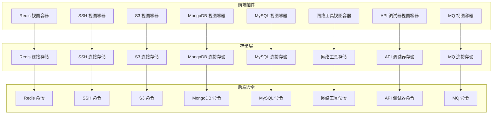

**图表来源**
- [src/plugins/redis-manager/index.tsx:14-57](file://src/plugins/redis-manager/index.tsx#L14-L57)
- [src/plugins/ssh-client/index.tsx:12-56](file://src/plugins/ssh-client/index.tsx#L12-L56)
- [src/plugins/s3-client/index.tsx:10-58](file://src/plugins/s3-client/index.tsx#L10-L58)
- [src/plugins/mongodb-client/index.tsx:14-77](file://src/plugins/mongodb-client/index.tsx#L14-L77)
- [src/plugins/mysql-client/index.tsx:14-35](file://src/plugins/mysql-client/index.tsx#L14-L35)
- [src/plugins/network-tools/index.tsx:9-24](file://src/plugins/network-tools/index.tsx#L9-L24)
- [src/plugins/api-debugger/index.tsx:13-36](file://src/plugins/api-debugger/index.tsx#L13-L36)
- [src/plugins/mq-client/index.tsx:13-35](file://src/plugins/mq-client/index.tsx#L13-L35)

## 详细组件分析

### Redis 管理器
- 功能定位：集中式 Redis 连接与运维工具
- 主要能力
  - 连接管理：保存/删除连接、测试延迟、连接/断开、选择数据库
  - Key 树浏览：扫描键、查看类型与 TTL、批量导出
  - 命令控制台：执行任意 Redis 命令并查看结果
  - 服务器信息：查看版本、内存、客户端等统计
- 典型使用流程
  1) 在“Connections”中新建或选择连接，测试连通性
  2) 在“Keys”中扫描键空间，定位目标键
  3) 在“Console”中执行命令进行调试
  4) 在“Server”查看服务器状态辅助排障

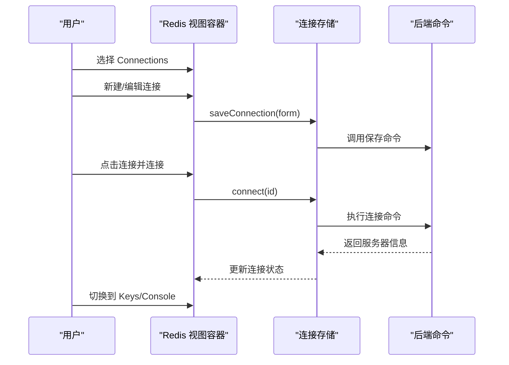

**图表来源**
- [src/plugins/redis-manager/index.tsx:14-57](file://src/plugins/redis-manager/index.tsx#L14-L57)
- [src/plugins/redis-manager/store/connections.ts:27-90](file://src/plugins/redis-manager/store/connections.ts#L27-L90)

**章节来源**
- [src/plugins/redis-manager/index.tsx:14-57](file://src/plugins/redis-manager/index.tsx#L14-L57)
- [src/plugins/redis-manager/types.ts:1-91](file://src/plugins/redis-manager/types.ts#L1-L91)
- [src/plugins/redis-manager/store/connections.ts:1-91](file://src/plugins/redis-manager/store/connections.ts#L1-L91)

### SSH 客户端
- 功能定位：终端与隧道综合管理
- 主要能力
  - 多标签 Terminal：会话生命周期管理
  - 密钥管理：导入/生成密钥对、查看公钥指纹
  - 端口转发：本地/远程/动态三种隧道规则
- 典型使用流程
  1) 在“Connections”中配置主机与认证方式
  2) 在“Terminal”中打开会话进行运维
  3) 在“Keys”中管理密钥
  4) 在“Tunnels”中配置与启停隧道

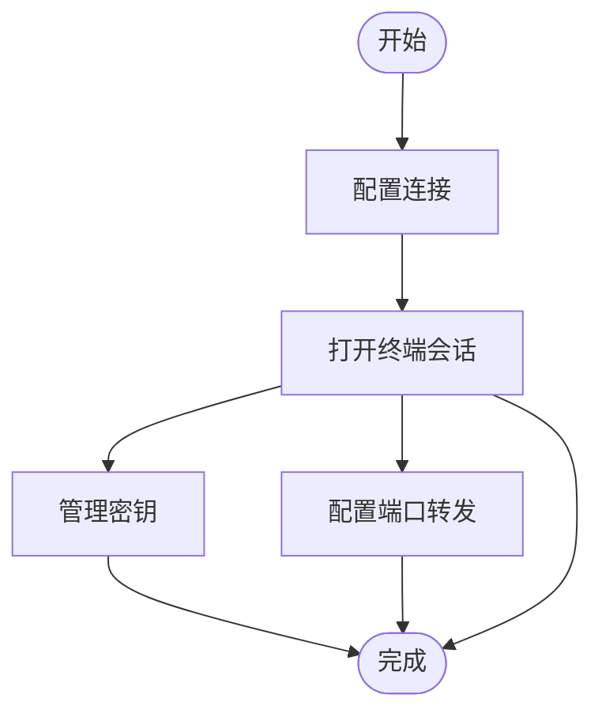

**图表来源**
- [src/plugins/ssh-client/index.tsx:12-56](file://src/plugins/ssh-client/index.tsx#L12-L56)
- [src/plugins/ssh-client/types.ts:1-115](file://src/plugins/ssh-client/types.ts#L1-L115)

**章节来源**
- [src/plugins/ssh-client/index.tsx:12-56](file://src/plugins/ssh-client/index.tsx#L12-L56)
- [src/plugins/ssh-client/types.ts:1-115](file://src/plugins/ssh-client/types.ts#L1-L115)
- [src/plugins/ssh-client/store/ssh-connections.ts:1-77](file://src/plugins/ssh-client/store/ssh-connections.ts#L1-L77)

### S3 浏览器
- 功能定位：对象存储统一入口
- 主要能力
  - Bucket 浏览：列出桶、查看版本与区域信息
  - 对象管理：目录式浏览、元数据查看、删除、预签名 URL
- 典型使用流程
  1) 在“Connections”中配置提供商与凭据
  2) 在“Buckets”中选择目标桶
  3) 在“Objects”中浏览对象并执行管理操作

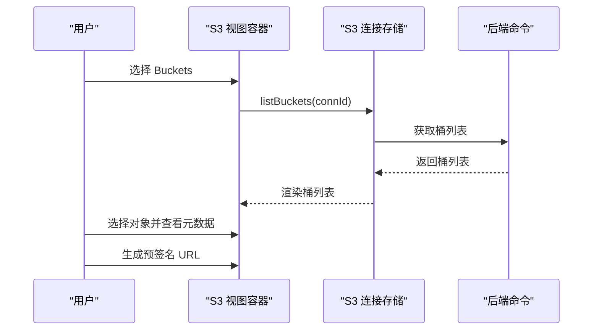

**图表来源**
- [src/plugins/s3-client/index.tsx:10-58](file://src/plugins/s3-client/index.tsx#L10-L58)
- [src/plugins/s3-client/types.ts:1-110](file://src/plugins/s3-client/types.ts#L1-L110)

**章节来源**
- [src/plugins/s3-client/index.tsx:10-58](file://src/plugins/s3-client/index.tsx#L10-L58)
- [src/plugins/s3-client/types.ts:1-110](file://src/plugins/s3-client/types.ts#L1-L110)

### MongoDB 客户端
- 功能定位：数据库与集合的可视化管理
- 主要能力
  - 数据库/集合浏览：查看数据库与集合信息
  - 文档 CRUD：分页浏览、编辑、插入、删除
  - 查询聚合：工作区执行查询与聚合管道
  - 索引管理：查看与管理索引
  - 导入/导出：批量导入导出
  - 服务器状态：查看运行指标
- 典型使用流程
  1) 在“Connections”中建立连接
  2) 在“Databases”中选择数据库
  3) 在“Documents”中浏览与编辑文档
  4) 在“Query”中编写与执行查询/聚合
  5) 在“Indexes”中管理索引
  6) 在“Import/Export”中进行批量操作

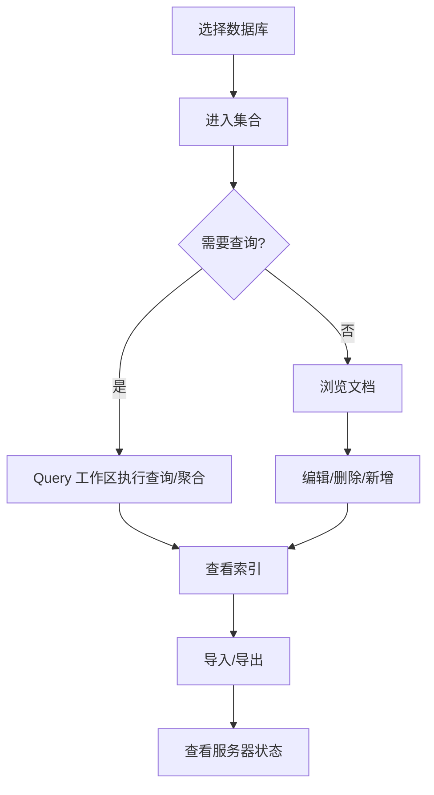

**图表来源**
- [src/plugins/mongodb-client/index.tsx:14-77](file://src/plugins/mongodb-client/index.tsx#L14-L77)
- [src/plugins/mongodb-client/types.ts:1-95](file://src/plugins/mongodb-client/types.ts#L1-L95)

**章节来源**
- [src/plugins/mongodb-client/index.tsx:14-77](file://src/plugins/mongodb-client/index.tsx#L14-L77)
- [src/plugins/mongodb-client/types.ts:1-95](file://src/plugins/mongodb-client/types.ts#L1-L95)

### MySQL 客户端
- 功能定位：数据库开发与运维助手
- 主要能力
  - 数据库/表浏览：查看数据库与表信息
  - 表数据管理：浏览与编辑表数据，分页与筛选
  - SQL 工作区：编写与执行 SQL，查看结果集
  - 索引管理：查看与管理索引
  - 导入/导出：批量导入导出
  - 服务器状态：查看运行指标
- 典型使用流程
  1) 在“Connections”中建立连接
  2) 在“Databases”中选择数据库
  3) 在“Table Data”中浏览与编辑表数据
  4) 在“SQL”中编写与执行 SQL
  5) 在“Indexes”中管理索引
  6) 在“Import/Export”中进行批量操作

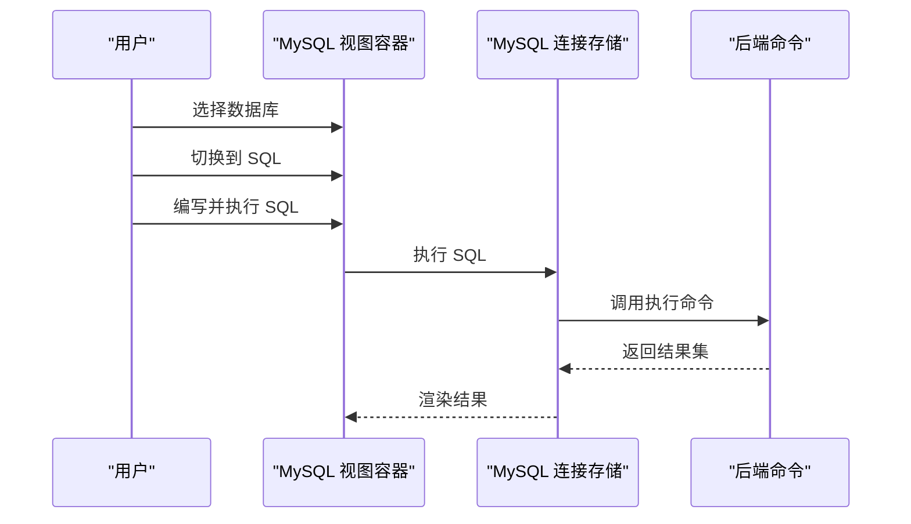

**图表来源**
- [src/plugins/mysql-client/index.tsx:14-35](file://src/plugins/mysql-client/index.tsx#L14-L35)
- [src/plugins/mysql-client/types.ts:1-40](file://src/plugins/mysql-client/types.ts#L1-L40)

**章节来源**
- [src/plugins/mysql-client/index.tsx:14-35](file://src/plugins/mysql-client/index.tsx#L14-L35)
- [src/plugins/mysql-client/types.ts:1-40](file://src/plugins/mysql-client/types.ts#L1-L40)

### 网络工具
- 功能定位：网络连通性与诊断工具箱
- 主要能力
  - Ping：主机连通性与丢包率、时延统计
  - TCP 端口检测：连通性与耗时检测
  - DNS 解析：域名到地址映射
  - Traceroute：路径追踪与跳点解析
  - 历史记录：失败/成功与摘要信息
- 典型使用流程
  1) 在“Diagnostics”中选择工具并输入目标
  2) 查看实时结果与原始输出
  3) 在“History”中回溯历史任务

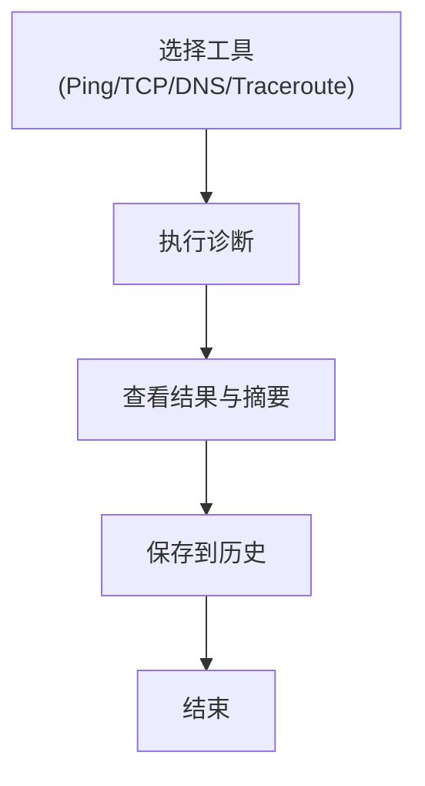

**图表来源**
- [src/plugins/network-tools/index.tsx:9-24](file://src/plugins/network-tools/index.tsx#L9-L24)
- [src/plugins/network-tools/types.ts:1-57](file://src/plugins/network-tools/types.ts#L1-L57)

**章节来源**
- [src/plugins/network-tools/index.tsx:9-24](file://src/plugins/network-tools/index.tsx#L9-L24)
- [src/plugins/network-tools/types.ts:1-57](file://src/plugins/network-tools/types.ts#L1-L57)

### API 调试器
- 功能定位：HTTP 接口调试与协作
- 主要能力
  - 请求构建：方法、URL、参数、头、Cookie、认证、请求体
  - 集合/环境：组织请求模板与环境变量
  - 响应查看：状态码、头、体、时序与重定向链
  - 历史记录：请求/响应快照与过滤
- 典型使用流程
  1) 在“Environments”中配置环境变量
  2) 在“Collections”中组织请求模板
  3) 在“Workspace”中构建并发送请求
  4) 在“History”中查看与复用历史

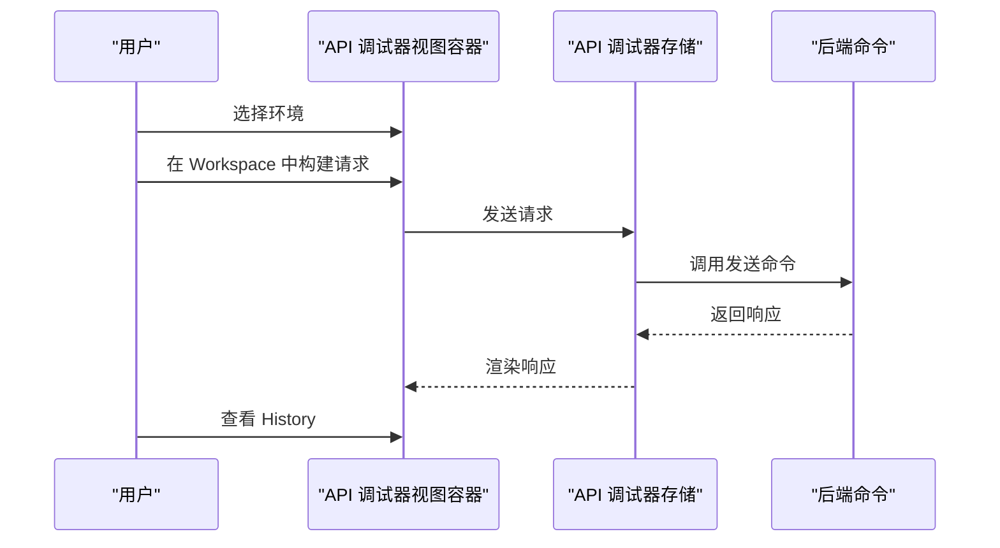

**图表来源**
- [src/plugins/api-debugger/index.tsx:13-36](file://src/plugins/api-debugger/index.tsx#L13-L36)
- [src/plugins/api-debugger/types.ts:1-105](file://src/plugins/api-debugger/types.ts#L1-L105)

**章节来源**
- [src/plugins/api-debugger/index.tsx:13-36](file://src/plugins/api-debugger/index.tsx#L13-L36)
- [src/plugins/api-debugger/types.ts:1-105](file://src/plugins/api-debugger/types.ts#L1-L105)

### MQ 客户端
- 功能定位：RabbitMQ 与 Kafka 的统一管理
- 主要能力
  - 连接管理：AMQP/Kafka 连接配置与诊断
  - 资源浏览：队列/交换机/主题、消费者组等
  - 消息发送：指定目标、路由键/分区、头部属性、编码体
  - 历史记录：操作类型、状态、耗时与请求/结果快照
- 典型使用流程
  1) 在“Connections”中添加连接并诊断
  2) 在“Browser”中浏览资源树
  3) 在“Message Studio”中发送消息
  4) 在“History”中查看操作记录

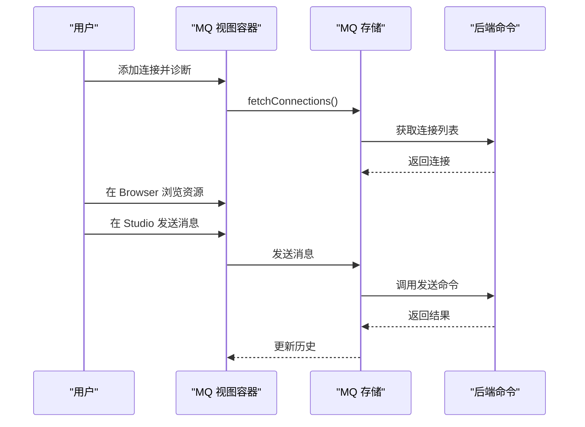

**图表来源**
- [src/plugins/mq-client/index.tsx:13-35](file://src/plugins/mq-client/index.tsx#L13-L35)
- [src/plugins/mq-client/types.ts:1-90](file://src/plugins/mq-client/types.ts#L1-L90)

**章节来源**
- [src/plugins/mq-client/index.tsx:13-35](file://src/plugins/mq-client/index.tsx#L13-L35)
- [src/plugins/mq-client/types.ts:1-90](file://src/plugins/mq-client/types.ts#L1-L90)

## 依赖关系分析
- 插件注册：所有内置插件在注册中心集中注册，确保启动时加载
- 视图容器与存储：每个插件的视图容器仅依赖对应存储，存储通过 invoke 调用后端命令
- 类型定义：各插件内部类型清晰划分，便于扩展与维护

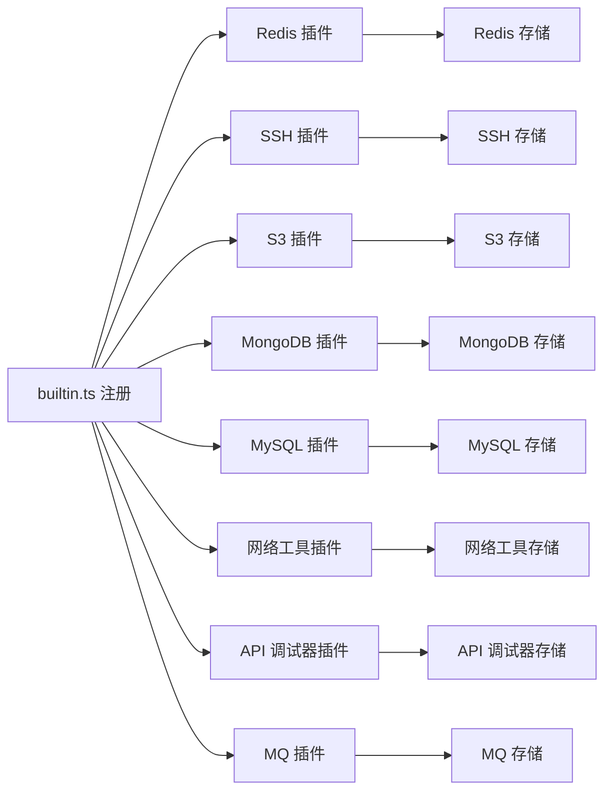

**图表来源**
- [src/app/plugin-registry/builtin.ts:13-27](file://src/app/plugin-registry/builtin.ts#L13-L27)

**章节来源**
- [src/app/plugin-registry/builtin.ts:1-29](file://src/app/plugin-registry/builtin.ts#L1-L29)

## 性能考虑
- 状态管理：使用轻量级状态库管理连接与视图状态，避免不必要的重渲染
- 异步调用：通过后端命令异步执行，避免阻塞 UI
- 分页与懒加载：在大数据集场景下采用分页与懒加载策略
- 缓存与去重：对连接列表与服务器信息进行缓存，减少重复请求

## 故障排除指南
- 连接失败
  - 检查连接配置与网络连通性
  - 使用“测试连接”功能定位问题
  - 查看历史记录中的错误摘要
- 会话异常
  - 在 SSH 客户端中确认会话状态与事件通知
  - 重新建立连接并检查密钥与认证方式
- 对象操作异常
  - 确认桶权限与凭据
  - 检查对象版本与存储类别
- 查询/SQL 执行缓慢
  - 优化查询条件与索引
  - 分页获取数据，避免一次性加载过多
- 网络诊断无结果
  - 确认目标可达与防火墙策略
  - 检查 DNS 解析与 Traceroute 路径

## 结论
DevNexus 的八个核心插件覆盖了开发与运维的关键场景，通过统一的插件化架构与清晰的视图/存储分离，提供了高可用、易扩展的工具集。建议根据实际需求优先掌握连接管理与基础浏览能力，再逐步深入到高级功能如查询/聚合、消息发送与网络诊断，以提升整体效率与稳定性。