# 开发环境搭建

<cite>
**本文档引用的文件**
- [README.md](file://README.md)
- [package.json](file://package.json)
- [vite.config.ts](file://vite.config.ts)
- [tsconfig.json](file://tsconfig.json)
- [tsconfig.node.json](file://tsconfig.node.json)
- [src-tauri/tauri.conf.json](file://src-tauri/tauri.conf.json)
- [src-tauri/Cargo.toml](file://src-tauri/Cargo.toml)
- [tests/app/plugin-registry/registry.test.ts](file://tests/app/plugin-registry/registry.test.ts)
- [tests/app/plugin-registry/builtin.test.ts](file://tests/app/plugin-registry/builtin.test.ts)
</cite>

## 目录
1. [简介](#简介)
2. [项目结构](#项目结构)
3. [核心组件](#核心组件)
4. [架构概览](#架构概览)
5. [详细组件分析](#详细组件分析)
6. [依赖分析](#依赖分析)
7. [性能考虑](#性能考虑)
8. [故障排除指南](#故障排除指南)
9. [结论](#结论)

## 简介

DevNexus 是一个基于 Tauri 2 + React 19 + TypeScript + Rust 的插件化桌面工具箱，专为开发、运维和日常数据管理场景设计。该项目采用现代化的技术栈，结合前端 React 生态和 Rust 后端能力，提供轻量级的桌面应用程序体验。

## 项目结构

DevNexus 采用清晰的分层架构设计：

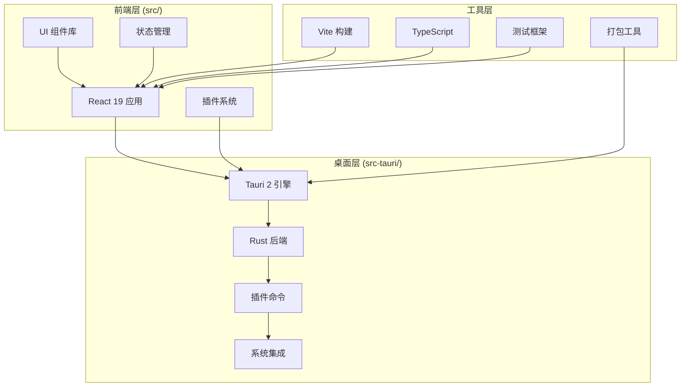

**图表来源**
- [README.md:56-93](file://README.md#L56-L93)
- [README.md:248-279](file://README.md#L248-L279)

**章节来源**
- [README.md:56-93](file://README.md#L56-L93)
- [README.md:248-279](file://README.md#L248-L279)

## 核心组件

### 技术栈概览

DevNexus 采用以下核心技术栈：

| 层级 | 技术 | 版本 | 用途 |
|------|------|------|------|
| 桌面框架 | Tauri 2 | 2.x | 跨平台桌面应用框架 |
| 前端框架 | React 19 | 19.x | 用户界面构建 |
| 开发语言 | TypeScript | ~5.8 | 类型安全的 JavaScript |
| 构建工具 | Vite | 7.x | 快速开发和构建 |
| UI 组件 | Ant Design | 6.x | 企业级 UI 组件库 |
| 状态管理 | Zustand | 5.x | 轻量级状态管理 |
| 终端组件 | xterm.js | 5.x | 内嵌终端模拟器 |
| 后端语言 | Rust | stable | 系统级编程和性能 |

### 项目布局

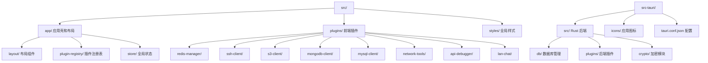

**图表来源**
- [README.md:58-91](file://README.md#L58-L91)
- [README.md:250-277](file://README.md#L250-L277)

**章节来源**
- [README.md:35-55](file://README.md#L35-L55)
- [README.md:228-247](file://README.md#L228-L247)

## 架构概览

DevNexus 采用插件化架构，实现了前后端的清晰分离：

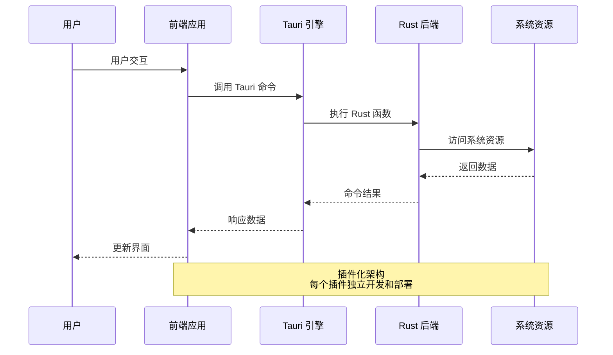

**图表来源**
- [README.md:28-34](file://README.md#L28-L34)
- [src-tauri/tauri.conf.json:1-39](file://src-tauri/tauri.conf.json#L1-L39)

## 详细组件分析

### 环境要求配置

#### Node.js 环境要求

项目明确要求 Node.js 20+ 版本，这是基于以下考虑：

- **性能优化**: Node.js 20+ 提供更好的性能和内存管理
- **ES 模块支持**: 完整的 ES 模块生态系统支持
- **TypeScript 集成**: 更好的 TypeScript 编译和类型检查

#### Rust 环境配置

Rust stable 版本是必需的，主要因为：

- **稳定性保证**: stable 版本提供长期支持和稳定性
- **跨平台编译**: 统一的编译工具链支持多平台
- **依赖管理**: Cargo 依赖解析和版本锁定机制

**章节来源**
- [README.md:95-101](file://README.md#L95-L101)
- [README.md:281-286](file://README.md#L281-L286)

### Tauri 平台前置依赖

#### Windows 平台

Windows 开发需要安装 Visual Studio 构建工具：

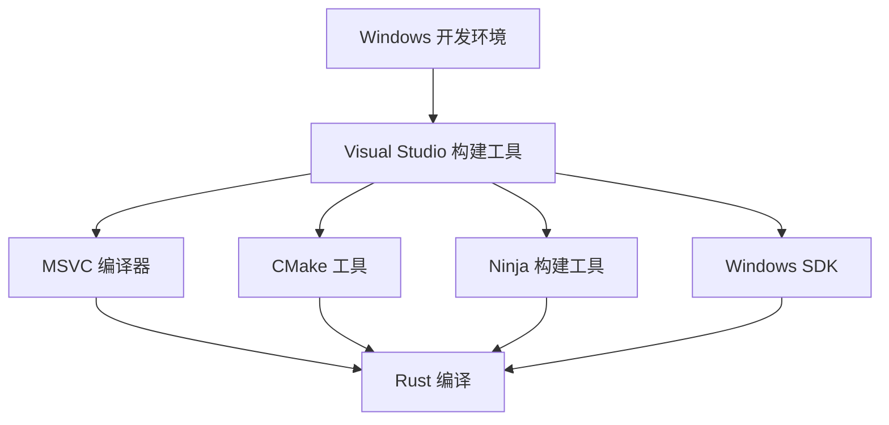

**图表来源**
- [README.md:99](file://README.md#L99)

#### macOS 平台

macOS 需要 Xcode 命令行工具：

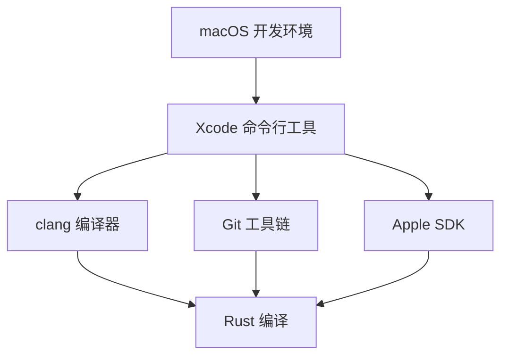

**图表来源**
- [README.md:100](file://README.md#L100)

#### Linux 平台

Linux 需要 GTK 开发库和其他系统依赖：

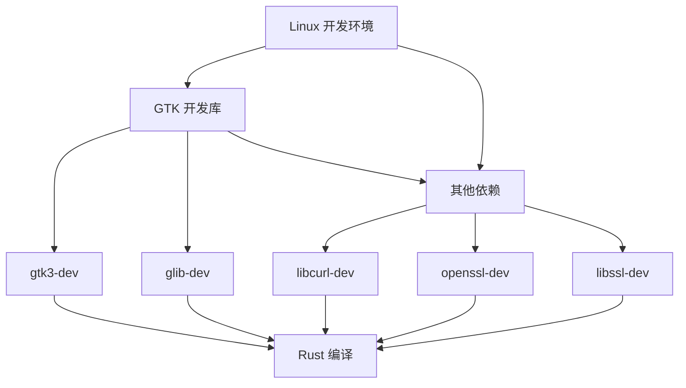

**图表来源**
- [README.md:100](file://README.md#L100)

### 开发流程配置

#### 本地开发流程

项目提供了完整的本地开发流程：

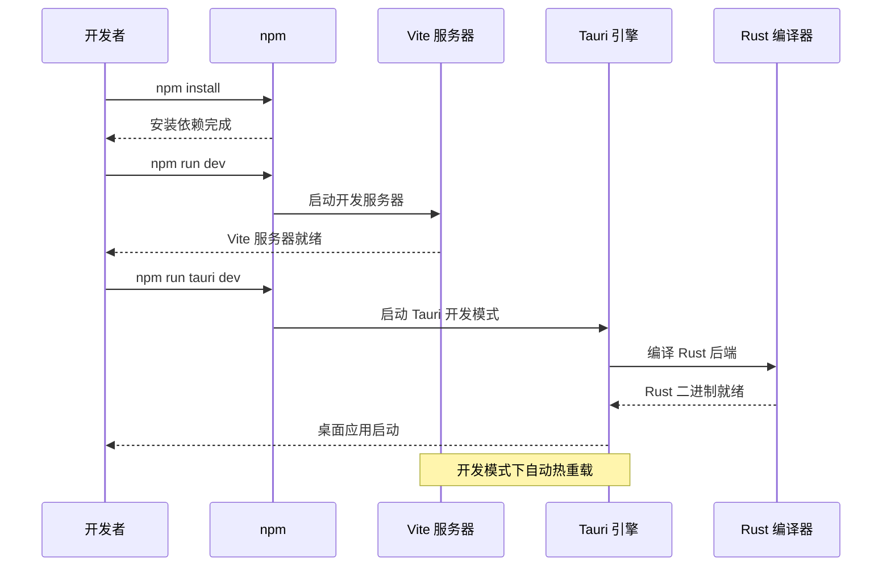

**图表来源**
- [README.md:107-118](file://README.md#L107-L118)
- [README.md:292-303](file://README.md#L292-L303)

**章节来源**
- [README.md:107-118](file://README.md#L107-L118)
- [README.md:292-303](file://README.md#L292-L303)

### 验证命令配置

#### 测试配置

项目使用 Vitest 作为测试框架，配置了完整的测试环境：

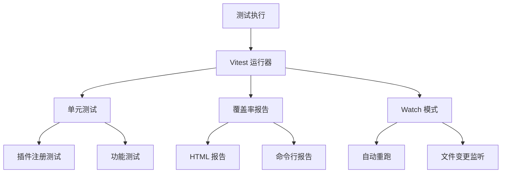

**图表来源**
- [package.json:6-14](file://package.json#L6-L14)
- [vite.config.ts:16-18](file://vite.config.ts#L16-L18)

#### TypeScript 类型检查

项目配置了严格的 TypeScript 检查规则：

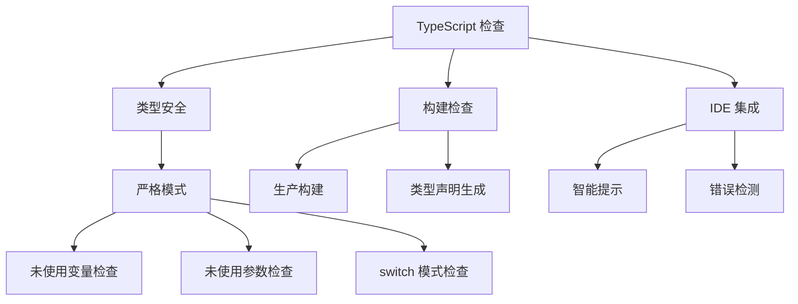

**图表来源**
- [tsconfig.json:22-25](file://tsconfig.json#L22-L25)
- [package.json:9](file://package.json#L9)

**章节来源**
- [package.json:6-14](file://package.json#L6-L14)
- [vite.config.ts:16-18](file://vite.config.ts#L16-L18)
- [tsconfig.json:22-25](file://tsconfig.json#L22-L25)

### 构建配置分析

#### Vite 开发配置

Vite 配置针对 Tauri 开发进行了专门优化：

```mermaid
classDiagram
class ViteConfig {
+number port
+boolean strictPort
+string host
+object hmr
+object watch
+clearScreen : false
+plugins : [react()]
+resolve.alias : {@ : src}
+test.include : [tests/**/*.test.ts]
}
class TauriIntegration {
+string devUrl
+string frontendDist
+string beforeDevCommand
+string beforeBuildCommand
}
ViteConfig --> TauriIntegration : "集成"
```

**图表来源**
- [vite.config.ts:9-41](file://vite.config.ts#L9-L41)
- [src-tauri/tauri.conf.json:6-11](file://src-tauri/tauri.conf.json#L6-L11)

**章节来源**
- [vite.config.ts:9-41](file://vite.config.ts#L9-L41)
- [src-tauri/tauri.conf.json:6-11](file://src-tauri/tauri.conf.json#L6-L11)

## 依赖分析

### 前端依赖关系

```mermaid
graph TB
subgraph "核心依赖"
A[React 19]
B[TypeScript]
C[Ant Design]
D[Zustand]
end
subgraph "开发依赖"
E[Vite]
F[@vitejs/plugin-react]
G[React DOM]
H[测试框架]
end
subgraph "工具依赖"
I[xterm.js]
J[ECharts]
K[@tanstack/react-virtual]
L[@ant-design/icons]
end
A --> C
A --> D
B --> E
C --> I
D --> J
E --> H
```

**图表来源**
- [package.json:15-29](file://package.json#L15-L29)
- [package.json:30-38](file://package.json#L30-L38)

### Rust 后端依赖

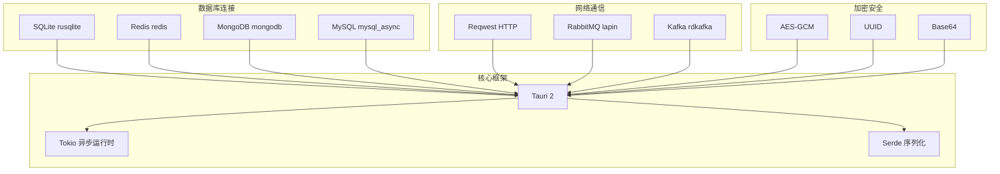

**图表来源**
- [src-tauri/Cargo.toml:20-48](file://src-tauri/Cargo.toml#L20-L48)

**章节来源**
- [package.json:15-38](file://package.json#L15-L38)
- [src-tauri/Cargo.toml:20-48](file://src-tauri/Cargo.toml#L20-L48)

## 性能考虑

### 开发性能优化

项目在开发阶段采用了多项性能优化措施：

1. **热重载优化**: Vite 提供快速的模块热替换
2. **并行编译**: Rust 编译器优化和 Cargo 的并行构建
3. **内存管理**: TypeScript 的严格模式减少内存泄漏
4. **虚拟滚动**: 大数据集的性能优化

### 生产性能配置

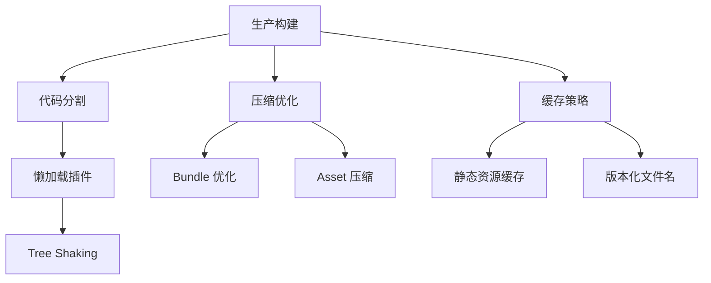

**图表来源**
- [package.json:8](file://package.json#L8)
- [vite.config.ts:23-40](file://vite.config.ts#L23-L40)

## 故障排除指南

### 常见开发问题

#### Node.js 版本问题

**问题**: Node.js 版本过低导致构建失败

**解决方案**:
1. 检查 Node.js 版本: `node --version`
2. 升级到 Node.js 20+
3. 清理缓存: `npm cache clean --force`

#### Rust 编译错误

**问题**: Rust 编译器版本不兼容

**解决方案**:
1. 安装稳定版 Rust: `rustup install stable`
2. 设置默认工具链: `rustup default stable`
3. 更新工具链: `rustup update`

#### Tauri 依赖缺失

**问题**: 平台特定依赖未安装

**解决方案**:
1. Windows: 安装 Visual Studio 构建工具
2. macOS: 安装 Xcode 命令行工具
3. Linux: 安装 GTK 开发库

#### 端口冲突

**问题**: Vite 开发服务器端口被占用

**解决方案**:
1. 修改 Vite 配置中的端口号
2. 检查端口占用情况: `netstat -ano | findstr :1420`
3. 释放占用端口或更改配置

**章节来源**
- [README.md:120-135](file://README.md#L120-L135)
- [README.md:305-320](file://README.md#L305-L320)

### 测试相关问题

#### Vitest 测试失败

**问题**: 测试用例执行失败

**解决方案**:
1. 运行测试: `npm test`
2. 查看测试报告: `npm run test:watch`
3. 检查测试文件路径配置

#### 类型检查错误

**问题**: TypeScript 类型检查失败

**解决方案**:
1. 运行类型检查: `npm run lint`
2. 检查 tsconfig 配置
3. 修复类型定义问题

**章节来源**
- [tests/app/plugin-registry/registry.test.ts:1-40](file://tests/app/plugin-registry/registry.test.ts#L1-L40)
- [tests/app/plugin-registry/builtin.test.ts:1-31](file://tests/app/plugin-registry/builtin.test.ts#L1-L31)

## 结论

DevNexus 提供了一个完整、现代化的桌面应用开发环境。通过合理的架构设计和技术选型，项目实现了良好的开发体验和性能表现。

### 关键优势

1. **插件化架构**: 支持独立开发和部署的插件系统
2. **跨平台支持**: 统一的 Tauri 框架支持多平台部署
3. **现代技术栈**: React 19 + TypeScript + Rust 的最佳实践组合
4. **完善的工具链**: Vite + TypeScript + Vitest 的开发体验
5. **性能优化**: 多层次的性能优化和缓存策略

### 最佳实践建议

1. **环境一致性**: 确保团队成员使用相同的 Node.js 和 Rust 版本
2. **依赖管理**: 定期更新依赖包，关注安全漏洞
3. **代码质量**: 遵循 TypeScript 严格模式和代码规范
4. **测试驱动**: 编写全面的单元测试和集成测试
5. **性能监控**: 定期进行性能基准测试和优化

通过遵循本文档提供的指导，开发者可以快速建立稳定、高效的 DevNexus 开发环境，为后续的功能开发和维护奠定坚实基础。