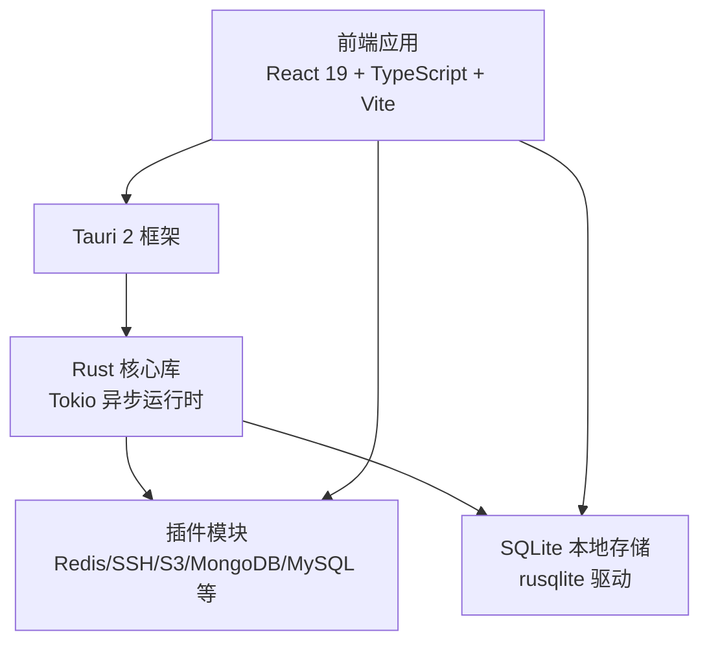
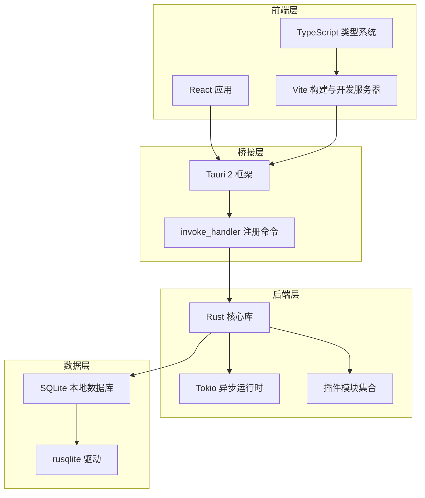
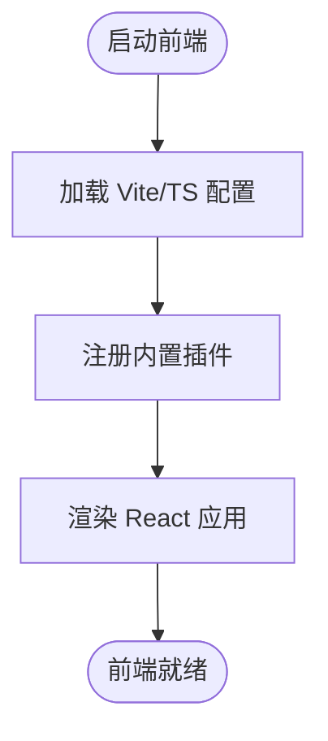
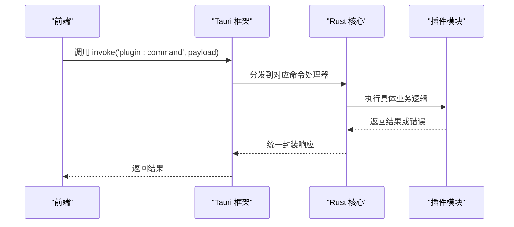
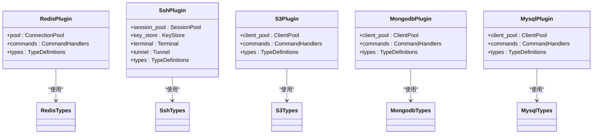
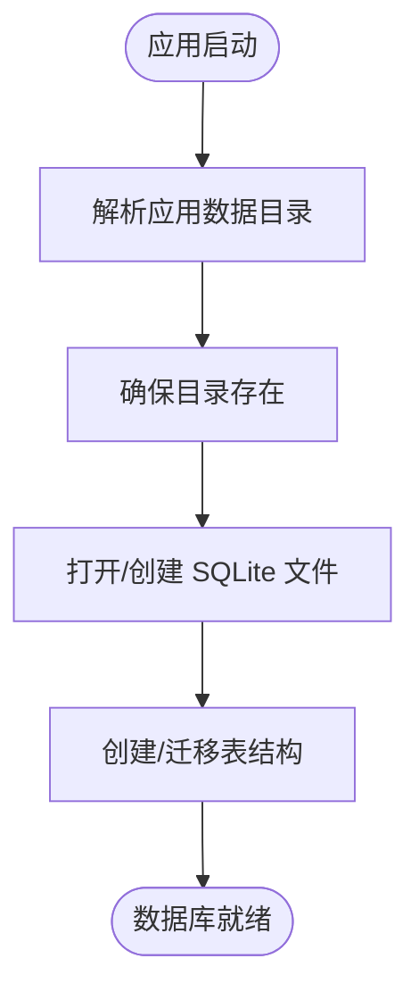
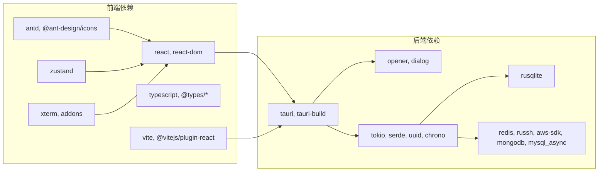

# 技术栈概览

<cite>
**本文档引用的文件**
- [package.json](file://package.json)
- [vite.config.ts](file://vite.config.ts)
- [tsconfig.json](file://tsconfig.json)
- [src/main.tsx](file://src/main.tsx)
- [src-tauri/Cargo.toml](file://src-tauri/Cargo.toml)
- [src-tauri/src/lib.rs](file://src-tauri/src/lib.rs)
- [src-tauri/tauri.conf.json](file://src-tauri/tauri.conf.json)
- [src/app/plugin-registry/builtin.ts](file://src/app/plugin-registry/builtin.ts)
- [src/plugins/redis-manager/types.ts](file://src/plugins/redis-manager/types.ts)
- [src/plugins/mongodb-client/types.ts](file://src/plugins/mongodb-client/types.ts)
- [src-tauri/src/db/init.rs](file://src-tauri/src/db/init.rs)
- [src-tauri/src/plugins/redis/mod.rs](file://src-tauri/src/plugins/redis/mod.rs)
- [src-tauri/src/plugins/ssh/mod.rs](file://src-tauri/src/plugins/ssh/mod.rs)
- [src-tauri/src/plugins/s3/mod.rs](file://src-tauri/src/plugins/s3/mod.rs)
- [src-tauri/src/plugins/mongodb/mod.rs](file://src-tauri/src/plugins/mongodb/mod.rs)
</cite>

## 目录
1. [引言](#引言)
2. [项目结构](#项目结构)
3. [核心组件](#核心组件)
4. [架构总览](#架构总览)
5. [详细组件分析](#详细组件分析)
6. [依赖关系分析](#依赖关系分析)
7. [性能考量](#性能考量)
8. [故障排除指南](#故障排除指南)
9. [结论](#结论)

## 引言
本文件为 DevNexus 的技术栈概览，系统性梳理前端技术栈（React 19 + TypeScript + Vite）、桌面框架（Tauri 2）、后端技术栈（Rust + Tokio 异步运行时）、数据库与各插件驱动的技术选型与实现要点，并进行横向对比与权衡分析，帮助读者快速理解项目整体技术架构与设计取舍。

## 项目结构
DevNexus 采用前后端分离的桌面应用架构：
- 前端：基于 React 19 + TypeScript + Vite 的现代化 Web 应用，通过 Tauri 桥接调用原生能力
- 后端：Rust 实现的 Tauri 插件层，提供 Redis、SSH、S3、MongoDB、MySQL 等插件能力
- 数据持久化：SQLite 本地存储，rusqlite 驱动
- 构建与打包：Vite 负责前端开发与构建，Tauri 负责桌面应用打包与运行

图表来源
- [src/main.tsx:1-38](file://src/main.tsx#L1-L38)
- [src-tauri/src/lib.rs:10-250](file://src-tauri/src/lib.rs#L10-L250)
- [src-tauri/Cargo.toml:20-48](file://src-tauri/Cargo.toml#L20-L48)

章节来源
- [package.json:1-40](file://package.json#L1-L40)
- [vite.config.ts:1-42](file://vite.config.ts#L1-L42)
- [tsconfig.json:1-30](file://tsconfig.json#L1-L30)
- [src-tauri/tauri.conf.json:1-39](file://src-tauri/tauri.conf.json#L1-L39)

## 核心组件
- 前端技术栈
  - React 19：提供声明式 UI 与组件化开发体验
  - TypeScript：强类型保障，提升开发效率与可维护性
  - Vite：快速热更新与构建工具，配合 Tauri 开发流程
- 桌面框架
  - Tauri 2：轻量级原生外壳，跨平台支持，安全沙箱模型
- 后端技术栈
  - Rust：内存安全与高性能，适合系统级与网络插件
  - Tokio：异步运行时，支撑高并发 I/O 密集型插件
- 数据库与存储
  - SQLite：本地存储，rusqlite 驱动，零配置部署
- 插件生态
  - Redis：redis crate + tokio 并发
  - SSH：russh + russh-keys
  - S3：AWS Rust SDK
  - MongoDB：mongodb 官方驱动
  - MySQL：mysql_async

章节来源
- [package.json:15-38](file://package.json#L15-L38)
- [src-tauri/Cargo.toml:20-48](file://src-tauri/Cargo.toml#L20-L48)
- [src-tauri/src/db/init.rs:1-363](file://src-tauri/src/db/init.rs#L1-L363)

## 架构总览
DevNexus 的运行时架构由前端、Tauri 桥接层与 Rust 插件层构成。前端通过 Tauri 提供的 API 与 Rust 插件交互，Rust 插件通过 Tokio 异步运行时处理网络与存储操作，SQLite 作为本地数据持久化层。

图表来源
- [src-tauri/src/lib.rs:25-246](file://src-tauri/src/lib.rs#L25-L246)
- [src-tauri/tauri.conf.json:6-11](file://src-tauri/tauri.conf.json#L6-L11)
- [src-tauri/src/db/init.rs:28-362](file://src-tauri/src/db/init.rs#L28-L362)

## 详细组件分析

### 前端技术栈：React 19 + TypeScript + Vite
- 组合优势
  - 类型安全：TypeScript 在编译期捕获潜在错误，提升大型应用的稳定性
  - 现代开发体验：Vite 提供极快的冷启动与热更新，提升开发效率
  - 快速构建能力：Vite 基于原生 ESM，构建速度快，产物体积小
- 关键配置
  - Vite 配置固定开发端口与 HMR 设置，确保与 Tauri 协同工作
  - TypeScript 使用 bundler 模式与严格模式，强化类型约束
  - 前端入口注册内置插件，统一初始化流程

图表来源
- [vite.config.ts:9-41](file://vite.config.ts#L9-L41)
- [tsconfig.json:2-26](file://tsconfig.json#L2-L26)
- [src/main.tsx:5-10](file://src/main.tsx#L5-L10)
- [src/app/plugin-registry/builtin.ts:13-27](file://src/app/plugin-registry/builtin.ts#L13-L27)

章节来源
- [package.json:6-13](file://package.json#L6-L13)
- [vite.config.ts:9-41](file://vite.config.ts#L9-L41)
- [tsconfig.json:2-26](file://tsconfig.json#L2-L26)
- [src/main.tsx:1-38](file://src/main.tsx#L1-L38)
- [src/app/plugin-registry/builtin.ts:1-29](file://src/app/plugin-registry/builtin.ts#L1-L29)

### 桌面框架：Tauri 2
- 选择理由
  - 轻量级原生外壳：相比 Electron 更加轻量，启动更快，资源占用更低
  - 跨平台支持：一套代码支持 Windows、macOS、Linux
  - 安全沙箱：通过权限控制与能力配置，限制前端可访问的系统能力
- 核心特性
  - 固定开发端口与 HMR 配置，便于与 Vite 协作
  - invoke_handler 动态注册命令，实现前端到后端的类型安全调用
  - 插件体系：内置 opener、dialog 等插件，扩展系统功能

图表来源
- [src-tauri/src/lib.rs:25-246](file://src-tauri/src/lib.rs#L25-L246)
- [src-tauri/tauri.conf.json:6-11](file://src-tauri/tauri.conf.json#L6-L11)

章节来源
- [src-tauri/tauri.conf.json:1-39](file://src-tauri/tauri.conf.json#L1-L39)
- [src-tauri/src/lib.rs:10-250](file://src-tauri/src/lib.rs#L10-L250)

### 后端技术栈：Rust + Tokio 异步运行时
- 性能优势
  - 内存安全：Rust 的所有权模型避免空指针与缓冲区溢出等常见问题
  - 高并发：Tokio 提供高效的异步运行时，适合 I/O 密集型插件（网络、存储）
- 典型插件实现
  - Redis：使用 redis crate，启用 tokio-comp 特性以适配 Tokio
  - SSH：russh + russh-keys 提供安全连接与密钥管理
  - S3：AWS Rust SDK 提供对 S3 的完整支持
  - MongoDB：mongodb 官方驱动，支持连接池与异步查询
  - MySQL：mysql_async 提供异步客户端与连接池

图表来源
- [src-tauri/src/plugins/redis/mod.rs:1-4](file://src-tauri/src/plugins/redis/mod.rs#L1-L4)
- [src-tauri/src/plugins/ssh/mod.rs:1-7](file://src-tauri/src/plugins/ssh/mod.rs#L1-L7)
- [src-tauri/src/plugins/s3/mod.rs:1-4](file://src-tauri/src/plugins/s3/mod.rs#L1-L4)
- [src-tauri/src/plugins/mongodb/mod.rs:1-4](file://src-tauri/src/plugins/mongodb/mod.rs#L1-L4)

章节来源
- [src-tauri/Cargo.toml:20-48](file://src-tauri/Cargo.toml#L20-L48)
- [src-tauri/src/plugins/redis/mod.rs:1-4](file://src-tauri/src/plugins/redis/mod.rs#L1-L4)
- [src-tauri/src/plugins/ssh/mod.rs:1-7](file://src-tauri/src/plugins/ssh/mod.rs#L1-L7)
- [src-tauri/src/plugins/s3/mod.rs:1-4](file://src-tauri/src/plugins/s3/mod.rs#L1-L4)
- [src-tauri/src/plugins/mongodb/mod.rs:1-4](file://src-tauri/src/plugins/mongodb/mod.rs#L1-L4)

### 数据库技术：SQLite 本地存储与 rusqlite 驱动
- 选择理由
  - 零配置：无需独立服务进程，部署简单
  - 轻量高效：单文件数据库，I/O 性能稳定
  - 跨平台：在 Tauri 环境中可直接使用
- 实现要点
  - 初始化时创建多张表，覆盖连接信息、历史记录、设备与聊天等业务数据
  - 支持迁移逻辑，兼容旧版本数据库路径
  - 通过 rusqlite 连接与执行 DDL/DML

图表来源
- [src-tauri/src/db/init.rs:28-362](file://src-tauri/src/db/init.rs#L28-L362)

章节来源
- [src-tauri/src/db/init.rs:1-363](file://src-tauri/src/db/init.rs#L1-L363)
- [src-tauri/Cargo.toml:27-27](file://src-tauri/Cargo.toml#L27-L27)

### 插件类型与数据模型示例

#### Redis 插件类型定义
- 连接类型与表单字段：支持 Standalone/Sentinel/Cluster 三种模式
- 键值元信息：包含键名、类型、TTL 等
- 导入导出格式：支持 JSON/CVS
- 多种 Redis 值类型封装，便于前端展示与编辑

章节来源
- [src/plugins/redis-manager/types.ts:1-91](file://src/plugins/redis-manager/types.ts#L1-L91)

#### MongoDB 插件类型定义
- 连接模式：支持 URI 或表单两种方式
- 查询历史项：记录数据库、集合、查询内容与时间
- 索引信息：名称、键定义、唯一性、稀疏性等
- 服务器状态：连接数、内存、计数器等指标

章节来源
- [src/plugins/mongodb-client/types.ts:1-95](file://src/plugins/mongodb-client/types.ts#L1-L95)

## 依赖关系分析
- 前端依赖
  - React 19、Ant Design、Zustand、Xterm 等用于界面与状态管理
  - Vite 与 React 插件用于开发与构建
- 后端依赖
  - Tauri 2 作为框架核心，集成 opener、dialog 插件
  - redis、russh、russh-keys、aws-*、mongodb、mysql_async 等驱动
  - serde、serde_json、tokio、uuid、chrono 等通用库
- 插件命令注册
  - 通过 invoke_handler 统一注册所有插件命令，形成完整的 API 表

图表来源
- [package.json:15-38](file://package.json#L15-L38)
- [src-tauri/Cargo.toml:20-48](file://src-tauri/Cargo.toml#L20-L48)
- [src-tauri/src/lib.rs:25-246](file://src-tauri/src/lib.rs#L25-L246)

章节来源
- [package.json:15-38](file://package.json#L15-L38)
- [src-tauri/Cargo.toml:20-48](file://src-tauri/Cargo.toml#L20-L48)
- [src-tauri/src/lib.rs:25-246](file://src-tauri/src/lib.rs#L25-L246)

## 性能考量
- 前端性能
  - Vite 的 ESM 基础与按需编译减少打包体积与启动时间
  - React 19 的并发特性与严格模式有助于优化渲染与内存使用
- 后端性能
  - Rust 的零成本抽象与无 GC 设计带来稳定的吞吐与低延迟
  - Tokio 的异步运行时在高并发网络场景下表现优异
- 存储性能
  - SQLite 适合中小规模本地数据，rusqlite 提供高效绑定与事务支持
- 插件 I/O
  - 各插件均采用异步客户端与连接池，避免阻塞主线程

## 故障排除指南
- 开发环境无法热更新
  - 检查 Vite server 配置是否启用 HMR，确认固定端口未被占用
- Tauri 开发服务器无法启动
  - 确认 beforeDevCommand 正确指向前端开发脚本，devUrl 与端口一致
- 插件命令调用失败
  - 检查 invoke_handler 是否正确注册对应命令，参数与返回值类型匹配
- 数据库初始化异常
  - 查看数据目录权限与路径，确认迁移逻辑未报错

章节来源
- [vite.config.ts:20-41](file://vite.config.ts#L20-L41)
- [src-tauri/tauri.conf.json:6-11](file://src-tauri/tauri.conf.json#L6-L11)
- [src-tauri/src/lib.rs:25-246](file://src-tauri/src/lib.rs#L25-L246)
- [src-tauri/src/db/init.rs:28-362](file://src-tauri/src/db/init.rs#L28-L362)

## 结论
DevNexus 的技术栈围绕“前端现代化 + 桌面原生 + Rust 异步”的理念构建，既保证了开发体验与性能，又兼顾了跨平台与安全性。通过 SQLite 本地存储与完善的插件体系，满足开发者工具箱的多样化需求。在后续演进中，可继续强化类型安全与测试覆盖率，优化插件间的共享状态与错误传播机制，进一步提升整体稳定性与可维护性。