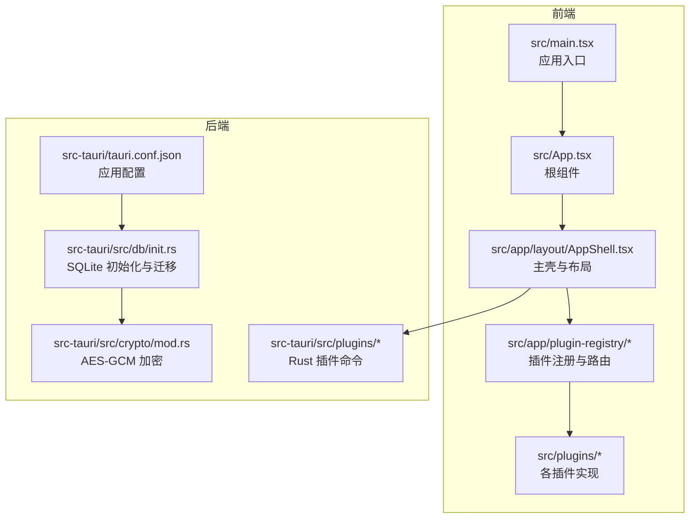
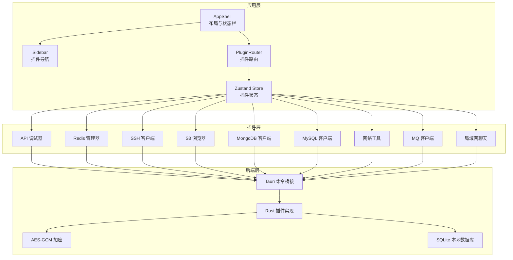
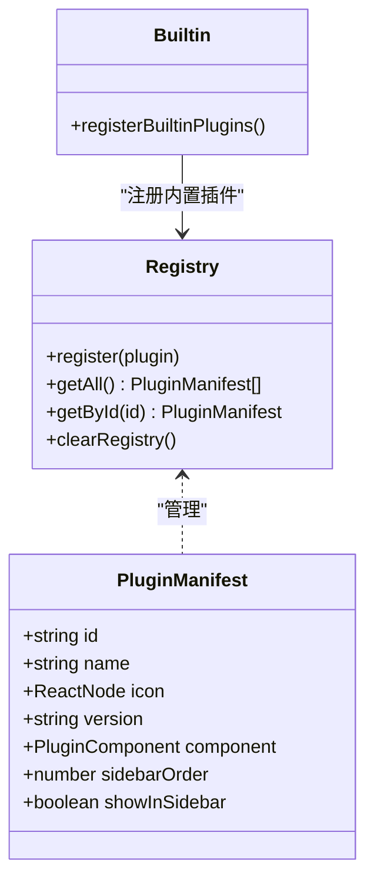
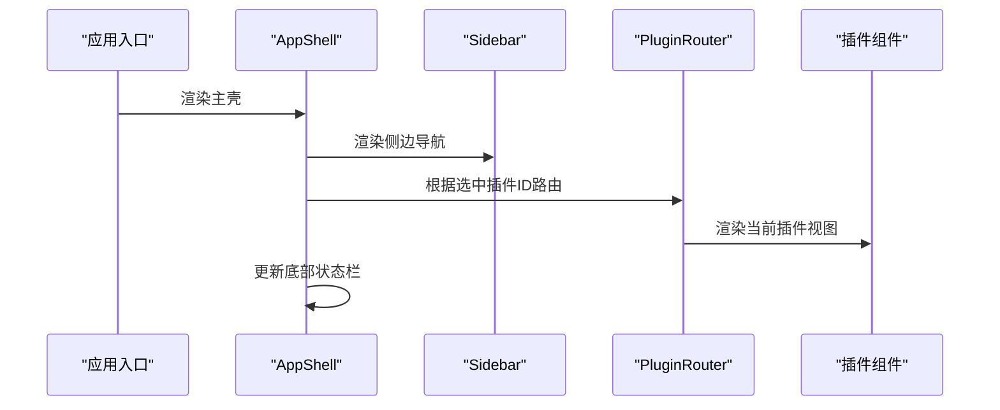
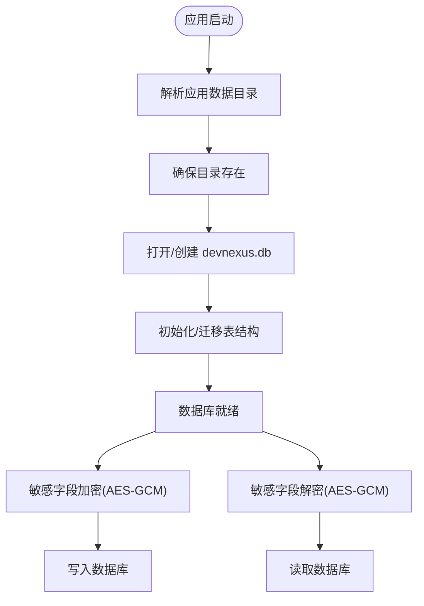
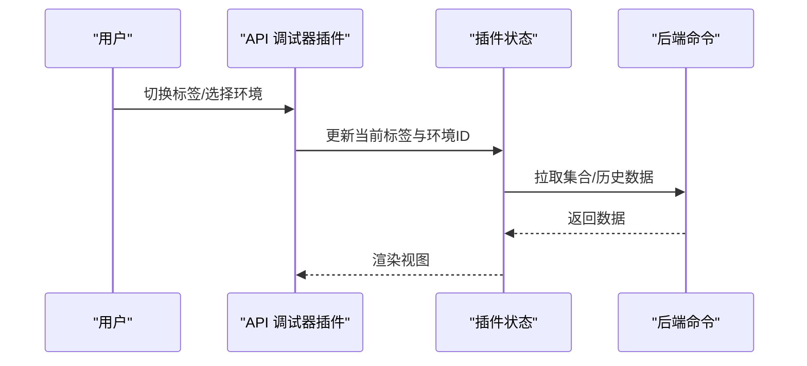
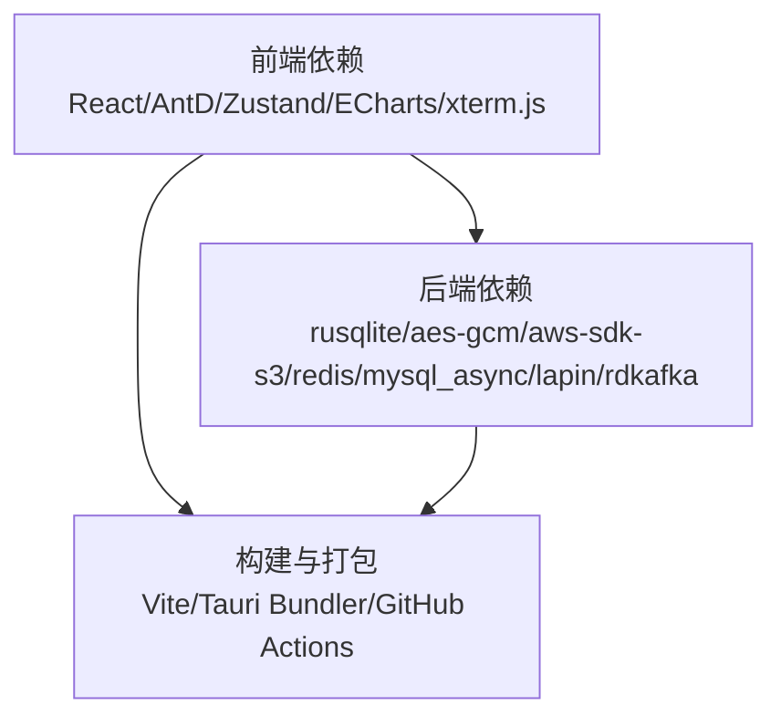

# 核心价值主张

<cite>
**本文档引用的文件**
- [README.md](file://README.md)
- [PLAN.md](file://PLAN.md)
- [src\App.tsx](file://src\App.tsx)
- [src\main.tsx](file://src\main.tsx)
- [src\app\plugin-registry\registry.ts](file://src\app\plugin-registry\registry.ts)
- [src\app\plugin-registry\builtin.ts](file://src\app\plugin-registry\builtin.ts)
- [src\app\plugin-registry\types.ts](file://src\app\plugin-registry\types.ts)
- [src\app\plugin-registry\visibility.ts](file://src\app\plugin-registry\visibility.ts)
- [src\app\layout\AppShell.tsx](file://src\app\layout\AppShell.tsx)
- [src\plugins\api-debugger\index.tsx](file://src\plugins\api-debugger\index.tsx)
- [src\plugins\redis-manager\index.tsx](file://src\plugins\redis-manager\index.tsx)
- [src\plugins\ssh-client\index.tsx](file://src\plugins\ssh-client\index.tsx)
- [src-tauri\tauri.conf.json](file://src-tauri\tauri.conf.json)
- [src-tauri\src\db\init.rs](file://src-tauri\src\db\init.rs)
- [src-tauri\src\crypto\mod.rs](file://src-tauri\src\crypto\mod.rs)
</cite>

## 目录
1. [简介](#简介)
2. [项目结构](#项目结构)
3. [核心组件](#核心组件)
4. [架构总览](#架构总览)
5. [详细组件分析](#详细组件分析)
6. [依赖关系分析](#依赖关系分析)
7. [性能考量](#性能考量)
8. [故障排查指南](#故障排查指南)
9. [结论](#结论)
10. [附录](#附录)

## 简介
DevNexus 的核心价值在于：将多个开发运维工具整合到单一轻量桌面应用中，通过插件化架构提升开发效率，通过本地优先存储保障数据安全，并通过跨平台打包简化部署。它面向三类用户群体——开发者、运维工程师、数据分析师——分别解决以下痛点：
- 开发者：减少在不同工具间切换的成本，统一调试 API、连接数据库与消息队列，集中管理环境变量与历史记录。
- 运维工程师：统一连接管理与认证，本地存储敏感信息并加密，避免云端泄露；通过网络诊断与 SSH 终端快速排障。
- 数据分析师：统一访问多种数据源（Redis、MongoDB、MySQL、S3），进行查询、浏览与导出，降低上下文切换带来的效率损失。

与传统分散工具相比，DevNexus 的优势体现在：
- 减少上下文切换：在一个应用中完成连接、调试、浏览与导出，无需频繁切换浏览器或命令行。
- 统一认证管理：集中管理各类连接配置与凭据，避免重复登录与凭据散落。
- 本地数据保护：连接配置与敏感字段本地加密存储，降低泄露风险。
- 跨平台一致性：一套代码，Windows/macOS/Linux 三端一致体验与部署。

## 项目结构
DevNexus 采用“主应用壳 + 插件注册表 + 多插件”的结构：
- 主应用壳负责布局、侧边导航、底部状态栏与开发者控制台。
- 插件注册表负责收集与排序各插件清单，按顺序渲染。
- 各插件各自管理 UI、状态与后端命令，彼此隔离且可独立演进。
- 后端由 Rust 提供系统能力与协议实现，前端通过 Tauri 命令与后端交互。

**图表来源**
- [src\main.tsx:1-38](file://src\main.tsx#L1-L38)
- [src\App.tsx:1-11](file://src\App.tsx#L1-L11)
- [src\app\layout\AppShell.tsx:1-207](file://src\app\layout\AppShell.tsx#L1-L207)
- [src\app\plugin-registry\registry.ts:1-26](file://src\app\plugin-registry\registry.ts#L1-L26)
- [src-tauri\tauri.conf.json:1-39](file://src-tauri\tauri.conf.json#L1-L39)
- [src-tauri\src\db\init.rs:1-363](file://src-tauri\src\db\init.rs#L1-L363)
- [src-tauri\src\crypto\mod.rs:1-75](file://src-tauri\src\crypto\mod.rs#L1-L75)

**章节来源**
- [README.md:56-93](file://README.md#L56-L93)
- [PLAN.md:52-113](file://PLAN.md#L52-L113)

## 核心组件
- 插件注册表与清单：定义插件清单接口，提供注册、获取与排序能力，确保插件以统一规范接入。
- 内置插件注册：在应用启动时注册所有内置插件，形成统一的侧边导航与工作区。
- 主应用壳：承载侧边栏、内容区、底部状态栏与开发者控制台，协调插件渲染与系统交互。
- 本地存储与加密：SQLite 本地数据库初始化与迁移，敏感字段使用 AES-GCM 加密，保障数据安全。
- 跨平台打包：Tauri 配置支持多平台打包，CI/CD 自动化构建与发布。

**章节来源**
- [src\app\plugin-registry\types.ts:1-14](file://src\app\plugin-registry\types.ts#L1-L14)
- [src\app\plugin-registry\registry.ts:1-26](file://src\app\plugin-registry\registry.ts#L1-L26)
- [src\app\plugin-registry\builtin.ts:1-29](file://src\app\plugin-registry\builtin.ts#L1-L29)
- [src\app\layout\AppShell.tsx:1-207](file://src\app\layout\AppShell.tsx#L1-L207)
- [src-tauri\src\db\init.rs:1-363](file://src-tauri\src\db\init.rs#L1-L363)
- [src-tauri\src\crypto\mod.rs:1-75](file://src-tauri\src\crypto\mod.rs#L1-L75)
- [src-tauri\tauri.conf.json:1-39](file://src-tauri\tauri.conf.json#L1-L39)

## 架构总览
DevNexus 的整体架构围绕“插件化 + 本地优先 + 跨平台”展开：
- 插件化：每个工具作为独立插件，前端视图、状态与后端命令按插件隔离，便于扩展与维护。
- 本地优先：连接配置与历史记录存储于本地 SQLite，敏感字段加密存储，避免云端泄露。
- 跨平台：Tauri 提供统一桌面壳，Rust 后端处理系统与协议能力，前端通过 Vite 构建，CI/CD 自动化打包。

**图表来源**
- [src\app\layout\AppShell.tsx:1-207](file://src\app\layout\AppShell.tsx#L1-L207)
- [src\app\plugin-registry\registry.ts:1-26](file://src\app\plugin-registry\registry.ts#L1-L26)
- [src-tauri\src\db\init.rs:1-363](file://src-tauri\src\db\init.rs#L1-L363)
- [src-tauri\src\crypto\mod.rs:1-75](file://src-tauri\src\crypto\mod.rs#L1-L75)

## 详细组件分析

### 插件注册与路由
- 插件清单接口定义了 id、名称、图标、版本、组件与侧边栏排序等字段，保证插件的一致性与可发现性。
- 注册表提供注册、获取与排序能力，确保插件按 sidebarOrder 顺序渲染。
- 内置插件注册在应用启动时一次性完成，避免重复注册与遗漏。
- 侧边栏可见性可通过 showInSidebar 控制，便于隐藏实验性或辅助功能。

**图表来源**
- [src\app\plugin-registry\types.ts:1-14](file://src\app\plugin-registry\types.ts#L1-L14)
- [src\app\plugin-registry\registry.ts:1-26](file://src\app\plugin-registry\registry.ts#L1-L26)
- [src\app\plugin-registry\builtin.ts:1-29](file://src\app\plugin-registry\builtin.ts#L1-L29)

**章节来源**
- [src\app\plugin-registry\types.ts:1-14](file://src\app\plugin-registry\types.ts#L1-L14)
- [src\app\plugin-registry\registry.ts:1-26](file://src\app\plugin-registry\registry.ts#L1-L26)
- [src\app\plugin-registry\builtin.ts:1-29](file://src\app\plugin-registry\builtin.ts#L1-L29)
- [src\app\plugin-registry\visibility.ts:1-6](file://src\app\plugin-registry\visibility.ts#L1-L6)

### 主应用壳与布局
- 主应用壳负责标题栏、侧边栏、内容区、底部状态栏与开发者控制台的整体布局。
- 底部状态栏展示当前工具、侧边栏状态、运行时环境与局域网聊天相关统计。
- 通过 Tauri 窗口 API 实现自定义标题栏与窗口拖拽，提升桌面体验。
- LAN Chat 的未读消息与浮动窗口逻辑在壳中协调，避免干扰主工作区。

**图表来源**
- [src\app\layout\AppShell.tsx:1-207](file://src\app\layout\AppShell.tsx#L1-L207)
- [src\app\plugin-registry\registry.ts:1-26](file://src\app\plugin-registry\registry.ts#L1-L26)

**章节来源**
- [src\app\layout\AppShell.tsx:1-207](file://src\app\layout\AppShell.tsx#L1-L207)

### 本地存储与加密
- SQLite 初始化与迁移：应用启动时在系统应用数据目录创建数据库文件，自动迁移旧文件名，确保数据连续性。
- 连接配置与历史记录：涵盖 Redis、SSH、S3、MongoDB、MySQL、网络诊断、API 调试、MQ 与 LAN Chat 的连接与历史表。
- 加密模块：使用 AES-GCM 对敏感字段进行加密存储，密钥在应用数据目录生成并持久化，确保本地安全。

**图表来源**
- [src-tauri\src\db\init.rs:1-363](file://src-tauri\src\db\init.rs#L1-L363)
- [src-tauri\src\crypto\mod.rs:1-75](file://src-tauri\src\crypto\mod.rs#L1-L75)

**章节来源**
- [src-tauri\src\db\init.rs:1-363](file://src-tauri\src\db\init.rs#L1-L363)
- [src-tauri\src\crypto\mod.rs:1-75](file://src-tauri\src\crypto\mod.rs#L1-L75)

### 跨平台打包与部署
- Tauri 配置：定义产品名称、版本、窗口尺寸与安全策略，支持多平台图标与打包目标。
- CI/CD：GitHub Actions 工作流支持自动构建与发布，按平台生成安装包并创建 Release。
- 打包命令：支持当前平台默认打包与指定平台包（Windows、macOS、Linux）。

**章节来源**
- [src-tauri\tauri.conf.json:1-39](file://src-tauri\tauri.conf.json#L1-L39)
- [README.md:136-177](file://README.md#L136-L177)

### 插件示例：API 调试器
- 视图组织：工作区、集合、环境、历史四个标签页，统一管理请求构建、集合与环境变量、历史复跑与脱敏导出。
- 状态管理：通过插件内部状态管理器维护当前标签、环境与历史数据，首次挂载时自动拉取数据。
- 插件清单：以 PluginManifest 形式注册，参与侧边栏排序与路由渲染。

**图表来源**
- [src\plugins\api-debugger\index.tsx:1-39](file://src\plugins\api-debugger\index.tsx#L1-L39)

**章节来源**
- [src\plugins\api-debugger\index.tsx:1-39](file://src\plugins\api-debugger\index.tsx#L1-L39)

### 插件示例：Redis 管理器
- 视图组织：连接、键空间、控制台、服务器信息四个标签页，覆盖连接管理、键浏览、命令执行与服务器监控。
- 状态管理：根据当前连接状态自动切换视图，避免无效操作。
- 插件清单：以 PluginManifest 形式注册，参与侧边栏排序与路由渲染。

**章节来源**
- [src\plugins\redis-manager\index.tsx:1-67](file://src\plugins\redis-manager\index.tsx#L1-L67)

### 插件示例：SSH 客户端
- 视图组织：连接、终端、密钥、隧道四个标签页，覆盖连接管理、多标签终端、密钥管理与端口转发。
- 状态管理：通过插件内部状态管理器维护连接列表、会话与隧道规则。
- 插件清单：以 PluginManifest 形式注册，参与侧边栏排序与路由渲染。

**章节来源**
- [src\plugins\ssh-client\index.tsx:1-66](file://src\plugins\ssh-client\index.tsx#L1-L66)

## 依赖关系分析
- 前端依赖：React、Ant Design、Zustand、ECharts、xterm.js 等，支撑插件 UI 与可视化。
- 后端依赖：Rust 生态中的 rusqlite、aes-gcm、aws-sdk-s3、redis、mysql_async、lapin、rdkafka 等，支撑本地存储与协议实现。
- 构建与打包：Vite、Tauri Bundler、GitHub Actions，支撑跨平台构建与发布。

**图表来源**
- [README.md:35-55](file://README.md#L35-L55)
- [PLAN.md:8-25](file://PLAN.md#L8-L25)

**章节来源**
- [README.md:35-55](file://README.md#L35-L55)
- [PLAN.md:8-25](file://PLAN.md#L8-L25)

## 性能考量
- 虚拟化与分页：针对大规模数据（如百万级 Key 列表）采用虚拟列表与分页加载，避免卡顿。
- 连接池与心跳：后端为各协议实现连接池与心跳检测，提升稳定性与资源利用率。
- 本地优先：敏感数据本地加密存储，减少网络往返与云端依赖，提高响应速度与安全性。
- 跨平台一致性：通过 Tauri 统一桌面壳，避免平台差异带来的性能波动。

**章节来源**
- [PLAN.md:368-377](file://PLAN.md#L368-L377)
- [README.md:226](file://README.md#L226)

## 故障排查指南
- 数据库初始化失败：检查应用数据目录权限与磁盘空间，确认数据库文件可创建与读写。
- 加密模块异常：确认密钥文件存在且长度正确，必要时删除旧密钥文件以触发重新生成。
- 插件未显示：检查插件注册是否成功，确认 sidebarOrder 与 showInSidebar 配置。
- 打包失败：核对 Tauri 前置依赖与平台工具链，确保 CI/CD 环境具备所需依赖。

**章节来源**
- [src-tauri\src\db\init.rs:1-363](file://src-tauri\src\db\init.rs#L1-L363)
- [src-tauri\src\crypto\mod.rs:1-75](file://src-tauri\src\crypto\mod.rs#L1-L75)
- [src\app\plugin-registry\registry.ts:1-26](file://src\app\plugin-registry\registry.ts#L1-L26)
- [README.md:136-177](file://README.md#L136-L177)

## 结论
DevNexus 通过插件化架构、本地优先存储与跨平台打包，为开发者、运维工程师与数据分析师提供了统一、安全、高效的桌面工具箱。它显著减少了上下文切换、统一了认证管理、强化了本地数据保护，并通过自动化打包与发布简化了部署流程。对于追求效率与安全的团队，DevNexus 是一个值得采纳的核心工具平台。

## 附录
- 使用场景与价值量化建议：
  - 场景一：开发者在本地快速调试 API 并复用环境变量，减少工具切换时间约 30%-50%，历史复跑与脱敏导出提升联调效率。
  - 场景二：运维工程师统一管理 SSH 连接与密钥，避免凭据散落，降低误操作风险；通过网络诊断与端口转发快速定位问题。
  - 场景三：数据分析师统一访问 Redis/MongoDB/MySQL/S3，分页与虚拟化浏览避免大表卡顿，导出与预览提升分析效率。
- 价值量化指标（示例）：
  - 时间节省：平均每次切换工具节省 1-2 分钟，日均 5 次切换可节省 5-10 分钟/天。
  - 复杂度降低：统一认证与本地存储减少配置与登录步骤，降低操作复杂度约 20%-30%。
  - 安全增强：本地加密存储敏感信息，降低凭据泄露风险，符合企业合规要求。