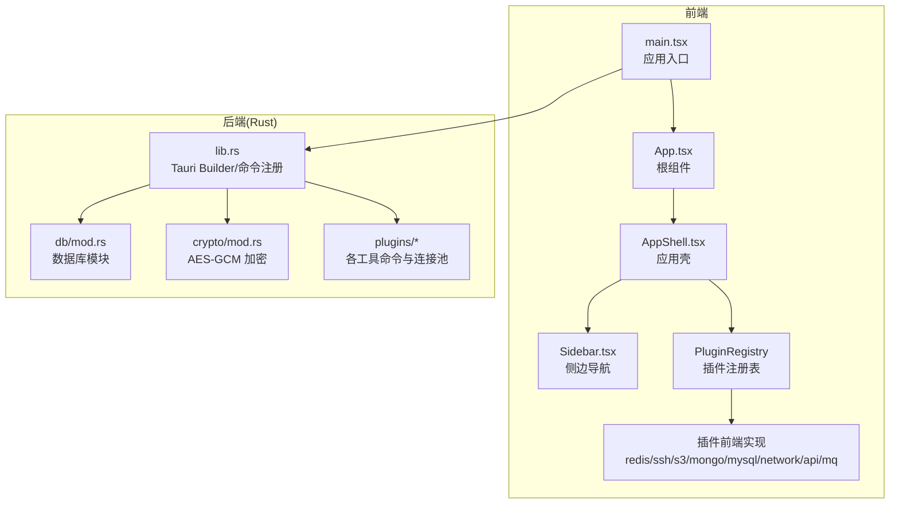
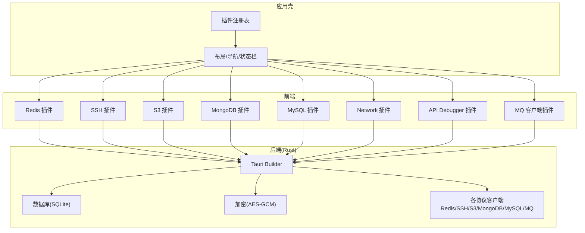
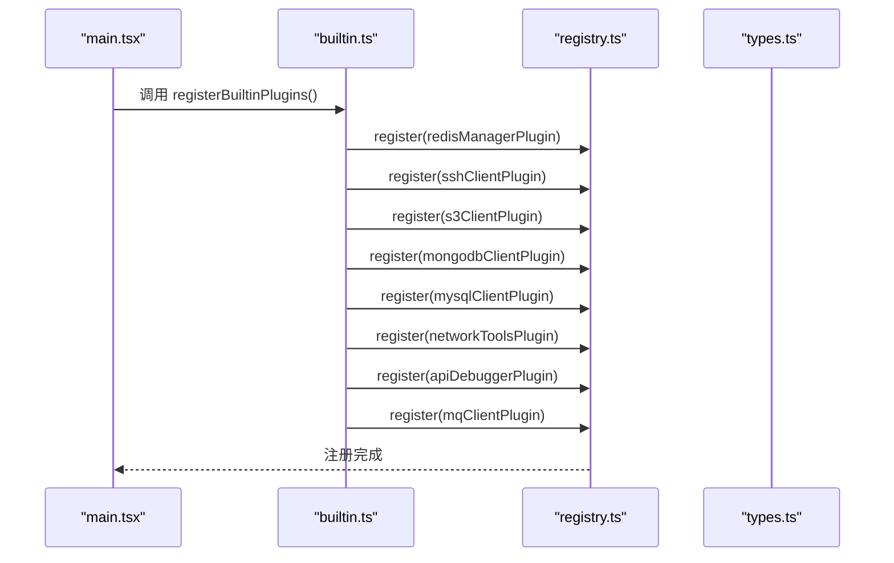
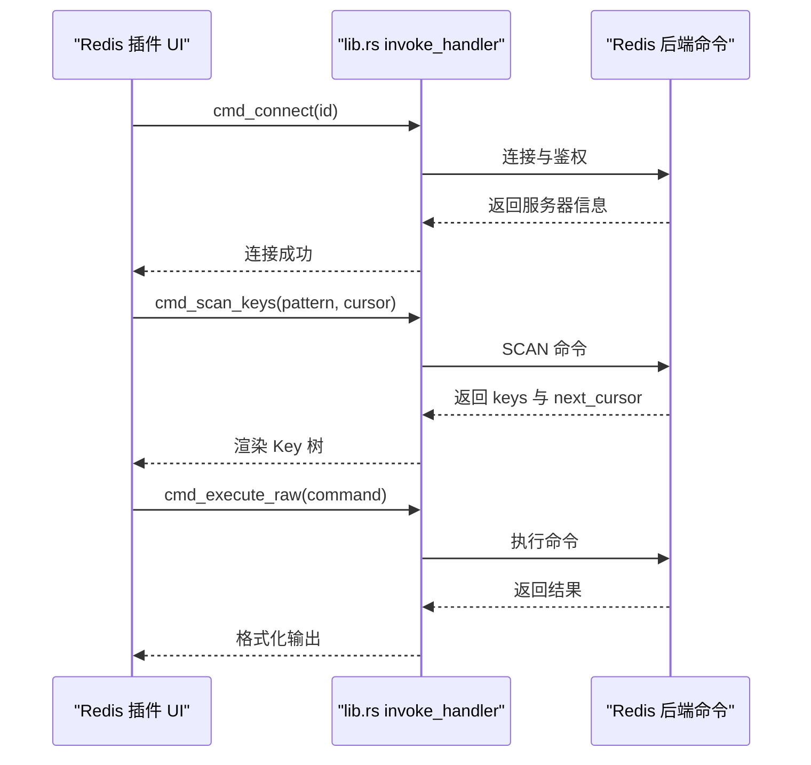
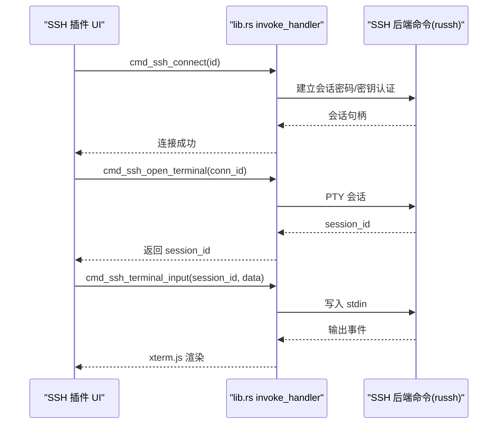
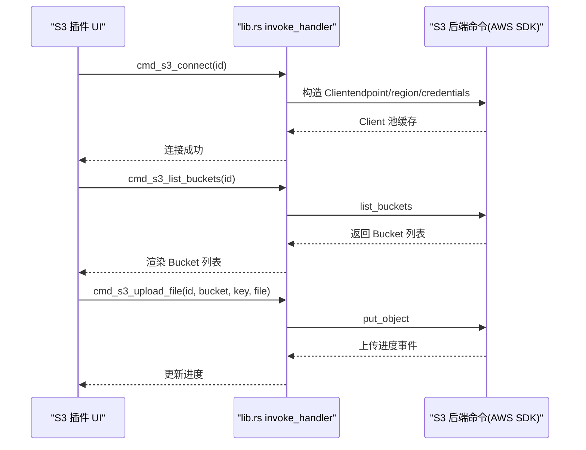
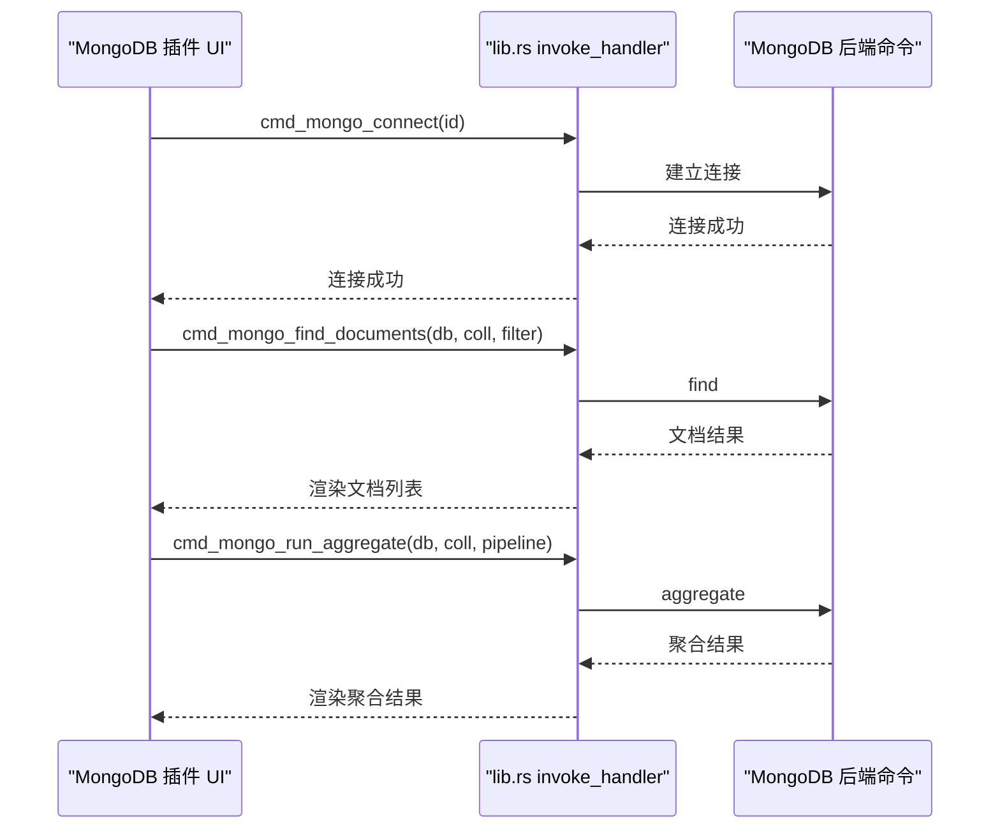
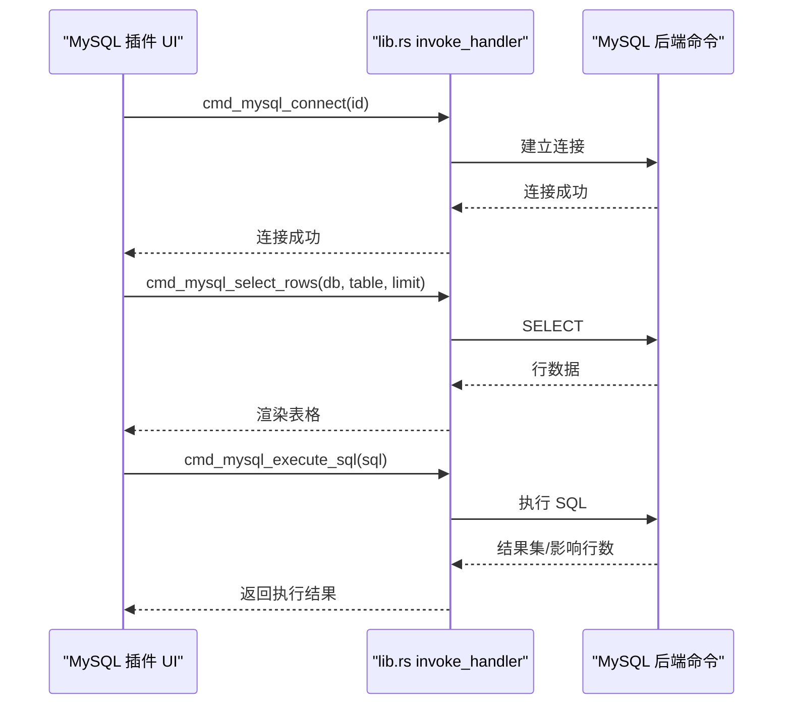
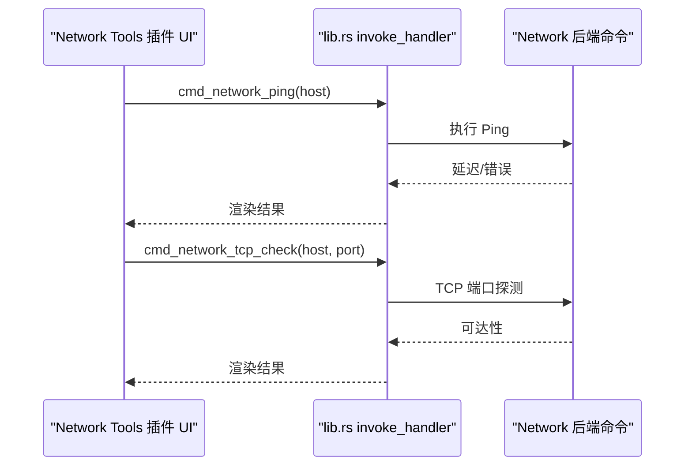
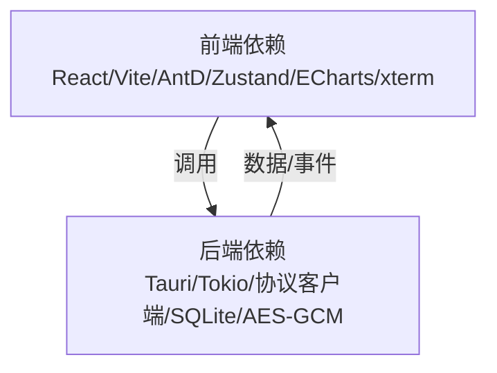

# 项目概述

<cite>
**本文档引用的文件**
- [README.md](file://README.md)
- [package.json](file://package.json)
- [src-tauri/Cargo.toml](file://src-tauri/Cargo.toml)
- [src-tauri/tauri.conf.json](file://src-tauri/tauri.conf.json)
- [src/app/plugin-registry/registry.ts](file://src/app/plugin-registry/registry.ts)
- [src/app/plugin-registry/types.ts](file://src/app/plugin-registry/types.ts)
- [src/app/plugin-registry/builtin.ts](file://src/app/plugin-registry/builtin.ts)
- [src-tauri/src/lib.rs](file://src-tauri/src/lib.rs)
- [src/main.tsx](file://src/main.tsx)
- [src/App.tsx](file://src/App.tsx)
- [src/plugins/redis-manager/index.tsx](file://src/plugins/redis-manager/index.tsx)
- [src/plugins/ssh-client/index.tsx](file://src/plugins/ssh-client/index.tsx)
- [src/plugins/s3-client/index.tsx](file://src/plugins/s3-client/index.tsx)
- [src/plugins/mongodb-client/index.tsx](file://src/plugins/mongodb-client/index.tsx)
- [src/plugins/mysql-client/index.tsx](file://src/plugins/mysql-client/index.tsx)
- [src/plugins/network-tools/index.tsx](file://src/plugins/network-tools/index.tsx)
- [src-tauri/src/crypto/mod.rs](file://src-tauri/src/crypto/mod.rs)
- [src-tauri/src/db/mod.rs](file://src-tauri/src/db/mod.rs)
- [PLAN.md](file://PLAN.md)
</cite>

## 目录
1. [简介](#简介)
2. [项目结构](#项目结构)
3. [核心组件](#核心组件)
4. [架构总览](#架构总览)
5. [详细组件分析](#详细组件分析)
6. [依赖关系分析](#依赖关系分析)
7. [性能考量](#性能考量)
8. [故障排查指南](#故障排查指南)
9. [结论](#结论)
10. [附录](#附录)

## 简介
DevNexus 是一个基于 Tauri 2 + React 19 + TypeScript + Rust 的插件化桌面工具箱，面向开发、运维与日常数据管理场景。其核心价值主张是将多个连接类与诊断工具整合到一个轻量、跨平台的桌面应用中，通过插件化架构实现功能扩展与隔离，同时采用本地优先存储与加密机制保障安全性。

产品特点
- 插件化架构：每个工具以独立插件组织，前端视图、状态与 Rust 后端命令按插件隔离，便于维护与扩展。
- 本地优先：连接配置存储在本机 SQLite 数据库中，敏感字段使用 AES-GCM 加密，确保数据隐私。
- 轻量桌面体验：使用 Tauri 2 提供轻量原生外壳，前端由 Vite 构建，后端由 Rust 提供系统与协议能力。
- 跨平台打包：内置 Windows、macOS、Linux 的 GitHub Actions 构建与发布流程，统一交付体验。
- 面向实际运维：提供虚拟列表、分页加载、危险命令确认、可滚动监控页面等细节，降低误操作风险与卡顿。

技术栈概览
- 桌面框架：Tauri 2
- 前端：React 19、TypeScript、Vite、Ant Design、Zustand、ECharts、xterm.js
- 后端：Rust、Tokio
- 本地存储：SQLite（rusqlite）
- 协议与客户端：Redis（redis）、SSH（russh/russh-keys）、S3（AWS Rust SDK）、MongoDB（mongodb）、MySQL（mysql_async）、MQ（lapin/rdkafka/RabbitMQ Management API）
- HTTP：reqwest

主要功能特性
- Redis 管理器：连接管理、DB 切换、Key 树浏览、Key 详情编辑、命令控制台、Server 信息、导入导出
- SSH 客户端：SSH 连接管理、多标签 Terminal、密钥管理、快捷命令、端口转发
- S3 浏览器：S3 连接管理、Bucket 浏览、Object 浏览、上传下载、预览、预签名 URL、Bucket 设置
- MongoDB 客户端：连接管理、数据库/集合浏览、文档 CRUD、查询/聚合、索引、导入导出、Server 状态
- MySQL 客户端：连接管理、库表浏览、表数据 CRUD、SQL 查询、索引、导入导出、Server 状态
- 网络工具：Ping、TCP 端口检测、DNS 解析、Traceroute、诊断历史与复跑
- API 调试器：HTTP 请求构建与发送、集合/环境变量、响应查看、历史复跑、cURL 导入、脱敏导出
- MQ 客户端：RabbitMQ/Kafka 连接管理、资源浏览、消息发送、临时消费预览、消息模板、历史复跑与安全脱敏

章节来源
- [README.md:1-382](file://README.md#L1-L382)

## 项目结构
项目采用“前端插件 + Rust 后端插件”的双层插件化设计，配合统一的应用壳与插件注册表，形成清晰的职责分离与可扩展架构。

- 前端层
  - 应用壳与布局：AppShell、Sidebar、Titlebar、StatusBar
  - 插件注册表：注册、发现与路由
  - 插件实现：各工具的前端视图、状态与组件
- 后端层（Rust）
  - 应用初始化：Tauri Builder、插件注册、数据库初始化
  - 插件命令：各工具的 Tauri 命令暴露层
  - 数据与加密：SQLite 连接与本地加密模块

图表来源
- [src/main.tsx:1-38](file://src/main.tsx#L1-L38)
- [src/App.tsx:1-11](file://src/App.tsx#L1-L11)
- [src-tauri/src/lib.rs:1-250](file://src-tauri/src/lib.rs#L1-L250)
- [src-tauri/src/db/mod.rs:1-8](file://src-tauri/src/db/mod.rs#L1-L8)
- [src-tauri/src/crypto/mod.rs:1-75](file://src-tauri/src/crypto/mod.rs#L1-L75)

章节来源
- [README.md:56-93](file://README.md#L56-L93)
- [PLAN.md:52-113](file://PLAN.md#L52-L113)

## 核心组件
- 插件注册表
  - 职责：维护插件清单、提供注册与查询接口，按 sidebarOrder 排序渲染
  - 关键实现：registry.ts（Map 存储、注册/查询/清空）、types.ts（PluginManifest 定义）、builtin.ts（内置插件注册）
- 应用壳与主题
  - 职责：提供全局样式、主题切换、根组件包裹
  - 关键实现：main.tsx（注册内置插件、主题算法配置）、App.tsx（Ant Design 包裹）
- Tauri 应用初始化
  - 职责：注册系统插件、初始化数据库、集中暴露各工具命令
  - 关键实现：lib.rs（Builder、setup、invoke_handler 注册大量命令）

章节来源
- [src/app/plugin-registry/registry.ts:1-26](file://src/app/plugin-registry/registry.ts#L1-L26)
- [src/app/plugin-registry/types.ts:1-14](file://src/app/plugin-registry/types.ts#L1-L14)
- [src/app/plugin-registry/builtin.ts:1-29](file://src/app/plugin-registry/builtin.ts#L1-L29)
- [src/main.tsx:1-38](file://src/main.tsx#L1-L38)
- [src/App.tsx:1-11](file://src/App.tsx#L1-L11)
- [src-tauri/src/lib.rs:1-250](file://src-tauri/src/lib.rs#L1-L250)

## 架构总览
DevNexus 采用“前端插件 + Rust 后端插件”的双层插件化架构。前端通过插件注册表统一调度各工具视图；后端通过 Tauri 的 invoke_handler 将 Rust 命令暴露给前端调用，实现协议与系统能力的本地化。

图表来源
- [src-tauri/src/lib.rs:25-246](file://src-tauri/src/lib.rs#L25-L246)
- [src/app/plugin-registry/registry.ts:13-17](file://src/app/plugin-registry/registry.ts#L13-L17)
- [src/app/plugin-registry/builtin.ts:18-26](file://src/app/plugin-registry/builtin.ts#L18-L26)

章节来源
- [PLAN.md:27-48](file://PLAN.md#L27-L48)
- [README.md:35-55](file://README.md#L35-L55)

## 详细组件分析

### 插件注册表与路由
- 设计要点
  - PluginManifest 定义插件标识、名称、图标、版本、组件与侧边栏排序
  - 注册表以 Map 存储，提供按 id 查询、按 sidebarOrder 排序获取、清空等能力
  - 内置插件在应用启动时一次性注册，保证后续渲染与调用稳定
- 关键流程
  - 应用启动：main.tsx 调用 registerBuiltinPlugins
  - 插件注册：builtin.ts 逐一调用 register
  - 插件发现：registry.getAll() 返回排序后的插件清单
  - 插件渲染：AppShell/Sidebar 基于清单渲染导航项

图表来源
- [src/main.tsx:10](file://src/main.tsx#L10)
- [src/app/plugin-registry/builtin.ts:13-27](file://src/app/plugin-registry/builtin.ts#L13-L27)
- [src/app/plugin-registry/registry.ts:5-11](file://src/app/plugin-registry/registry.ts#L5-L11)
- [src/app/plugin-registry/types.ts:5-13](file://src/app/plugin-registry/types.ts#L5-L13)

章节来源
- [src/app/plugin-registry/registry.ts:1-26](file://src/app/plugin-registry/registry.ts#L1-L26)
- [src/app/plugin-registry/types.ts:1-14](file://src/app/plugin-registry/types.ts#L1-L14)
- [src/app/plugin-registry/builtin.ts:1-29](file://src/app/plugin-registry/builtin.ts#L1-L29)
- [src/main.tsx:1-38](file://src/main.tsx#L1-L38)

### Redis 管理器插件
- 功能定位：连接管理、DB 切换、Key 树浏览、Key 详情编辑、命令控制台、Server 信息、导入导出
- 前端组织：通过 Segment 控制“Connections/Keys/Console/Server”四个视图，根据活动连接状态自动切换
- 命令暴露：lib.rs 中集中注册 Redis 相关命令（连接、DB 切换、Key 操作、命令执行、导入导出等）

图表来源
- [src/plugins/redis-manager/index.tsx:14-57](file://src/plugins/redis-manager/index.tsx#L14-L57)
- [src-tauri/src/lib.rs:25-68](file://src-tauri/src/lib.rs#L25-L68)

章节来源
- [src/plugins/redis-manager/index.tsx:1-67](file://src/plugins/redis-manager/index.tsx#L1-L67)
- [src-tauri/src/lib.rs:1-68](file://src-tauri/src/lib.rs#L1-L68)

### SSH 客户端插件
- 功能定位：连接管理、多标签 Terminal、密钥管理、快捷命令、端口转发
- 前端组织：通过 Segment 控制“Connections/Terminal/Keys/Tunnels”，支持多标签终端与会话管理
- 命令暴露：lib.rs 中注册 SSH 相关命令（连接、终端 I/O、密钥、隧道等）

图表来源
- [src/plugins/ssh-client/index.tsx:12-56](file://src/plugins/ssh-client/index.tsx#L12-L56)
- [src-tauri/src/lib.rs:69-94](file://src-tauri/src/lib.rs#L69-L94)

章节来源
- [src/plugins/ssh-client/index.tsx:1-66](file://src/plugins/ssh-client/index.tsx#L1-L66)
- [src-tauri/src/lib.rs:69-94](file://src-tauri/src/lib.rs#L69-L94)

### S3 浏览器插件
- 功能定位：连接管理、Bucket 浏览、Object 浏览、上传下载、预览、预签名 URL、Bucket 设置
- 前端组织：通过 Segment 控制“Connections/Buckets/Objects”，支持面包屑导航与对象元数据抽屉
- 命令暴露：lib.rs 中注册 S3 相关命令（连接、Bucket 操作、对象列表、上传下载、预签名 URL 等）

图表来源
- [src/plugins/s3-client/index.tsx:10-58](file://src/plugins/s3-client/index.tsx#L10-L58)
- [src-tauri/src/lib.rs:95-133](file://src-tauri/src/lib.rs#L95-L133)

章节来源
- [src/plugins/s3-client/index.tsx:1-68](file://src/plugins/s3-client/index.tsx#L1-L68)
- [src-tauri/src/lib.rs:95-133](file://src-tauri/src/lib.rs#L95-L133)

### MongoDB 客户端插件
- 功能定位：连接管理、数据库/集合浏览、文档 CRUD、查询/聚合、索引、导入导出、Server 状态
- 前端组织：通过 Segment 控制“Connections/Databases/Documents/Query/Indexes/Import/Export/Server”
- 命令暴露：lib.rs 中注册 MongoDB 相关命令（连接、数据库/集合浏览、文档 CRUD、聚合、索引、导入导出、Server 状态等）

图表来源
- [src/plugins/mongodb-client/index.tsx:14-77](file://src/plugins/mongodb-client/index.tsx#L14-L77)
- [src-tauri/src/lib.rs:134-159](file://src-tauri/src/lib.rs#L134-L159)

章节来源
- [src/plugins/mongodb-client/index.tsx:1-87](file://src/plugins/mongodb-client/index.tsx#L1-L87)
- [src-tauri/src/lib.rs:134-159](file://src-tauri/src/lib.rs#L134-L159)

### MySQL 客户端插件
- 功能定位：连接管理、库表浏览、表数据 CRUD、SQL 查询、索引、导入导出、Server 状态
- 前端组织：通过 Segment 控制“Connections/Databases/Table Data/SQL/Indexes/Import/Export/Server”
- 命令暴露：lib.rs 中注册 MySQL 相关命令（连接、库表浏览、行 CRUD、SQL 执行、索引、导入导出、Server 状态等）

图表来源
- [src/plugins/mysql-client/index.tsx:14-35](file://src/plugins/mysql-client/index.tsx#L14-L35)
- [src-tauri/src/lib.rs:160-183](file://src-tauri/src/lib.rs#L160-L183)

章节来源
- [src/plugins/mysql-client/index.tsx:1-38](file://src/plugins/mysql-client/index.tsx#L1-L38)
- [src-tauri/src/lib.rs:160-183](file://src-tauri/src/lib.rs#L160-L183)

### 网络工具插件
- 功能定位：Ping、TCP 端口检测、DNS 解析、Traceroute、诊断历史与复跑
- 前端组织：通过 Segment 控制“Diagnostics/History”，支持当前工具状态提示
- 命令暴露：lib.rs 中注册网络诊断相关命令（TCP 检查、Ping、DNS、Traceroute、历史管理等）

图表来源
- [src/plugins/network-tools/index.tsx:9-24](file://src/plugins/network-tools/index.tsx#L9-L24)
- [src-tauri/src/lib.rs:185-191](file://src-tauri/src/lib.rs#L185-L191)

章节来源
- [src/plugins/network-tools/index.tsx:1-27](file://src/plugins/network-tools/index.tsx#L1-L27)
- [src-tauri/src/lib.rs:185-191](file://src-tauri/src/lib.rs#L185-L191)

### API 调试器与 MQ 客户端插件
- API 调试器：HTTP 请求构建与发送、集合/环境变量、响应查看、历史复跑、cURL 导入、脱敏导出
- MQ 客户端：RabbitMQ/Kafka 连接管理、资源浏览、消息发送、临时消费预览、消息模板、历史复跑与安全脱敏
- 命令暴露：lib.rs 中注册 API 与 MQ 相关命令

章节来源
- [src-tauri/src/lib.rs:192-225](file://src-tauri/src/lib.rs#L192-L225)

## 依赖关系分析
- 前端依赖
  - React 19 + TypeScript + Vite：构建与开发体验
  - Ant Design + @ant-design/icons：UI 组件与图标
  - Zustand：轻量状态管理
  - ECharts：图表可视化
  - xterm.js：终端渲染
- 后端依赖
  - Tauri 2：桌面外壳与系统能力
  - Tokio：异步运行时
  - 各协议客户端：Redis、SSH、S3、MongoDB、MySQL、MQ
  - SQLite：本地存储
  - AES-GCM：本地敏感数据加密

图表来源
- [package.json:15-29](file://package.json#L15-L29)
- [package.json:30-38](file://package.json#L30-L38)
- [src-tauri/Cargo.toml:20-48](file://src-tauri/Cargo.toml#L20-L48)

章节来源
- [package.json:1-40](file://package.json#L1-L40)
- [src-tauri/Cargo.toml:1-48](file://src-tauri/Cargo.toml#L1-L48)
- [README.md:35-55](file://README.md#L35-L55)

## 性能考量
- 虚拟化与分页
  - Redis Key 树使用虚拟列表渲染百万级 Key，避免一次性加载造成卡顿
  - MongoDB/MySQL 大表、S3 大桶采用分页与前缀过滤，减少内存压力
- 异步与连接池
  - Rust 后端使用 Tokio 异步运行时，协议客户端通过连接池复用，降低握手与上下文切换开销
- 轻量桌面体验
  - Tauri 2 提供轻量原生外壳，前端由 Vite 构建，后端由 Rust 提供系统与协议能力，整体体积小、启动快
- 本地优先与加密
  - SQLite 本地存储 + AES-GCM 加密，敏感字段不离开本地，兼顾安全与性能

章节来源
- [PLAN.md:18-24](file://PLAN.md#L18-L24)
- [README.md:27-34](file://README.md#L27-L34)

## 故障排查指南
- 开发与构建
  - 前端：npm run dev（Vite）、npm run build（TypeScript + Vite）
  - 后端：cd src-tauri && cargo check
  - 测试：npm test（Vitest）
- 打包与发布
  - npm run tauri build（当前平台）
  - Windows：nsis；macOS：app + dmg；Linux：deb + appimage
- 安全与数据
  - 连接配置与敏感数据加密存储于本地 SQLite，注意不要提交真实凭据与本地数据库文件
  - 如遇加密相关问题，检查本地密钥文件是否存在与格式正确

章节来源
- [README.md:107-150](file://README.md#L107-L150)
- [README.md:158-177](file://README.md#L158-L177)
- [README.md:179-185](file://README.md#L179-L185)

## 结论
DevNexus 通过插件化架构将多种开发运维工具整合到统一的轻量桌面应用中，结合本地优先存储与跨平台打包能力，为用户提供高效、安全、易用的工具体验。随着各插件功能逐步完善与扩展，项目将持续提升数据库与协议支持的广度与深度，并在用户体验与安全性方面持续优化。

## 附录
- 配置与运行
  - 环境要求：Node.js 20+、Rust stable、对应平台 Tauri 前置依赖
  - 本地开发：npm install → npm run dev（前端）或 npm run tauri dev（完整桌面）
- 版本与路线图
  - 当前版本：0.9.x（详见 README 与发布说明）
  - 路线图：以 PLAN.md 为准，持续迭代导入导出、更新检测、数据库能力与用户体验

章节来源
- [README.md:95-101](file://README.md#L95-L101)
- [README.md:194-197](file://README.md#L194-L197)
- [PLAN.md:1-10](file://PLAN.md#L1-L10)